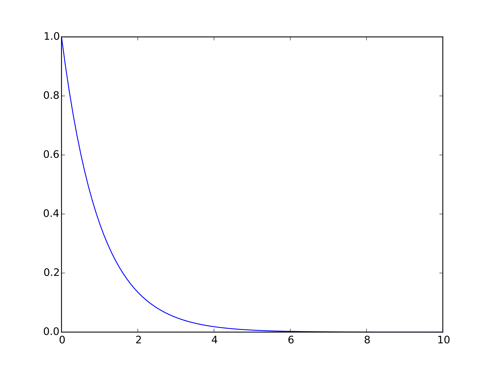
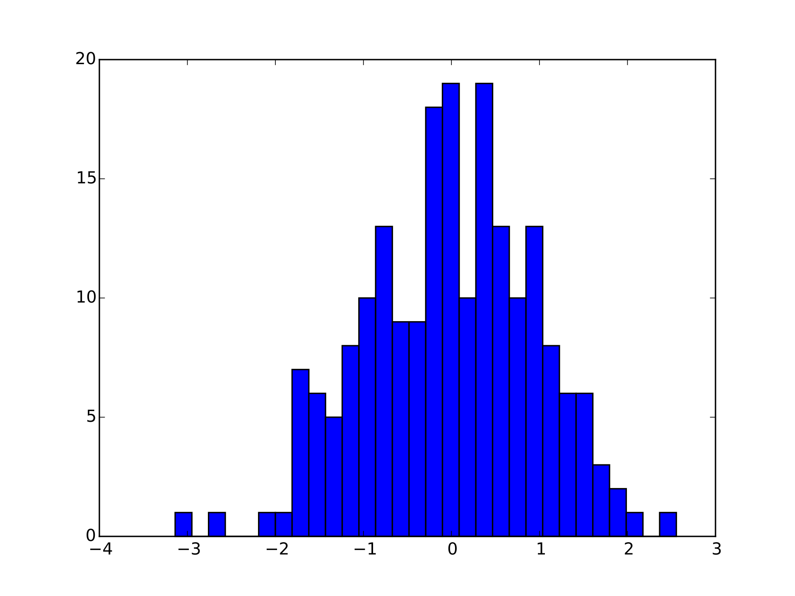
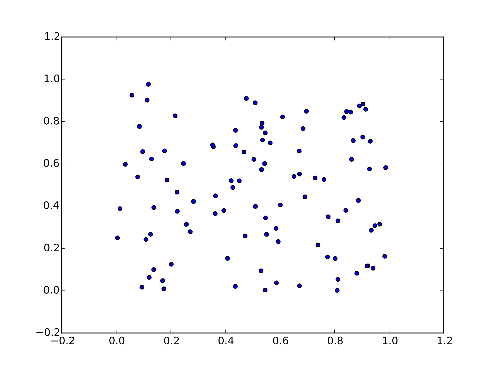
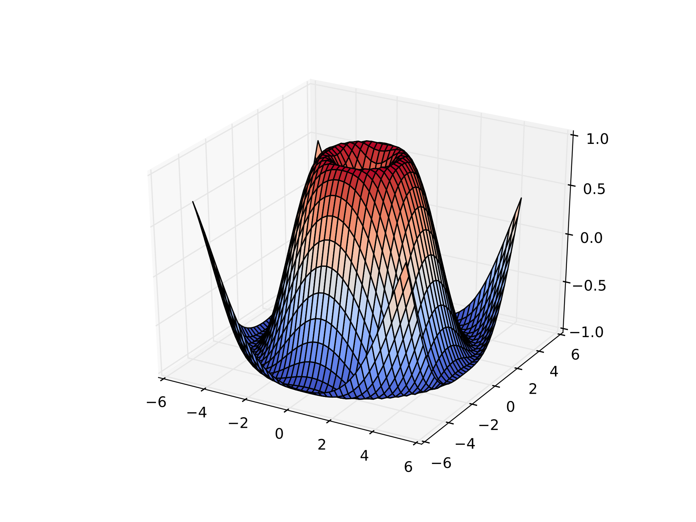

# 搬砖时应该掌握的matplotlib

熟练使用Matplotlib能够帮助你将研究内容可视化，加速你的研究进程。

**[matplotlib](https://matplotlib.org/)**是[Python](https://zh.wikipedia.org/wiki/Python)编程语言及其数值数学扩展包 [NumPy](https://zh.wikipedia.org/wiki/NumPy)的可视化操作界面。它利用通用的[图形用户界面工具包](https://zh.wikipedia.org/wiki/部件工具箱)，如Tkinter, wxPython, [Qt](https://zh.wikipedia.org/wiki/Qt)或[GTK+](https://zh.wikipedia.org/wiki/GTK%2B)，向应用程序嵌入式绘图提供了[应用程序接口](https://zh.wikipedia.org/wiki/应用程序接口)（API）。此外，matplotlib还有一个基于图像处理库（如开放图形库OpenGL）的pylab接口，其设计与[MATLAB](https://zh.wikipedia.org/wiki/MATLAB)非常类似。SciPy就是用matplotlib进行图形绘制。

可以使用pip安装matplotlib：

```
pip install matplotlib
```

如果你的pip安装缓慢，请参阅附录中关于环境和包的部分，对pip进行换源。

大部分情况下我们使用matplotlib.pyplot进行图形的绘制。pyplot是matplotlib的一个模块，它提供了一个类似MATLAB的接口。 matplotlib被设计得用起来像MATLAB，具有使用Python的能力。免费是其优点。

你可以用matplot做到：


以上图片源自matplotlib的github的[某个代码仓库](https://github.com/matplotlib/cheatsheets)。

你可以在[官方的例程](https://matplotlib.org/stable/gallery/index.html)中找到更多点子。在这里我们只介绍一些简单的功能。

绘制曲线图：

```python
import matplotlib.pyplot as plt
import numpy as np
a = np.linspace(0,10,100)
b = np.exp(-a)
plt.plot(a,b)
plt.show()
```



绘制直方图：

```python
import matplotlib.pyplot as plt
from numpy.random import normal,rand
x = normal(size=200)
plt.hist(x,bins=30)
plt.show()
```



```python
import matplotlib.pyplot as plt
from numpy.random import rand
a = rand(100)
b = rand(100)
plt.scatter(a,b)
plt.show()
```



三维曲面：

```python
from matplotlib import cm
from mpl_toolkits.mplot3d import Axes3D
import matplotlib.pyplot as plt
import numpy as np
fig = plt.figure()
ax = fig.gca(projection='3d')
X = np.arange(-5, 5, 0.25)
Y = np.arange(-5, 5, 0.25)
X, Y = np.meshgrid(X, Y)
R = np.sqrt(X**2 + Y**2)
Z = np.sin(R)
surf = ax.plot_surface(X, Y, Z, rstride=1, cstride=1, cmap=cm.coolwarm)
plt.show()
```



深入学习请继续参考[官方文档](https://matplotlib.org/stable/contents.html)。

