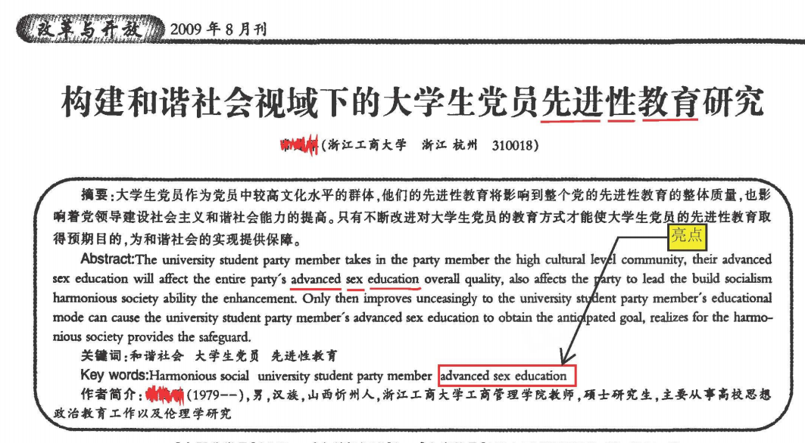

## 写作一篇科技类论文？

注：这一部分是在听了陈关荣教授的分享后写下的。

### 认真写作的重要性

请认真写作。

上图是不认真写作的结果。

### 一篇科技论文典型的结构

| Content                 | 描述                                                         |
| ----------------------- | ------------------------------------------------------------ |
| Title（题目）           | 文献的题目。通常情况下，文献的题目应该简单、准确、精炼、引人注目，表达文章主要内容或思想。 |
| Author（作者）          | 文献的作者。（千万不能未经同意和许可就随便地把别人例如导师的名字加到文章上单方面去投稿） |
| Abstract（摘要）        | 文献的摘要，要全面准确、简明握要。摘要是供出版社、图书馆、信息库检索用的，通常要单独刊登，因此，要自我完备，尽量不要使用数学公式、数学符号、方程序号、 引文序号、图表等等。 |
| Keywords（关键词）      | 文章的关键字，文章所包含的研究领域或方向，并且应该用单数（例如：“attractor” 而不是 “attractors”）。SCI 系统利用关键词来分类文献，并且读者利用关键词来搜索文章。 关键词不全面可能导致检索遗漏和引用减少。 |
| Introduction（引言）    | 引言应该全面、客观、准确地介绍问题的背景和历史发展， 他人以及自己的贡献，本文的动因和主要成果。注意，短文在引言部分并不一定需要说明文章的基本结构。 |
| Sections（段落）        | 文章的内容分为很多段落。这些段落的标题、编号和格式应该尽量统一；在写作时，要尽量避免冗长的句子、避免不必要的符号和定义、避免太多太滥的缩写、避免太多太滥的方程号码。 |
| Conclusion（结论）      | 文章的结论。结论中不要简单地改写甚至重复文章的摘要；和摘要部分一样，结论部分不要援引前文中出现过的方程号码、图表号码， 不要重新讨论数学公式、给出定理补充证明之类。 |
| Acknowledgement（致谢） | 在这部分可以感谢认真而又有实质性建议的匿名审稿人、认真而又有实质性建议的朋友、以及有关科研基金。 |
| References（参考文献）  | 这部分列表呈现写作时参考的文献。请注意严格使用标准格式。关于格式，请使用统一格式，或使用你打算投稿的那个杂志的格式。文献的多少要恰当：不要漏掉重要和必要的文献，又不要罗列多余且毫不相关的文章。 |
| Appendix（附录）        | 附录通常可以放一些比较长的引理和定理的证明，方便读者在阅读简洁的原文后查阅。 |

你可以通过一些工具来规范你的写作。

### Abstract的写作技巧

以下内容摘抄自网络：

> 套路一般是，先说大环境下本领域的发展，分类，极其对其他领域的作用。进而转到其中某某模块(你针对的模块)对整体的性能至关重要。该模块已被多个其他领域应用，如U,V,W(列出参考文献)。针对该模块，大家都使用的方法是Z，近十年来一直如此。后续针对传统方法Z的不足，近几年有学者提出了D方法(ECCV2017)，用以改善XXXX。接着针对D方法的不足，又有人提出了E，解决了D的问题，比如提高D的速度，或者D的稳定性，或者是D的推广版本。E是相当经典的，这么多年以来成为了主导，可谓人尽皆知。最新的研究进展中，有学者还提出了F, H等变体，分别考虑了XXXX，有的还应用在其他领域中。但是(关键来了)，上述这些方法，都仅仅考虑了XXXX层面，因素。However, we observed that......，they may suffer from……，they face the problem of……这个地方最好需要你用一句神来之笔的观点说出这些方法的问题，从而让人眼前一亮，让人恍悟好像这些方法确实是这么一回事，甚至让人恍悟原来E方法能有提升是出于背后这么个原因。总之你若能总结到类似于这样的深刻道理，那基本上审稿人对你论文的看法就是very novel。加之你的提升有1.5个点这么多，那么审稿人对你实验结果的看法也将是significant或very convincing。

- 为了流畅地书写Abstract，你需要有足够的文献储备，这样才能做到信手拈来。
- 注意语言表达要客观，要尊重，还要犀利。

### 论文的投稿流程

- Have an idea （你有一个想法）
- Do your research （完成你的研究和实验）
- Write your paper （进行论文写作）
- Identify  a journal （选择要发表的期刊。老手的一些想法是有想法之后先选择期刊再进行论文写作，有许多直接被拒的论文不是写的不好而是找错了地方。）
- Submit your paper （提交你的论文）
- Receive reviewers' comments （收到审稿人评价）
- Revise and submit （修改后重新提交）
- Receive further comments （收到后续审稿意见）
- Revise and submit （修改后重新提交）
- ......
- Get accepted and published （被接受并发表）

### 论文的审稿流程

- Editor-in-Chief receives manuscript （主编收到论文）
- Checks for quality, scope （检查论文质量。Desk rejection 也就是拒稿往往是在这一步发生的）
- Assigns to an editor including the EIC herself （分配给编辑审阅）
- Handling editor invites reviewers （编辑邀请审稿人）
- May or may not use suggested reviewers （接受或者不接受该审稿人评阅）
- Receives reviewers' comments （收到审稿人意见）
- Makes decision : Reject, major revision, minor revision or accept （做决定：拒绝，重大修改，轻微修改，还是接受论文）
- reject and resubmit （拒绝并重新提交）
- Receives revised manuscript （接收修改后的论文）
- Invites reviewers （邀请评阅）
- Likely the previous reviewers, but could also be new reviewers （可能是之前的审稿人，也可能是新的审稿人）
- Receives reviewers' comments （收到审稿人意见）
- ......
- Accepts （接受）

### 常见的简单审稿意见（在写作期就可以避免）

|          审稿意见          | 审稿意见全文                                                 | 参考中文                                                     | 举例                                                         |
| :------------------------: | :----------------------------------------------------------- | :----------------------------------------------------------- | :----------------------------------------------------------- |
|      参考文献不要扎堆      | Eliminate multiple references. After that please check the manuscript thoroughly and eliminate all the lumps in the manuscript. This should be done by characterizing each reference individually. This can be done by mentioning 1 or 2 phrases per reference to show how it is different from the others and why it deserves mentioning | 消除出现在同个位置的多个引用。在那之后，请彻底检查手稿，消除所有的扎堆文献。这应该通过单独描述每个引用来实现。这可以通过在每次引用中提到1或2个短语来说明它与其他的不同之处，以及为什么它值得提到。 | 修改如“前人的工作有\[1\]\[2\]\[3\]\[4\]\[5\]\[6\]\[7\]”的大量引用，仅保留必要的。 |
|  结论中增加意义量化及对比  | In the conclusions, in addition to summarizing the actions taken and results, please strengthen the explanation of their significance. It is recommended to use quantitative reasoning comparing with appropriate benchmarks, especially those stemming from previous work. | 在结论中，除了总结所采取的行动和结果外，请加强对其重要性的解释。建议使用定量推理与适当的基准进行比较，特别是那些源于以前工作的基准。 | 增加如“我们在前人提出的xxx之上又做出了怎样的贡献”的语句。    |
|  结论中增加意义量化及对比  | Please revise the conclusion in paragraphs. Conclusions are not just about summarizing the key results of the study, it should highlights the insights and the applicability of your findings/results for further work. Please make it more concise and show only the high impact outcomes. Report your Conclusions in one or maximum 2 paragraph. Avoid [bullet form](https://en.wikipedia.org/wiki/Bullet_(typography))). | 请在段落中修改结论。结论不仅仅是总结研究的关键结果，它应该突出你的发现结果对进一步工作的洞察力和适用性。请让它更简洁，只显示高影响的结果。一段或最多两段报告你的结论。避免[子弹形式](https://en.wikipedia.org/wiki/Bullet_(typography))。 | 一般结论不超过半页纸。请不要在结论里使用分条分点的段落形式。 |
|       删除多余的虚词       | Eliminate the use of redundant words, e.g. in this way, recently, respectively, therefore, currently, thus, hence, finally, to do this, first, in order, however, moreover, nowadays, consequently, in addition, additionally, furthermore. Revise all similar cases, as removing these term(s) would not significantly affect the meaning of the sentence. | 消除多余虚词的使用，例如：这样做、最近、分别、目前、因为、因此，最后、这件事、首先、顺序、然而、此外、如今、因此、此外等词汇。修改或删除这些“删除后不会对句子的意思产生重大影响”的词。 | 删除诸如“关于这件事...”等无关语义的连接，对各种虚词的使用仅保留必要的部分。 |
| 对一千以上的数字增加分隔符 | Add a separator for the numbers over 1,000. Check all numbers including those in the tables/figures. | 为超过1000的数字添加分隔符。检查所有数字包括表/图中的数字。  | 例如将“1000”改为“1,000”。                                    |
|        检查下标格式        | Check all format, e.g. "SO2" in Fig.5, 2 should be in subscript, check all。 | 在Fig.5中，2应该是下标，请检查全部格式。                     | 例如二氧化硫$SO_2$不小心写成了$SO2$，请检查并改正。          |
|      请使用国际制单位      | Please use SI unit. E,g, m instead of meter, t instead of tons. d instead of day, y instead of years or yr, h instead of hours, M instead of million, kg instead of kilogram or Kg (including those in figures/tables) and leave a space between the value and unit. Please check all. | 请使用国际制单位。例如，“m”代替米，用“t”代替吨。用“d”代替“天”，用“y”代替“年”用“h”代替“小时”用“M”代替“百万”，用“kg”代替“公斤”或“Kg”(包括图表中的单位)，并在数值和单位之间留一个空格。 | 原文中已经足够举例。                                         |
|     没有添加页码或行号     | I suggest the authors add page and line numbers when they re-submit it. It will be easier for reviewers to make comments. | 我建议作者在重新提交时添加页码和行号。评审者可以更容易地发表评论。 | 加上页码，需要行号的位置增加行号。                           |
|        图表缺少摘要        | Please provide a graphical abstracts.                        | 请提供图表摘要。                                             | 一张没有任何文字描述的图表。                                 |

### 常见的复杂审稿意见

|           审稿意见           | 审稿意见全文                                                 | 参考中文                                                     |
| :--------------------------: | ------------------------------------------------------------ | ------------------------------------------------------------ |
|         文章亮点问题         | This is not a highlight of the research.                     | 这不是研究的重点。                                           |
|         文章缺少亮点         | I think highlights are mandatory for this journal, and they are missing in this paper. | 我认为本期刊论文必须具备Highlight的部分，但是这篇论文中没有  |
| 文章类型比较像报告而不是论文 | On the whole, the manuscript is more like a thesis or a report rather than a scientific research. In my understanding, this is not acceptable in a scientific paper of this field of knowledge. The paper is well-written and organized. However, it seems more a technical report than a scientific contribution at this moment. I'm not sure about the SCIENTIFIC CONTRIBUTION of this paper, since most of the results and discussions seems to be more TECHNICAL than SCIENTIFIC. | 总的来说，稿件更像是理论或报告，而不是科学研究。(这种形 式)在这一知识领域的学术论文中是不能接受的。这篇论文写得很好，条理清晰。然而，目前看来，它更像是一份技术报告，而不是一份学术成果。我不确定这篇论文的学术贡献，因为大多数结果和讨论似乎缺乏学术性。 |
| 文章类型比较像报告而不是论文 | This existing review article makes few relevant contributions to the academic environment. The whole article looks like a technical report, rather than a scientific one. Please tell readers, what the research gaps are, what the scientific contributions are. Then, pls. re-organize the text. | 现有的综述文章对学术环境的相关贡献很少。整篇文章看起来像是一篇技术报告，而不是学术论文。请告诉读者(这一领域的)研究空白是什么，科学贡献是什么，并重新组织文章。 |
|        文章新颖性不足        | My first and primary concern lies in the novelty of this work, as \|feel that the novelty issue has not been sufficiently. | 我首先关注的是这个作品的新颖性，因为我觉得这个新颖性问题在目前的版本中没有得到充分的强调。应该回答一个重要的问题:这项工作是否填补了一些以前的文章不能解决的知识空白？ |
|       论文价值体现不足       | The author needs to provide the contributions of this study more specific. | 作者需要更具体地提供本研究的贡献。                           |
|     没有体现研究的重要性     | The second major concern is related to the significance of this work, that is, how the results derived from the work be benefitting to the WEEE management? A list of issues can be proposed. | 第二个主要的关注点与这项工作的意义有关，即这项工作的结果如何有益于WEEE管理可以提出一系列问题。 |
|     没有体现研究的重要性     | The discussion is related to the theory, but the relevance of the findings to the modernization of the state of art is not clear. The : methodology is well designed, but there are missing elements that relate the proposed to what was actually found by the authors. Contributions are unclear. | 讨论与理论有关，但研究结果与当前（研究的）技术方法水平的相关性并不清楚。该方法设计得很好，但是缺少一些与作者实际发现的内。容相关的元素。贡献尚不清楚。 |
|        摘要需要重新写        | The format of the abstract is not correct. Please read the author guidelines. Is too descriptive and lengthy. Please add some quantities to it and shorten it through focusing on the main point. | 摘要的格式不正确。请阅读作者指南。太描述性和冗长。请增加一些定量描述，并通过主要观点来缩减摘要内容。 |
|        摘要需要重新写        | \| suggest the authors to rewrite the abstract with a focus on background, objectives, methodology, main findings and conclusion. Please add a sentence which shows the necessity of the study. | 我建议作者重写摘要，重点关注背景、目标、方法、主要发现和结论。请说明研究的必要性。 |
|         引言有些跑题         | Actually, it is a little far from the topic of this study. Literature review - this section is quite extensive in its coverage, but tends to summarize disaggregate studies of EV adoption derived from surveys. The research has seemingly overlooked the existing literature which applies spatial models to EV registrations, which is surprising given that this is the focus of the work. I'd advise the authors to examine the following papers as they [a] might find them useful for results comparisons and [b] demonstrate that the association between EV registrations and charge point availability has been considered. | 事实上，这离本研究的主题有些偏离。文献综述-本节涵盖范围相当广泛，但倾向于总结从调查中得出的采用电动汽车的研究令人惊讶的是，这项研究似乎忽略了（总结）将空间模型应用于电动汽车登记的现有文献，因为这是工作的重点。我建议作者们检查一下下面的论文，因为他们[a]可能会发现它们有利于结果对比，并且[b]证明了电动汽车注册和充电桩可用性之间的关联。 |
|        引言思路不清晰        | I do not think the authors make it very clear of their contributions to this field. | 我认为作者没有很清楚地对他们在这个领域的贡献进行说明。       |
|        引言思路不清晰        | In the "Introduction" and "Literature review" section, I do not think the authors make it very clear of their contributions to this field. They have citied almost 90 papers about the relevant studies at the city scale, which is quite a lot. But it is still not clear to me, what specific research questions the authors are asking and how they contribute to the existing studies. | 在“介绍”和“文献综述”部分，我认为作者并没有很清楚地说明他们对这个领域的贡献。他们引用了近90篇城市尺度的相关研究论文，数量相当可观。但我仍然不清楚，作者研究了哪些具体的问题，以及他们有何贡献。 |
|       研究方法介绍不够       | Methodology - the preliminary focus groups are an interesting component to the work, but are not outlined in sufficient detail. l'd advise that more clarity is offered concerning [a] who participated, [b] how the narratives were analyzed, [c] the main findings. | 方法-初步的焦点小组是工作中的重要的组成部分，但没有(对此)给出充分的描述。我建议，应该就[a]参与的人，[b]如何分析的，[c]主要发现，进行更清晰的说明。 |
|      应用对象新但方法旧      | While this is the first application in XXXX, such an approach has been utilized in the past. | 虽然这是在XXXX领域的第一次应用，但这种方法在过去也被使用过。 |
|           缺乏对比           | The author should provide the advantages of this paper compared to other types of works. | 作者应该提供这篇论文相较于其他工作的优点。                   |
|         讨论不够深入         | I read the results and discussion section completely. The discussion section is the main part of a paper, but this manuscript mainly reported the data of the modelling without discussing it through adding available reasoning for justifying the result. I recommend author adding several reasoning and comparison through available publications in the literature. | 我完整地阅读了结果和讨论部分。讨论部分是论文的主要部分，但这篇稿件主要描述了模型的数据，并没有通过增加可用的推理来对结果进行讨论。我建议作者在结合文献的基础上添加一些推理和比较。 |
|     讨论部分建议不够详细     | Please discuss qualitatively and quantitatively for "Suggestions for further improvements" in detail. | 请就“进一步改进的建议”进行详细的定性和定量讨论。             |
|     讨论部分缺乏启示意义     | Please insert a section on the implications of the study. Who benefits with it? What problem can the study help to solve? What' s next? | 请插入一个部分讨论该研究的影响。谁从中受益了?这项研究可以帮助解决什么问题?下一步是什么? |
|         结论需要精炼         | The conclusion part should be more refined to make the findings and contributions of the paper clearer. Furthermore, please note the difference between the conclusions and abstract. | 结论部分应该更加精炼，使论文的发现和贡献更加清晰。此外，请注意结论和摘要之间的区别。 |
|         结论需要精炼         | I believe that this result can be obtained without too much analysis. As an alternative, it is recommended to use quantitative reasoning comparing with appropriate benchmarks. | 我相信这个结果不需要太多的分析就可以得到。作为一-种替代方法，建议使用定量推理与适当的基准进行比较。 |
|       文章贡献不够明确       | So a clearer illustration of contribution or innovation should be further provided in the introduction and conclusion. | 因此在引言和结论中应该进一步提供一个更清晰的贡献或创新的说明。 |
|       语言使用需要修缮       | The presentation should be further improved by native speakers, especially for those grammatical errors, typographical errors, and bad structured sentences. | 文献应该由母语者进一步改进，特别是那些语法错误、排版错误、句子结构有问题的地方。 |

# 修改原稿

Submit the original manuscript showing clearly all textual changes using track changes. Just highlighting textual changes in yellow (or other color) is not acceptable. This includes all edits related to reviewer(s) comments and the Editorial points. Do also submit the clean revised version of the manuscript.

请使用修订模式修改原稿，或使用其他颜色标注修改的部分。也请提交一份干净的完全修改版。

---

## Q&A

1. Q：为什么每篇笔记后面首先会跟一个笔记作者的信息的三级标题？

   A：为了建立静态索引。这样你在搜索框里就能直接通过搜索笔记作者的名称来找到他/她写下的全部笔记。这样做只是临时的，新的办法还没有找到。

2. Q：为什么笔记的格式不统一？

   A：因为本部分是又很多人一起写下的笔记。大家写笔记的风格都不一样。

   Q：那怎样读到适合自己的笔记格式？

   A：如果你更倾向于阅读某位笔记作者的笔记，可以在网页右上方的搜索框搜索其名称。

3. Q：这些笔记的排列有什么顺序吗？

   A：有，时间顺序。越新的笔记越靠下。将来unlimited-paper-works将会从ml.akasaki.space迁移出去，到时候会使用更合理的排列顺序。

4. Q：读了这些笔记就一定懂了这些论文吗？

   A：并不。有机会请阅读原论文。这些笔记并不保证完善，甚至可能出现错误。

---

## 随时会变的没什么用的内容

这次的没什么用内容是我学习的过程中遇到一些困惑，以及我的牢骚。简述之就是：才疏学浅，领域又发展太快，感觉出现了泡沫，找不到方向。

> 现在越看越觉得除了那些创新backbone的论文，其他这些论文新技术天天出，但是都感觉在哪似曾相识（似乎就是以前看过的哪几个论文东拼西凑一下），看完了感觉似乎自己也能想出来（但其实完全想不出来），论文效果似乎很好，结果跑了发现完全跑不到，等差不多快跑到了新技术又出了。

我最近主要的学习方向是使用深度学习(deep learning)技术的计算机视觉(CV, computer vision)分割(segmentation)任务。可能是因为深度学习技术发展的太快了，尤其是卷积神经网络(CNN, convolutional neural network)之后，一直到不久前GAN(generative adversarial network)开始流行于各个任务，仅仅花了不到十年。

在[Yizeng Han](https://arxiv.org/search/cs?searchtype=author&query=Han%2C+Y)等的综述论文[Dynamic Neural Networks: A Survey]([08]Dynamic-Neural-Networks-A-Survey)中，作者将视觉领域的神经网络近十年的发展分为这样几个阶段：

1. 快速发展阶段（Fast developing stage），2012~2015

   神经网络的设计变得多样化，出现了包括AlexNet、VGG、GoogLeNet在内的一系列代表性网络结构。

2. 发展成熟阶段（Mature stage），2015~2017

   这个阶段出现了很多至今都起到了很重要的影响的或是依然被大家经常使用的网络结构，例如ResNet、DenseNet等

3. 繁荣发展阶段（Properous stage），2017~Now

   人们设计了很多多样化的效果优秀的神经网络，并且大量出现了很多新型的神经网络，例如轻量级网络CondenseNet、ShuffleNet，利用自动搜索技术设计的模型NASNet、DARTS，还有这篇论文想要介绍的动态神经网络MSDNet、Block-Drop、Glance and Focus等，以及突然就火起来的Transformer。

在之前几十年的AI发展中，大部分时候图像处理走的都很慢。但是在当前阶段，想要再做哪怕一点点improvement都很难。

一些开创性的工作比如[Sergey Ioffe](https://arxiv.org/search/cs?searchtype=author&query=Ioffe%2C+S)等人的[Batch Normalization: Accelerating Deep Network Training by Reducing Internal Covariate Shift](https://arxiv.org/abs/1502.03167)，或是一些非线性的激活函数，或是[Yann LeCun](http://yann.lecun.com/)等人在[Gradient-Based Learning Applied to Document Recognition](../ch2p2/[1]LeNet)（LeNet）中第一次使用卷积神经网络进行手写数字识别，这些工作都要去从数学那一块找新东西，这些方法有的以前可能只在理论上出现过，并且难以被理解或证明有效性，投入实验后也不一定能work，上述这些工作通过实验证明了其有效性，后人就开始在其基础上开展工作了。很遗憾的是这些一旦出现就会产生巨大影响的工作不会经常出现。

很多对后人具有重要且深远影响的工作例如[Karen Simonyan](https://arxiv.org/search/cs?searchtype=author&query=Simonyan%2C+K)等人的[Very Deep Convolutional Networks for Large-Scale Image Recognition](../ch2p2/[7]VGGNet)（深度卷积网络的初步探索）以及[Kaiming He](https://arxiv.org/search/cs?searchtype=author&query=He%2C+K)等人的[Deep Residual Learning for Image Recognition](../ch2p2/[11]ResNet)（首次提出残差网络结构）都具有巨大的创新：比如使用了全新的网络结构，或是全新的目标函数（loss function, 或称为损失函数），或者很新的正则化（regularizer）方法。最近也有一些具有重大影响的新结构，例如[Ashish Vaswani](https://arxiv.org/search/cs?searchtype=author&query=Vaswani%2C+A)等人的[Attention Is All You Need](https://arxiv.org/abs/1706.03762)也就是Transformer中，结合了最新的神经网络注意力(Attention)机制，抛弃了的CNN和RNN结构，整个网络结构完全是由Attention机制组成。这些方法往往需要大量的积累和实验，不可能经常做出。

最新的工作它们之间往往具有很大的相关性，即便它们出自不同的作者。例如，[Changqian Yu](https://arxiv.org/search/cs?searchtype=author&query=Yu%2C+C)等人的论文[BiSeNet: Bilateral Segmentation Network for Real-time Semantic Segmentation](./[24]BiSeNet-Bilateral-Segmentation-Network-for-Real-time-Semantic-Segmentation)中，有许多思想参考了[Jie Hu](https://arxiv.org/search/cs?searchtype=author&query=Hu%2C+J)等人的[Squeeze-and-Excitation Networks](./[23]Squeeze-and-Excitation-Networks)。根据某项创新，可能会出现更多类似的创新，应用于同领域会应用于其他领域。这类工作的出现速度非常之快：研究者在阅读前人工作时发现不做或可以修改的点，就会进行实验并迅速发出一篇论文。在结果中，研究者往往会注明新的研究达到了多高的精度，有时还会附赠一份源代码。但是其他人尝试这份源代码时，却发现精度远远达不到论文中提及的水平。实际上，模型的表现不确定因素实在是太多。

就中国人的数量来说，如果每个研究生都要水出一篇论文，可能会导致领域内论文平均质量的下降。这个领域再也回不到每篇论文都具有很大创新和影响的时代了。

> 有研究者网友打趣地说：计算机视觉方面的论文可以分为以下几类：「只想浑个文凭」、「教电脑生成更多猫的照片」、「ImageNet上试验结果精度提升0.1%」、「手里有很棒的数据集但并不打算公开」、「3年过去了，代码还在赶来的路上」、「实验证明还是老的baseline更好」、「我们的数据集更大」、「花钱越多，效果越好」...

本人是一个名不见经传大学的本科生，既没有卓越的能力，也没有远见的眼光。想研究一个方向，只能摸索着来。也许有的时候努力方向是错的，但是完全不能自知。可以阅读的文献是大量的，但其中包含的有用的信息总量却不高。对于当前这个方向会怎样继续发展、应该从哪里着手创新，既没有神明现身说法，也是才疏学浅的我所不能自己知晓的——这种具有独特风味的难受也许只有菜鸡才能深有体会吧。

等一位贵人点醒无知的我。我的邮箱：$miya@akasaki.space$。

