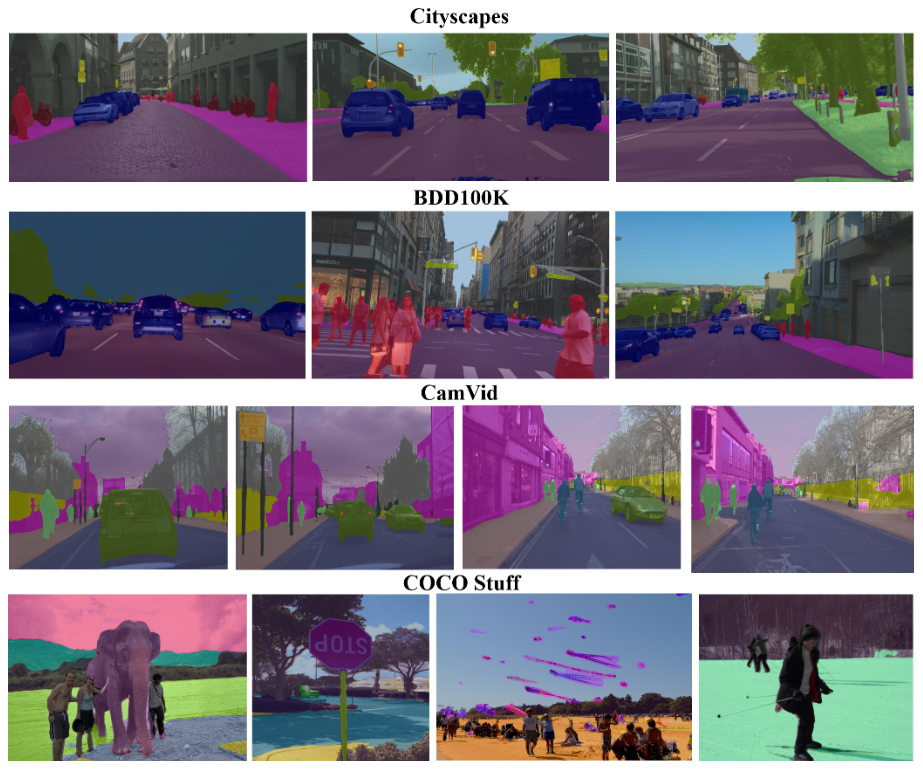
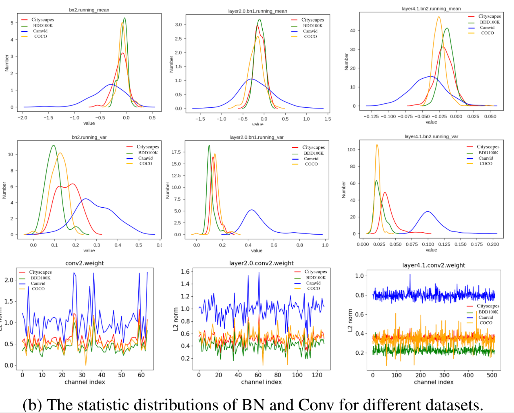

---
title: Cross-Dataset Collaborative Learning for Semantic Segmentation
authors: [zerorains]
tags: [segmentation, refinement, cross-dataset-learning]
--- 

> 论文名称：[Cross-Dataset Collaborative Learning for Semantic Segmentation](https://arxiv.org/abs/2103.11351)
>
> 作者：[Li Wang](https://arxiv.org/search/cs?searchtype=author&query=Wang%2C+L), [Dong Li](https://arxiv.org/search/cs?searchtype=author&query=Li%2C+D), [Yousong Zhu](https://arxiv.org/search/cs?searchtype=author&query=Zhu%2C+Y), [Lu Tian](https://arxiv.org/search/cs?searchtype=author&query=Tian%2C+L), [Yi Shan](https://arxiv.org/search/cs?searchtype=author&query=Shan%2C+Y)
>
> 期刊：CVPR2021

## 主要结构

DAB：Dataset-Aware Block(数据集感知块)

		作为网络的基本计算单元，有助于捕获o不同功能数据集之间的同质表示和异构统计。
	
		主要由，一个数据集不变的卷积层，多个数据集特定的BatchNormal和一个激活层构成。

DAT：Dataset Alternation Training(数据集交替训练机制)

分割结果：

<!--truncate-->

## 跨数据域的训练

最初的跨数据集训练机制是运用在基于帧的动作识别上的。

后来通过简单的标签级联和标签映射产塞回给你的混合数据集应用到了目标检测上

Domain adaptation(DA 领域适应)或knowledge transfer(知识转化)为跨数据训练提供了有效的技术，目的是通过使用来自源域的知识和足够的标记数据来提高带有注释数据不足或缺少的目标模型的性能

## 跨数据集协作学习

### 参数共享可行性分析

对比不同数据集在conv层和bn层的参数分布：

结论：

1. Conv层中的权重具有相同的分布，即conv层的参数是可以共享的
2. 对于BN层，不同数据集的均值和方差的分布具有不同的形状，可能无法共享。

​		

### 网络结构图

在数据集感知块(DAB)其作为我们通常的CONV+BN+RELU的一个替代，即基本计算单元的替代

DAB的结构如下，其实很简单，使用的卷积层是一个固定数据集训练出来的，但是在BN层中选择的是不同的数据集i除拉的BN层。据论文说，这里又一个自动交换机的东西，自动地将不同分布的数据集分配到对应的BN层中。

假设我们有N个数据集，那么每个数据集的BN层可以通过下面这个公式设定
$$
DSBN\{D_i\}(X_i;\gamma_i,\beta_i) = \gamma_i\hat X_i+\beta_i
$$
其中:

1. DSBNa表示的就是该数据集的BN
2. $\hat X_i = \frac{X_i-\mu_i}{\sqrt{\sigma_i^2+\epsilon}}$，$\mu_i=\frac 1B\sum_{j=1}^BX_i^j$，$\sigma_i^2=\frac 1B\sum_{j=1}^B(X_i^j-\mu_i)^2$
3. $\mu_i,\sigma_i^2$是均值和方差
4. $\gamma_i,\beta_i$表示仿射变换参数
5. B是一个batch的数量

通过学习$\gamma_i,\beta_i$两个BN层的仿射参数，来捕获特定的数据信息。

## 数据集交替训练

目的：减小不同特征图分布的差异引起的训练不稳定性

### DAT机制

在每次迭代过程中，针对不同的数据集进行不同batch的设置，先执行一个数据集的batch获得Loss1后，执行下一个数据集的batch获得loss2，直到获得所有的Loss，将他们相加起来最终获得总的loss，再分别对每一个数据集的batch进行反向传播。

作者尝试设置间隔训练t，即训练A数据集t次，才训练B数据集1次，经过作者实验，得出结论，当t=1时可以获得最好的效果。

./

### DAT优点

 	1. 在每次迭代中反向传播每个数据集的损失将导致训练不稳定。而DAT可以通过优化从不同数据集计算出的总和损失来改进这个问题。
 	2. DAT提供了一种有效的方法来训练来自多个数据集的样本

### 全局损失函数

$$
L=-\sum_{i=1}^{N} \sum_{j=1}^{M} w^{i} y_{j}^{i} \log \left(p_{j}^{i}\right)
$$

N：表示数据集的数量

M：表示图像像素的数量

$p^i_j和y^i_j$：分别表示第i个数据集的第j个像素的预测概论和相应标签

$w^i$：表示损失权重，作者将其设置为1，以使这些损失值范围具有可比性

## 实验

### 实验细节

基线：主干网络为ResNet-18的PSPNetn网络在ImageNet预训练的结果

优化器：SGD

 	1. momentun:0.9
 	2. 权重衰减(weight decay):0.0001
 	3. batch size:8
 	4. 初始学习率：0.01,乘上 $(1-\frac{iter}{maxiter})^{0.9}$的多项式衰减策略

图像随机裁剪为$512 \times512$

评估指标：miou

### 结果

实验先是对两个数据集进行实验，采用单数据集(Single-dataset)，微调(Finetuning)，标签映射(Label remapping)，和DAT的不同跨数据训练方式得到的结果如下:

对三个数据集训练的结果也有较好的提升：

