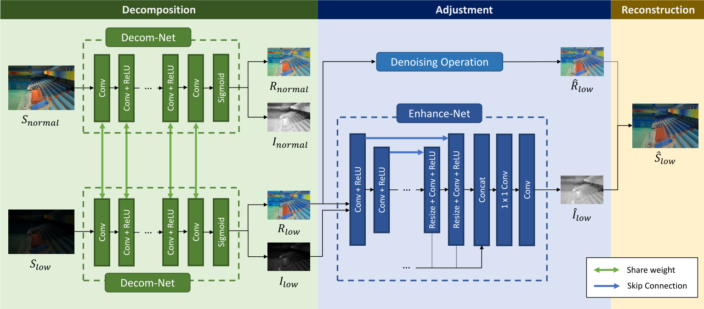

---
title: Deep Retinex Decomposition for Low-Light Enhancement
authors: [pommespeter]
tags: [low-light, backbone]
--- 

> 论文名称: [Deep Retinex Decomposition for Low-Light Enhancement](https://arxiv.org/abs/1808.04560)
>
> 论文作者: Chen Wei, Wenjing Wang, Wenhan Yang, Jiaying Liu
>
> Code: [https://github.com/weichen582/RetinexNet](https://github.com/weichen582/RetinexNet)

这是一篇讲解使用卷积神经网络进行低照度增强的论文。

- 采用了分解网络和增强网络，使用Retinex理论构建分解网络，分解后再进行增强。

## Abstract (摘要)

> Retinex model is an effective tool for low-light image enhancement. It assumes that observed images can be decomposed into the reflectance and illumination. Most existing Retinex-based methods have carefully designed hand-crafted constraints and parameters for this highly ill-posed decomposition, which may be limited by model capacity when applied in various scenes. In this paper, we collect a LOw-Light dataset (LOL) containing low/normal-light image pairs and propose a deepRetinex-Netlearned on this dataset, including a Decom-Net for decomposition and an Enhance-Net for illumination adjusment. In the training process for Decom-Net, there is no ground truth of decomposed reflectance and illumination. The network is learned with only key constraints including the consistent reflectance shared by paired low/normal-light images, and the smoothness of illumination. Based on the decomposition, subsequent lightness enhancement is conducted on illumination by an enhancement network called Enhance-Net, and for joint denoising there is a denoising operation on reflectance. The Retinex-Net is end-to-end trainable, so that the learned decomposition is by nature good for lightness adjustment. Extensive experiments demonstrate that our method not only achieves visually pleasing quality for low-light enhancement but also provides a good representation of image decomposition.

Retinex模型是弱光图像增强的有效工具。它假设观察到的图像**可以分解为反射率和照度**。大多数现有的基于视网膜的方法都为这种高度不适定的分解精心设计了手工制作的约束和参数，当应用于各种场景时，这可能会受到模型容量的限制。在本文中，我们收集了一个包含弱光/正常光图像对的弱光数据集，并在此数据集上提出了一个Deeprinex Netlearn，包括一个用于分解的Decom-Net和一个用于光照调整的增强-Net。在Decom-Net的训练过程中，不存在分解反射率和光照的基本事实。该网络仅在关键约束条件下学习，包括成对的弱光/正常光图像共享的一致反射率以及照明的平滑度。在分解的基础上，通过增强网络对光照进行后续的亮度增强，对于联合去噪，对反射率进行去噪操作。RetinexNet是端到端训练的，因此学习的分解本质上有利于亮度调整。大量实验表明，我们的方法不仅在弱光增强方面获得了视觉上令人满意的质量，而且提供了图像分解的良好表示。

<!--truncate-->

## Introduction

图像捕捉中的照明不足会显著降低图像的可见性。丢失的细节和低对比度不仅会造成不愉快的主观感受，还会损害许多为正常光线图像设计的计算机视觉系统的性能。照明不足的原因很多，例如光线不足的环境、摄影设备性能有限以及设备配置不当。

直方图均衡化(HE)  [20]及其变体抑制输出图像的直方图以满足某些约束。基于去雾的方法[5]利用了光照不足的图像和朦胧环境中的图像之间的反向联系。另一类弱光增强方法建立在Retinex理论[12]的基础上，该理论假设观察到的彩色图像可以**分解为反射率和照度**。作为早期的尝试，单尺度视网膜(SSR)  [11]**通过高斯滤波器将光照图限制为平滑**的。**多尺度视网膜(MSRCR)  [10]通过多尺度高斯滤波器和颜色恢复扩展了SSR。**[23]提出了一种利用亮度级误差测量来保持照明自然性的方法。Fu等人[7]提出融合初始光照图的多个导数。SRIE  [7]使用加权变分模型同时估计反射率和照度。操纵照明后，可以恢复目标结果。另一方面，LIME [9]仅利用结构先验估计光照，并使用反射作为最终的增强结果。还有基于Retinex的联合弱光增强和噪声去除方法[14，15]。对于CNN方法，CNN在低级别图像处理中得到了广泛应用，包括**超分辨率[6，24，26，27]，去雨[16，21，25]等.  Lore等[17]使用堆叠稀疏去噪自动编码器同时进行弱光增强和降噪(LLNet)**，但没有考虑弱光图片的性质。(前人常用的方法)

为了克服这些困难，我们提出了一种数据驱动的Retinex分解方法。建立了一个深度网络，称为RetinexNet，它集成了图像分解和连续增强操作。首先，DecompositionNet被用来将观察到的图像分割成独立于光照的反射和结构感知的平滑光照。Decom-Net是在两个约束条件下学习的。

首先，低/正常光图像具有相同的反射率。其次，光照图应该是平滑的，但保留主要结构，这是**通过结构感知的总变化损失**获得的。然后，另一个**增强网络调整光照图**，以保持大区域的一致性，同时通过多尺度拼接调整局部分布。由于噪声在黑暗区域通常更大，甚至被增强过程放大，因此引入了对反射率的去噪。

为了训练这样一个网络，我们从真实摄影和原始数据集中的合成图像构建了一个低/正常光图像对的数据集。大量实验表明，我们的方法不仅在弱光增强中获得了令人满意的视觉质量，而且提供了图像分解的良好表示。我们工作的贡献总结如下:

- 构建了一个大规模数据集，其中包含在真实场景中捕获的成对弱光/正常光图像。据我们所知，它是微光增强领域的首次尝试；
- 构建了一个基于Retinex模型的深度学习图像分解模型；
- 分解网络是用连续的弱光增强网络进行端到端训练的，因此能够自然地调节光照；
- 针对深度图像分解，**提出了一种结构感知的全变差约束。通过减轻梯度强的地方的总变化的影响，约束成功地平滑了光照图并保留了主要结构**。

## RetinexNet低照度增强

经典的Retienx理论模拟了人类的颜色感知。它假设观察到的图像可以分解成两个分量，反射率和照度。让我们表示源图像，那么它可以表示为
$$
S=R\circ I
$$
其中$R$表示反射率，$I$表示亮度，$\circ$表示点乘，图像中的各个元素逐元素进行相乘。反射率描述了被捕获物体的内在属性，它被认为在任何亮度条件下都是一致的。照明表示物体上的各种亮度。在弱光图像上，它通常受到黑暗和不平衡照明分布的影响。

在视网膜理论的启发下，我们设计了一个深度视网膜网络来联合执行反射/光照分解和弱光增强。网络由三个步骤组成:**分解、调整和重建**。

在分解步骤中，视网膜神经网络通过分解神经网络将输入图像分解成图像。它在训练阶段接收成对的弱光/正常光图像，而在测试阶段只接收弱光图像作为输入。

在弱光/正常光图像具有相同的反射率和光照平滑度的约束下，Decom-Net学习以数据驱动的方式提取不同光照图像之间的一致R。

在调整步骤中，使用增强网来照亮光照图。**增强网络采用一个整体的编码器-解码器框架**。**使用多尺度拼接来保持大区域中照明与上下文信息的全局一致性，同时集中注意力调整局部分布。**此外，如果需要，通常在弱光条件下出现的放大噪声将从反射率中去除。然后，我们在重建阶段通过逐元素乘法来组合调整后的照明和反射。

### 数据驱动型图像分解

分解观察到的图像的一种方法是利用精心手工制作的约束直接在弱光输入图像上估计反射率和亮度。从(1)式中可以看出高度不适定的，不容易设计适合各种场景的约束函数。因此，我们试图以数据驱动的方式解决这个问题，**通过引入数据来实现估计图像的反射率和亮度。**

在训练阶段，Decom-Net每次接收成对的弱光/正常光图像，并在弱光图像和正常光图像具有相同反射率的指导下，学习弱光及其对应的正常光图像的分解。请注意，虽然分解是用成对数据训练的，但它可以在测试阶段单独分解低照度输入。在训练过程中，不需要提供反射率和照度的基本事实。只有必要的知识，**包括反射率的一致性和光照图的平滑度作为损失函数嵌入到网络中。**因此，我们的网络的分解是从成对的低/正常光图像中自动学习的，并且本质上适合于描述不同光条件下图像之间的光变化。

需要注意的一点是，虽然这个问题在形式上可能与原有图像分解相似，但本质上是不同的。在我们的任务中，**我们不需要精确地获得实际的原本的图像，而是一个很好的光线调节表示**。因此，我们让网络学习**寻找弱光图像与其对应的增强结果之间的一致性成分**。

DecomNet将低照度图像$S_{low}$和正常图像$S_{normal}$作为输入，估计$S_{low}$的反射率$R_{low}$和亮度$I_{low}$，对于$S_{normal}$也是估计反射率$R_{normal}$和亮度$I_{normal}$。首先使用$3\times3$的卷积层从输入图像中提取特征，通过几个带有ReLU激活函数的$3\times3$的卷积层将RGB图像映射为反射率和照度。3×3卷积层从特征空间投射R和I，并使用sigmoid函数将R和I都约束在[0，1]范围内。

Loss的组成主要有三个部分：重构损失$L_{recon}$，不变反射率损失$L_{ir}$和光照平滑损失$L_{is}$，总的Loss的损失为:
$$
L=L_{recon}+\lambda_{ir}L_{ir}+\lambda_{is}L_{is}
$$

其中，$\lambda_{ir}$和$\lambda_{is}$表示反射率和平滑光照损失的系数。基于我们预想的，$R_{low}$和$R_{high}$可以用对应的光照图重构图像，重构损失表示为

$$
L_{recon}=\sum_{i=low,normal}\sum_{j=low,normal}\lambda_{ij}||R\circ I_j-S_j||_1
$$

不变损失用来约束反射率的一致性，损失函数表示为

$$
L_{ir}=||R_{low}-R_{normal}||_1
$$

光照损失当中，光照图的一个基本假设是局部一致性和结构感知，换句话说，光照贴图的一个好的解决方案应该是在纹理细节平滑的同时仍然可以保留整体结构边界。

- 总可变最小化损失Total variation minimization (TV)，也就是使得整个图片的梯度最小，这是比较常用来做平滑先验在多种图像的恢复任务中他直接使用TV作为损失在局部区域中会失效，例如图像中有很强的结构或者亮度变化很大的地方。这是由于光照图的梯度的均匀减少，无论该区域是文本细节还是强边界。换句话说，TV损失函数是一种没有考虑到结构的损失函数，如图 2 所示，照明是模糊的，并且在反射上留下了强烈的黑色边缘。

    

    为了让损失函数意识意识到图像的结构，对原本的TV函数可以给反射图的梯度进行加权最终$L_{is}$表示为:
    $$
    L_{is}=\sum_{i=low,normal}||\nabla I_i\circ \exp(-\lambda\nabla R_i)||
    $$
    其中$\nabla$表示梯度，包含水平方向$\nabla_h$和垂直方向$\nabla_v$，$\lambda_g$表示平衡结构意识强度的系数。对于$\exp(-\lambda_g\nabla R_i)$，$L_{is}$减轻了反射率的梯度比较陡峭的平滑约束，也就是说，图像结构的定位和光照都是不连续的。

    

### 多尺度光照调整

增强网络采用编码器-解码器的结构作为主体，为了从分层的角度调整光照，在不同尺度上引入了多尺度的concat。编码器解码器结构在大区域中能够获得图像的上下文信息，**在输入图像被连续下采样到小尺度，在这个尺度下网络可以有比较大尺度光照分布的视野。这样可以让我们具有自适应调整的能力。**利用大尺度光照信息，上采样块重建局部光照分布。通过元素求和，从下采样块到其对应的镜像上采样块引入跳跃连接，这强制网络学习残差。

为了分层调整光照，即保持全局光照的一致性，同时适应不同的局部光照分布，引入了**多尺度拼接**。如果有$M$个递增的上采样块，每个上采样块提取一个$C$通道特征图，我们通过最近邻插值调整这些不同比例的特征到最终比例，并将它们连接到一个$C\times M$通道特征图。然后，通过$1×1$卷积层，级联特征被简化为$C$通道。遵循$3×3$卷积层来重建照明图$\hat I$.

下采样块由步长为2的卷积层和ReLU组成。在上采样块中，使用了大小调整卷积层。调整大小卷积层由最近邻插值操作、步长为1的卷积层和ReLU组成。

增强网络的损失函数就由重构损失和光照平滑损失组成，重构损失意味着可以产生一个正常光照图$\hat S$
$$
L_{recon}=||R_{low}\circ\hat I-S_{normal}||_1
$$
光照平滑损失与(5)式相同，除了$\hat I$是被加权之后的$R_{low}$的梯度图。

### 基于反射率的去噪方法

在分解步骤中，对网络施加若干约束，其中之一是光照图的结构感知平滑性。当估计的光照图平滑时，细节都保留在反射率上，包括增强的噪声。因此，在用光照图重建输出图像之前，可以对反射率进行去噪处理。鉴于暗区域的噪声在分解过程中根据亮度强度被放大，我们应该使用与光照相关的去噪方法。

## Dataset

我们的数据集命名为低光配对数据集(LOL)，包含500个低/正常光图像对。据我们所知，LOL是第一个包含从真实场景中获取的用于弱光增强的图像对的数据集。大多数弱光图像是通过改变曝光时间和ISO来收集的，而相机的其他配置是固定的。我们从各种场景中捕捉图像，例如房屋、校园、俱乐部、街道。图3示出了场景的子集。由于相机抖动、物体移动和亮度变化可能导致图像对之间的未对准，受[1]的启发，我们使用三步方法来消除数据集中图像对之间的这种未对准。实现细节可以在补充文件中找到。这些原始图像会调整到400×600，并转换为便携式网络图形格式。数据集将公开提供。(LOL数据集)

...剩余内容查看原文

## Experiments

见原文...

## Conclusion

本文提出了一种深度视网膜分解方法，该方法可以学习以数据驱动的方式将观测图像分解为反射和光照，而不需要分解反射和光照的基本事实。随后的光照增强和反射率去噪操作被引入。分解网络和弱光增强网络是端到端训练的。实验结果表明，我们的方法产生了视觉上令人满意的增强结果，以及图像分解的良好表现。
