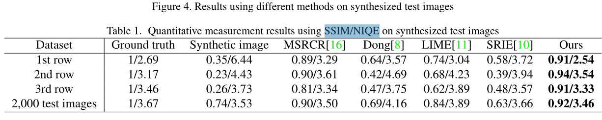

---
title: MSR-net - Low-light Image Enhancement Using Deep Convolutional Network
authors: [pommespeter]
tags: [low-light, multi-scale-learning]
--- 

> 论文名称: [MSR-net:Low-light Image Enhancement Using Deep Convolutional Network](https://arxiv.org/abs/1711.02488)
>
> 论文作者: Liang Shen, Zihan Y ue, Fan Feng, Quan Chen, Shihao Liu, Jie Ma
>
> Code: None

这是一篇讲解基于Retinex理论使用卷积神经网络进行低照度增强的论文。

- 基于MSR传统理论构造卷积神经网络模型
- 直接学习暗图像和亮图像之间的端到端映射

## Abstract (摘要)

> Images captured in low-light conditions usually suffer from very low contrast, which increases the difficulty of sub-sequent computer vision tasks in a great extent. In this paper, a low-light image enhancement model based on convolutional neural network and Retinex theory is proposed. Firstly, we show that multi-scale Retinex is equivalent to a feedforward convolutional neural network with different Gaussian convolution kernels. Motivated by this fact, we consider a Convolutional Neural Network(MSR-net) that directly learns an end-to-end mapping between dark and bright images. Different fundamentally from existing approaches, low-light image enhancement in this paper is regarded as a machine learning problem. In this model, most of the parameters are optimized by back-propagation, while the parameters of traditional models depend on the artificial setting. Experiments on a number of challenging images reveal the advantages of our method in comparison with other state-of-the-art methods from the qualitative and quantitative perspective.

本文提出了一种基于卷积神经网络和视网膜理论(Retinex Theory)的低照度图像增强模型。证明了多尺度视网膜等价于一个具有不同高斯卷积核的前馈卷积神经网络。考虑一种卷积神经网络(MSR网络)，它**直接学习暗图像和亮图像之间的端到端映射**。

<!--truncate-->

## Introduction

在弱光条件下拍摄时，图像有时候会表现出非常低的对比度和亮度，这在很大程度上增加了后续高级任务的难度。一般很多细节都被隐藏在黑暗的背景中。现在有很多种方法解决，主要是分为基于直方图的方法和基于Retinex理论的方法。

本文提出的方法是基于卷积神经网络和视网膜理论(Retinex Theory)的低照度图像增强模型。我们解释了多尺度视网膜等价于一个具有不同高斯卷积核的前馈卷积神经网络。我们提出了一种卷积神经网络(MSR网络)，它可以直接学习暗图像和亮图像之间的端到端映射。

我们主要做三个方面的工作:

- 我们建立了多尺度视网膜神经网络和前馈卷积神经网络之间的关系。
- 我们将弱光图像增强视为一个监督学习问题，暗图像和亮图像分别作为输入和输出。
- 在一些具有挑战性的图像上的实验揭示了我们的方法与其他最先进的方法相比的优势。(实验对比)

## Related Work 

### 低照度增强

一般来说，微光图像增强可以分为两类:基于直方图的方法和基于视网膜的方法(histogram-based methods and
Retinex-based methods)。通过直方图变换直接放大弱光图像可能是最直观的亮暗图像的方法。最简单也是应用最广泛的技术之一是直方图均衡化(he)，它使整个图像的直方图尽可能平衡。伽马校正也是一个很好的方法，通过同时扩大暗区和压缩亮区来增强对比度和亮度。然而，这些方法的主要缺点是图像中的每个像素都是单独处理的，没有其邻域的依赖性，这使得结果看起来与真实场景不一致。为了解决上述问题，提出了在直方图上使用不同正则项的变分方法。相对而言，更多地会使用Retinex的方法。

Retinex理论的主要内容是：图像可以被分解成为反射和亮度(公示表达为:$I(x,y)=r(x,y)\cdot S(x,y)$)。此外，修正的MSR [16]在色度空间中应用颜色恢复函数(CRF)来消除MSR输出中明显的颜色失真和灰色区域。

### 使用CNN做低级视觉任务

近期越来越多的人使用卷积神经网络实现低级的视觉任务。这方面做了很多工作，如去除雨水，去除大雾等。

## CNN for Image Enhancement

本文主要提出的是一个直接学习低照度图像和亮图像之间端到端的映射。

### 多尺度视网膜

首先介绍SSR模型，也就是单尺度Retinex是基于Retinex理论，SSR的核心公式如下
$$
I(x,y)=r(x,y)\cdot S(x,y)
$$
其中$I$和$r$分别表示捕获的图像和反射。基于中心/周围视网膜的单尺度视网膜(SSR)类似于自然视觉科学中广泛使用的高斯差分(DOG)函数。
$$
R_i(x,y)=\log I_i(x,y)-\log[F(x,y)*I_i(x,y)]
$$
其中$R_i(x，y)$是相关的Retinex输出，$I_i(x，y)$是第$i$个颜色光谱带中的图像分布，$*$表示卷积运算，而$F(x，y)$是高斯环绕函数。
$$
F(x,y)=Ke^{-\frac{x^2+y^2}{2c^2}}
$$
其中$c$是标准差，$K$是一个系数，使得(3)式满足:
$$
\iint F(x,y)dxdy=1
$$
通过改变对数在上述公式中的位置得
$$
R_i(x,y)=\log I_i(x,y)-[\log I_i(x,y)] * F(x,y)
$$
通过上述操作就得到了一个经典的高通线性滤波器。(2)式和(5)式在数学上表达式是不等价的，**前者是求图像与其加权平均值之比的对数，后者是图像与夹全乘积之比的对数。**本质上相当于是算术平均值和几何平均值之间进行选择。那么求解多尺度的Retinex增强可以通过对不同尺度大小的分别进行增强，然后求其加权平均值。
$$
R_{MSR_i}=\sum^N_{n=1}w_nR_{n_i}
$$
其中$N$表示不同尺度的数量，$R_{n_i}$表示第$n$个尺度的第$i$个分量，$R_{MSR_i}$表示MSR输出的第$i$个分量。$w_n$表示与第$n$个尺度相关的权重。为了消除强边缘附近可见的“光晕”伪影，对第三个中间范围的需求立即变得明显[16]。因此，公式如下:
$$
R_{MSR_i}(x, y) =\frac{1}{3}\sum^3_{n=1}\{\log I_i(x, y) − [\log I_i(x, y)] ∗ F_n(x, y)\}
$$
具体而言就得到
$$
R_{MSR_i}(x,y)=\log I_i(x,y)-\frac{1}{3}\log I_i(x,y)*[\sum^3_{n=1}K_ne^{-\frac{x^2+y^2}{2c^2_n}}]
$$
注意到两个高斯函数的卷积仍然是高斯函数，其方差等于两个原始方差之和。因此，我们可以使用级联结构来表示上面的等式(8)，如图2(a)所示**(该图不是神经网络结构图)**。

三个级联卷积层被视为三个不同的高斯核。更具体地，第一卷积层的参数基于高斯分布，其方差为$c^2_1$。类似地，第二和第三卷积层的方差分别为$c^2_2-c^2_1$，$c_3^2-c_2^2$，级联层和$1 × 1$卷积层代表加权平均值。总之，多尺度视网膜神经网络实际上相当于一个具有残差结构的前馈卷积神经网络。

### 卷积神经网络方法

在前一节中，我们提出了多尺度视网膜等效于前馈卷积神经网络的事实。在这一部分中，受这个新事实的启发，我们考虑用卷积神经网络来解决弱光图像增强问题。我们在图2(b)中概述的方法与现有方法有根本的不同，现有方法将弱光图像增强作为一个有监督的学习问题。**输入和输出数据分别对应于弱光和亮图像**。

我们的模型由三部分组成:多尺度对数变换、卷积差和颜色恢复函数。与MSR的单尺度对数变换相比，我们的模型尝试使用多尺度对数变换，在实践中得到验证，取得了更好的性能。图7给出了一个例子。卷积差在MSR起到与高斯差类似的作用，色彩恢复功能也是如此。我们的模型与原始MSR模型的主要区别在于，我们的模型中的大多数参数是从训练数据中学习的，而MSR模型中的参数，如方差和其他常数，则取决于人工设置。

形式上，我们将弱光图像表示为输入$X$，相应的亮图像表示为Y，假设$f_1、f_2、f_3$表示三个子函数:多尺度对数变换、卷积差和颜色恢复函数。我们的模型可以写成三个函数的组合:
$$
f(X)=f_3(f_2(f_1(X)))
$$

- 多尺度对数变换

  多尺度对数变换$f_1(X)$以原始低照度图像$X$为输入，计算相同大小的输出$X_1$。首先，对低照度图像进行多次差分对数变换增强。公式如下:
  $$
  M_j=\log_{v_j+1}(1+v_j\cdot X),j=1,2,...,n
  $$
  其中$M_j$表示在经过底数为$v_j+1$的对数运算之后的第$j$个尺度输出。n表示对数变换函数的数量。接下来，我们将这些3D张量$Mj(3个通道×宽度×高度)$连接成更大的3D张量$M(3n个通道×宽度×高度)$，然后使其通过卷积层和ReLU层。
  $$
  M=[M_1,M_2,...,M_n](做concat) \\
  X_1=\max(0, M*W_{-1}+b_{-1})*W_0+b_0
  $$
  其中$*$表示卷积算子，$w_1$是将$3n$个通道收缩为3个通道的卷积核，$max(0,\cdot)$对应于ReLU，$w_0$是具有三个输出通道的卷积核，以获得更好的非线性表示。从上面的操作可以看出，这部分主要是为了**通过多次对数变换的加权和得到更好的图像，加快了网络的收敛速度。**

- 卷积差

  卷积差函数$f_2$取输入$X_1$，并计算相同大小的输出$X_2$。首先，输入$X_1$穿过多层卷积层和一层ReLU。
  $$
  H_0=X_1\\
  H_m=\max(0, H_{m-1}*W_m+b_m),m=1,2,...,K
  $$
  其中$m$表示第$m$个卷积层，$K$等于卷积层数。而$W_m$代表第m个核的权重。$H_1,H_2,...,H_K$被认为是不同尺度下的平滑图像，然后我们将这些3D张量$H_m$连接到更大的3D张量H，并使其通过卷积层:
  $$
  H = [H_1, H_2, ..., H_K] \\
  H_{K+1}=H∗W_{K+1}+ b_{K+1}
  $$
  其中$W_{K+1}$是具有三个输出通道和$1  × 1$感受野的卷积层，相当于对这些$K$个图像求平均。类似于MSR，$f_2$的输出$X_2$是$X_1$和$H_{K+1}$之间的减法:
  $$
  X_2=f_2(X)=X_1-H_{K+1}
  $$

- 颜色恢复函数

  **考虑到MSR结果通常看起来不自然**，修改后的MSR在色度空间中应用颜色恢复函数(CRF)来消除MSR输出中**明显的颜色失真和灰色区域**。在我们的模型中，颜色恢复函数是用一个具有三个输出通道的$1 ×  1$卷积层来模拟:
  $$
  \hat Y=f_3(X_2)=X_2*W_{K+2}+b_{K+2}
  $$
  其中$\hat Y$是最终的增强图像。为了更加直观，图3中分别显示了弱光图像和$f_1、f_2、f_3$的结果。

  ### 目标函数

  我们模型的目标是训练一个深度卷积神经网络，使输出$f(X)$和标签$Y$**在Frobenius范数**的准则下尽可能接近。
  $$
  L =\frac{1}{N}\sum^N_{i=1}||f(X_i) − Y_i||^2_F+λ\sum^{K+2}_{i=-1}||Wi||^2_F
  $$
  其中$N$为训练样本数，$λ$为正则化参数。权重$W$和偏差$b$是我们模型中的全部参数。此外，模型中考虑了正则化参数$λ$、对数变换函数个数$n$、对数变换尺度$v$和卷积层数$K$作为超参数。模型中的参数通过反向传播进行优化，超参数通过网格搜索进行选择。

  ## 问题

  本文由于我们模型中的感受野有限，像晴空这样非常平滑的区域有时会受到光晕效应的攻击。扩大感受野或增加隐藏层可以解决这个问题。

  

## 实验

实验部分自行阅读原文

  