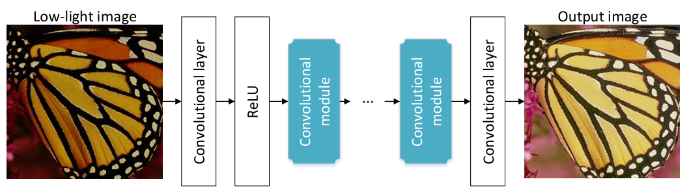

---
title: LLCNN - A convolutional neural network for low-light image enhancement
authors: [pommespeter]
tags: [low-light, multi-scale-learning]
--- 

> 论文名称: [LLCNN: A convolutional neural network for low-light image enhancement](https://ieeexplore.ieee.org/abstract/document/8305143/)
>
> 论文作者: Li Tao, Chuang Zhu, Guoqing Xiang, Yuan Li, Huizhu Jia, Xiaodong Xie
>
> Code: [https://github.com/BestJuly/LLCNN](https://github.com/BestJuly/LLCNN)

### 这篇笔记的写作者是[PommesPeter](https://github.com/PommesPeter)。

这是一篇讲解使用卷积神经网络进行低照度增强的论文。

- 本文使用卷积神经网络进行低照度增强
- 使用SSIM损失更好地评价图像好坏和梯度收敛

## Abstract (摘要)

> In this paper, we propose a CNN based method to perform low-light image enhancement. We design a special  module to utilize multiscale feature maps, which can avoid  gradient vanishing problem as well. In order to preserve image textures as much as possible, we use SSIM loss to train our model. The contrast of low-light images can be adaptively enhanced using our method. Results demonstrate that our CNN based method  outperforms other contrast enhancement methods. 

本文提出了一种基于CNN的低照度图像增强方法。我们设计了一个特殊的模块来**利用多尺度特征映射**，这样可以避免梯度消失的问题。**为了尽可能地保留图像纹理，我们使用SSIM损失来训练我们的模型**。使用我们的方法可以**自适应地增强弱光图像的对比度**。

<!--truncate-->

## Introduction

为了增强图像对比度和提高图像亮度，提出了几种算法。**直方图均衡(HE)方法**[1]，[2]重新排列像素值，使其服从均匀分布。**基于视网膜理论的方法**[3]–[7]利用了一个模型，该模型假设图像是照明和反射的相互作用。**基于dehaze模型的方法**[8]固定像素值，使其服从自然分布。我们称所有这些方法为传统方法。

本文应用CNN对低照度图像进行增强。我们称所提出的网络为低照度卷积神经网络。它学习用不同的核过滤弱光图像，然后将多尺度特征图组合在一起生成增强图像，这些图像看起来是在正常光照条件下捕获的，并且保留了原始特征和纹理。此外，**SSIM损失被整合到我们的LLCNN，以重建更准确的图像纹理。**我们将我们的结果与其他方法进行了比较，结果表明我们的方法在常见的弱光图像增强方法中取得了最好的性能。

## Related Work

### 低照度增强方法

一般来说，低照度图像增强方法可以分为**三类**。

- HE方法保持像素值之间的相对关系，尽量使其服从均匀分布。

- 动态直方图均衡化(DHE)  [1]将直方图分成几个部分，并在每个子直方图中执行HE处理。
- 对比度受限的自适应直方图均衡化(CLAHE)  [2]自适应地限制了HE的对比度增强结果的程度。

对于这些HE方法，在许多情况下会出现严重的偏色问题，而且暗黑暗区域的细节没有得到适当的增强。

基于Retinex理论的方法计算图像的照度，并通过去除它们来实现图像增强。单尺度视网膜(SSR)  [3]、多尺度视网膜(MSR) [4]和带颜色恢复的多尺度视网膜(MSRCR) [5]是这类方法的典型作品。最近，一些新的方法(SRIE  [6]，LIME[7])被提出来估计光照图和反射率以增强低照度图像。在许多情况下，这些方法可能会出现严重的**颜色失真**。

基于Dehaze模型的方法反转低照度图像，并在其上应用dehaze方法。在Dehaze模型中，这种方法用于增强低照度图像。然而，图像通常被过度增强，并且增强图像的饱和度通常被夸大。

### 使用深度学习进行图像处理的方法

\*LLNet是唯一使用深度神经网络增强低照度图像的方法。该网络是**堆叠稀疏去噪自动编码器的变体**，并且它不使用卷积层。使用非线性方法模拟弱光条件，使自然图像变暗。这些图像被设置为训练数据。经过训练，网络可以增强弱光图像。

### Inception模块和残差学习

在许多计算机视觉任务中，深度网络比非深度网络具有更好的性能。然而，当堆叠的卷积层越深，网络就会遇到梯度消失的严重问题，这可能会导致训练难以收敛。使用inception模块和残差学习能够解决这些问题。(因为GoogleNet and ResNet取得了比较好的效果)

## Proposed Method

### 网络结构

虽然低照度图像增强属于低层次(low-level)的图像处理任务，但它与超分辨率和图像去噪有很大不同。对于这两个任务，劣质图像中的像素值都在真值附近，平均像素值几乎不变，这在我们的任务中是不同的。因此，我们设计了一个不同但有效的CNN网络来增强弱光图像。网络结构如下

具体流程如Fig2，可分为两个阶段。

在第一阶段，数据以两种不同的方式处理。一种方式是1×1卷积层，另一种方式是两个3×3卷积层。我们将它们组合在一起，形成第二阶段的输入。第一阶段类似于初始模块。我们不对结果做concat，而是直接相加它们。

第二阶段，也有两种方式。第一种方式是使用两个3×3卷积层处理数据，而第二种方式是直接绕过输入数据，这是残差学习中使用残差连接。

对于VDSR和DnCNN，网络会生成一个残差图像，通过将残差图像与原始图像相加来计算最终图像。这是因为对于超分辨率和图像去噪，地面真实和劣化图像之间的差异不是很大。对于弱光图像增强，网络学习残留图像似乎比一点一点地增强图像更困难。因此，我们不使用这种在VDSR或DnCNN的架构。另一个原因是我们已经在模块中利用了残差学习。

LLCNN的结构是这样描述的:

一个卷积层做预处理产生归一化的输入，另一个卷积层产生增强图像，在这两层之间放置几个特殊设计的卷积模块。对于每个过滤器，我们使用64个过滤器，除了最后一个。最后一层中使用的滤镜数量取决于颜色通道的数量。

该网络以弱光图像作为输入，并进行处理，以使输出图像看起来像是在正常光线条件下捕获的。类似于VDSR和DnCNN，我们将原始图像切割成面片。补丁大小设置为41×41。所有输入图像均采用非线性方法生成，以模拟弱光条件。

### SSIM损失函数

在低照度增强中，我们不需要增强在特定光照环境下的图像。例如，给定在白天拍摄的自然图像，通过添加或减去一个小数字来改变所有像素值是影响很小，在这种情况下，结构几乎不会改变，但使用PSNR函数会有很大的差异。SSIM公式如下
$$
SSIM(p)=\frac{2\mu_x\mu_y+C_1}{\mu_x^2+\mu_y^2+C_1}\cdot\frac{2\sigma_{xy}+C_2}{\sigma_x^2+\sigma_y^2+C_2}
$$
SSIM的值域范围为$(0,1]$，值为1时表示两张图像完全一样，因此我们用$1-SSIM(p)$来计算像素的损失。损失函数定义如下
$$
l_{ssim}\frac{1}{N}\sum_{p\in P}1-SSIM(p)
$$
我们遵循[11]并将自然图像设置为地面真实图像，并且通过退化方法产生弱光图像。随机伽玛调整用于模拟弱光图像。参数γ在范围(2，5)内随机设置，这将使网络能够自适应地增强图像。我们测试了两种不同深度的网络。一个叫做LLCNN，它有三个模块，所以它有17个卷积层。另一个LLCNN-s使用两个模块，卷积层数为12层。除了最后一层，我们在每层设置了64个过滤器。训练时动量设置为0.9，重量衰减为0.0001。基础学习率为0.01。学习速度会在训练过程中发生变化。这里还提供了SSIM损耗层的参数。卷积核大小和$C_1$,$C_2$分别设置为8、0.0001和0.001。在我们的训练过程中，每迭代4万次表示1个epoch。

## Experiments

详见原文

