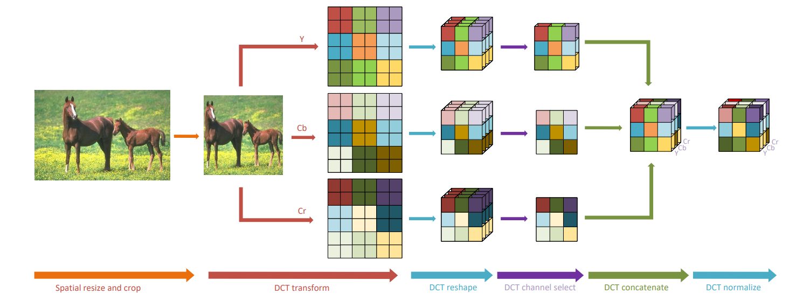
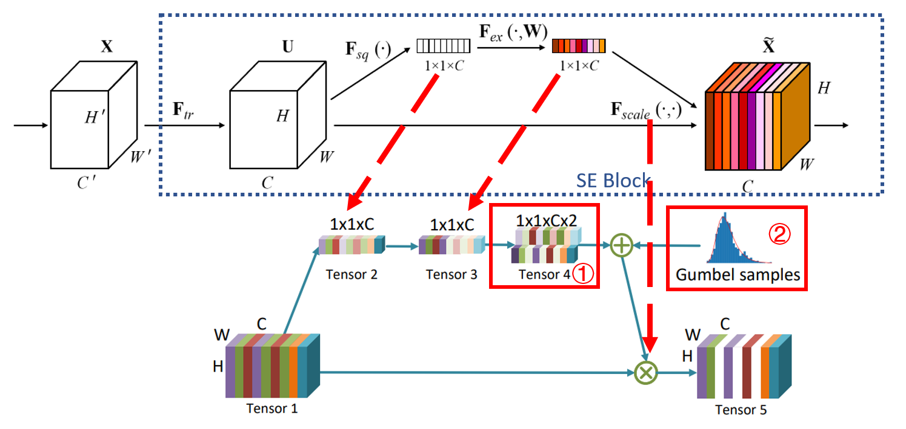
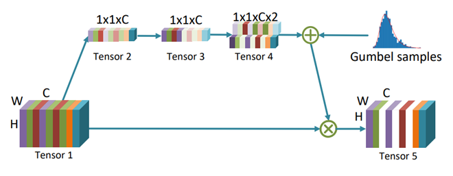

## 概览

在传统的CNN结构中，受限于设备的计算性能（也有的时候单纯是为了产生固定长度的输出以适应需要固定大小输入的全连接层），通常会使用固定大小的图像作为输入（例如：224$\times224$），因此通常会先将图片下采样到某个大小。这已经不能满足现代摄像机实际能达到的视觉画面精度了。加之传统CNN通常在空间上对图像进行操作，这样的行为有意无意中将图像的部分高频信息以及显著性信息移除，直接或间接地导致图像信息或精度的丢失（参考[Effects of Image Degradations to CNN-based Image Classification](https://arxiv.org/abs/1810.05552)）。这篇文章在Introduction中提到以前的工作通过对特定的视觉任务控制这个downsample的过程来降低信息损失（例如 [Task-Aware Image Downscaling](https://openaccess.thecvf.com/content_ECCV_2018/papers/Heewon_Kim_Task-Aware_Image_Downscaling_ECCV_2018_paper.pdf)）。

本文的作者受到HVS（human visual system，人类视觉系统）中的一些研究（[Deep Learning of Human Visual Sensitivity in Image Quality Assessment Framework](https://openaccess.thecvf.com/content_cvpr_2017/papers/Kim_Deep_Learning_of_CVPR_2017_paper.pdf)）以及数字信号处理中一些方法的启发，首先将图像通过某种方法映射到频域内（例如离散余弦变换（discrete cosine transform）或其他方式），获得频域上的特征图后，训练一种“选择器”，其功能是筛选出对最终结果影响较大的频域信息，并移除无关紧要的部分，作为输入后续网络的数据的一部分。

上图(a)：一般CNN模型处理图片的流程；上图(b)：本文的方法处理图片的流程（值得一提的是，该方法作为前处理加入网络时，不需要对原来使用RGB图像作为输入的CNN结构做出什么更改）。实验证明，在相同的输入图像精度下，加入该方法的神经网络比直接在空间域上卷积完成的逐层下采样的方法达到了更高的精度，并且在二分之一输入大小的图像上依然如此。	

从代码上看，本篇论文的贡献主要是一个频域的前处理过程。作者在论文中说明了，将输入转换进频域的前处理几乎可以直接用于任何CNN模型。

>   关注到本文，是因为最近研究分割比较多，并且我觉得分割作为一个逐像素的密集预测问题，其所需的编码方式和类别数量巨大的分类问题以及目标检测问题可以分开来讲。抛开实例分割这种除了分类还需要区分实体的人物不谈，在单纯的语义分割中，分类图像的方式基本是通过编码后特征图每个像素对应channel上解码出的概率分布。在分类数量较少时，我认为所需要的编码复杂度并不需要很高。降低编码的复杂度，一方面能够加快参数收敛的速度，另一方面能够降低网络参数两。自从拜读了一些通道注意力相关的文章（例如[Squeeze and Excitation Networks](./[23]Squeeze-and-Excitation-Networks)），我就隐约感到CNN在较长的channel上可能会隐式地编码一些频率信息，只是由于在网络的监督上没有针对这一点进行优化，所以表现得并不明显。此篇文章提出在频域上选择必要的信息，并不是像我想的那样在直接在监督上使网络显式编码频率信息，而是通过前处理使网络在输入上就表现出对频域的偏置。这和我一开始的想法有些出入，非常具有启发意义。

本文的主要贡献如下：

1.   本文提出了一种不需要更改原有CNN网络结构的频域学习方法，其主要使用“某种频域像关系数”（DCT coefficients as input）作为输入而不是RGB图像。该方法在许多视觉任务上具有出色表现。
2.   本文通过实验证明，使用在频域上的前处理比直接使用卷积操作进行下采样更能保留图像的信息。
3.   本文从频域的角度对“光谱偏置”进行了分析并证明了使用RGB图像作为输入的CNN模型对低频信息更加敏感，这和人类的视觉系统表现是贴合的。
4.   本文提出了一种可学习的动态channel选择器。该选择器通过学习在推理时静态地移除一部分相关性不大的频率分量（通过拦截部分通道）。

---

## 提出了频域的数据前处理过程

很少有CNN模型会直接将高清图片直接放入GPU或任何计算设备中进行推理。这会导致设备内存、带宽或计算瓶颈。为了解决这个问题，高清图片通常被CPU提前处理成较小的图片输入进网络。这通常会导致一些信息的损失以及精度下降。

本文中的方法是将RGB色域的图像转换进YCbCr颜色空间，再转换进频域空间。

>   YCbCr或Y'CbCr有的时候会被写作：YCBCR或是Y'CBCR，是[色彩空间](https://zh.wikipedia.org/wiki/色彩空間)的一种，通常会用于影片中的影像连续处理，或是数字摄影系统中。Y'和Y是不同的，Y就是所谓的[流明](https://zh.wikipedia.org/wiki/流明)（[luminance](https://zh.wikipedia.org/w/index.php?title=Luminance&action=edit&redlink=1)），Y'表示光的浓度且为非线性，使用[伽马修正](https://zh.wikipedia.org/wiki/伽瑪校正)（gamma correction）编码处理，而CB和CR则为蓝色和红色的浓度偏移量成分。
>
>   **YCbCr**不是一种[绝对色彩空间](https://zh.wikipedia.org/wiki/絕對色彩空間)，是[YUV](https://zh.wikipedia.org/wiki/YUV)压缩和偏移的版本。YCbCr的Y与YUV中的Y含义一致，Cb和Cr与UV同样都指色彩，Cb指蓝色色度，Cr指红色色度，在应用上很广泛，JPEG、MPEG、DVD、[摄影机](https://zh.wikipedia.org/wiki/攝影機)、[数字电视](https://zh.wikipedia.org/wiki/數位電視)等皆采此一格式。因此**一般俗称的YUV大多是指YCbCr**。
>
>   **YUV**，是一种[颜色](https://zh.wikipedia.org/wiki/顏色)[编码](https://zh.wikipedia.org/wiki/編碼)方法。常使用在各个影像处理组件中。 YUV在对照片或视频编码时，考虑到人类的感知能力，允许降低色度的带宽。YUV是编译true-color颜色空间（color space）的种类，Y'UV, YUV, [YCbCr](https://zh.wikipedia.org/wiki/YCbCr)，[YPbPr](https://zh.wikipedia.org/wiki/YPbPr)等专有名词都可以称为YUV，彼此有重叠。“Y”表示**[明亮度](https://zh.wikipedia.org/wiki/流明)**（Luminance、Luma），“U”和“V”则是**[色度](https://zh.wikipedia.org/wiki/色度_(色彩学))**、**[浓度](https://zh.wikipedia.org/wiki/濃度_(色彩學))**（Chrominance、Chroma）

上述内容摘自 Wikipedia 中关于 [YCbCr](https://zh.wikipedia.org/wiki/YCbCr) 以及 [YUV ](https://zh.wikipedia.org/wiki/YUV)的相关内容。本篇论文的方法中没有直接将RGB色域的图像转化进频域空间，而是将数据先放入YCbCr颜色空间是有理由的。也许你会在多媒体技术或者数字图像处理课程上了解过早期电视机的相关内容，在该颜色空间下黑白视频是只有Y（Luma，Luminance）通道的视频，也就是灰阶值。到了彩色电视规格的制定，是以YUV/[YIQ](https://zh.wikipedia.org/wiki/YIQ)的格式来处理彩色电视图像，把UV视作表示彩度的C（Chrominance或Chroma），如果忽略C信号，那么剩下的Y（Luma）信号就跟之前的黑白电视频号相同，这样一来便解决彩色电视机与黑白电视机的兼容问题。Y'UV最大的优点在于只需占用极少的带宽。

刚才提到“HVS中的一些研究”，作者在频域中对CNN的输入输出进行测试，通过实验分析发现，在分类、检测和分割任务中，CNN模型对低频率的channel更加敏感。这和HVS中的一些研究是贴合的。也就是说，在使用现在主流的数据集进行监督时，CNN在频域上表现出了和人类一样的“低频敏感性”。因此，对于RGB色域上的输入，并不是整个RGB空间内的所有值在CNN模型中都具有重要的作用。

上图：在本论文提出的方法中图像前处理的过程。该过程包含如下步骤：

1.   Spatial resize and crop：将图像转为输入大小。
2.   DCT transform：将图像从RGB色域转入YCbCr颜色空间，再通过DCT变换转入频域。
3.   DCT channel select：一个选择器选择的过程，选出通道中对推理具有更大影响的部分。
4.   DCT concatenate：将刚才在YCbCr的三个通道里做出的频域选择结果拼接成一个张量。
5.   DCT normalize：利用训练数据集计算的均值和方差对每个频率通道进行归一化处理。

## 提出频域的通道选择器

在聊频域通道的选择（原文：Frequency Channel Selection）之前，先回忆起 [Squeeze and Excitation Networks](./[23]Squeeze-and-Excitation-Networks) 中使用Excitation的过程选择channel，在频域的选择问题上，也许可以使用相似的思路。例如，将不同的频域信息堆叠在channel中，使用类似Squeeze的过程产生一组等于channel长度的选择器，决定某个channel是否进入输出。在CNN中是存在对光谱的偏置的（主要体现为输入为RGB图像），因此对于编码好的特征图，可以在channel中选出“比较重要的部分”。

>   刚才提到“HVS中的一些研究”，作者在频域中对CNN的输入输出进行测试，通过实验分析发现，在分类、检测和分割任务中，CNN模型对低频率的channel更加敏感。这和HVS中的一些研究是贴合的。也就是说，在使用现在主流的数据集进行监督时，CNN在频域上表现出了和人类一样的“低频敏感性”。

基于上述思考，我猜对于频域上的特征图这样做的理由也是相同存在的。还真猜对了，在经过前处理后，特征图上不同的channel堆叠了不同的频域信息。本篇论文中提出通过学习筛除一部分对最终的结果及误差影响不大的通道。在刚才的前处理中，图像变为了$W\times H\times C$（本文中$C=192$）的频域特征图，输入频率选择器。这篇文章在通道选择上直接使用了类似SE Block的结构：

上图：选择器结构（下，文中称之为 $Gate\ Module$）和SE Block（上）的结构对比图。可以看到，除了图中标号1和2，其余部分和两者结构基本相同（注：本文的$F_{ex}(\cdot,W)$过程是$1\times 1$卷积，而不是SE Block中全连接）。在Gate Module的输出中标记为白色的通道代表被过滤的通道（查看[Squeeze and Excitation Networks](./[23]Squeeze-and-Excitation-Networks) 以理解 SE Block ）。

论文的作者在文中说明了该结构与SE Block的不同之处：在 SE Block 中，对channel的采样是数值的，每个channel会得到一个数值的权重。而本文的Gate Module则对channel进行 $0-1$ 采样。采样的方式是 $Tensor 3$ 通过两套参数变为 $Tensor 4$（shape为$1\times 1\times C\times 2$），然后再进行伯努利分布的采样。原文中是这样描述的：

>   The decision is obtained by sampling a Bernoulli distribution $Bern(p)$, where $p$ is calculated by the 2 numbers in the $1 \times 1 \times C \times 2$ tensor mentioned above.

在原SE Block的设计中经过“$F_{ex}$”过程得到 $Tensor 3$ 后直接 $softmax$ 。但是在本文给出的Gate Module中产生了一个问题。上面描述的选择方法中使用了伯努利分布采样，这会产生离散的通道选择决策。当我们采用梯度下降优化时，能够直接优化的是连续量。对于离散量以及在中间过程中出现离散量的网络是难以直接进行梯度下降优化的。因此，在Gate Module中，然后再进行 $Gumbel\ softmax$（ Gumbel softmax distribution 可参考论文[Categorical Reparameterization with Gumbel-Softmax ](https://arxiv.org/abs/1611.01144)）。$Gumbel\ softmax$ 允许了在具有离散采样的过程中进行反向传播，解决了这个问题。

上图：通过类似 SE Block 的结构选取重要的通道。

## 探究哪些通道被选择了

为了研究通道选择器的行为，作者使用相同数据集在图像分类和语义分割任务上进行训练，并对频域的选择器选出的channel信息进行了可视化：

上图：在 ImageNet（validation set）进行**分类**任务时对选出的通道 YCbCr 组成绘制可视化 heat map。

上图：在 COCO（validation set）进行**分割**任务时对选出的通道 YCbCr 组成绘制可视化 heat map。

>   阅读上述 heat map 的方法：在 heat map 中每个代表channel方块上具有的index编号表示该通道对应的frequency index。颜色越深表示在前向传播时该channel越容易被选中。

通过观察上述可视化结果，论文的作者提出了以下几个结论：

1.   低频的（index较小的）通道比高频的（index较大的）通道更容易被选择。这说明在常见的视觉任务中低频信息比高频信息携带了更多对推理有效的信息。
2.   在亮度分量Y（luma component Y）中的通道比Cb和Cr中的通道更容易被选择。这说明YCbCr空间内的输入在推理时图像的亮度分量Y包含了更多有用信息。
3.   根据heat map，在分类任务和分割任务上，上述两点同时成立。这证明了这些结论并非task-specific，并且可能同样适用于更多高级的计算机视觉任务。
4.   低频的通道并不是严格地比高频的通道容易被选中。例如，在Cb和Cr上，能够观察到$6,9$通道被选中而$3,4,5$通道没有被选中的情况，并且在COCO数据集上 $index=0$对应的通道被选择的可能性低于$index=1,2$的通道。也就是说，上述结论可能因为数据集分布的不同具有少量差异。

这些结论也许说明了，CNN模型和人类的视觉一样喜欢低利用低频信息。JPEG标准在压缩图像时使用的时相似的策略。如果你想仔细研究以下JPEG标准，可以移步维基。

## 什么数据输入了网络

经过前处理得到频域特征图也并没有直接作为输入特征直接输入网络，而是与来自spatial-wise的特征图concatenate成为组合特征共同输入网络。这个过程可以表示为：

上图：前处理后的频域特征与直接来自图像的特征图拼接的方式。由于CNN中的卷积层对于spatial-wise的图像数据在设计上就表现出优化偏置，因此空域上的输入是必要的。上图中channel数量写为$64$仅为举例。根据论文描述，实际在代码中这个数字一般小等于$192$。在这片论文中，作者一直将这个数字写为$192$。

上图：真正被输入后续网络中的数据。在concatenate操作之后，空间域的特征图和频域的特征图被拼接。经过这样的前处理，使输入的特征包含了频域信息丰富了特征表达，并且降低了占用大量带宽的空域特征图大小。
