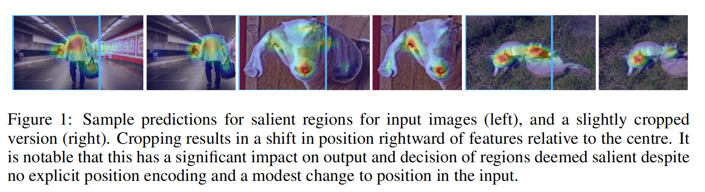
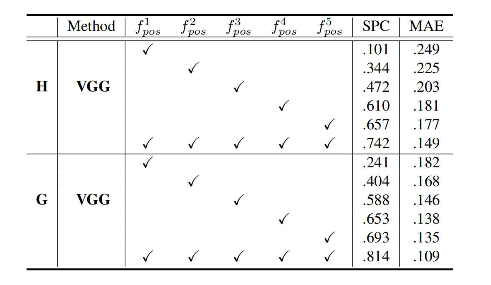
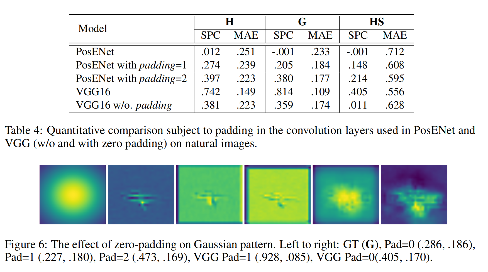

---
title: How much Position Information Do Convolutional Neural Networks Encode?
authors: [visualdust]
tags: [inductive-bias, positional-encoding]
--- 

[Md Amirul Islam](https://arxiv.org/search/cs?searchtype=author&query=Islam%2C+M+A), [Sen Jia](https://arxiv.org/search/cs?searchtype=author&query=Jia%2C+S), [Neil D. B. Bruce](https://arxiv.org/search/cs?searchtype=author&query=Bruce%2C+N+D+B)

> In contrast to fully connected networks, Convolutional Neural Networks (CNNs) achieve efficiency by learning weights associated with local filters with a finite spatial extent. An implication of this is that a filter may know what it is looking at, but not where it is positioned in the image. Information concerning absolute position is inherently useful, and it is reasonable to assume that deep CNNs may implicitly learn to encode this information if there is a means to do so. In this paper, we test this hypothesis revealing the surprising degree of absolute position information that is encoded in commonly used neural networks. A comprehensive set of experiments show the validity of this hypothesis and shed light on how and where this information is represented while offering clues to where positional information is derived from in deep CNNs.

`Comments`: Accepted to ICLR 2020

## 引言
经典CNN模型被认为是`spatially-agnostic`的，因此胶囊网络或循环网络已被用于建模学习特征层内的相对空间关系。目前尚不清楚CNN是否捕获了在位置相关任务中重要的绝对空间信息（例如语义分割和显著对象检测）。如下图所示，被确定为最显著的区域倾向于靠近图像中心。在裁剪过图像上做显著性检测时，即使视觉特征没有改变，最显著的区域也会移动。

在这篇文中，研究了绝对位置的作用通过执行一系列随机化测试，假设CNN确实可以学习到编码位置信息作为决策线索，从而获得位置信息。实验表明，位置信息是通过常用的填充操作（零填充）隐式学习的。

<!--truncate-->

## CNN中的位置信息

CNN会在早期卷积阶段尝试提取精细的高空间频率细节（例如边缘、纹理、线条），而在编码的最深层，网络产生最丰富的类别特定特征表示。在本文中，提出了一个假设，即位置信息隐式编码在提取的特征映射中，并在从视觉场景中分类、检测或分割对象时起着重要作用。下面给出研究问题的数学定义。

**问题表述：** 给定一个输入图像$I_m\in R^{h\times w\times 3}$，目标是预测一个类似梯度的位置信息掩模${\hat{f}}_p\in R^{h\times w}$，其中每个像素值定义了绝对坐标，像素从左到右，从上到下。我们生成类似梯度的掩模$G_{pos}\in R^{h\times w}$用于实验中的监督，基本CNN原型网络的权重是固定的。

### 位置编码网络

位置编码网络（`PosENet`）由两个关键组件组成：一个前馈卷积编码器网络$f_{enc}$和一个简单的位置编码模块$f_{pem}$。编码器网络从较浅层到较深层提取不同抽象级别的特征。位置编码模块将来自编码器网络的多尺度特征作为输入，并在最后预测绝对位置信息。

**编码器：** 使用基于`ResNet`和`VGG`的体系结构，通过**删除平均池层**和分配类别的层来构建编码器网络$f_{enc}$，即上面灰色的部分，编码器模块由五个特征提取块组成，用（$f^1\vartheta$、$f^2\vartheta$、$f^3\vartheta$、$f^4\vartheta$、$f^5\vartheta$）表示。从标准网络的底层到顶层提取的多尺度特征用（$f^1pos$、$f^2pos$、$f^3pos$、$f^4pos$、$f^5pos$）表示。总结如下：

$$
f^ipos=f^i\vartheta(\mathbf{W}_{a}*\mathcal{I}_{m})
$$

其中$\mathbf{W}_{a}$表示被冻结的权重，$*$表示卷积运算。注意，在编码网络时，只有位置编码模块$f_{pem}$被训练成专注于提取位置信息，而编码器网络被强制保持其现有权重。

**位置编码模块：** 位置编码模块将$f_{enc}$的多尺度特征（$f^1pos$、$f^2pos$、$f^3pos$、$f^4pos$、$f^5pos$）作为输入，并通过转换函数$\mathcal{T}_{pos}$生成所需的位置映射${\hat{f}}_p$。转换函数$\mathcal{T}_{pos}$首先在特征图上应用双线性插值操作，使其具有相同的空间维度，从而生成特征图$f^c_{pos}$。然后进行一系列$k\times k$卷积操作。在实验中，我们在$\{1,3,5,7\}$之间改变$k$的值，并且大多数实验是在位置编码模块$f_{pem}$中使用单个卷积层进行的。关键操作可概括如下：

$$
f^cpos=(f^1pos\oplus \cdots \oplus f^5pos ) \qquad \hat{f}_{p}=(\mathbf{W}^cpos*f^cpos)
$$

式中，$W^c_{pos}$是与转换函数$\mathcal{T}_{pos}$相关的可训练权重。

编码模块的主要目标是验证在分类标签上训练时是否隐式学习位置信息。此外，位置编码模块对隐含的位置信息和梯度状真值掩模之间的关系进行建模。**如果特征图中没有编码位置信息，则输出预计为随机输出，反之亦然（忽略图像内容的任何指导）。**

### 合成数据和真值生成

为了验证网络中位置信息的存在性，我们通过指定一个标准化梯度位置图作为真值来执行随机化测试（**梯度一词来表示像素强度，而不是反向传播中的梯度**）。我们首先在水平（**H**）和垂直（**V**）方向生成类似梯度的遮罩。同样，我们应用高斯滤波器来设计另一种真值图，高斯分布（**G**）。生成这三种模式的关键动机是验证模型是否可以学习一个或两个轴上的绝对位置。此外，我们还创建了两种类型的重复模式，水平和垂直条纹（**HS**，**VS**）。无论其方向如何，多级特征中的位置信息都可能通过编码模块$f_{pem}$的转换进行建模。注意这里设计的梯度真值可以看作是一种随机标签，因为输入图像和真值之间没有位置相关性。由于位置信息的提取与图像内容无关，因此可以选择任何图像数据集。

### 训练网络

通过均方差损失，进行监督

$$
\Delta_{\hat{f}_p}=\frac{1}{2n}(x_{i}-y_{i})^2
$$
其中$x\in R^n$和$y\in R^n$（n表示空间分辨率）分别是矢量化的预测位置图和真值图。$x_{i}$和$y_{i}$分别是${\hat{f}}_p$和$G^h_{pos}$的一个像素。

## 结论

### 位置信息存在

上表1所示，`PosENet（VGG和ResNet）`可以很容易地从预训练的CNN模型中提取位置信息，尤其是基于`ResNet`的`PosENet`模型。然而，单独训练`PosENet（PosENet）`在不同的模式和源图像中获得更低的分数。**这一结果意味着很难单独从输入图像中提取位置信息。PosENet仅在与深度编码器网络耦合时才能提取与真值位置图一致的位置信息**。
如前所述，鉴于与输入的相关性已被忽略，生成的真值图可被视为一种随机化测试。然而，测试集在不同的真值模式上的高性能表明，该模型不是盲目地过度拟合噪声，而是提取真实位置信息。然而，与其他模式相比，我们观察到重复模式（HS和VS）的性能较低，这是由于模型的复杂度，特别是真值和绝对位置之间缺乏相关性（表1的最后两行）。H模式可视为正弦波的四分之一，而条纹模式（HS和VS）可视为正弦波的重复周期，这需要更深入的讨论。

上图显示了跨不同模式的几种体系结构的定性结果。我们可以看到与H、G和HS模式对应的预测和真值位置图之间的相关性，这进一步揭示了这些网络中位置信息的存在。定量和定性结果有力地验证了假设，即位置信息隐式编码在每个体系结构中，没有任何明确的监督。

此外这里也展示了不同架构的网络对于位置的编码能力不同或者语义内容的先验知识程度不同。

### 分析POSENET

在上述中，位置编码网络只用了一层不同大小的卷积层进行实验。什么能影响位置编码网络的性能呢？
（1）改变内核大小在位置编码模块中
（2）添加卷积层的堆栈长度，以从多级特征中提取位置信息。

**堆叠层的影响：**    表1中的实验结果表明存在从对象分类任务中学习到的位置信息。在本实验中，改变了PosENet的设计，以检验是否有可能更准确地提取隐藏位置信息。先前实验（表1）中使用的PosENet只有一个卷积层，其内核大小为3×3。
在这里，我们将一组不同长度的卷积层应用于PosENet，并在表2（a）中报告实验结果。

如表2所示，我们在堆叠多层时将内核大小固定在3×3。在PosENet中应用更多层可以改善所有网络位置信息的读出。一个原因可能是堆叠多个卷积滤波器允许网络具有更大的有效感受野，例如，两个3×3卷积层在空间上等于一个5×5卷积层。另一种可能性是，位置信息的表示方式可能需要一阶以上的推断（？）。

**不同核大小的影响：** 我们仅使用一个具有不同内核大小的卷积层来进一步验证PosENet，并在表2（b）中报告了实验结果。从表2（b）中，可以看到，与较小的内核大小相比，较大的内核大小可能捕获更多的位置信息。这一发现意味着位置信息可能在空间上分布在层内和特征空间中，因为更大的感受野可以更好地解析位置信息。(This finding implies that the position information may be distributed spatially within layers and in feature space as a larger receptive field can better resolve position information.)

### 位置信息储存在哪里

上述实验表明，位置信息是在预训练的CNN模型中编码的。观察位置信息在各层中的分布也同样有意思。
下面实验分别对提取的特征$f_1pos$、$f^2pos$、$f^3pos$、$f^4pos$、$f^5pos$进行PosENet训练，以检查哪一层编码了更多的位置信息。

如上表所示，与$f^1pos$相比，使用$f^5pos$取得最佳的性能。这可能部分是由于从较深的层相比更浅的层提取了更多的特征图（分别为512和64层）。然而，这很可能表明在网络的最深层中位置信息的编码更强，其中该信息由高级语义共享。同时进一步研究了VGG16的这种效应，其中最上面的两层（$f^4pos$和$f^5pos$）具有相同数量的特征。更有趣的是，$f^5pos$比$f^4pos$获得更好的结果。这一比较表明，更深层次的特征包含更多的位置信息，这验证了顶层视觉特征与全局特征相关联的普遍观点(top level visual featuresare associated with global features.)。

## 位置信息来自哪里

零填充广泛应用于卷积层，以保持输入和输出的相同空间尺寸，在水平和垂直两个轴的开始和结束处添加许多零。为了验证这一点，作者做了如下实验。
删除了VGG16中实现的所有填充机制，但仍然使用ImageNet预训练权重初始化模型。请注意，仅使用基于VGG的PosENet执行此实验，因为删除ResNet模型上的填充将导致跳连的大小不一致。

在PosENet中不使用填充的效果。**从表4可以看出，没有零填充的VGG16模型在自然图像上实现的性能远远低于默认设置（padding=1）**。类似地，我们通过应用零填充向PosENet引入位置信息。padding=1的PosENet（在帧周围连接一个零）比原始（padding=0）实现更高的性能。当我们设置padding=2时，位置信息的作用更加明显。**这也验证了之前的实验，该实验表明PosENet无法提取明显的位置信息，因为没有应用填充，并且信息是从预训练的CNN模型编码的**。这就是为什么在之前的实验中没有在PosENet中应用零填充。此外，我们的目标是探索在预训练模型中编码了多少位置信息，而不是直接与PosENet结合。图6示出了，使用高斯模式，零填充编码位置信息的影响。(Fig. 6 illustrates the impact of zero-padding on encoding position information subject to padding using a Gaussian pattern.)

### one more thing

回想一下，位置信息应该是独立于内容的一种信息，即不管输入的图片语义如何，其位置信息都应差不多。但是在表一中表明，图像中的语义会影响位置映射。为了可视化语义的影响，使用以下等式计算内容损失热图：

$$
\mathcal{L}=\frac{|\mathcal{G}^hpos-\hat{f}^h_p|+|\mathcal{G}^vpos-\hat{f}^v_p|+|\mathcal{G}^gpos-\hat{f}^g_p|}{3}
$$
其中$\hat{f}^h_p$，$\hat{f}^v_p$，$\hat{f}^g_p$，分别是水平、垂直和高斯模式的预测位置图。

如图所示，PosENet的热图在各个角落都有较大的内容损失。而VGG和ResNet的损失图更多地与语义内容相关。特别是对于ResNet，对语义内容的深入理解会导致在生成平滑梯度时产生更强的干扰。损失最大的分别是脸、人、猫、飞机和花瓶（从左到右）。这种可视化可以作为显示模型关注哪些区域的替代方法，特别是在ResNet的情况下。

## 总结

本文探讨了卷积神经网络中绝对位置信息隐式编码的假设。实验表明，位置信息在很大程度上是可用的。而更大的感受野或位置信息的非线性读出进一步增强了绝对位置的读出。实验还表明，当不存在语义线索时，根据来自语义信息的干扰的实验表明对what（语义特征）和where（绝对位置）进行联合编码，恢复位置信息也是可能的（Experiments also reveal that this recovery is possible when no semantic cues are present and interference from semantic information suggests joint encoding of what (semantic features) and where (absolute position，`不太明白`）。**结果表明，零填充和边界作为锚定，空间信息从中衍生出来，并随着空间特征提取的发生最终传播到整个图像**(zero padding and borders as an anchor from which spatial information is derived and eventually propagated over the whole image as spatial abstraction occurs )。