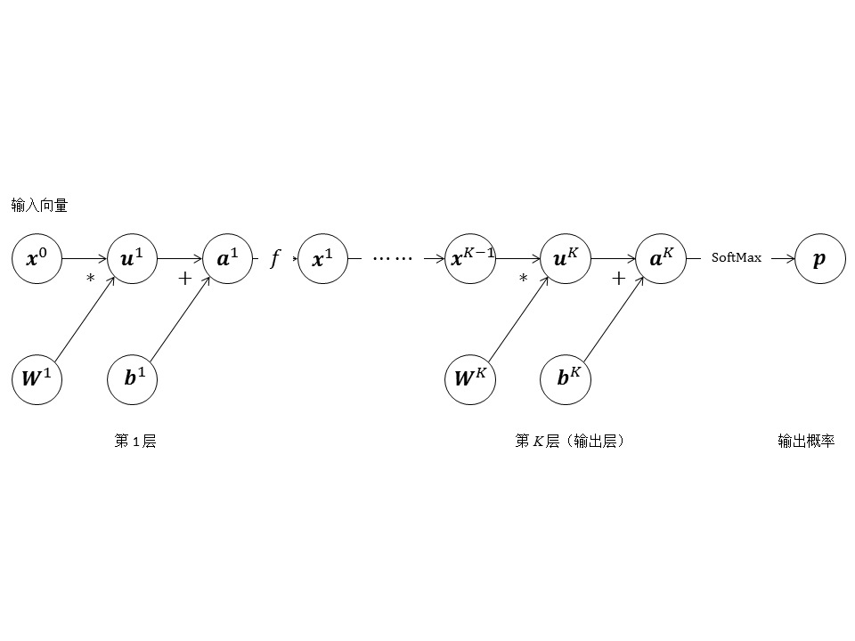
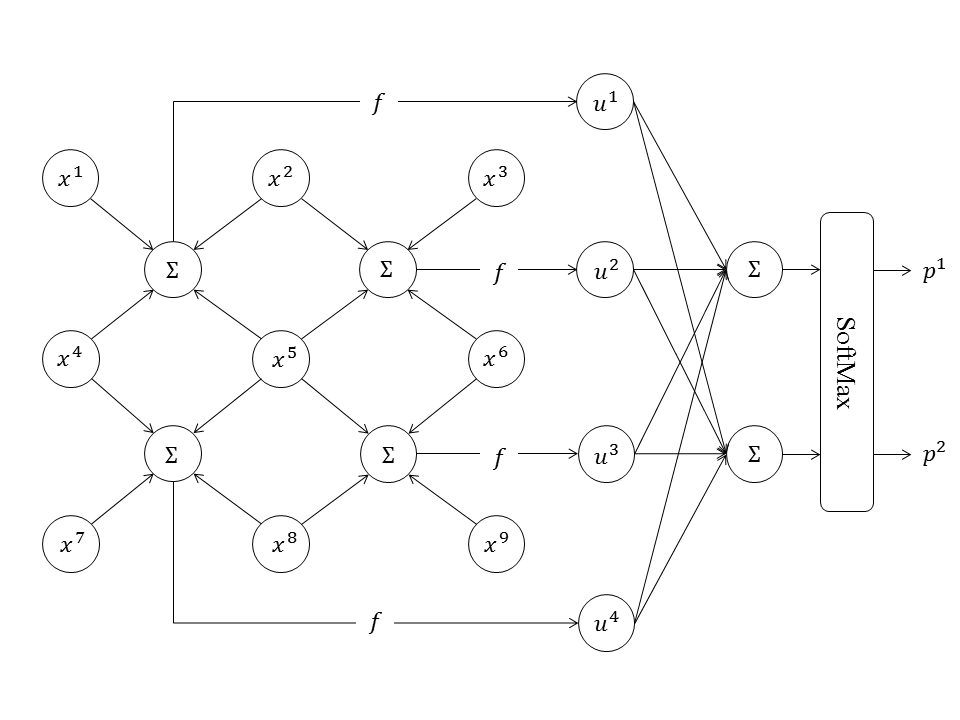

# TensorFlow编程策略

## TensorFlow名称由来

​	TensorFlow中的计算过程都可以表示为一个计算图（computation graph），又称有向图（directed graph），其作用与外观都可以比作程序流程图。在计算图中我们能直观地观察数据的计算流程，换个说法，你可以观察到“张量在这其中流动的过程”。

​	计算图中的每一个运算操作被叫做一个节点（Node），每一个节点可以有任意的输入和任意的输出。如果一个运算的输入取值自另外一个运算的输出，那么称这两个运算存在依赖关系。存在依赖关系的两个节点通过边（Edge）互相连接。

​	张量（Tensor）就是在边中流动（Flow）的数据。其数据类型可以是任意的。这也是TensorFlow名称的由来。

## 计算图：TensorFlow的计算模型

### 接触计算图

在TensorFlow中，计算图是神经网络计算的流程的直观表示。计算图被定义为有向图，其中节点对应于数学运算。 在数学上，计算图是表达和评估数学表达式的一种方式。

接下来通过简单的举例对计算图进行描述：

首先我们尝试表示$p=x+y$

上面的计算图具有一个加法节点(具有“+”符号的节点)，其具有两个输入变量`x`和`y`以及一个输出`q`。

第二个例子：$g = ( x + y ) \cdot z$

#### 多层全连接网络的计算图

常见的多层全连接神经网络示意图就是一个计算图，它的节点都是标量，表示计算的粒度较细。现在我们可以用向量节点更简洁地表示多层全连接神经网络，如下图所示。

计算图可以灵活地表示更为复杂的神经网络：

#### 计算图和向前传播

实际上，计算图本身就表示着正向传播。比如在上面的图中我们表示了$g = ( x + y ) \cdot z$。如果我们对这些变量进行取值：`x = 1`和`y = 3`的值来获得`p = 4`,然后`p = 4`和`z = -3`来得到`g = -12`。

上图是这个过程表示在计算图中。所以，计算图本身就很直观的表示了向前传播。

#### 计算图中的反向传播

反向传播的目的是计算每个输入相对于最终输出的梯度。例如，在简单的表达式$y=k\cdot x+b$中，我们看到两组x和y之后，就可以解出k和b来。之后我们可以用这组k和b来预测不知道的x对应的y。这便是机器学习任务最直观的解释。所以这些梯度对于使用梯度下降训练神经网络至关重要。

诶嘿嘿其实我才写了一点...