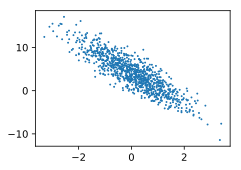

# 线性回归的代码实现

## 从零开始的实现

在了解了线性回归的背景知识之后，现在我们可以动手实现它了。尽管强大的深度学习框架可以减少大量重复性工作，但若过于依赖它提供的便利，会导致我们很难深入理解深度学习是如何工作的。因此，本节将介绍如何**只利用`NDArray`和`autograd`来实现**一个线性回归的训练。

首先导入所需要的包：

```python
from matplotlib import pyplot as plt
from mxnet import autograd, nd
import random
```

### 生成数据集

神经网络和其他一些形式的训练都需要数据集。在这里我们可以把神经网络或是简单的线性回归比作是学生。学生的使命有两个，上课和考试。其中，数据集就是上课用的教材。它上课的过程是它学习的过程，也就是之前一节我们讲到的训练过程。而数据集就是上课使用的教材。它会从数据集中学习预测要用到的知识。相对的，实际的预测工作就是考试了。通常，我们学习到的课本知识就是考试要用到的知识，所以其实数据集和测试集一般是相同的东西。如果你忘记了数据集的作用，请参考[上一节](./linear-regression.md)中的内容。

我们构造一个简单的人工训练数据集，它可以使我们能够直观比较学到的参数和真实的模型参数的区别。设训练数据集样本数为1000，输入个数（特征数）为2。给定随机生成的批量样本特征$\boldsymbol{X} \in \mathbb{R}^{1000 \times 2}$，我们使用线性回归模型真实权重$\boldsymbol{w} = [2, -3.4]^\top$和偏差$b = 4.2$，以及一个随机噪声项$\epsilon$来生成标签
$$
\boldsymbol{y} = \boldsymbol{X}\boldsymbol{w} + b + \epsilon,
$$
其中噪声项$\epsilon$服从均值为0、标准差为0.01的正态分布。噪声代表了数据集中无意义的干扰。下面，让我们生成数据集。

```python
num_inputs = 2
num_examples = 1000
true_w = [2, -3.4]
true_b = 4.2
features = nd.random.normal(scale=1, shape=(num_examples, num_inputs))
labels = true_w[0] * features[:, 0] + true_w[1] * features[:, 1] + true_b
labels += nd.random.normal(scale=0.01, shape=labels.shape)
```

注意，`features`的每一行是一个长度为2的向量，而`labels`的每一行是一个长度为1的向量（标量）。

```python
print(features[0], labels[0])
```

你会看到这样的输出：

```
([2.2122064 0.7740038]
 <NDArray 2 @cpu(0)>,
 [6.000587]
 <NDArray 1 @cpu(0)>)
```

通过生成第二个特征`features[:, 1]`和标签 `labels` 的散点图，可以更直观地观察两者间的线性关系。

```python
plt.scatter(features[:, 1].asnumpy(), labels.asnumpy(), 1)
plt.show()
```

你可以看到这样的结果：



我们将上面的`plt`作图函数以及`use_svg_display`函数和`set_figsize`函数定义在`d2lzh`包里。以后在作图时，我们将直接调用`d2lzh.plt`。由于`plt`在`d2lzh`包中是一个全局变量，我们在作图前只需要调用`d2lzh.set_figsize()`即可打印矢量图并设置图的尺寸。

### 读取数据集

在训练模型的时候，我们需要遍历数据集并不断读取小批量数据样本。这里我们定义一个函数：它每次返回`batch_size`（批量大小）个随机样本的特征和标签。

```python
# 可以将本函数暂存，可能会经常使用
def data_iter(batch_size, features, labels):
    num_examples = len(features)
    indices = list(range(num_examples))
    random.shuffle(indices)  # 样本的读取顺序是随机的
    for i in range(0, num_examples, batch_size):
        j = nd.array(indices[i: min(i + batch_size, num_examples)])
        yield features.take(j), labels.take(j)  # take函数根据索引返回对应元素
```

让我们读取第一个小批量数据样本并打印。每个批量的特征形状为(10, 2)，分别对应批量大小和输入个数；标签形状为批量大小。

```python
batch_size = 10
for X, y in data_iter(batch_size, features, labels):
    print(X, y)
    break
```

你可以看到这样的输出：

```
[[-0.5159189  -0.76856834]
 [-2.338083   -0.32677847]
 [ 0.2963081   0.8711869 ]
 [-0.25645885 -0.06595954]
 [-1.1917231  -1.9933461 ]
 [-1.2387311   1.6483529 ]
 [-1.3782892  -0.26404357]
 [ 0.5992656   1.1744224 ]
 [-1.3917285  -0.6852174 ]
 [ 0.19469471  0.26424283]]
<NDArray 10x2 @cpu(0)>
[ 5.7907085  0.6198239  1.8301572  3.9042075  8.604688  -3.8805866
  2.344126   1.3913386  3.7515614  3.6989803]
<NDArray 10 @cpu(0)>
```

### 初始化模型参数

我们将权重初始化成均值为0、标准差为0.01的正态随机数，偏差则初始化成0。

```python
w = nd.random.normal(scale=0.01, shape=(num_inputs, 1))
b = nd.zeros(shape=(1,))
```

之后的模型训练中，需要对这些参数求梯度来迭代参数的值，因此我们需要创建它们的梯度。

```python
w.attach_grad()
b.attach_grad()
```

### 定义模型

下面是线性回归的矢量计算表达式的实现。我们使用`dot`函数做矩阵乘法。

```python
def linreg(X, w, b):  # 本函数已保存在d2lzh包中方便以后使用
    return nd.dot(X, w) + b
```

### 定义损失函数

我们使用上一节描述的平方损失来定义线性回归的损失函数。在实现中，我们需要把真实值`y`变形成预测值`y_hat`的形状。以下函数返回的结果也将和`y_hat`的形状相同。

```python
def squared_loss(y_hat, y):  # 本函数已保存在d2lzh包中方便以后使用
    return (y_hat - y.reshape(y_hat.shape)) ** 2 / 2
```

### 定义优化算法

以下的`sgd`函数实现了上一节中介绍的小批量随机梯度下降算法。它通过不断迭代模型参数来优化损失函数。这里自动求梯度模块计算得来的梯度是一个批量样本的梯度和。我们将它除以批量大小来得到平均值。

```python
def sgd(params, lr, batch_size):  # 本函数已保存在d2lzh包中方便以后使用
    for param in params:
        param[:] = param - lr * param.grad / batch_size
```

### 训练模型

在训练中，我们将多次迭代模型参数。在每次迭代中，我们根据当前读取的小批量数据样本（特征`X`和标签`y`），通过调用反向函数`backward`计算小批量随机梯度，并调用优化算法`sgd`迭代模型参数。由于我们之前设批量大小`batch_size`为10，每个小批量的损失`l`的形状为(10, 1)。回忆一下[“自动求梯度”](https://zh.d2l.ai/chapter_prerequisite/autograd.html)一节。由于变量`l`并不是一个标量，运行`l.backward()`将对`l`中元素求和得到新的变量，再求该变量有关模型参数的梯度。

在一个迭代周期（epoch）中，我们将完整遍历一遍`data_iter`函数，并对训练数据集中所有样本都使用一次（假设样本数能够被批量大小整除）。这里的迭代周期个数`num_epochs`和学习率`lr`都是超参数，分别设3和0.03。在实践中，大多超参数都需要通过反复试错来不断调节。虽然迭代周期数设得越大模型可能越有效，但是训练时间可能过长。我们会在后面“优化算法”一章中详细介绍学习率对模型的影响。

```python
lr = 0.03
num_epochs = 3
net = linreg
loss = squared_loss

for epoch in range(num_epochs):  # 训练模型一共需要num_epochs个迭代周期
    # 在每一个迭代周期中，会使用训练数据集中所有样本一次（假设样本数能够被批量大小整除）。X
    # 和y分别是小批量样本的特征和标签
    for X, y in data_iter(batch_size, features, labels):
        with autograd.record():
            l = loss(net(X, w, b), y)  # l是有关小批量X和y的损失
        l.backward()  # 小批量的损失对模型参数求梯度
        sgd([w, b], lr, batch_size)  # 使用小批量随机梯度下降迭代模型参数
    train_l = loss(net(features, w, b), labels)
    print('epoch %d, loss %f' % (epoch + 1, train_l.mean().asnumpy()))
```

你会看到这样的输出：

```
epoch 1, loss 0.040165
epoch 2, loss 0.000156
epoch 3, loss 0.000050
```

训练完成后，我们可以比较学到的参数和用来生成训练集的真实参数。它们应该很接近。

```python
print(true_w, w) # 输出真实w和预测w
print(true_b, b) # 输出真实b和预测b
```

你会看到：

```
([2, -3.4],
 [[ 1.9997545]
  [-3.3998818]]
 <NDArray 2x1 @cpu(0)>)
```

```
(4.2,
 [4.199627]
 <NDArray 1 @cpu(0)>)
```

### 

---


## 更加简洁的实现

随着深度学习框架的发展，开发深度学习应用变得越来越便利。实践中，我们通常可以用比上一节更简洁的代码来实现同样的模型。在本节中，我们将介绍如何使用MXNet提供的Gluon接口更方便地实现线性回归的训练。

### 生成数据集

我们生成与上一节中相同的数据集。其中`features`是训练数据特征，`labels`是标签。

```python
from mxnet import autograd, nd

num_inputs = 2
num_examples = 1000
true_w = [2, -3.4]
true_b = 4.2
features = nd.random.normal(scale=1, shape=(num_examples, num_inputs))
labels = true_w[0] * features[:, 0] + true_w[1] * features[:, 1] + true_b
labels += nd.random.normal(scale=0.01, shape=labels.shape)
```

### 读取数据集

Gluon提供了`data`包来读取数据。由于`data`常用作变量名，我们将导入的`data`模块用添加了Gluon首字母的假名`gdata`代替。在每一次迭代中，我们将随机读取包含10个数据样本的小批量。

```python
from mxnet.gluon import data as gdata

batch_size = 10
# 将训练数据的特征和标签组合
dataset = gdata.ArrayDataset(features, labels)
# 随机读取小批量
data_iter = gdata.DataLoader(dataset, batch_size, shuffle=True)
```

这里`data_iter`的使用与上一节中的一样。让我们读取并打印第一个小批量数据样本。

```python
for X, y in data_iter:
    print(X, y)
    break
```

你可以看到这样的输出：

```
[[ 0.1533563  -0.735794  ]
 [ 0.86821365  1.3929764 ]
 [ 0.18896957 -0.16971196]
 [-0.56865287  0.91230786]
 [-1.986459    1.0147698 ]
 [-1.4778582  -0.7482584 ]
 [ 1.0731696   0.12017461]
 [-1.169967   -0.1280246 ]
 [-0.11494503  1.7983674 ]
 [-0.15030771  1.2691218 ]]
<NDArray 10x2 @cpu(0)>
[ 6.9870367   1.1803569   5.1567063  -0.03822104 -3.2290347   3.7934349
  5.927642    2.2820377  -2.1227243  -0.4165226 ]
<NDArray 10 @cpu(0)>
```

### 定义模型

在上一节从零开始的实现中，我们需要定义模型参数，并使用它们一步步描述模型是怎样计算的。当模型结构变得更复杂时，这些步骤将变得更烦琐。其实，Gluon提供了大量预定义的层，这使我们只需关注使用哪些层来构造模型。下面将介绍如何使用Gluon更简洁地定义线性回归。

首先，导入`nn`模块。实际上，“nn”是neural networks（神经网络）的缩写。顾名思义，该模块定义了大量神经网络的层。我们先定义一个模型变量`net`，它是一个`Sequential`实例。在Gluon中，`Sequential`实例可以看作是一个串联各个层的容器。在构造模型时，我们在该容器中依次添加层。当给定输入数据时，容器中的每一层将依次计算并将输出作为下一层的输入。

```python
from mxnet.gluon import nn
net = nn.Sequential()
```

回顾图3.1中线性回归在神经网络图中的表示。作为一个单层神经网络，线性回归输出层中的神经元和输入层中各个输入完全连接。因此，线性回归的输出层又叫全连接层。在Gluon中，全连接层是一个`Dense`实例。我们定义该层输出个数为1。

```python
net.add(nn.Dense(1))
```

值得一提的是，在Gluon中我们无须指定每一层输入的形状，例如线性回归的输入个数。当模型得到数据时，例如后面执行`net(X)`时，模型将自动推断出每一层的输入个数。我们将在之后“深度学习计算”一章详细介绍这种机制。Gluon的这一设计为模型开发带来便利。

### 初始化模型参数

在使用`net`前，我们需要初始化模型参数，如线性回归模型中的权重和偏差。我们从MXNet导入`init`模块。该模块提供了模型参数初始化的各种方法。这里的`init`是`initializer`的缩写形式。我们通过`init.Normal(sigma=0.01)`指定权重参数每个元素将在初始化时随机采样于均值为0、标准差为0.01的正态分布。偏差参数默认会初始化为零。

```python
from mxnet import init
net.initialize(init.Normal(sigma=0.01))
```

### 定义损失函数

在Gluon中，`loss`模块定义了各种损失函数。我们用假名`gloss`代替导入的`loss`模块，并直接使用它提供的平方损失作为模型的损失函数。

```
from mxnet.gluon import loss as gloss
loss = gloss.L2Loss()  # 平方损失又称L2范数损失
```

### 定义优化算法

同样，我们也无须实现小批量随机梯度下降。在导入Gluon后，我们创建一个`Trainer`实例，并指定学习率为0.03的小批量随机梯度下降（`sgd`）为优化算法。该优化算法将用来迭代`net`实例所有通过`add`函数嵌套的层所包含的全部参数。这些参数可以通过`collect_params`函数获取。

```python
from mxnet import gluon
trainer = gluon.Trainer(net.collect_params(), 'sgd', {'learning_rate': 0.03}
```

### 训练模型

在使用Gluon训练模型时，我们通过调用`Trainer`实例的`step`函数来迭代模型参数。上一节中我们提到，由于变量`l`是长度为`batch_size`的一维`NDArray`，执行`l.backward()`等价于执行`l.sum().backward()`。按照小批量随机梯度下降的定义，我们在`step`函数中指明批量大小，从而对批量中样本梯度求平均。

```python
num_epochs = 3
for epoch in range(1, num_epochs + 1):
    for X, y in data_iter:
        with autograd.record():
            l = loss(net(X), y)
        l.backward()
        trainer.step(batch_size)
    l = loss(net(features), labels)
    print('epoch %d, loss: %f' % (epoch, l.mean().asnumpy()))
```

你会看到这样的输出：

```
epoch 1, loss: 0.041022
epoch 2, loss: 0.000154
epoch 3, loss: 0.000051
```

下面我们分别比较学到的模型参数和真实的模型参数。我们从`net`获得需要的层，并访问其权重（`weight`）和偏差（`bias`）。学到的参数和真实的参数很接近。

```python
dense = net[0]
true_w, dense.weight.data()
true_b, dense.bias.data()
```

输出是这样的：

```
([2, -3.4],
 [[ 1.9994273 -3.3997018]]
 <NDArray 1x2 @cpu(0)>)
```

```
(4.2,
 [4.199502]
 <NDArray 1 @cpu(0)>)
```