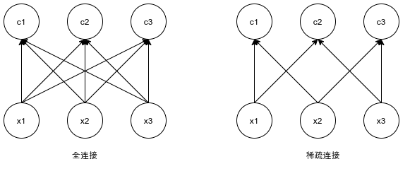
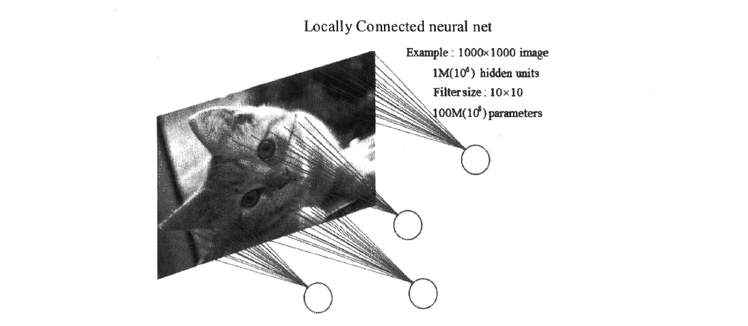
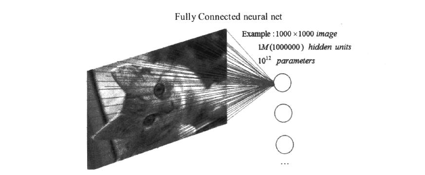

# 卷积神经网络

## 为什么使用卷积神经网络

在[“多层感知机”](../ch1/multilayer-perceptron.md)一节里我们构造了一个含单隐藏层的多层感知机模型来对Fashion-MNIST数据集中的图像进行分类。每张图像高和宽均是28像素。我们将图像中的像素逐行展开，得到长度为784的向量，并输入进全连接层中。然而，这种分类方法有一定的局限性。

1. 图像在同一列邻近的像素在这个向量中可能相距较远。它们构成的模式可能难以被模型识别。
2. 对于大尺寸的输入图像，使用全连接层容易导致模型过大。假设输入是高和宽均为1,0001,000像素的彩色照片（含3个通道）。即使全连接层输出个数仍是256，该层权重参数的形状也是3,000,000×2563,000,000×256：它占用了大约3 GB的内存或显存。这会带来过于复杂的模型和过高的存储开销。

卷积层尝试解决这两个问题。一方面，卷积层保留输入形状，使图像的像素在高和宽两个方向上的相关性均可能被有效识别；另一方面，卷积层通过滑动窗口将同一卷积核与不同位置的输入重复计算，从而避免参数尺寸过大。

卷积神经网络又称卷积网络（Convolutional Networks），是一种专门用来处理具有类似网格结构数据的伸进网络。例如图像就可以看作二维网格机构的像素数据。卷积神经网络和全连接网络都属于前馈神经网络。相较于全连接网络，卷积网络的进步是卷积层的引入和池化层的引入，这两者都是卷积神经网络的重要组成部分。卷积神经网络的名称中“卷积”一词标明了这种网络结构使用卷积（Convolution）这种数学运算。卷积是一种较为特殊的线性运算，用来代替一般的矩阵乘法运算。

本页面将大致叙述卷积本身的具体过程，并讨论在卷积神经网络中的卷积运算的三个性质：稀疏连接特性、参数共享特性、平移等变特性。

## 卷积运算

### 数学的卷积

函数$f$,$g$是定义在$\R^n$上的可测函数（measueable function），$f$与$g$的卷积就记作$f*g$，它是其中一个函数翻转，并平移后，与另外一个函数的乘积的积分，是一个对平移量的函数，也就是：
$$
(f*g)(t) = \int_{\R^n} f(\tau)f(\tau )g(t-\tau ) d\tau
$$
如果函数不是定义在$\R^n$上的，可以吧函数定义域以外的值都规定成0，这样就变成了一个定义在$\R^n$上的函数。

在[泛函分析](https://zh.wikipedia.org/wiki/泛函分析)中，**卷积**（又称**叠积**（convolution）、**褶积**或**旋积**），是透过两个[函数](https://zh.wikipedia.org/wiki/函数) *f* 和 *g* 生成第三个函数的一种数学[算子](https://zh.wikipedia.org/wiki/算子)，表征函数 *f* 与经过翻转和平移的 *g* 的乘积函数所围成的曲边梯形的面积。卷积是[数学分析](https://zh.wikipedia.org/wiki/数学分析)中一种重要的运算。设：$f(x)$、$g(x)$是$\R$上的两个[可积函数](https://zh.wikipedia.org/wiki/可积函数)，作[积分](https://zh.wikipedia.org/wiki/积分)：
$$
\int_{-\infty}^{+\infty} f(\tau)f(\tau )g(x-\tau ) d\tau
$$
可以证明，关于几乎所有的$x\in (-\infty ,\infty )$，上述积分是[存在](https://zh.wikipedia.org/wiki/存在)的。这样，随着$x$的不同取值，这个积分就定义了一个新函数$h(x)$，称为函数$f$与$g$的卷积，$h(x)=(f*g)(x)$。我们可以轻易验证：$(f*g)(x)=(g*f)(x)$，并且$(f*g)(x)$仍为可积函数。卷积与[傅里叶变换](https://zh.wikipedia.org/wiki/傅里叶变换)有着密切的关系。例如两函数的傅里叶变换的乘积等于它们卷积后的傅里叶变换，利用此一性质，能简化傅里叶分析中的许多问题。

卷积的概念还可以推广到[数列](https://zh.wikipedia.org/wiki/数列)、[测度](https://zh.wikipedia.org/wiki/测度)以及[广义函数](https://zh.wikipedia.org/wiki/广义函数)上去。

## 卷积运算的稀疏连接特性

 在全连接网络中，我们通过输入与参数空间的矩阵乘法得到了输出。在这个过程中，参数矩阵的每一个参数全部并且仅仅只描述了一个输入单元与一个输出单元的交互关系。这样做是不明智的，因为当输入的数据增多时，参数的数量也会变得巨大。

与全连接方式不同的是，卷积运算具有稀疏连接（Sparse Connectivity，或称稀疏交互）的特性。这通过将卷积核的大小限制为远小于输入的大小来达到。举个例子说明，假设某一层有$m$个输入和$n$个输出，那么做一次矩阵乘法会产生$m*n$个参数；如果我们限制每一个来自上一层的输出只连接到下一层的$k$个输入，那么稀疏的连接方法只需要$k*n$个参数。

上图是对稀疏连接的一种图形化解释过程。其中，输入单元用$xi$的形式表示，输出单元用$ci$的形式表示。在稀疏连接中，输出的元素由输入的元素经过核宽为2的卷积产生，例如$c2$仅与$x1$和$x3$产生联系。这些单元被称为$c$的感受野（Receptive Field）；在非稀疏连接时，由于c是由矩阵乘法产生的，所以所有输入都会影响$c$。

卷积运算的稀疏连接特性与感受野有关。每一张图像都存在着空间组织结构图像的一个像素点在空间上和周围的像素点实际存在着紧密的联系。比如图片中有一根黄色的相较放在白色的盘子里，我们放大这幅图片就会发现带表香蕉的像素在边缘会慢慢变白，这些像素就能当作香蕉和盘子的分界线，但是这些像素和太遥远的像素点似乎就没什么关联了。如果盘子里还有一个红色的苹果，代表苹果的像素和代表盘子的像素之间也存在着分界线，但是这条分界线和香蕉没有什么关系。这也就是所谓的计算机视觉中的感受野的概念。一般认为动物对外界的认知是从局部到全局的，每一个感受野只接收来自某一小块区域的信号，并且着一小块区域内的像素相互关联。卷积运算的稀疏连接借鉴了感受野的概念，因为图像的空间联系中局部的像素联系更加紧密，而距离较远的像素相关性则较弱，所以每一个神经元不需要接收全部的像素点的信息，只需要接收相互关联的一小块区域内的像素点座位输入即可，之后这些神经元接受到的局部信息在更高层进行综合，就可以得到全局的信息。

接下来我们通过一个例子叙述卷积运算的稀疏连接特性在减小参数量方面的巨大作用：

（稀疏连接）如图所示，如果一张图像的尺寸是$1000*1000$，并且是只有一个颜色通道的黑白图像，那么一张图片就有100万个像素点，假设局部感受野（如果你不知道感受野的大致含义，可以参考下一段）的大小（卷积核大小）是$10*10$，，并且隐藏单元有100万个，那么稀疏连接就是指每个隐藏单元只与图像中的$10*10$个像素连接，于是现在就需要$10*10*100万=1亿$个连接，也就是需要一亿个权重参数。

一亿个参数，这是在稀疏连接下的情况，听起来参数量还是很大的，但是如果将图片的100万个像素全部连接到一个相同大小的隐藏层（同样是100万个隐藏单元），也就是全连接的情况，这样会产生$100万*100万=1万亿$个连接，也就是一万亿个权重参数，相比于稀疏连接的一亿权重参数，全连接的方式将这个数字扩大了一万倍。（全连接）示意图如下：

通过稀疏连接，我们达到了减少权重参数的目的。

减少权重参数的数量有两个好处，一个是降低计算的复杂度；另一个是过多的连接会导致严重的过拟合，并且参数越多理论上为了达到某种精度所需的训练次数也越多。减少连接数可以提升模型的泛化能力。

我们通过卷积的稀疏连接特性将一万亿参数降低到了一亿，但是这听上去依然很大，仍然需要继续降低参数量，这就需要用到卷积运算的下一个特性——参数共享特性。

## 卷积运算的参数共享特性

## 卷积运算的平移等变特性

## 多卷积核

## 卷积层代码实现