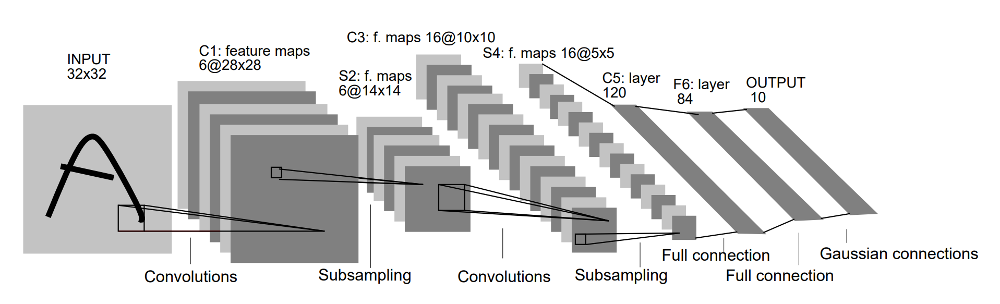

# LeNet：初试卷积神经网络

在[“多层感知机”](../ch1/multilayer-perceptron.md)一节里我们构造了一个含单隐藏层的多层感知机模型来对Fashion-MNIST数据集中的图像进行分类。每张图像高和宽均是28像素。我们将图像中的像素逐行展开，得到长度为784的向量，并输入进全连接层中。然而，这种分类方法有一定的局限性。

1. 图像在同一列邻近的像素在这个向量中可能相距较远。它们构成的模式可能难以被模型识别。
2. 对于大尺寸的输入图像，使用全连接层容易导致模型过大。假设输入是高和宽均为1,0001,000像素的彩色照片（含3个通道）。即使全连接层输出个数仍是256，该层权重参数的形状也是3,000,000×2563,000,000×256：它占用了大约3 GB的内存或显存。这会带来过于复杂的模型和过高的存储开销。

卷积层尝试解决这两个问题。一方面，卷积层保留输入形状，使图像的像素在高和宽两个方向上的相关性均可能被有效识别；另一方面，卷积层通过滑动窗口将同一卷积核与不同位置的输入重复计算，从而避免参数尺寸过大。

LeNet的名字来源于LeNet论文的第一作者Yann LeCun。LeNet展示了通过梯度下降训练卷积神经网络可以达到手写数字识别在当时最先进的结果。这个奠基性的工作第一次将卷积神经网络推上舞台，为世人所知。

## LeNet 模型

LeNet缠身过很多不同的变种。在这我们讨论LeNet-5。

LeNet-5是一个专门为手写数字识别而设计的经典卷积神经网络。在MNIST数据集上，LeNet-5能够达到大约99.4%的准确率。基于LeNet-5设计的手写数字识别系在20世纪90年代被广泛应用于美国的许多家银行进行支票的手写数字识别。

根据LeNet-5作者Yann LeCun教授公开发表的[论文]()内容，可知LeNet-5公有8层（包括输入和输出层），之所以它被称为LeNet-5是因为其卷积部分（包含卷积和下采样）层数的总数是5。

与近几年的卷积神经网络相比较，LeNet-5的网络规模比较小，但是包含了构成现代卷积神经网络的基本组件——卷积层、池化层、全连接层。再复杂的卷积神经网络也会包含这些基本的组件。所以某种意义上我们将LeNet视为卷积神经网络的“开山之作”。



上图是在LeNet-5相应论文中找到的网络结构图，在上图中，C代表卷积层，卷积操作的目的是使信号特征增强并降低噪音。用S代表下采样层，执行的是池化操作，利用图像局部相关性原理，对图像进行子抽样，这样可以减少数据量，同时也保留一定的有用的信息。

现在我们讨论LeNet-5的模型结构。LeNet-5共有8层，其中包含了1个输入层、3个卷积层、2个下采样层，2个全连接层。它的网络结构可以被描述为：

```
LeNet-5：输入-（1.卷积-2.下采样-3.卷积-4.下采样-5.卷积）-全连接-全连接
```

1. 第一层：输入层，输入的是32x32分辨率的灰度图。注意，MNIST数据集中图片的大小是28x28。这样做的原因是希望最高层特征检测感受野的中心能够收集更多潜在的明显特征（如转折、断点等）。
2. 第二层：C1层是一个卷积层，由6个特征图组成。这个卷积层的核尺寸是5x5，深度是6。
3. 第三层：S2是一个下采样层，通过2x2的下采样，得到了深度为6（和上一层一样）的14x14特征图。也就是说，S2中的每一个特征图的每一个单元都与C1层输出的特征图中的2x2大小的位置相连。
4. 第四层：C3是一个卷积层，由第三层的图像通过一个深度为16，大小为5x5的卷积核卷积得到。注意，本层输出的每个特征图并不是一对一地与上一层的6个特征图相连，它们相连的关系是：
5. 第五层：S4是一个下采样层，有16个5x5大小的特征图，每一个都与C3层输出的特征图中的2x2大小的位置相连。
6. 第六层：C5是一个卷积层，其中有120个大小为5x5的卷积核对上一层的输出进行卷积。尽管这层在论文中是一个卷积层，但是基本与全连接层没有区别，在代码中常将其直接写为全连接层。
7. 第七层：F6是一个全连接层，有84个神经元，与上一层C5构成全连接关系。
8. 第八层：输出层也是一个全连接层，共有十个神经元，分别代表数字0~9。

## 使用代码实现

