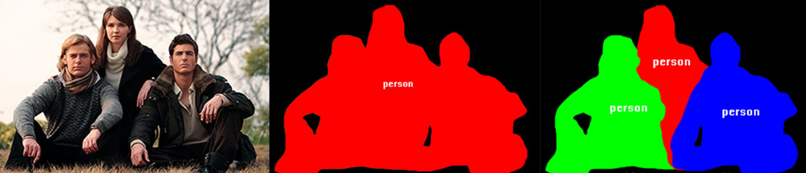

# 图像语义分割综述

## 关于分割

### 从种类上

对图像进行分割主要有：语义分割（Semantic segmentation）和实例分割（Instance segmentation）。它们的区别一目了然：

左图：原图；中图：语义分割；右图：实例分割。

很明显，语义分割希望将不同类别的物体所在位置的像素分开来，但是对于相同类别的不同物体并不敏感；而实例分割不但需要分开每一个位置上像素属于哪一类，还要分出它具体属于哪一个对象。

我们知道一个图像只不过是许多像素的集合。图像分割分类是对图像中属于特定类别的像素进行分类的过程，因此**图像分割可以认为是按像素进行分类的问题**。

### 从实现方法上

#### 传统方法

在深度学习方法流行之前，TextonForest和基于随机森林分类器等语义分割方法是用得比较多的方法。但是本文章的背景是基于深度学习方法的计算机视觉，所以不做过多讨论。

#### 深度学习技术和方法

深度学习技术在各个计算机领域获得了巨大的成功，其解决语义分割问题可以概括为几种思路：

1. 块分类（Patch classification）

   如其名，把图像分成小块塞给网络进行分类。分成指定大小的小块是因为全连接网络只接受指定大小的输入。这大概是最初的基于深度学习的分割方法了（吧）。

2. 全卷积方法（基于FCN）

   用于代替全连接的全卷积方法除了在其他视觉方法里很出名，也很快用到了分割算法中。2014年，全卷积网络（FCN）横空出世，FCN将网络全连接层用卷积取代，因此使任意图像大小的输入都变成可能，而且速度比Patch classification方法快很多。（我用简单分类模型实测了一下也是，全连接真的是太烂了，又慢又重，但是作为多层感知机到全卷积网路中间的过度组件，还是功不可没的。）

   尽管移除了全连接层，但是CNN模型用于语义分割还存在一个问题，就是下采样操作（这里以池化为例）。池化可以扩大感受野因而能够很好地整合上下文信息（如果想了解更多这方面的内容可以参考），

3. 编码器-解码器结构（encoder-decoder，本质基于FCN）

   编码器解码器结构是为了避免全卷积方法中采样导致的空间信息丢失等问题而进行改进的一种方法。

4. 空洞卷积（dilated/atrous代替了池化）

5. 条件随机场

---

