# 图像语义分割综述

## 关于分割

对图像进行分割主要有：语义分割（Semantic segmentation）和实例分割（Instance segmentation）。它们的区别一目了然：

左图：原图；中图：语义分割；右图：实例分割。

很明显，语义分割希望将不同类别的物体所在位置的像素分开来，但是对于相同类别的不同物体并不敏感；而实例分割不但需要分开每一个位置上像素属于哪一类，还要分出它具体属于哪一个对象。

我们知道一个图像只不过是许多像素的集合。图像分割分类是对图像中属于特定类别的像素进行分类的过程，因此**图像分割可以认为是按像素进行分类的问题**。

如果你对离散数学以及softmax很敏感的化，肯定第一时间会产生这样的联想：

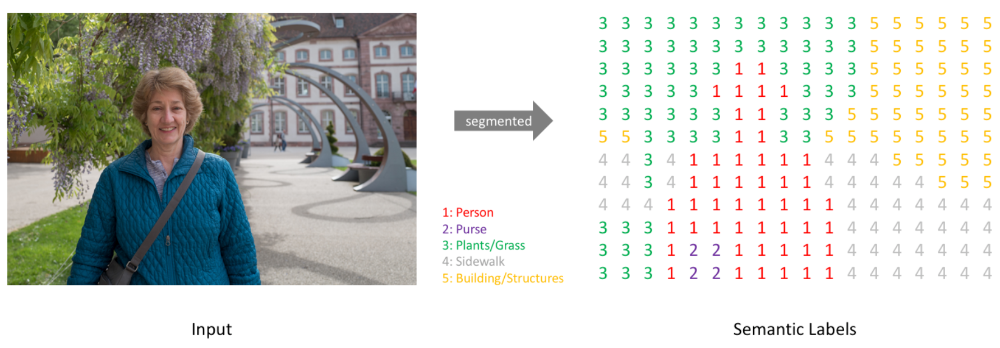

这张图实际上是这样的：

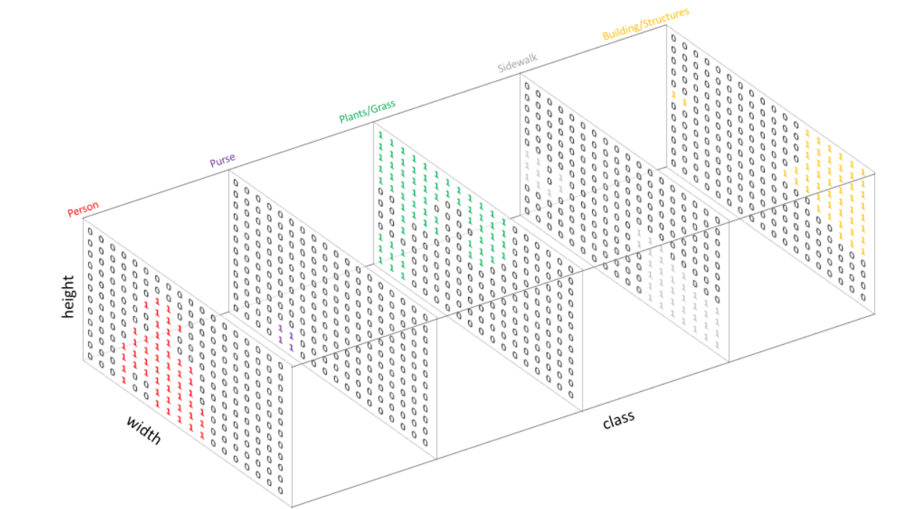

## 分割的技术

在深度学习方法流行之前，TextonForest和基于随机森林分类器等语义分割方法是用得比较多的方法。但是本文章的背景是基于深度学习方法的计算机视觉，所以不做过多讨论。

深度学习技术在各个计算机领域获得了巨大的成功，其解决语义分割问题可以概括为几种思路：

### 块分类（Patch classification）

如其名，把图像分成小块塞给网络进行分类。分成指定大小的小块是因为全连接网络只接受指定大小的输入。这大概是最初的基于深度学习的分割方法了（吧）。

### 全卷积方法（基于FCN）

用于代替全连接的全卷积方法除了在其他视觉方法里很出名，也很快用到了分割算法中。2014年，全卷积网络（FCN）横空出世，FCN将网络全连接层用卷积取代，因此使任意图像大小的输入都变成可能，而且速度比Patch classification方法快很多。（我用简单分类模型实测了一下也是，全连接真的是太烂了，又慢又重，但是作为多层感知机到全卷积网路中间的过度组件，还是功不可没的。）

尽管移除了全连接层，但是CNN模型用于语义分割还存在一个问题，就是下采样操作（这里以池化为例）。池化可以扩大感受野因而能够很好地整合上下文信息（如果想了解更多这方面的内容可以参考），

### 空洞卷积（Dilated/Atrous Convolution，代替了池化-上采样的过程）

Dilated/Atrous Convolution（空洞卷积），这种结构代替了池化，一方面它可以保持空间分辨率，另外一方面它由于可以扩大感受野因而可以很好地整合上下文信息（我觉得这个设计很有意思，原图的大小完全不会改变，也不需要上采样了）。

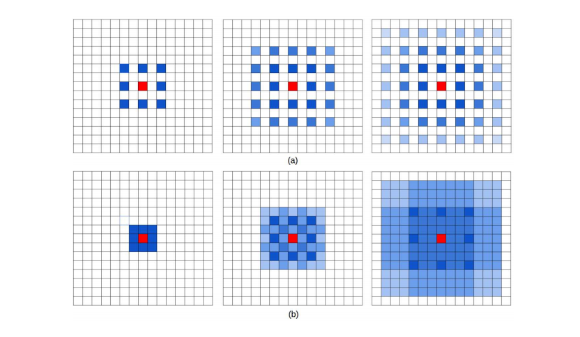

上图：在某篇论文中出现的空洞卷积示意图。

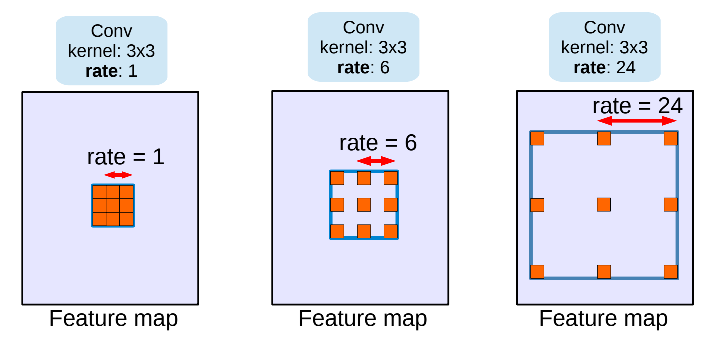

上图：另一张空洞卷积的示意图。

### 编码器-解码器结构（encoder-decoder，本质基于FCN）

encoder由于pooling逐渐减少空间维度，而decoder逐渐恢复空间维度和细节信息。通常从encoder到decoder还有shortcut connetction（捷径连接，也就是跨层连接，其思想我猜是从ResNet开始的）。

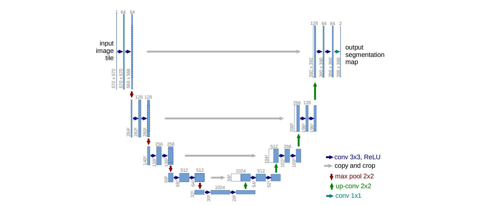

上图是encoder-decoder的代表之一：UNet的结构。

### 反卷积的上采样

在上采样的方法中，比较出名的是转置卷积，因为它允许我们使用可学习的上采样过程。典型的转置卷积运算将采用滤波器视图中当前值的点积并作为相应的输出位置产生的单个值，而转置卷积的过程基本想法。对于转置卷积，我们从低分辨率特征图中获取单个值，并将滤波器中的所有权重乘以该值，将加权值输出到更大的特征图。

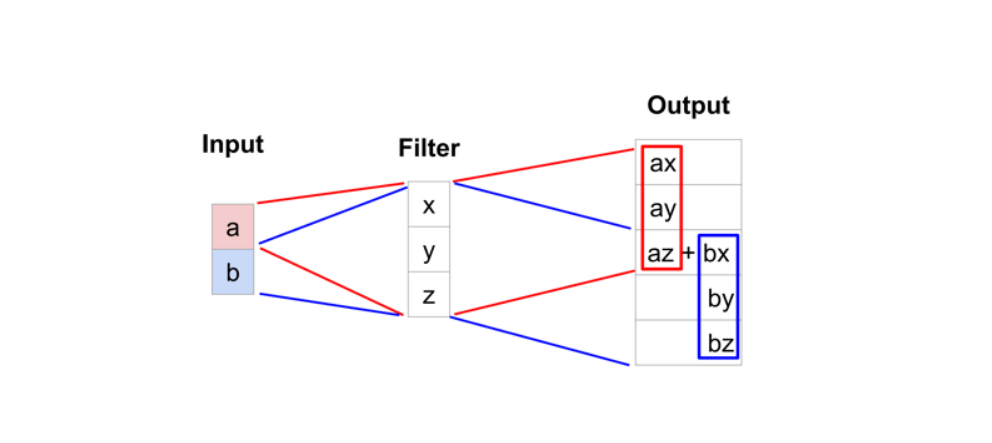

上图：转置卷积的一种示意。

下图：一种反卷积的示意。其中蓝色较小的特征图是输入，通过在它周围填充，使其变为较大的特征图后，再进行卷积。得到的结果是绿色的特征图。

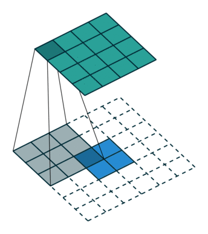

下图：另一种反卷积的示意。其中蓝色较小的特征图经过填充变为“空洞卷积核”的形状，再进行卷积，得到的输出是绿色的特征图。

> 解卷积层也被称作上卷积（upconvolution）、完全卷积（full convolution）、转置卷积（transposed convolution）、微步卷积（fractionally-strided convolution）

### 高低层特征融合

由于池化操作造成的信息损失，上采样（即使采用解卷积操作）只能生成粗略的分割结果图。因此，论文从高分辨率的特征图中引入跳跃连接（shortcut/skip connection）操作改善上采样的精细程度：

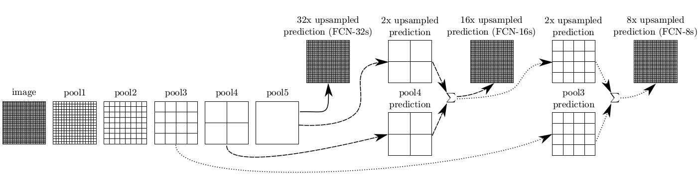

实验表明，这样的分割结果更细致更准确。在逐层fusion的过程中，做到第三行再往下，结果又会变差，所以作者做到这里就停了。可以看到如上三行的对应的结果：

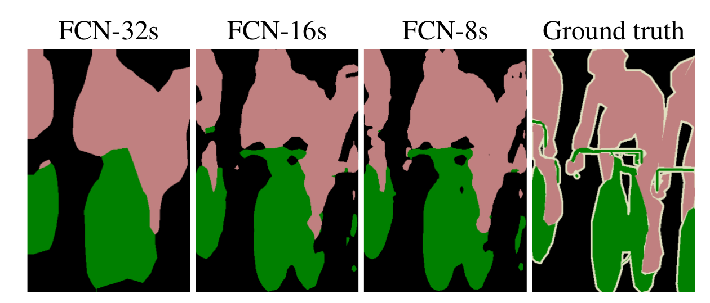

### 条件随机场

在使用全卷积网络的分割方法中，有一个很常用的基本框架：

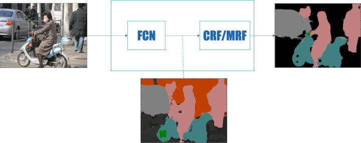

其中， FCN 表示各种全卷积网络，CRF 为条件随机场，MRF 为马尔科夫随机场。其大致思路就是前端使用 FCN 进行特征粗提取，后端使用 CRF/MRF 优化前端的输出，最后得到分割图。

[条件随机场（Conditional Random Field，CRF）](https://arxiv.org/pdf/1210.5644.pdf) 后处理操作通常用于进一步改善分割的效果。CRFs 是一种基于底层图像的像素强度进行“平滑”分割（‘smooth’ segmentation）的图模型，其工作原理是相似强度的像素更可能标记为同一类别。CRFs 一般能够提升 1-2% 的精度。

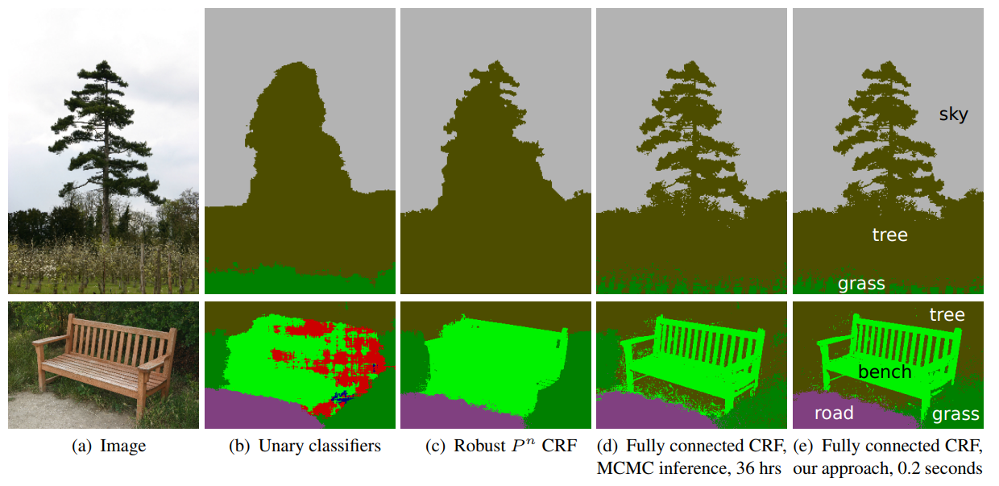

上图为CRF示意图。（b）一元分类结合CRF;（c, d, e）是CRF的变体，其中(e)是广泛使用的一种CRF。

---

