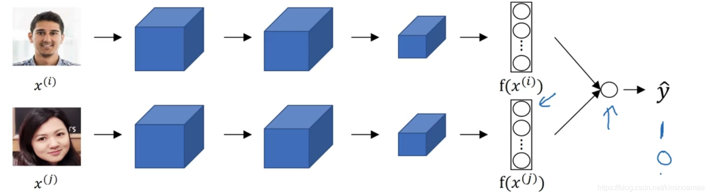
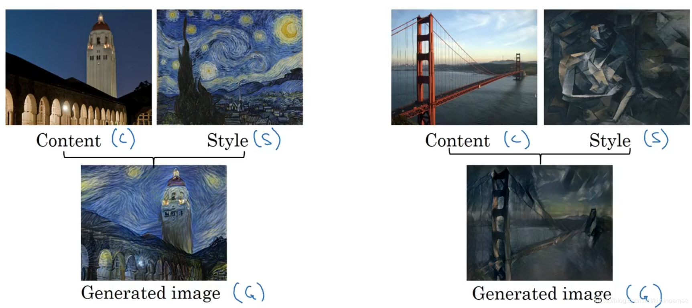
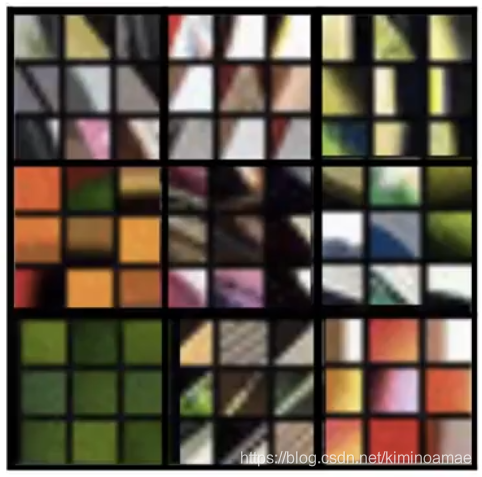
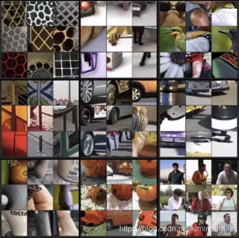
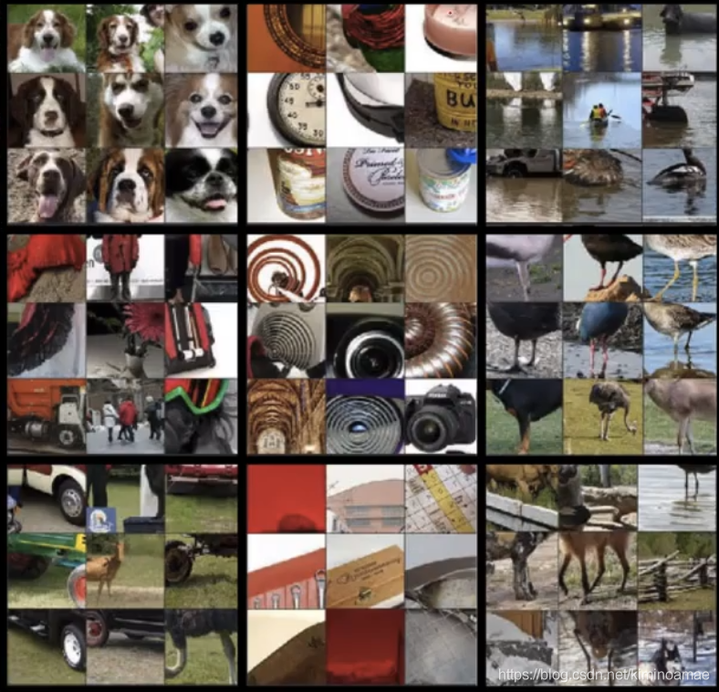
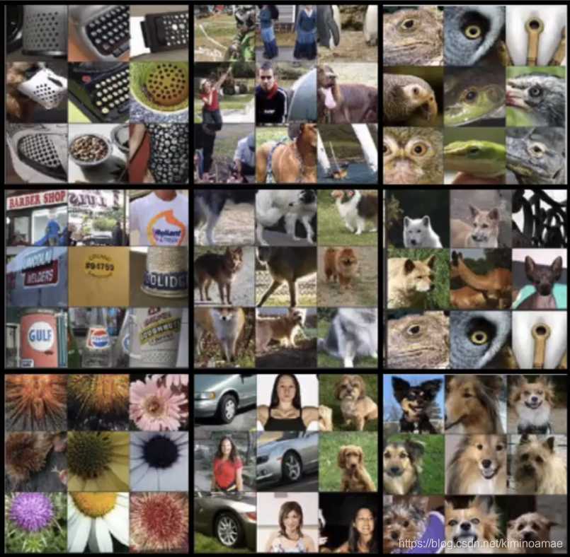
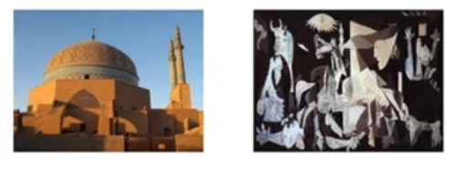
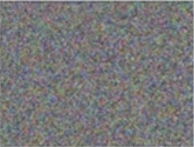
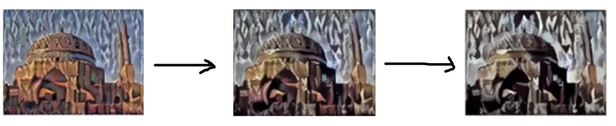

# 人脸识别

在人脸识别的相关文献中，人们通常提到**人脸验证和人脸识别**。

## 1、人脸验证

我们只用判断图片中的人是不是我们要判断的人，只有0和1一个两个选择，相当于1对1的问题

## 2、人脸识别

如果我们的验证系统达到了99%的正确率，那我们现在从1人扩充到100人，那么按照验证系统一个人有1%的错误率，那么100人呢，错误率就会增加，因此，要达到合理的识别系统，验证系统的正确率可能需要达到99.9%。这也是为什么识别系统构造比验证系统构造困难的原因。

## 3、一次学习

**一次学习**：只使用一个样本来进行训练

在我们的认知中，对图片识别，一般是把他放入CNN中训练，然后经过softmax进行输出，最后获得他的标签，但是由于我们的训练集只有一张，也就是说，我们的CNN网络可能不是那么地稳定。或者当我们在增加一个人图片，难道我们又要重新训练一次CNN网络吗？这显然无法解决一次学习的问题。

于是我们引入了**similarity函数**

d(img1,img2) = 两张图片不同的程度

我们会设定一个**阈值$\tau$**

$$d(i m g 1, i m g 2)\left\{\begin{array}{l}\leqslant \tau, \text { same } \\ >\tau, \text { different }\end{array}\right.$$
当d大于阈值是就是不同的人，当d小于等于阈值时就是同一个人，这对解决一次学习是一个可行的方法。

把我们的检测到的人脸与数据库中的人脸带入到similarity函数中，如果与数据库中某人图像的不同程度很低，我们就认定他是我们数据库中的人；如果与数据库中每个人图像的不同程度都很高，我们就认定他不是我们数据库中的人。

## 4、Siamese 网络

siamese网络也是使用与一次学习问题的一个方法，他的核心思想是将**一张图片经过卷积，池化层，全连接层后在使用softmax之前，获得的一个特征向量，利用他来作为我们的判断标准。**

假设我们获得的这个向量n1是128个元素，那么我们用新的一张图片，进行和第一张图片做同样的运算，就会获得同样的128个元素的向量n2，只是，他们的数值不相同，我们把**这种向量称为这类图片的一种编码。**

我们把之前的运算用f()表示，那么$n_1 = f(x_1),n_2 = f(x_2)$

然后我们就求取这两个向量的平之间的距离，$d(x_1,x_2) = ||f(x_1) - f(x_2)||^2$

如果我们新放入的图片和第一张图片是同一个人我们就要想办法把他们之间的d缩小，如果不是，就应该想办法把他们之间的d增大，这部分就需要靠我们的方向传播来完成了。

## 5、三元组损失函数(triplet loss function)

**三元组**：顾名思义，就是三个元素组成的元组，他**由我们要训练的人的图片（anchor，缩写A）和同一个人的另一张图片(positive ，缩写B)以及另一个人的图片(negative缩写N)组成**

根据我们的Siamese网络，我们可以定义他们的不同程度为$||f(A) - f(P)||^2$（或者d(A,P)）和$||f(A) - f(N)||^2$（或者叫做d(A,N)）

因为我们要使图中的人与本人的不同程度很低，对于不同的人不同程度要很高，于是我们有这样的式子

$$||f(A) - f(P)||^2 \leqslant ||f(A) - f(N)||^2$$

但是如果这样第定义这个式子，如果我们两边的图片学习出来总是0，或者学习总是相等，那我们这样定义就毫无用处。于是为了避免这种情况，我们需要修改目标，就是他相当小于0，但是并不能真的等于0，因此我们在小于等于号加一个α来限制他等于0，于是就有了这个公式

$$||f(A) - f(P)||^2 + \alpha \leqslant ||f(A) - f(N)||^2$$

这个α可以设置成自习希望的数值，比如0.2。因此如果，我们的d(A,P)为0.5，而我们的d(A,N)为0.51，但是我们仍然觉得这样的训练结果不好，因为，他们的差值只到了0.1，没有超过我们预期的0.2，因此我们对这样结果的网络还需要继续学习

**三元组损失函数**

现在开始定义三元损失函数

$$L(A,P,N) = max(||f(A) - f(P)||^2  - ||f(A) - f(N)||^2+ \alpha,0)$$

$$J = \sum_{i=1}^mL(A,P,N)$$

解读：当我们d(A,P)比d(A,N)小的时候，我们这次学习的损失值就会变成0，从而不对原本累加的损失值产生影响，相反，当我们d(A,P)比d(A,N)大的时候，我们的损失值就会变成正数，从而产生累加效应，当我们不断训练过程中，当损失的变化不断减小，说明我们的模型正在不断完善

值得注意的是，当我们在选择三元组的时候，我们通常选择**一个对象的两张图片和另一个人的一张图片进行组合**，并且要求**他们的组合难训练**。

**什么叫难训练呢**？意思就是说，我们的d(A,P)与d(A,N)要相似。

**为什么要难训练呢**？因为如果我们训练的时候，每次训练的结果都是L = 0，那对于模型的训练就过于简单，这样他的参数就不会进行较大更新，相当于无意义学习，当两人的图片相似，但是并非同一个人的时候，我们的模型就会发生问题。相反，用难训练的模型训练，我们模型获得的学习空间也就越大，这样的模型也就会更加稳定。

## 6、面部验证与二分类

我们可以将人脸识别这个问题当做一个二分类来处理，是与不是，就是这个二分类问题的关键

对于这个二分类问题，我们需要一张新的图片和一张在数据库已经存在的图片。我们对这两张图片使用相同的卷积网络进行处理，在经过全连接层后获得一个列向量(假设为128个元素的)，这两个向量就是我们对这两个图片的编码。我们**使用逻辑回归单元对这两个编码进行处理**，从而获得标签（0或1）

那么，我们如何才能对这两个编码放入卷积单元中呢？很简单，我们计算这**两个编码对应的位置的差值之和，然后再乘上一个权重W，加上一个偏置b**，在**放入sigmoid函数**中，这样我们就会得到新图片的标签。公式如下：

$$yHat = \sigma(\sum_{k=1}^{128}w_i|f(x^{(i)})_k - f(x^{(j)})_k| + b)$$

这里的i，j表示的是不同的图片，k表示图片编码的元素位置，这里引入了权重(w)和偏置(b),这两个参数是需要反向传播进行调整的。

除此之外还有一些其他的公式可以使用：
$$yHat = \sigma(\sum_{k=1}^{128}w_i\frac{(f(x^{(i)})_k - f(x^{(j)})_k)^2}{f(x^{(i)})_k +f(x^{(j)})_k} + b)$$

在计算过程中，我们检测到的人脸和数据库中的人脸都需要进行卷积网络的计算，这样计算可能过多。于是，我们可以**预先计算数据库中的图片，然后保存他的编码**，当我们遇到一张要检测的人脸时，只需要对这张人脸图片进行卷积运算，再从数据库中提取编码进行逻辑回归分类就能节省计算的过程。

在这个二分类中，我们把相同人脸的一对图片记为标签1（“same”）,不同的一对人脸记录为0("different")。

**切记，无论是对检测图片还是数据库中图片的卷积运算，都要确保他们卷积网络的参数相同。**

# 二、风格迁移

## 1、什么叫做风格迁移？

我们用一张图来表现风格迁移

比如右边的部分，我们有两张图。我们把要改变风格的**原图称为Content(记为C)**，要**提取风格的图片称为Style(记为S)**,在经过风格迁移处理后**获得了融合风格图片Generated image(记为G)**

**将一张图片的主要内容，借用另一张图像的风格展示，这就是风格迁移。**

## 2 、深度卷积网络究竟在学习什么？

我们知道卷积神经网络时如何构造出来的，但是我们并不明白，他在每一个隐藏层中，到底在提取什么？

对每一个隐藏单元来说，他都会**提取图片的重要特征**。但是，什么才叫图片的重要特征呢？专业一些，那就是图像中的**某个部分最大程度地激活了我们的隐藏层，这样的部分，我们称为图片的重要特征。**

以一个五层的卷积网络为例

**在第一层中**，我们的隐藏层要找到最大激活他的部分，一般是**图像中的边缘区域，阴影区域**，因此，第一层中通常会提取图像的边缘或阴影。可以是纵向、横向、甚至是不同方向的边缘，阴影可以是各种颜色的阴影。正如下图：

我们都知道，每个隐藏层提取的特征，都基于上层输出的样本。因此，在第二层中提取的特征是基于第一层的，在第二层中，就要寻找这些边缘，什么部分能够最大激活我们的隐藏层，从而使我们提取的特征变得不断的详细起来。一般**第二层会提取出边缘的组合**，最后**提取出图片更复杂的形状和模式**，比如垂直图案，细线图案，原形图案等等。

接着第三层，在基于第二层的基础上继续抽取。如果我们说前两层抽取的只是抽象图案，那么后面抽取的就是**图像中的具体部分**。从这里开始，我们通过对第二层图案的抽取，**渐渐会构成图案中的一部分**。如果图片是人，他可能会提取出人的手，眼睛，鼻子，如果图片是汽车，那么他可能提取出车子的车轮等等。

到了第四，第五层我们抽取的特征会**逐渐拥有更复杂的形状和模式**，**逐渐构造成一个个体**，最后我们抽取出的关键有用的特征数据，将成为我们对其进行分类的依据。

第四层

第五层

## 3、代价函数

要判断风格迁移的好坏程度，我们需要一个评估指标，即需要一个**关于G（风格迁移图像）代价函数**来评估迁移的好坏，我们可以这么定义这个函数：

$$J(G) = \alpha J_{content}(C,G) + \beta J_{style}(S,G)$$

我们需要将C和G的差异与S与G的差异关联起来，通过两个权重赋值，最后得出我们的代价函数J(G)来判断我们迁移的成果，当然，我们不可能一次就迁移成果，这个调参的过程还是需要用到我们的反向传播和更细参数，使我们的J(G)下降到最小

这个代价函数由**内容代价函数组分**和**风格代价函数组分**构成

算法的具体过程：

**1. 先随机初始化生成图像G，他可能是100x100x3的一张RGB图像，因为是随机生成的
他会是一张白噪图像**

**2. 使用梯度下降法来最小化我们的代价函数J(G)**

$$G=G-\frac{d}{dG} J(G)$$

举个例子来模拟他演变的过程：

现在我们要对这两张图片进行风格迁移：

先对G进行随机初始化获得白噪图片:

接着我们开始进行风格迁移，和更细迁移方式，过程如下：

## 4、内容代价函数

我们一般使用在卷积网络后计算我们的内容代价函数。

我们使用$a^{[l][C]}$来表示C的激活值，用$a^{[l][G]}$来表示G的激活值，如果他们的不同程度很低，我们就说这两张图片在内容上很相似。

于是我们定义的**内容代价函数为**:

$$J_{content}(C,G) = \frac 12 ||a^{[l][C]} - a^{[l][G]}||^2$$

这前面的$\frac 12$代表正则项，其实不加也可以

## 5、风格代价函数

图片的风格贯穿在一张图片中，因此，无论我们做怎样的变换，图片的风格始终保存在我们的卷积块中，但是，我们很难理解**图片的风格到底是什么**。

我们从卷积网络中的任意一个卷积块取出来，假设他有5个通道，我们所说的风格，就是**每一通道之间的关系**，为了让机器处理这种风格，我们得找出**任意两个通道之间的相关系数**

我们的目的就是**通过找出风格图片与生成图片之间对应的相关系数之间的差异**，来作为我们风格的代价函数。

于是我们引入了**风格矩阵（style matrix）**，他用来存放他们各自的相关系数

假设我们用第l层来测量分格，我们用i,j,k（高，宽，通道）来定义我们参数所表示的位置，因为我们是寻找通道与通道之间的关系，自然是要用一个通道和其他通道进行对比，于是我们的风格矩阵的维度应该是$n_c$x$n_c$(n_c是通道数量)

于是对于一个通道(k)与另一通道(k1)之间的相关系数，我们用$G_{kk1}^{[l][s]}$来表示，然后计算两条通道对应的i,k位置的乘积，然后将这些乘积相加起来，就能获得我们的相关系数。下面的式子就表示**对风格图像的k通道与k1通道之间的相关系数：**

$$G_{kk1}^{[l][S]} = \sum_{i=1}^{n_h^{[l]}}\sum_{j=1}^{n_w^{[l]}}a_{ijk}^{[l]}a_{ijk1}^{[l]}$$

**对于合成图像的任意k通道与k1通道之间的相关系数为：**
$$G_{kk1}^{[l][G]} = \sum_{i=1}^{n_h^{[l]}}\sum_{j=1}^{n_w^{[l]}}a_{ijk}^{[l]}a_{ijk1}^{[l]}$$

于是我们现在可以定义我们的**风格代价函数**为：

$$J^{[l]}_{style}(S,G) = \frac 1{2n_H^{[l]}n_W^{[l]}n_C^{[l]}}||G^{[l][S]}-G^{[l][G]}||_F^2 = \frac 1{2n_H^{[l]}n_W^{[l]}n_C^{[l]}}\sum_k\sum_{k1}(G^{[l][S]}_{kk1} - G^{[l][G]}_{kk1})$$

这里的$\frac 1{2n_H^{[l]}n_W^{[l]}n_C^{[l]}}$表示正则项，我么可以无视掉，或者直接使用一个$\beta$替换

通常如果**对每一个隐藏层都计算风格代价函数**，那么我们最终的风格代价函数可以这么定义：

$$J^{[l]}_{style}(S,G) = \sum_l\lambda^{[l]}J^{[L]}_{style}(S,G)$$

这使得我们网络**同时考虑低级和高级特征的相关系数**

**经过内容代价函数和风格代价函数的定义，我们最终获得代价函数应该表示为**

$$J(G) = \alpha J_{content}(C,G) + \beta J_{style}(S,G)$$