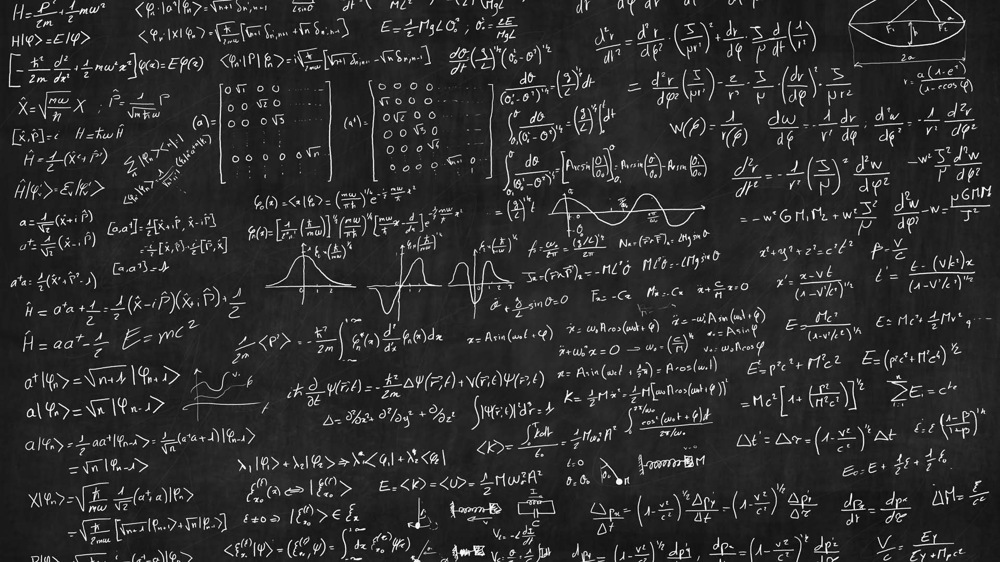
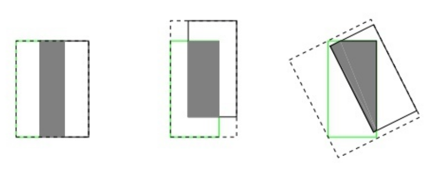
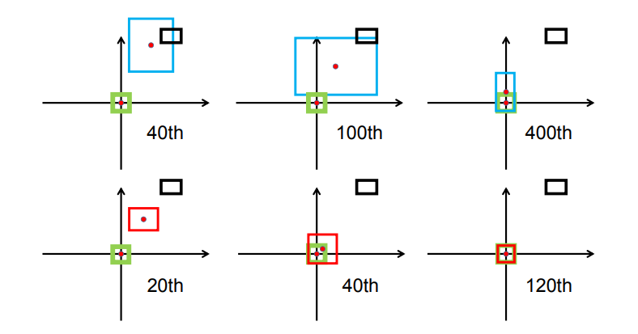
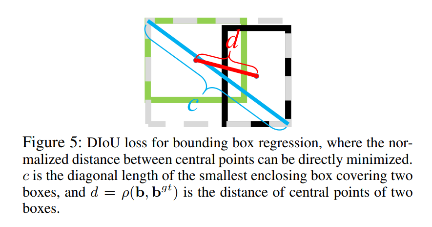
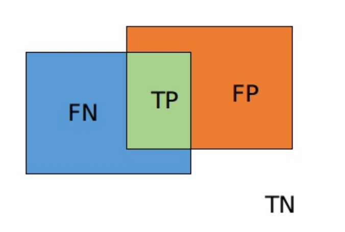

# 损失函数们

> 损失函数（loss function）或代价函数（cost function）是将随机事件或其有关随机变量的取值映射为非负实数以表示该随机事件的“风险”或“损失”的函数。 在应用中，损失函数通常作为学习准则与优化问题相联系，即通过最小化损失函数求解和评估模型。

首先我们对三个名词进行说明：

- 损失函数（Loss function）用于定义单个训练样本与真实值之间的误差。

- 代价函数（Cost function）用于定义单个批次或整个训练集样本与真实值之间的误差。

- 目标函数（Objective function）则泛指任意可以被优化的函数。

在机器学习中，损失函数是代价函数的一部分，用于衡量模型所作出的预测离真实值（Ground Truth）之间的偏离程度；而代价函数则是目标函数的一种类型。通常，我们都会最小化目标函数，最常用的算法便是 **“梯度下降法”（Gradient Descent）**。

实际上，目标函数大都是针对某种任务提出的，并没有一种万能的损失函数能够适用于所有的机器学习任务，所以在这里我们需要知道每一种损失函数的优点和局限性，才能更好的利用它们去解决实际的问题。损失函数大致可分为两种：**回归损失**（针对**连续型**变量）和**分类损失**（针对**离散型**变量）。其中回归损失多用于目标检测等回归任务，分类损失多用于分割等密集预测任务。

损失函数的形式千变万化，但追究溯源还是万变不离其宗。其本质便是给出一个能较全面合理的描述两个特征或集合之间的相似性度量或距离度量，针对某些特定的情况，如类别不平衡等，给予适当的惩罚因子进行权重的加减。大多数的损失都是基于最原始的损失一步步改进的，或提出更一般的形式，或提出更加具体实例化的形式。

## 回归损失（Regression Loss）

### L1 Loss

也称为**Mean Absolute Error**，即平均绝对误差（MAE），它衡量的是预测值与真实值之间距离的平均误差幅度，作用范围为0到正无穷。
$$
L_1 = |f(x)-Y|
$$
导数：
$$
L_1' = \begin{cases}
-f'(x)& \text{f(x)<0}\\
f'(x)& \text{otherwise}
\end{cases}
$$

优点： 收敛速度快，能够对梯度给予合适的惩罚权重，而不是“一视同仁”，使梯度更新的方向可以更加精确。

缺点： 对异常值十分敏感，梯度更新的方向很容易受离群点所主导，不具备鲁棒性。

### L2 Loss

也称为**Mean Squred Error**，即均方差（**MSE**），它衡量的是预测值与真实1值之间距离的平方和，作用范围同为0到正无穷。
$$
L_2 = |f(x)-Y|^2
$$
导数：
$$
L_2' = 2f'(x)(f(x)-Y)
$$
优点：对离群点（**Outliers**）或者异常值更具有鲁棒性。

缺点：由图可知其在0点处的导数不连续，使得求解效率低下，导致收敛速度慢；而对于较小的损失值，其梯度也同其他区间损失值的梯度一样大，所以不利于网络的学习。

###  Smooth L1 Loss

即平滑的$L_1$损失（SLL），出自Fast RCNN [7]。SLL通过综合$L_1$和$L_2$损失的优点，在0点处附近采用了$L_2$损失中的平方函数，解决了$L_1$损失在0点处梯度不可导的问题，使其更加平滑易于收敛。此外，在|x|>1的区间上，它又采用了$L_1$损失中的线性函数，使得梯度能够快速下降。
$$
L_{1_{smooth}}(x) = \begin{cases}
0.5x^2& \text{|x|<1}\\
|x|-0.5& \text{otherwise}
\end{cases}
$$
导数：
$$
L_{1_{smooth}}' =\begin{cases}
x& \text{|x|<1}\\
-1& \text{x< -1}\\
1& \text{x>1}
\end{cases}
$$
L1损失的导数为常数，如果不及时调整学习率，那么当值过小时，会导致模型很难收敛到一个较高的精度，而是趋向于一个固定值附近波动。反过来，对于L2损失来说，由于在训练初期值较大时，其导数值也会相应较大，导致训练不稳定。最后，可以发现Smooth L1在训练初期输入数值较大时能够较为稳定在某一个数值，而在后期趋向于收敛时也能够加速梯度的回传，很好的解决了前面两者所存在的问题。

### IoU Loss

即交并比损失，出自UnitBox，由旷视科技于ACM2016首次提出。常规的$L_{\cdot}$型损失中，都是基于目标边界中的4个坐标点信息之间分别进行回归损失计算的。因此，这些边框信息之间是相互**独立**的。然而，直观上来看，这些边框信息之间必然是存在某种**相关性**的。

上图中，绿色框代表Ground Truth，蓝色框代表Prediction。显然**重叠度**越高的预测框是越合理的。IoU Loss的核心是一个被称为IoU（Intersection over Union）的表达式：
$$
IoU = \frac{|B\cap B^{gt}|}{|B\cup B^{gt}|}
$$
该表达式是一种度量框的重叠程度的公式。为了解决IoU度量不可导的现象，引入了负Ln范数来间接计算IoU Loss：
$$
Loss_{IOU} = -Ln(IoU) = -Ln \frac{|B\cap B^{gt}|}{|B\cup B^{gt}|}
$$
在应用中，也出现了其他Iou的计算形式：
$$
Loss_{IOU} = 1- IoU = 1- \frac{|B\cap B^{gt}|}{|B\cup B^{gt}|}
$$
IoU损失将候选框的四个边界信息作为一个**整体**进行回归，从而实现准确、高效的定位，具有很好的**尺度不变性**（IoU的值总在$[0,1]$之间）。

### GIoU Loss

上文中的IoU Loss存在一个问题，就是IoU Loss只能衡量prediction和ground truth有重叠的情况：

例在上图中，IoU Loss只能衡量图1中的情况。对于图2和图3中的情况，其Loss值是一样的。例如，当采用$Loss_{IOU} = -Ln(IoU) = -Ln \frac{|B\cap B^{gt}|}{|B\cup B^{gt}|}$的情况，由于两个框交集（IoU的分子）为0，上式的值永远为$+\infin$。再例如，当采用$Loss_{IOU} = 1- IoU = 1- \frac{|B\cap B^{gt}|}{|B\cup B^{gt}|}$的情况，由于两个框的交集（IoU的分子）为0，上式的值永远为$0$。这会导致出现梯度消失的现象，致使网络无法给出一个**优化的方向**。

也就是说，当两个框未出现交集时，IoU Loss将无法量化其距离造成的差距。在直观上，虽然并未出现交集，但两个框的距离较大时，Loss应该更大才对，这样有利于更好地更新梯度。

GIoU（Generalized Intersection over Union）即泛化的IoU（由斯坦福学者于CVPR2019的[论文](https://arxiv.org/abs/1902.09630)中提出），能够解决这个问题：

在上图中，绿色的实线框表示ground truth，黑色的实线框表示prediction，黑色的虚线框表示**两个框的最小闭区域面积**（可通俗理解为同时包含了预测框和真实框的最小框的面积），记为$C$。则：
$$
GIoU = IoU - \frac{|C\setminus(B\cup B^{gt})|}{|C|}
$$
上式中$|C\setminus(B\cup B^{gt})|$表示$C$中除了$B$和$B^{gt}$的部分，$\setminus$是差集符号。

与IoU Loss的设计类似，GIoU Loss可以设计为：
$$
Loss_{GIoU} = 1-GIoU
$$
和IoU一样，GIoU也具有scale不敏感的特性，在两个框完全重合的情况下，$IoU = GIoU = 1$。不同的是，IoU的取值范围是$[0,1]$，而GIoU的取值是$[-1,1]$的对称区间。与IoU只关注重叠区域不同，**GIoU不仅关注重叠区域，还关注其他的非重合区域**，能更好的反映两者的重合度。

### DIoU Loss

DIoU即距离IoU损失，全称为Distance-IoU loss，由天津大学数学学院研究人员于AAAI2020所发表的这篇[论文](https://arxiv.org/abs/1911.08287)中首次提出。上面我们谈到GIoU通过引入最小闭合凸面来解决IoU无法对不重叠边框的优化问题。但是，其仍然存在两大局限性：

- 边框回归还不够精确
- 收敛速度缓慢

考虑下图这种情况，当目标框**完全包含**预测框时，此时GIoU**退化**为IoU。

显然，我们希望的预测是最右边这种情况。因此，作者通过计算两个边框之间的**中心点归一化距离**，从而更好的优化这种情况。

下图表示的是GIoU损失（第一行）和DIoU损失（第二行）的一个训练过程收敛情况：

其中绿色框为目标边框，黑色框为锚框，蓝色框和红色框则分别表示使用GIoU损失和DIoU损失所得到的预测框。可以发现，GIoU损失一般会增加预测框的大小使其能和目标框重叠，而DIoU损失则直接使目标框和预测框之间的中心点归一化距离最小，即让预测框的中心快速的向目标中心收敛。

现给出三种IoU的公式对比：
$$
IoU = \frac{|B\cap B^{gt}|}{|B\cup B^{gt}|}\\
GIoU = IoU - \frac{|C\setminus(B\cup B^{gt})|}{|C|}\\
DIoU = IoU - \frac{\rho^2(b,b^{gt})}{c^2}
$$
同样地，DIoU Loss的值也是$1-DIoU$。

对于DIoU来说，其惩罚项由两部分构成：分子为目标框和预测框中心点之间的欧式距离；分母为两个框最小外接矩形框的两个对角线距离：

因此， 直接优化两个点之间的距离会使得模型**收敛得更快，同时又能够在两个边框不重叠的情况下给出一个优化的方向。**

### CIoU Loss

即完整IoU损失，全称为Complete IoU loss，与DIoU出自同一篇论文。上面我们提到GIoU存在两个缺陷，DIoU的提出解决了其实一个缺陷，即收敛速度的问题。而一个好的边框回归损失应该同时考虑三个重要的几何因素，即重叠面积（**Overlap area**）、中心点距离（C**entral point distance**）和高宽比（**Aspect ratio**）。GIoU考虑到了重叠面积的问题，DIoU考虑到了重叠面积和中心点距离的问题，CIoU则在此基础上进一步的考虑到了高宽比的问题。
$$
CIoU = IoU - \frac{\rho^2(b,b^{gt})}{c^2} + \alpha v
$$
上式为CIoU的计算公式，可以看出，其在DIoU的基础上加多了一个惩罚项$\alpha v$​。其中$\alpha$​为权重为正数的重叠面积平衡因子，在回归中被赋与更高的优先级，特别是在两个边框不重叠的情况下；而$v$​​则用于测量宽高比的一致性。

### F-EIoU Loss

Focal and Efficient IoU Loss是由华南理工大学学者最近提出的一篇关于目标检测损失函数的论文，文章主要的贡献是提升网络收敛速度和目标定位精度。目前检测任务的损失函数主要有两个缺点：

- 无法有效地描述边界框回归的目标，导致收敛速度慢以及回归结果不准确。
- 忽略了边界框回归中不平衡的问题。

F-EIou loss首先提出了一种有效的交并集（IOU）损失，它可以准确地测量边界框回归中的**重叠面积**、**中心点**和**边长**三个几何因素的差异：
$$
L_{EIoU} = L_{IoU} + L_{dis} + L_{asp}\\
 = 1 - IoU + \frac{\rho^2(b,b^{gt})}{c^2} + \frac{\rho^2(w,w^{gt})}{C_w^2} + \frac{\rho^2(h,h^{gt})}{C_h^2}
$$
其次，基于对有效样本挖掘问题（EEM）的探讨，提出了Focal loss的回归版本，以使回归过程中专注于高质量的锚框：
$$
L_f(x)=
\begin{cases}
-\frac{\alpha x^2 (2\ln(\beta x)-1)}{4} & 0<x\leq1;1/e\leq\beta\leq1\\
-\alpha\ln(\beta)x+C & x>1;1/2\leq\beta\leq1
\end{cases}
$$
最后，将以上两个部分结合起来得到Focal-EIou Loss：
$$
L_{Focal-EIoU} = \frac{\sum_{i=1}^n W_i\cdot L_{EIOU}}{\sum_{i=1}^n W_i}
$$
其中，通过加入每个batch的权重和来避免网络在早期训练阶段收敛慢的问题。

### CDIoU Loss

Control Distance IoU Loss是由同济大学学者提出的，文章的主要贡献是在几乎不增强计算量的前提下有效提升了边界框回归的精准度。目前检测领域主要两大问题：

- SOTA算法虽然有效但计算成本高。
- 边界框回归损失函数设计不够合理。

文章首先提出了一种对于Region Propasl（RP）和Ground Truth（GT）之间的新评估方式，即CDIoU。可以发现，它虽然没有直接中心点距离和长宽比，但最终的计算结果是有反应出RP和GT的差异。计算公式如下：
$$
diou = \frac{||RP-GT||_2}{4MBR's diagonal}\\
=\frac{AE+BF+CG+DH}{4WY}
$$

$$
CDIoU = IoU + \lambda(1 - diou)
$$

对比以往直接计算中心点距离或是形状相似性的损失函数，CDIoU能更合理地评估RP和GT的差异并且有效地降低计算成本。然后，根据上述的公式，CDIoU Loss可以定义为：
$$
L_{CDIoU} = L_{IoU_s} + diou
$$
通过观察这个公式，可以直观地感受到，在权重迭代过程中，模型不断地将RP的四个顶点拉向GT的四个顶点，直到它们重叠为止，如下图所示：

## 分类损失（Classification Loss）

### Cross Entropy

Entropy 即“熵”，**熵**的概念最早起源于物理学，用于度量一个热力学系统的**无序**程度。但更常见的，在信息论里面， 熵是用于描述对**不确定性**的度量。所以，这个概念可以延伸到深度神经网络中，比如我们的模型在做分类时，其实也是在做一个判断一个物体到底是不是属于某个类别。因此，在正式介绍分类损失函数时，我们必须先了解熵的概念。

数字化时代，信息都是由Bits(0和1)组成的。在通信时，有些位是**有用（useful）的信息，有些位则是冗余（redundant）的信息，有些位甚至是错误（error）**的信息，等等。熵可以很好地描述事件的不确定性。它是由以下公式给出：
$$
Entropy,H(p) = - \sum p(i) * log(p(i))
$$
它衡量的是**平均信息量**。一般来说，它给出了给定**概率分布p**中样本值的平均信息量，或者说概率分布有**多不可预测**。总的来说：一个事件的不确定性就越大，其信息量越大，它的熵值就越高。相反，如果一个时间的不确定性越小，其信息量越小，它的熵值就越低。

交叉熵可以**衡量预测分布q和真实分布p的不同**：
$$
CrossEntropy,H(p,q) = -\sum p(i)log(q(i))
$$
注：这里对数的底数为2。

### K-L Divergence

即KL散度。对于交叉熵损失，除了我们在这里使用**预测概率的对数 $log(q(i))$​ 外，它看起来与上面熵**的方程非常相似。如果我们的预测是完美的，那就是**预测分布等于真实分布**，此时**交叉熵就等于熵**。但是，如果分布不同，则**交叉熵将比熵大一些位数**。**交叉熵超过熵的量称为相对熵**，或更普遍地称为**库尔贝克-莱布里埃发散度（KL Divergence**）。总结如下：
$$
CorssEntropy = Entropy + KL - Divergence
$$

$$
D_{KL}(p||q) = H(p,q) - H(p) = -\sum_{i} p_i \log(q_i)-(-\sum_{i} p_i \log(p_i))
$$

$$
D_{KL}(p||q) = -\sum_{i} p_i \log(q_i) + \sum_{i} p_i \log(p_i) = \sum_{i} p_i \log \frac{p_i}{q_i}
$$

通常来说，一般分类损失最常用的损失函数之一便是交叉熵损失。假设我们当前做一个3个类别的图像分类任务，如猫、狗、猪。给定一张输入图片其真实类别是猫，模型通过训练用Softmax分类后的输出结果为：`｛"cat": 0.3, "dog": 0.45, "pig": 0.25｝`，那么此时交叉熵为：$-1 * log(0.3) = 1.203$。当输出结果为：`｛"cat": 0.5, "dog": 0.3, "pig": 0.2｝`时，交叉熵为：$-1 * log(0.5) = 0.301$。可以发现，当真实类别的预测概率接近于0时，损失会变得非常大。但是当预测值接近真实值时，损失将接近0。

### Dice Loss

即骰子损失，出自V-Net，是一种用于评估两个样本之间相似性度量的函数，取值范围为0~1，值越大表示两个值的相似度越高，其基本定义（二分类）如下：
$$
L_{dice} = 1 - \frac{2\cdot|X\bigcap Y|}{|X|+|Y| + \sigma} = 1- \frac{2\cdot TP}{2\cdot TP + FP + FN + \sigma}
$$
其中，$|X\bigcap Y|$表示$X$和$Y$之间的交集，$|X|$和$|Y|$分别表示集合$X$和$Y$中像素点的个数，分子乘于2保证域值范围在0~1之间。此外，为了防止分母项为0，一般我们会在分子和分母处同时加入一个很小的数作为平滑系数$\sigma$​，也称为拉普拉斯平滑项。因为分母相加时会计算多一次重叠区间，如下图：

Dice损失由以下两个主要特性：

- 有益于正负样本不均衡的情况，侧重于对前景的挖掘；
- 训练过程中，在有较多小目标的情况下容易出现振荡；
- 极端情况下会出现梯度饱和的情况。

所以一般来说，我们都会结合交叉熵损失或者其他分类损失一同进行优化。

### Focal Loss

焦点损失，出自何凯明的《Focal Loss for Dense Object Detection》[4]，出发点是解决目标检测领域中one-stage算法如YOLO系列算法准确率不高的问题。作者认为样本的**类别不均衡**（比如前景和背景）是导致这个问题的主要原因。比如在很多输入图片中，我们利用网格去划分小窗口，大多数的窗口是不包含目标的。如此一来，如果我们直接运用原始的交叉熵损失，那么负样本所占比例会非常大，主导梯度的优化方向，即网络会偏向于将前景预测为背景。即使我们可以使用OHEM（在线困难样本挖掘）算法来处理不均衡的问题，虽然其增加了误分类样本的权重，但也容易忽略掉易分类样本。而Focal loss则是聚焦于训练一个困难样本的稀疏集，通过直接在标准的交叉熵损失基础上做改进，引进了两个惩罚因子，来减少易分类样本的权重，使得模型在训练过程中更专注于困难样本。其基本定义如下：
$$
FL(p,\hat{p}) = - (\alpha(1-\hat{p})^{\gamma}p\log(\hat{p}) + (1-\alpha)\hat{p}^{\gamma}(1-p)\log(1-\hat{p}))
$$
其中：

- 参数 $\alpha$ 和 $(1-\alpha)$ 分别用于控制正/负样本的比例，其取值范围为$[0, 1]$。$\alpha$的取值一般可通过交叉验证来选择合适的值。
- 参数 $\gamma$ 称为聚焦参数，其取值范围为$[0, +\infin)$，目的是通过**减少易分类**样本的权重，从而使模型在训练时更专注于困难样本。当 $\gamma = 0$ 时，Focal Loss就退化为交叉熵损失，$\gamma$ 越大，对易分类样本的惩罚力度就越大。

实验中，作者取 $\alpha=0.25,\gamma=0.2$ 的效果最好，具体还需要根据任务的情况调整。由此可见，应用Focal-loss也会引入多了两个超参数需要调整，而一般来说很需要经验才能调好。

### Tversky loss

Tversky loss，发表于CVPR 2018的《Tversky loss function for image segmentation using 3D fully convolutional deep networks》，是根据Tversky 等人于1997年发表的《Features of Similarity》所提出的Tversky指数所改造的。Tversky系数主要用于描述两个特征（集合）之间的相似度，其定义如下：
$$
T(A,B) = \frac{|A\bigcap B|}{|A\bigcap B|+\alpha |A-B| + \beta |B-A|}
$$
由上可知，它是结合了Dice系数（F1-score）以及Jaccard系数（IoU）的一种广义形式，如：

- 当$\alpha = \beta = 0.5$时，此时Tversky loss便退化为Dice系数（分子分母同乘于2）
- 当$\alpha = \beta = 0.5$时，此时Tversky loss便退化为Jaccard系数（交并比）

因此，我们只需控制$\alpha$​和$\beta$便可以控制**假阴性**和**假阳性**之间的平衡。比如在医学领域我们要检测肿瘤时，更多时候我们是希望Recall值（查全率，也称为灵敏度或召回率）更高，因为我们不希望说将肿瘤检测为非肿瘤，即假阴性。因此，我们可以通过增大$\beta$的取值，来提高网络对肿瘤检测的灵敏度。其中，$\alpha + \beta$的取值我们一般会令其1。
