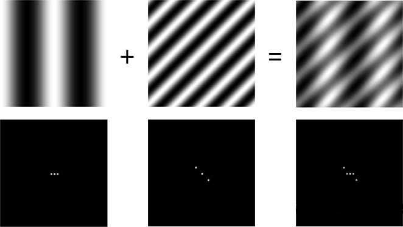

# 图像中的信号

对于二维的图像信号，

通过观察，可以发现图像的频域表示具有以下特征：

- 高频部分代表细节、边缘和噪声
- 低频占据绝大多少能 量，其中直流分量 (零频)能量占比最 大。
- 频率分布具有中心对称性。

## 图像的空域和频域

和声音信号不同，图像并没有时间属性。因此图像不具备时域（但是视频却具备）。对图像，主要讨论空域（空间域，像素具有位置，也就是空间属性）和频域。

图像的频域和空域在运算上具有关系。例如：

上图中上方是图像在空域复合；下方是同样的过程在频域的体现。

## 图像的频域滤波

两个信号的乘积的傅里叶变换，等于它们各自的傅里叶变换的乘积。而在频域中两信号的成绩的反傅里叶变换等于它们各自的反傅里叶变换相卷积。图像的频域的滤波再某种意义上能够起到空域滤波的效果。

