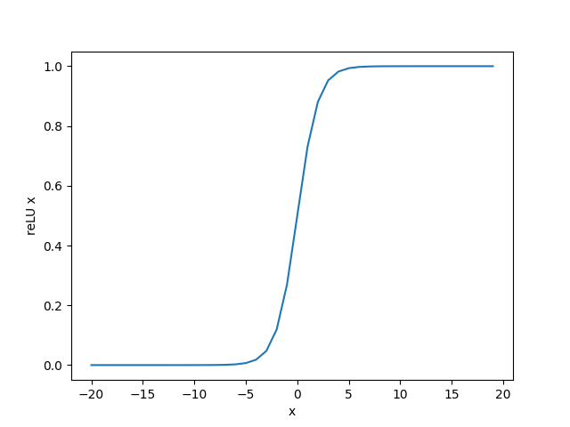
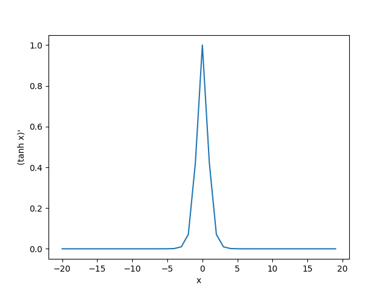

# 激活函数们

## 为什么使用激活函数

因为线性模型的表达能力不够，引入激活函数是为了添加非线性因素。


在没有激活函数的神经网络中，每一层输出的都是上一层输入的线性函数，所以无论网络结构怎么搭，输出都是输入的**线性组合**。


上图中是一个单层感知机。单层感知机能够将空间用直线划分为两个区域，从而获得一种类似二分类的能力。

我们可以通过多个感知机的组合，获得更强的分类能力：


当多个感知机组合时，会在空间内画出多根直线，将空间分成很多份，或是在空间内独立出一个封闭的有限图形。这使得感知机获得了更强的分类能力。

我们来看一下上如的感知机进行组合输出的结果：


可以看出，不论怎么组合，都是输出都是输入的线性变换，无法做到能够用在空间内画出曲线或是更复杂操作的非线性分类。

## 常见的激活函数

### ReLU函数

ReLU（rectified linear unit）函数提供了一个很简单的非线性变换。给定元素x，该函数定义为$\text{ReLU}(x) = \max(x, 0) $

可以看出，ReLU函数只保留正数元素，并将负数元素清零。为了直观地观察这一非线性变换，我们先定义一个绘图函数`xyplot`。

```python
import tensorflow as tf
import matplotlib.pyplot as plt

x = tf.constant(range(-8, 8, 1))
out = tf.nn.relu(x)
plt.xlabel("x")
plt.ylabel("reLU x")
plt.plot(x, out)
plt.show()
```

下图是会上面这段代码绘制出的图形


可以看出，该函数定义为 $\text{ReLU}(x) = \max(x, 0) $ ，在 $x>0$ 处函数值为 $x$ 本身。因此在 $x>0$ 处的梯度应该是1。

接下来我们打出它的梯度：

```python
x = tf.Variable(tf.cast(x, dtype=tf.float32))
with tf.GradientTape() as tape:
    y = tf.nn.relu(x)
plt.xlabel("x")
plt.ylabel("(reLU x)\'")
grad = tape.gradient(y, x)
plt.plot(x.numpy(), grad)
plt.show()
```

下图是代码打印出的图形：


### Sigmoid函数

sigmoid函数可以将元素的值变换到0和1之间：
$$
\text{sigmoid}(x) = \frac{1}{1 + \exp(-x)}.
$$
sigmoid函数在早期的神经网络中较为普遍，但它目前逐渐被更简单的ReLU函数取代。在后面“循环神经网络”一章中我们会介绍如何利用它值域在0到1之间这一特性来控制信息在神经网络中的流动。下面绘制了sigmoid函数。当输入接近0时，sigmoid函数接近线性变换。

我们绘制sigmoid的函数图像：

```python
import tensorflow as tf
import matplotlib.pyplot as plt

x = tf.constant(range(-20, 20, 1))
x = tf.cast(x,dtype=tf.float32)
out = tf.nn.sigmoid(x)
plt.xlabel("x")
plt.ylabel("reLU x")
plt.plot(x, out)
plt.show()
```

这段代码绘制的图像如下图：



依据链式法则，sigmoid函数的导数为：
$$
\text{sigmoid}'(x) = \text{sigmoid}(x)\left(1-\text{sigmoid}(x)\right)
$$
下面绘制了sigmoid函数的导数。当输入为0时，sigmoid函数的导数达到最大值0.25；当输入越偏离0时，sigmoid函数的导数越接近0。

```python
x = tf.Variable(tf.cast(x, dtype=tf.float32))
with tf.GradientTape() as tape:
    y = tf.nn.sigmoid(x)
plt.xlabel("x")
plt.ylabel("(reLU x)\'")
grad = tape.gradient(y, x)
plt.plot(x.numpy(), grad)
plt.show()
```


### tanh函数

tanh（双曲正切）函数可以将元素的值变换到-1和1之间：
$$
\text{tanh}(x) = \frac{1 - \exp(-2x)}{1 + \exp(-2x)}.
$$
我们接着绘制tanh函数。当输入接近0时，tanh函数接近线性变换。虽然该函数的形状和sigmoid函数的形状很像，但tanh函数在坐标系的原点上对称。

这段代码将会打印tanh的图像：

```python
import tensorflow as tf
import matplotlib.pyplot as plt

x = tf.constant(range(-20, 20, 1))
x = tf.cast(x,dtype=tf.float32)
out = tf.nn.tanh(x)
plt.xlabel("x")
plt.ylabel("reLU x")
plt.plot(x, out)
plt.show()
```


老规矩打印tanh梯度的图像：

```python
x = tf.Variable(tf.cast(x, dtype=tf.float32))
with tf.GradientTape() as tape:
    y = tf.nn.tanh(x)
plt.xlabel("x")
plt.ylabel("(reLU x)\'")
grad = tape.gradient(y, x)
plt.plot(x.numpy(), grad)
plt.show()
```

