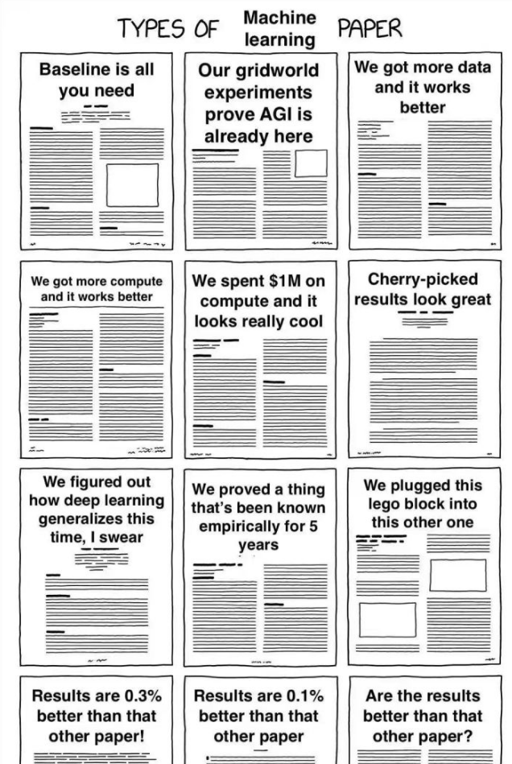
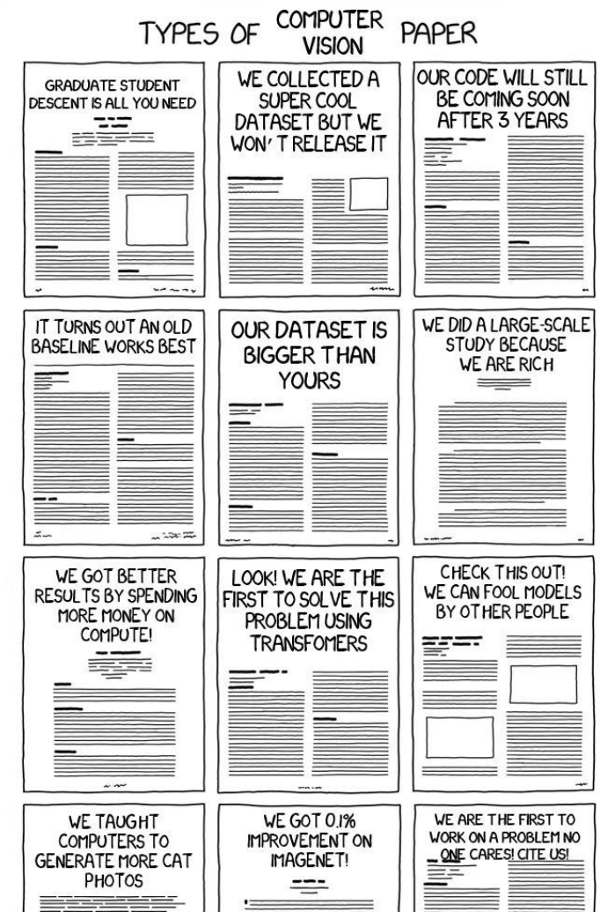
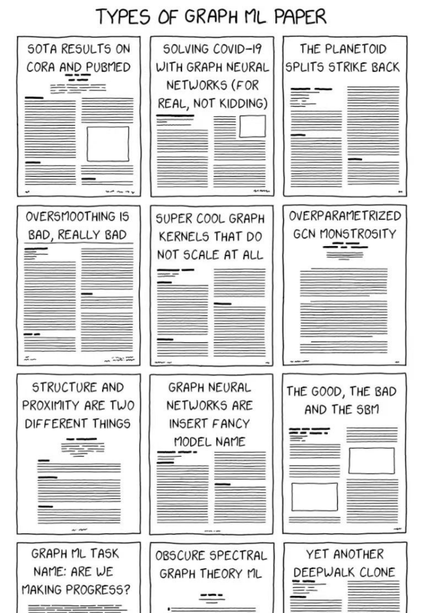
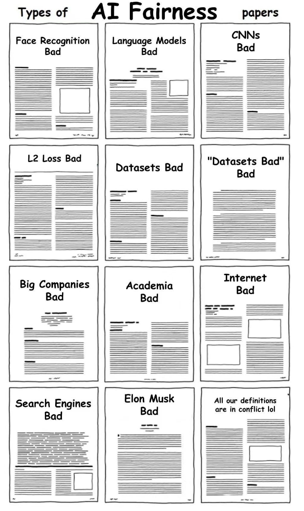

# 一些顶尖的会议和期刊特色

### CVPR/ICCV/ECCV常见论文

1. 我们在imagenet上提升了0.1%！
2. 研究生梯度下降(graduate student descent)是最重要的技术！
3. 我们很快将释放代码，也可能用很长时间。
4. 我们是第一个把transformer用到这个任务的！
5. 我们采用了更多的计算资源，发现很老的一个基线方法是最好的！

### Neurips

1. 我提出了一个新的任务，尽管可能没什么实际意义。
2. 经过精心挑选，我们的结果看上去不错！
3. 我们提出的方法在我们生成的非公开数据集上很有效！

### ICML

1. 我们证明了五年以前大家都知道的东西！
2. 我们有很复杂的连自己也看不太懂的公式。

### ICLR

1. 虽然我们是一个比较新的会议，但是我们仍然在鄙视链顶层。
2. Open review不代表我们论文质量高，可能只是我们脸皮厚。

### AAAI

1. 我们的审稿人看不懂我们做了什么，反正通过了。
2. 我们将已有方法运用到了新数据集，发现它超过了SOTA 1%！
3. 我们发现把已有模块插入到当前的任务，可以涨点！

### IJCAI

1. 我们的中奖率只有不到15%，真的不是水会，CCF别踢我。
2. 不是我们实验不够，六页真的啥都放不下。
3. 没错，我们的论文如果能投三大会我就投三大会了，投IJCAI实在没办法，日子总还是要过的嘛。

### SIGGRAPH（非CV）

1. 只要录取率足够低，圈内都是自己人，把圈外人门关上，焊的死死的。
2. SIGGRAPH可不是像水会，我们CG就这一个顶会，质量杠杠的。别看了，说的就是你们，视觉三大会一个比一个水。
3. Incremental的方法都不能发表，至于你要问我什么是incremental，demo视频PS地不好，就是incremental，外人我不告诉他。

### ICRA/IROS（非CV）

1. 我们引用了30篇非常相关的论文，没错都是我们的论文。
2. 我们研究了人与机器人的交互，但是可能没有人能用得到。
3. 我们将机器学习应用到了已经解决的问题当中，发现它可以达到相似的效果。
4. 我们也做了SLAM，但是比其他论文好2%。
5. 我们的sensor很创新，但是你们可能买不起。
6. 我们又一次在模拟器中取得了完美的效果！

### EMNLP（非CV）

1. 我们在某个特定的任务上取得了提升，但是可能在你的数据上不work。
2. 你只需要这个简单的trick即可。
3. 我们的神经网络模拟了人脑思考的过程，可能对你的任务有一丢丢帮助。
4. 预训练加bert真的很有效。
5. 我们在大规模数据集上验证了结果，但是你想要复现，可能还需要一些运气。

