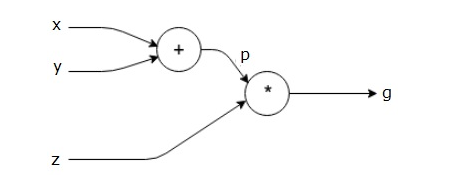
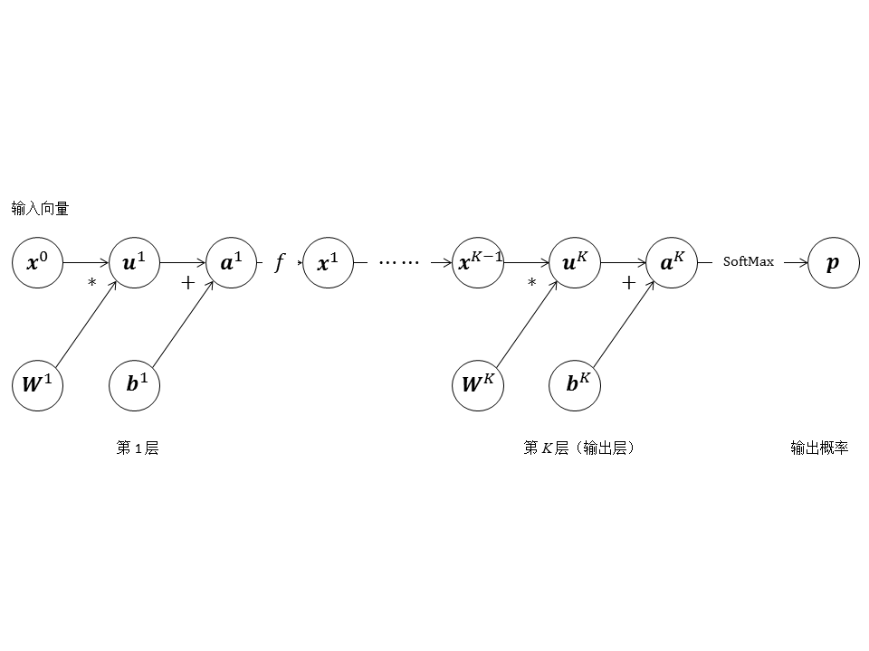
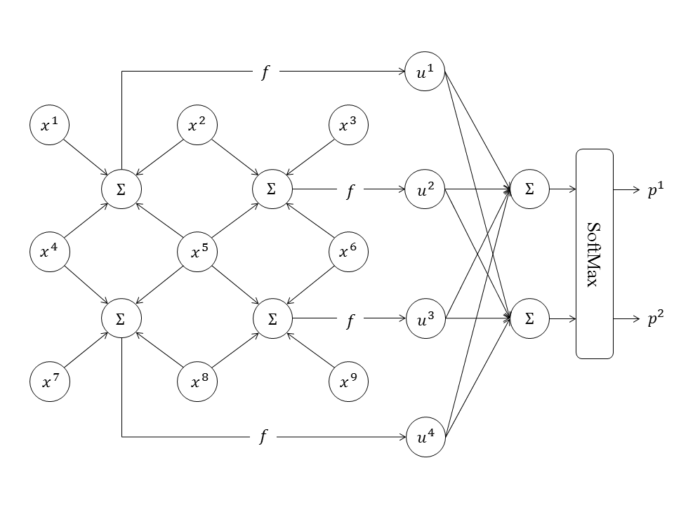

# Pytorch编程策略

## 计算图：Pytorch的计算模型

### 接触计算图

在Pytorch中，计算图是神经网络计算的流程的直观表示。计算图被定义为有向图，其中节点对应于数学运算。 在数学上，计算图是表达和评估数学表达式的一种方式。

接下来通过简单的举例对计算图进行描述：

首先我们尝试表示$p=x+y$


上面的计算图具有一个加法节点(具有“+”符号的节点)，其具有两个输入变量`x`和`y`以及一个输出`q`。

第二个例子：$g = ( x + y ) \cdot z$



#### 多层全连接网络的计算图

常见的多层全连接神经网络示意图就是一个计算图，它的节点都是标量，表示计算的粒度较细。现在我们可以用向量节点更简洁地表示多层全连接神经网络，如下图所示。



计算图可以灵活地表示更为复杂的神经网络：



#### 计算图和向前传播

实际上，计算图本身就表示着正向传播。比如在上面的图中我们表示了$g = ( x + y ) \cdot z$。如果我们对这些变量进行取值：`x = 1`和`y = 3`的值来获得`p = 4`,然后`p = 4`和`z = -3`来得到`g = -12`。


上图是这个过程表示在计算图中。所以，计算图本身就很直观的表示了向前传播。

#### 计算图中的反向传播

反向传播的目的是计算每个输入相对于最终输出的梯度。例如，在简单的表达式$y=k\cdot x+b$中，我们看到两组x和y之后，就可以解出k和b来。之后我们可以用这组k和b来预测不知道的x对应的y。这便是机器学习任务最直观的解释。所以这些梯度对于使用梯度下降训练神经网络至关重要。

## Pytroch的动态计算图

pytoch构建的计算图是动态图，为了节约内存，所以每次一轮迭代完之后计算图就被在内存释放，所以当你想要多次**backward**时候就会报如下错：

```python
net = nn.Linear(3, 4)  # 一层的网络，也可以算是一个计算图就构建好了
input = torch.randn(2, 3, requires_grad=True)  # 定义一个图的输入变量
output = net(input)  # 最后的输出
loss = torch.sum(output)  # 这边加了一个sum() ,因为被backward只能是标量
loss.backward()  # 到这计算图已经结束，计算图被释放了
```

上面这个程序是能够正常运行的，但是下面就会报错

```python
net = nn.Linear(3, 4)  # 一层的网络，也可以算是一个计算图就构建好了
input = torch.randn(2, 3, requires_grad=True)  # 定义一个图的输入变量
output = net(input)  # 最后的输出
loss = torch.sum(output)  # 这边加了一个sum() ,因为被backward只能是标量
loss.backward()
loss.backward()

Out:
RuntimeError: Trying to backward through the graph a second time, but the saved intermediate results have already been freed. Specify retain_graph=True when calling backward the first time.
```

之所以会报这个错，因为计算图在内存中已经被释放。但是，如果你需要多次**backward**只需要在第一次反向传播时候添加一个标识，如下：

```python
net = nn.Linear(3, 4)
input = Variable(torch.randn(2, 3), requires_grad=True)
output = net(input)
loss = torch.sum(output)
loss.backward(retain_graph=True) # 添加retain_graph=True标识，让计算图不被立即释放
loss.backward()
```

读到这里，可能你对计算图中的**backward**还是一知半解。例如上面提过**backward**只能是标量。那么在实际运用中，如果我们只需要求图中某一节点的梯度，而不是整个图的，又该如何做呢？下面举个例子，列子下面会给出解释。

```python
x = torch.FloatTensor([[1, 2]])  # 定义一个输入变量
x.requires_grad = True
y = torch.FloatTensor([[3, 4], [5, 6]])
y.requires_grad = True
loss = torch.mm(x, y)  # 变量之间的运算
loss.backward(torch.FloatTensor([[1, 0]]), retain_graph=True)  # 求梯度，保留图
print(x.grad.data)  # 求出 x_1 的梯度
x.grad.data.zero_()  # 最后的梯度会累加到叶节点，所以叶节点清零
loss.backward(torch.FloatTensor([[0, 1]]))  # 求出 x_2的梯度
print(x.grad.data)  # 求出 x_2的梯度
```

结果如下：

```
tensor([[3., 5.]])
tensor([[4., 6.]])
```

可能看到上面例子有点懵，用数学表达式形式解释一下，上面程序等价于下面的数学表达式：
$$
\begin{array}{l}
x=\left(x_{1}, x_{2}\right) \mid x_{1}=1, x_{2}=2 \\
y_{1}=3 x_{1}+5 x_{2} \\
y_{2}=4 x_{1}+6 x_{2} \\
x_{1} \cdot g r a d=\frac{\partial y_{1}}{\partial x_{1}} \Rightarrow 3, x_{2} \cdot g r a d=\frac{\partial y_{1}}{\partial x_{2}} \Rightarrow 5 \\
x_{1} \cdot g r a d=\frac{\partial y_{2}}{\partial x_{1}} \Rightarrow 4, x_{2} \cdot \text { grad }=\frac{\partial y_{2}}{\partial x_{2}} \Rightarrow 6
\end{array}
$$
这样我们就很容易利用backward得到一个雅克比行列式：
$$
\left|\begin{array}{cccc}
\frac{\partial y_{1}}{\partial x_{1}} & \frac{\partial y_{1}}{\partial x_{2}} & \ldots & \frac{\partial y_{1}}{\partial x_{n}} \\
\frac{\partial y_{2}}{\partial x_{1}} & \frac{\partial y_{2}}{\partial x_{2}} & \cdots & \frac{\partial y_{2}}{\partial x_{n}} \\
\ldots & \cdots & & \\
\frac{\partial y_{m}}{\partial x_{1}} & \frac{\partial y_{m}}{\partial x_{2}} & \cdots & \frac{\partial y_{m}}{\partial x_{n}}
\end{array}\right|
$$
到这里应该对pytorch的计算图和backward有一定了解了吧。


**参考文献**

[[1] pytorch的计算图[EB/OL].(2018-1-03)[2018-02-03].https://zhuanlan.zhihu.com/p/33378444.](https://zhuanlan.zhihu.com/p/33378444)


