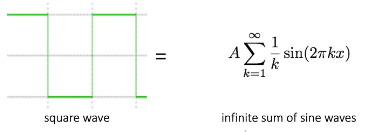
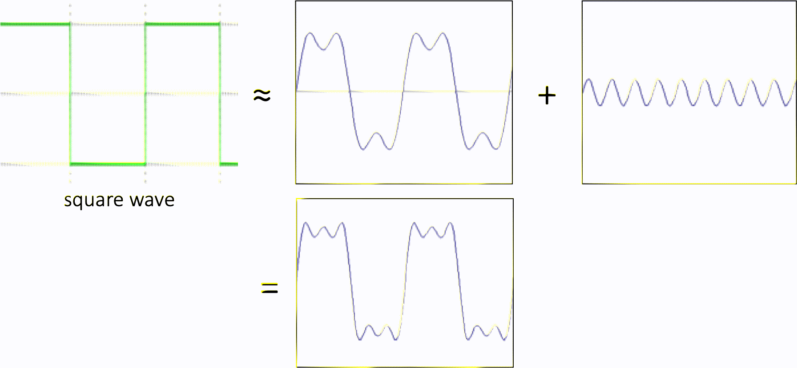
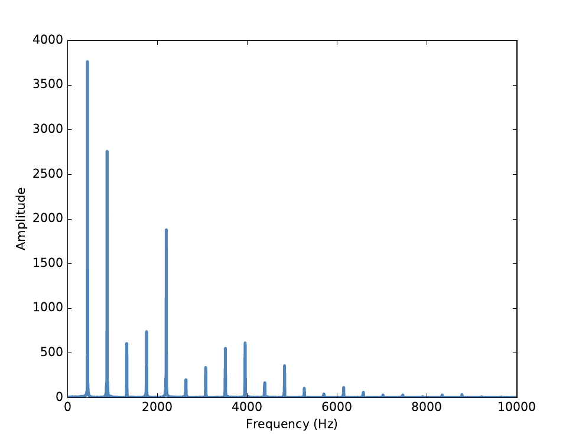

# 周期信号

如果你想深刻地学习数字信号处理，那请移步他处。在这里，我们不会使用特别高深的数学概念。除了学习必要的理论，简单的代码也会随时出现。这些是你需要导入的库：

```python
import matplotlib.pyplot as plt
import numpy as np
import math
```

## 一些定义

- **周期信号**：在一段时间内重复出现的信号。
- **振幅**：频率元素的强度。

- **频谱**：指相加产生信号的正弦波的集合。
- **基频**：某个信号中频率最低的元素。
- **谐波**：频谱中频率是基频的整数倍的峰值对应的频率元素（在乐理上与基频和谐）。

频域和时域

傅里叶变换

---

## 周期信号

周期信号是在一段时间内重复出现的信号。比如，敲钟的时候，钟会震动产生声音。

这个信号和三角函数相似，可以把它当作一个正弦三角函数的形状。


上图中是一个正弦函数。声音信号和这个函数一样是具有**周期性**的。在上图中战士了三个这样完整的重复。这也被称作循环。每个循环的时间长度（在图中表现为x轴上的长度）被称为**周期**。上图中是一个正弦函数，所以周期理所当然的是$\pi$。 

- 生成上面的这幅图像可以使用这一段代码（别忘了上面的imports。如果你还没怎么接触matplotlib，可以尝试这些代码。它们非常简单）：

  ```python
  x = np.arange(-10, 10, 0.1) # 从-10到10是x的定义域。我们每秒采10次样本。当然，你可以通过修改0.1来让生成的曲线变得圆滑或是粗糙。你可以暂时不知道为什么这样做。这会在后面关于采样频率和采样定理的部分进行讲解。
  y = []
  for t in x: # 对于每个x的取值，生成对应的y
      y.append(math.sin(t))
  plt.plot(x, y) # 使用x和生成的y绘制曲线
  plt.show() # 将生成的图片显示出来
  ```

信号的**频率**是每秒内周期的数量，即周期的倒数。频率的单位是每秒钟循环数，或者称为赫兹（Hertz），英文符号为“Hz”。

当然，并不是所有的声音的信号画出来的波形都是正弦式的，这里只是一个案例。对于比正弦信号更加复杂的波形，人们主管上认为它更加富有内涵、更温暖而有趣。例如，小提琴演奏的鲍凯利尼E大调第五弦乐五重奏第三乐章的录音片段画出来就要比正弦复杂的很多：


## 正弦波

傅里叶级数的基本内容为：给定一个周期为$T$的函数$x(t)$，那么它可以表示为无穷级数。
$$
A\sin(\omega x + \phi)
$$
上式是傅里叶级数的基本构成。其中，$A$（amplitude）表示振幅；$sin$（sinusoid）表示正弦曲线函数；$\omega$（angular frequency）表示频率；$\phi$（phase）表示相位。

不同的正弦波相互组合构成任意周期信号：


例如，上图中是由两种正弦波叠加的波形的时域和频域图。

方波也可以由正弦波表示出来：



（当然是用极限的形式），下图是比较形象的描述：



## 频谱分析

​	“任何信号都可以表示称一系列不同频率的正弦信号的叠加和”。在这里最重要的数学概念是离散傅里叶变换（Discrete Fourier Transform，DFT），DFT也就是将信号转换为频谱。**频谱是指相加产生信号本身的正弦波的集合**。在这里有一个重要的算法叫做快速傅立叶变换（Fast Fourier Transform，FFT），它是计算离散傅里叶变换的一种高效的方式。

​	例如，这是上面那段小提琴录音的频谱图：

​	

**频谱图描述了信号的频率结构及频率与该频率信号幅度的关系。**

在频谱的柱状图中x轴表示的是合成这个信号的频率（Frequency）范围，y轴表示的是各个频率元素的强度，或者说是振幅（Amplitude）。其中频率最低的元素被称为基频。通常情况下，在声音的频谱中，干知道的声音的音高是由其基频决定的。


## 时域和频域

首先抛出图中的直观理解

- 时域：横轴是时间，纵轴是信号的变化。
- 频域：横轴是频率，纵轴是该信号频率的幅度。

在这里，还有两个比较重要的概念是时域和频域。如同一开始我们说的，时域是信号在时间轴随时间变化的总体概括，所以表现在座标轴上时域信号是一个横轴为时间的曲线。频域是把时域波形的表达式做傅立叶等变化得到复频域的表达式。所以我们画出的频谱图就是描述频率变化和幅度变化的关系。这便是时域和频域的简要关系。

我们常在时域上对数字信号进行分析，但是有时一些信号的时域参数相同，但并不能说明信号就完全相同。因为信号不仅随时间变化，还与频率、相位等信息有关，这就需要进一步分析信号的频率结构，并在频率域中对信号进行描述。

## 采样频率和采样定理（可以略过）

我们使用计算机处理各种各样的信号。在数学和信号学上，函数曲线或者模拟信号是以连续的曲线的形式出现的。例如下面这个**可懂可不懂**（如果并不打算深究的话）的公式：
$$
\tilde{x}(\omega) = \int^{+\infty}_{-\infty}e^{-i\omega t}x(t)dt =  \int^{+\infty}_{-\infty}e^{-2\pi i f t}x(t)dt \quad.
$$
这个公式其实就是傅里叶公式。其中时域信号即$x(t)$，频域信号是$\tilde{x}(\omega)$并且$\omega = 2\pi f$。这个方程是可逆的，于是还有一个它的逆变换：
$$
x(t)= \int^{+\infty}_{-\infty}e^{i\omega t}\tilde{x}(\omega) \frac{d\omega}{2\pi} =  \int^{+\infty}_{-\infty}e^{2\pi ift}\tilde{x}(f) df \quad.
$$
但是很明显你不能指望你的电脑和你一样在连续的函数上运算。 在信号处理中，我们的信号数据都是离散的。所谓**采样**，就是把模拟信号转换为计算机可以处理的数字信号的过程。

这时你肯定会想到采样。同时你肯定也会担心这种在曲线上“每隔一小段取一个点”的方式会导致你的信号变得“不真实”或者“有损失”。这里有一条大名鼎鼎的定理能打消你的担心：

> 采样定理
>
> 在进行模拟/数字信号的转换过程中，当采样频率大于信号中最高频率的2倍时，采样之后的数字信号完整地保留了原始信号中的信息，一般实际应用中保证采样频率为信号最高频率的2.56～4倍；采样定理又称奈奎斯特定理。

在编程时，我们使用迫真离散傅里叶变换：
$$
\tilde{x}[k]=\sum^{N-1}_{n=0}e^{\frac{-2\pi i}{N}k\cdot n}x[n] \quad,\\

x[n]=\frac{1}{N}\sum^{N-1}_{k=0}e^{\frac{2\pi i}{N}k\cdot n}\tilde{x}[k] \quad.
$$
其中，信号采样点的数目是${k,n}=0,\dots,N-1$。上面的公式实际上是Python的一些库中关于`fft()`的定义。说它迫真是因为它确实和真正的离散傅里叶变换有些差别。这里不对这些差别进行讨论。

## 快速傅里叶变换（FFT）

任意信号，包括非周期信号都可以用傅里叶变换转到频域：


傅里叶分析法是信号分析中最基本的方法，傅里叶变换是傅里叶分析的核心，通过它把信号从时间域变换到频率域，进而研究信号的频谱结构和变化规律。但是在实际应用上，傅里叶变换有一个致命缺点：计算量太大，时间复杂度太高，当采样点数太高的时候，计算缓慢。

