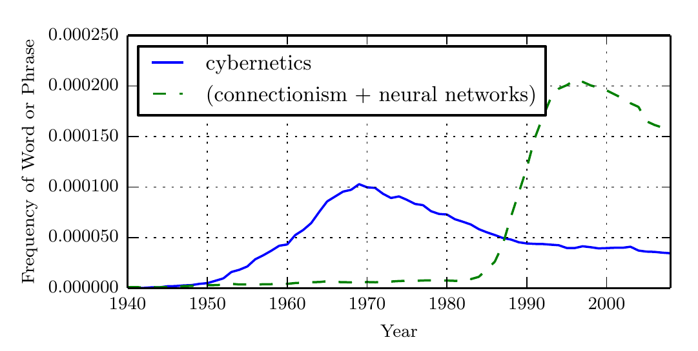
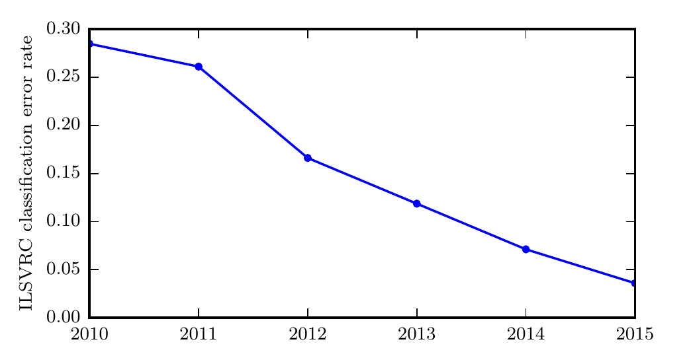

# 毁灭网友的人工智能

知乎上有一个比较出名的问题，是《锅炉设计转行AI，可行吗？》。在网友的世界里，人工智能天天不是摧毁这个行业就是取代那个行业——或许再过一段时间它就要毁灭人类了。然而实际上的人工智能：

但是如果你仔细观察整个人类科技发展史，你会发现，新事物的出现带来的巨大改变在下一个时代的人眼中是再正常不过的事了。书籍刚刚出现时，有人担心书籍会“侵蚀人的思想”，但是现在大多数人的人生前20年求学精力中，有至少10年是住在书堆里的。这篇文章标题“毁灭网友的人工智能”，是在调侃网友们对人工智能的想象力过度丰富了。

1950年，阿兰·图灵(AlanTuring)发表了一篇有着重要影响力的论文《Computing  Machinery and Intelligence》，讨论了创造一种“智能机器”的可能性。由于“智能”一词比较难以定义，他提出了著名的图灵测试：“一个人在不接触对方的情况下，通过一种特殊的方式和对方进行一系列的问答。如果在相当长时间内，他无法根据这些问题判断对是人还是计算机，那么就可以认为这个计算机是智能的”。	

## 人工智能和深度学习

人工智能是计算机科学的一个分支，主要研究、开发用于模拟、延伸和扩展人类智能的理论、方法、技术及应用系统等。和很多其他学科不同，人工智能这个学科的诞生有着明确的标志性事件，就是1956年的达特茅斯(Dartmouth)会议。在这次会议上，“人工智能”被提出并作为本研究领域的名称。同时，人工智能研究的使命也得以确定。JohnMcCarthy提出了人工智能的定义：人工智能就是要让机器的行为看起来就像是人所表现出的智能行为一样。目前，人工智能的主要领域大体上可以分为以下几个方面：

1. 感知：模拟人的感知能力，对外部刺激信息(视觉和语音等)进行感知和加工。主要研究领域包括语音信息处理和计算机视觉等。
2. 学习：模拟人的学习能力，主要研究如何从样例或从与环境的交互中进行学习。主要研究领域包括监督学习、无监督学习和强化学习等。
3. 认知：模拟人的认知能力，主要研究领域包括知识表示、自然语言理解、推理、规划、决策等。

深度学习的历史可以追溯到20 世纪 40 年代。深度学习看似是一个全新的领域，只不过因为在目前流行的前几年它是相对冷门的，同时也因为它被赋予了许多不同的名称（其中大部分已经不再使用），最近才成为众所周知的 “深度学习”。这个领域已经更换了很多名称，它反映了不同的研究人员和不同观点的影响。

## 深度学习的历史趋势

现代术语 “深度学习” 超越了目前机器学习模型的神经科学观点。它诉诸于学习多层次组合这一更普遍的原理，这一原理也可以应用于那些并非受神经科学启发的机器学习框架。深度学习技术发展的历史有几个关键趋势：

- 深度学习有着悠久而丰富的历史，但随着许多不同哲学观点的渐渐消逝，与之对应的名称也渐渐尘封。
- 随着可用的训练数据量不断增加，深度学习变得更加有用。
- 随着时间的推移，针对深度学习的计算机软硬件基础设施都有所改善，深度学习模型的规模也随之增长。
- 随着时间的推移，深度学习已经解决日益复杂的应用，并且精度不断提高。

我们今天知道的一些最早的学习算法，是旨在模拟生物学习的计算模型，即大脑怎样学习或为什么能学习的模型。其结果是深度学习以 人工神经网络（artificial neural network， ANN）之名而淡去。彼时，深度学习模型被认为是受生物大脑（无论人类大脑或其他动物的大脑）所启发而设计出来的系统。尽管有些机器学习的神经网络有时被用来理解大脑功能 ，但它们一般都没有被设计成生物功能的真实模型。深度学习的神经观点受两个主要思想启发。一个想法是大脑作为例子证明智能行为是可能的，因此，概念上，建立智能的直接途径是逆向大脑背后的计算原理，并复制其功能。另一种看法是，理解大脑和人类智能背后的原理也非常有趣，因此机器学习模型除了解决工程应用的能力，如果能让人类对这些基本的科学问题有进一步的认识也将会很有用。

根据 Google 图书中短语 “控制论”、“联结主义” 或 “神经网络” 频率衡量的人工神经网络研究的历史浪潮：

上图中展示了三次浪潮的前两次，第三次最近才出现。第一次浪潮开始于20 世纪 40 年代到 20 世纪 60 年代的控制论，随着生物学习理论的发展和第一个模型的实现(如感知机 ，能实现单个神经元的训练。第二次浪潮开始于 1980-1995 年间的联结主义方法，可以使用反向传播训练具有一两个隐藏层的神经网络。当前第三次浪潮，也就是深度学习，大约始于 2006 年，并且现在在 2016 年以书的形式出现。另外两次浪潮类似地出现在书中的时间比相应的科学活动晚得多。这些浪潮，证明了使用深度学习解决各类问题将会继续流行。

## 深度学习和计算机视觉

本仓库（`ml。akasaki。space`）的主要内容是使用深度学习方法的计算机视觉。计算机视觉是领域，深度学习是方法，神经网络是手段。

经过训练的神经网络具有强大的建模和分类能力。最早的深度模型被用来识别裁剪紧凑且非常小的图像中的单个对象 。此后，神经网络可以处理的图像尺寸逐渐增加。现代对象识别网络能处理丰富的高分辨率照片，并且不需要在被识别的对象附近进行裁剪 。类似地，最早的网络只能识别两种对象(或在某些情况下，单类对象的存在与否)，而这些现代网络通常能够识别至少1000个不同类别的对象。对象识别中最大的比赛是每年举行的 ImageNet 大型视觉识别挑战(ILSVRC)。深度学习迅速崛起的激动人心的一幕是卷积网络第一次大幅赢得这一挑战，它将最高水准的前5 错误率从 26.1% 降到 15.3% ，这意味着该卷积网络针对每个图像的可能类别生成一个顺序列表，除了 15.3% 的测试样本，其他测试样本的正确类标都出现在此列表中的前 5 项里。此后，深度卷积网络连续地赢得这些比赛，截至写本书时，深度学习的最新结果将这个比赛中的前 5 错误率降到了 3.6%：

深度网络在行人检测和图像分割中也取得了引人注目的成功，并且在交通标志分类上取得了超越人类的表现。现在，深度学习技术能够处理更多复杂的任务，并在这些任务上取得不错的成绩。使用深度学习方法解决计算机视觉问题成为了时代的潮流。

## 要逃吗

想要确定自己是否真的会喜欢学习基于深度学习的计算机视觉，可以按照以下步骤进行自检：

1. 自习阅读花书目录，并发现自己什么都看不懂。半年后，再回来看一次，发现自己还是什么都看不懂。
2. 自习阅读一篇英文论文，发现自己什么都没看懂，对文中大量出现的各种概念也毫无头绪。

如果你仍未气馁，那么可以尝试着开始学习了。
