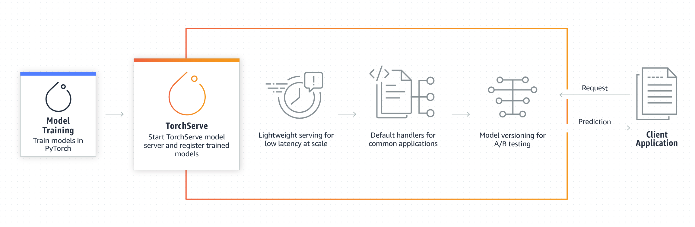

# 选一个深度学习框架

如果你在读这篇文章，那么你可能已经开始了自己的深度学习之旅。如果你对这一领域还不是很熟悉，那么简单来说，深度学习使用了“人工神经网络”，这是一种仿生的、利用计算机进行计算的、听上去很高大上的结构，深度学习框架是一种能够帮助你实现这种结构的工具。

## 我不懂，我想无脑选一个

夹带私货，你先选着Pytorch吧，绝对不会吃亏。

如上图，Pytorch是一整个生态系统。虽然Tensorflow对各种硬件、语言、部署环境的支持能力比Pytorch要好，但是Pytorch目前的代码生态是要优于Tensorflow的。在Github上我们可以找到非常多的Tensorflow代码，但是有非常多的代码都是TF1.x或者更低的版本，这导致了在尝试不同代码时就需要更换不同的环境。Pytorch在0.4版本之后就具有了非常好的代码兼容性。如果你是想从事科学研究的小白，Pytorch决定是你的不二之选。

## 理智的选择

1. 如果你主要从事学术研究工作，并且不考虑生产和部署环境，而且讨厌麻烦，不喜欢考虑移植和工程问题，建议无脑选择pytorch。很多论文给的代码都是用pytorch写的。
2. 如果你同时考虑研究和生产、部署环境，希望代码能到处跑，喜欢看丰富的技术文档，那TensorFlow是不错的选择。合格的程序员可以使用TensorFlow编写具有工程完整性的代码，初学者也可以使用tensorflow.keras用几行代码轻松架构神经网络。简明扼要地说，Tensorflow可繁可简。
3. PaddlePaddle是百度内部开发自用的Paddle衍生得到的生态完整的深度学习框架，具有稠密参数和稀疏参数场景的超大规模深度学习并行训练能力，有百度在线平台支持，从编写到部署你基本不怎么用愁，文档中英都有，这两年生态也在逐渐完善。如果你主要从事生产环境，PaddlePaddle是你不错的选择。

更多内容请自行搜索如何选择深度学习框架，肯定讲的比这里又全又好。请注意，由于深度学习及其技术具有很强的时效性，框架也会推陈出新，所以请即使关注业内的最新动态。