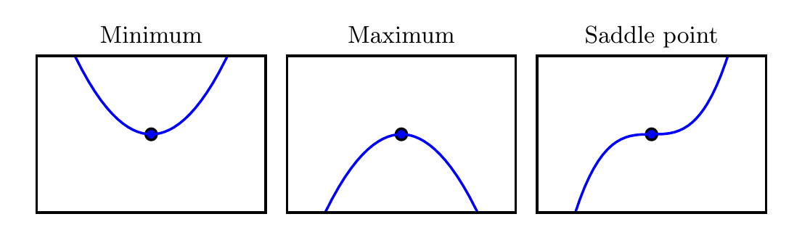

import Tabs from '@theme/Tabs';
import TabItem from '@theme/TabItem';

# 自动求梯度

<Tabs groupId="language">
  <TabItem value="tf" default>

```python
import tensorflow as tf
print(tf.__version__)

# import os
# os.environ['TF_CPP_MIN_LOG_LEVEL'] = '2'
# tf.test.is_gpu_available( cuda_only=False, min_cuda_compute_capability=None )
```

    2.0.0

在深度学习中，我们经常需要对函数求梯度（gradient）。本节将介基于梯度的优化方法和如何使用tensorflow2.0提供的GradientTape来自动求梯度。阅读本节，请确保你对微积分有一定的掌握。

## 基于梯度的优化方法

大多数深度学习算法都涉及某种形式的优化。优化指的是改变 $x$ 以最小化或最大化某个函数 $f (x)$ 的任务。我们通常以最小化 $f (x)$ 指代大多数最优化问题。最大化可经由最小化算法最小化 $−f (x)$​ 来实现。

我们把要最小化或最大化的函数称为**目标函数(objective function)**或准则(criterion)。当我们对其进行最小化时，我们也把它称为代价函数(cost function)、**损失函数(loss function)**或误差函数(error function)。我们通常使用一个上标$*$表示最小化或最大化函数的$x$值。如我们记$ x^* =arg min f (x)$​​​。

假设我们有一个函数 $y = f (x)$，其中 $x$ 和 $y$ 是实数。这个函数的 导数(derivative)记为 $f'(x)$ 或$\frac{dy}{dx}$ 。导数 $f'(x)$代表$f (x)$在点$x$处的斜率。换句话说,它表明如何缩放输入的小变化才能在输出获得相应的变化:$f (x + \epsilon) \approx f (x) + \epsilon f'(x)$。

因此导数对于最小化一个函数很有用,因为它告诉我们如何更改 x 来略微地改善$y$​。例如,我们知道对于足够小的$\epsilon$​来说,$f (x − \epsilon sign(f'(x)))$​ 是比$f (x)$​小的。因此我们可以将$x$​往导数的反方向移动一小步来减小$f (x)$​。这种技术被称为 梯度下降(gradient descent)。


上图为梯度下降的一种示意。梯度下降算法如何使用函数导数的示意图,即沿着函数的下坡方向(导数反方向)直到最小。

当$f'(x) = 0$，导数无法提供往哪个方向移动的信息。$f'(x)=0$的点称为临界点(critical point)或驻点(stationary point)。一个局部极小点(local minimum)意味着这个点的$ f(x)$ 小于所有邻近点,因此不可能通过移动无穷小的步长来减小$f(x)$。一个局部极大点(local maximum)意味着这个点的$f(x)$大于所有邻近点,因此不可能通过移动无穷小的步长来增大$f(x)$​。有些临界点既不是最小点也不是最大点，这些点被称为鞍点(saddle point)。



上图：临界点的类型。一维情况下，三种临界点的示例。临界点是斜率为零的点。这样的点可以是局部极小点(local minimum)，其值低于相邻点； 局部极大点(local maximum)，其值高于相邻点；或鞍点，同时存在更高和更低的相邻点。

使 f (x) 取得绝对的最小值(相对所有其他值)的点是 全局最小点(global minimum)。函数可能只有一个全局最小点或存在多个全局最小点,还可能存在不是全局最优的局部极小点。在深度学习的背景下,我们要优化的函数可能含有许多不是最优的局部极小点,或者还有很多处于非常平坦的区域内的鞍点。尤其是当输入是多维的时候,所有这些都将使优化变得困难。因此,我们通常寻找使 f 非常小的点,但这在任何形式意义下并不一定是最小。


上图：近似最小化。当存在多个局部极小点或平坦区域时，优化算法可能无法找到全局最小点。在深度学习的背景下，即使找到的解不是真正最小的，但只要它们对应于代价函数显著低的值，我们通常就能接受这样的解。

我们经常最小化具有多维输入的函数：$f: \R^n \rightarrow \R $​。 为了使“最小化”的概念有意义，输出必须是一维的(标量)。针对具有多维输入的函数,我们需要用到 偏导数(partial derivative)的概念。偏导数$\frac{\partial}{\partial x_i}f(x)$​衡量点$x$​处只有$x_i$​增加时$f(x)$​如何变化。梯度(gradient)是相对一个向量求导的导数$f$​的导数是包含所有偏导数的向量，记为$\nabla_{x} f(x)$​。梯度的第$i$​个元素是$f$​关于$X_i$​的偏导数。在多维情况下,临界点是梯度中所有元素都为零的点。

在$u$(单位向量)方向的 方向导数(directional derivative)是函数$f$在$u$方向的斜率。换句话说，方向导数是函数$f (x + \alpha u)$关于$\alpha$的导数（在$\alpha = 0$时取得）。使用链式法则,我们可以看到当$\alpha = 0$时,$\frac{\partial}{\partial \alpha} f(x + \alpha u) = u^T \nabla_{x} f(x)$

为了最小化$f$,我们希望找到使$f$下降得最快的方向。计算方向导数：
$$
\begin{align}
 \underset{u, u^T = 1}{\min} u^T & \nabla_{x} f(x) \\
 = \underset{u, u^T = 1}{\min} \| u \|_2 \| &\nabla_{x}f(x) \|_2 \cos \theta
\end{align}
$$

其中$\theta$​是$u$​与梯度的夹角。将$∥u∥2 = 1$​代入，并忽略与$f$​无关的项,就能简化得到$\min \cos \theta$​。这在$u$​​与梯度方向相反时取得最小。换句话说,梯度向量指向上坡，负梯度向量指向下坡。我们在负梯度方向上移动可以减小$f$​​。这被称为最速下降法(method of steepest descent) 或**梯度下降(gradient descent)**。

最速下降建议新的点为：
$$
x' = x - \epsilon \nabla_{x} f(x)
$$

其中$\epsilon$为 学习率(learning rate)，是一个确定步长大小的正标量。我们可以通过几种不同的方式选择$\epsilon$。普遍的方式是选择一个小常数。有时我们通过计算,选择使方向导数消失的步长。还有一种方法是根据几个$\epsilon$计算$f(x - \epsilon \nabla_{x} f(x))$，并选择其中能产生最小目标函数值的$epsilon$​。这种策略被称为线搜索。

最速下降在梯度的每一个元素为零时收敛(或在实践中,很接近零时)。在某些情况下，我们也许能够避免运行该迭代算法，并通过解方程$\nabla_{x} f(x)= 0$​直接跳到临界点。

虽然梯度下降被限制在连续空间中的优化问题，但不断向更好的情况移动一小步(即近似最佳的小移动)的一般概念可以推广到离散空间。递增带有离散参数的目标函数被称为 爬山(hill climbing)算法。

## 简单示例

我们先看一个简单例子：对函数 $y = 2\boldsymbol{x}^{\top}\boldsymbol{x}$ 求关于列向量 $\boldsymbol{x}$ 的梯度。我们先创建变量`x`，并赋初值。


```python
x = tf.reshape(tf.Variable(range(4), dtype=tf.float32),(4,1))
x
```

    <tf.Tensor: id=10, shape=(4, 1), dtype=float32, numpy=
    array([[0.],
           [1.],
           [2.],
           [3.]], dtype=float32)>

函数 $y = 2\boldsymbol{x}^{\top}\boldsymbol{x}$ 关于$\boldsymbol{x}$ 的梯度应为$4\boldsymbol{x}$。现在我们来验证一下求出来的梯度是正确的。

```python
with tf.GradientTape() as t:
    t.watch(x)
    y = 2 * tf.matmul(tf.transpose(x), x)
    
dy_dx = t.gradient(y, x)
dy_dx
```

    <tf.Tensor: id=30, shape=(4, 1), dtype=float32, numpy=
    array([[ 0.],
           [ 4.],
           [ 8.],
           [12.]], dtype=float32)>

## 训练模式和预测模式

```python
with tf.GradientTape(persistent=True) as g:
    g.watch(x)
    y = x * x
    z = y * y
    dz_dx = g.gradient(z, x)  # 108.0 (4*x^3 at x = 3)
    dy_dx = g.gradient(y, x)  # 6.0
dz_dx,dy_dx
```

    WARNING:tensorflow:Calling GradientTape.gradient on a persistent tape inside its context is significantly less efficient than calling it outside the context (it causes the gradient ops to be recorded on the tape, leading to increased CPU and memory usage). Only call GradientTape.gradient inside the context if you actually want to trace the gradient in order to compute higher order derivatives.
    WARNING:tensorflow:Calling GradientTape.gradient on a persistent tape inside its context is significantly less efficient than calling it outside the context (it causes the gradient ops to be recorded on the tape, leading to increased CPU and memory usage). Only call GradientTape.gradient inside the context if you actually want to trace the gradient in order to compute higher order derivatives.
    
    (<tf.Tensor: id=41, shape=(4, 1), dtype=float32, numpy=
     array([[  0.],
            [  4.],
            [ 32.],
            [108.]], dtype=float32)>,
     <tf.Tensor: id=47, shape=(4, 1), dtype=float32, numpy=
     array([[0.],
            [2.],
            [4.],
            [6.]], dtype=float32)>)

## 对Python控制流求梯度

即使函数的计算图包含了Python的控制流（如条件和循环控制），我们也有可能对变量求梯度。

考虑下面程序，其中包含Python的条件和循环控制。需要强调的是，这里循环（while循环）迭代的次数和条件判断（if语句）的执行都取决于输入a的值。

```python
def f(a):
    b = a * 2
    while tf.norm(b) < 1000:
        b = b * 2
    if tf.reduce_sum(b) > 0:
        c = b
    else:
        c = 100 * b
    return c
```

我们来分析一下上面定义的`f`函数。事实上，给定任意输入`a`，其输出必然是 `f(a) = x * a`的形式，其中标量系数`x`的值取决于输入`a`。由于`c = f(a)`有关`a`的梯度为`x`，且值为`c / a`，我们可以像下面这样验证对本例中控制流求梯度的结果的正确性。

```python
a = tf.random.normal((1,1),dtype=tf.float32)
with tf.GradientTape() as t:
    t.watch(a)
    c = f(a)
t.gradient(c,a) == c/a
```

    <tf.Tensor: id=201, shape=(1, 1), dtype=bool, numpy=array([[ True]])>

</TabItem>
<TabItem value="torch">

```python
import torch
print(torch.__version__)
```

    1.7.0+cu110


在深度学习中，我们经常需要对函数求梯度（gradient）。本节将介绍如何使用Pytorch的动态图机制来求梯度。

## 简单示例

我们先看一个简单例子：对函数 $y = 2\boldsymbol{x}^{\top}\boldsymbol{x}$ 求关于列向量 $\boldsymbol{x}$ 的梯度。我们先创建变量`x`，并赋初值。


```python
x = torch.reshape(torch.tensor(range(4), dtype=torch.float32), (4, 1))
print(x)
```

    tensor([[0.],
            [1.],
            [2.],
            [3.]])

函数 $y = 2\boldsymbol{x}^{\top}\boldsymbol{x}$ 关于$\boldsymbol{x}$ 的梯度应为$4\boldsymbol{x}$。现在我们来验证一下求出来的梯度是正确的。

```python
x.requires_grad = True
y = 2 * torch.matmul(x.T, x)
y.backward()
print(x.grad.data)
```

    tensor([[ 0.],
            [ 4.],
            [ 8.],
            [12.]])

## 对Python控制流求梯度

即使函数的计算图包含了Python的控制流（如条件和循环控制），我们也有可能对变量求梯度。

考虑下面程序，其中包含Python的条件和循环控制。需要强调的是，这里循环（while循环）迭代的次数和条件判断（if语句）的执行都取决于输入a的值。

```python
def f(a):
    b = a * 2
    while torch.norm(b) < 1000:
        b = b * 2
    if torch.sum(b) > 0:
        c = b
    else:
        c = 100 * b
    return c
```

我们来分析一下上面定义的`f`函数。事实上，给定任意输入`a`，其输出必然是 `f(a) = x * a`的形式，其中标量系数`x`的值取决于输入`a`。由于`c = f(a)`有关`a`的梯度为`x`，且值为`c / a`，我们可以像下面这样验证对本例中控制流求梯度的结果的正确性。

```python
a = torch.randn((1, 1), dtype=torch.float32)
a.requires_grad = True
c = f(a)
c.backward()
print(a.grad.data == (c / a).detach())
```

    tensor([[True]])

  </TabItem>
</Tabs>