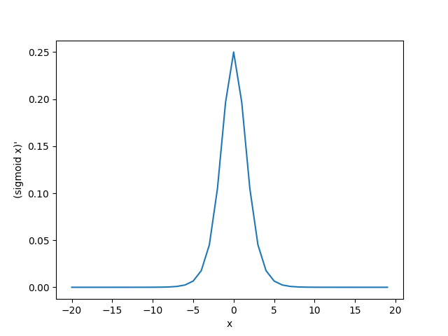

# 多层感知机

我们已经介绍了包括[线性回归](../ch1p1/linear-regression.md)和[softmax回归](../ch1p1/softmax-regression.md)在内的单层神经网络。然而深度学习主要关注多层模型。在本节中，我们将以多层感知机（multilayer perceptron，MLP）为例，介绍多层神经网络的概念。


## 隐藏层

多层感知机在单层神经网络的基础上引入了一到多个隐藏层（hidden layer）。隐藏层位于输入层和输出层之间。下图展示了一个多层感知机的神经网络图。它带有隐藏层的多层感知机。它含有一个隐藏层，该层中有5个隐藏单元。


在上图所示的多层感知机中，输入和输出个数分别为4和3，中间的隐藏层中包含了5个隐藏单元（hidden unit）。由于输入层不涉及计算，上图中的多层感知机的层数为2。可见，隐藏层中的神经元和输入层中各个输入完全连接，输出层中的神经元和隐藏层中的各个神经元也完全连接。因此，多层感知机中的隐藏层和输出层都是全连接层。

具体来说，给定一个小批量样本$\boldsymbol{X} \in \mathbb{R}^{n \times d}$，其批量大小为n，输入个数为d。假设多层感知机只有一个隐藏层，其中隐藏单元个数为h。记隐藏层的输出（也称为隐藏层变量或隐藏变量）为$\boldsymbol{H}$，有$\boldsymbol{H} \in \mathbb{R}^{n \times h}$。因为隐藏层和输出层均是全连接层，可以设隐藏层的权重参数和偏差参数分别为$\boldsymbol{W}_h \in \mathbb{R}^{d \times h}$和 $\boldsymbol{b}_h \in \mathbb{R}^{1 \times h}$，输出层的权重和偏差参数分别为$\boldsymbol{W}_o \in \mathbb{R}^{h \times q}$和$\boldsymbol{b}_o \in \mathbb{R}^{1 \times q}$。


我们先来看一种含单隐藏层的多层感知机的设计。其输出$\boldsymbol{O} \in \mathbb{R}^{n \times q}$的计算为
$$
\begin{split}\begin{aligned} \boldsymbol{H} &= \boldsymbol{X} \boldsymbol{W}_h + \boldsymbol{b}_h,\\ \boldsymbol{O} &= \boldsymbol{H} \boldsymbol{W}_o + \boldsymbol{b}_o, \end{aligned}\end{split}
$$
也就是将隐藏层的输出直接作为输出层的输入。如果将以上两个式子联立起来，可以得到
$$
\boldsymbol{O} = (\boldsymbol{X} \boldsymbol{W}_h + \boldsymbol{b}_h)\boldsymbol{W}_o + \boldsymbol{b}_o = \boldsymbol{X} \boldsymbol{W}_h\boldsymbol{W}_o + \boldsymbol{b}_h \boldsymbol{W}_o + \boldsymbol{b}_o.
$$
从联立后的式子可以看出，虽然神经网络引入了隐藏层，却依然等价于一个单层神经网络：其中输出层权重参数为$\boldsymbol{W}_h\boldsymbol{W}_o$，偏差参数为$\boldsymbol{b}_h \boldsymbol{W}_o + \boldsymbol{b}_o$。不难发现，即便再添加更多的隐藏层，以上设计依然只能与仅含输出层的单层神经网络等价。


## 激活函数

上述问题的根源在于全连接层只是对数据做仿射变换（affine transformation），而多个仿射变换的叠加仍然是一个仿射变换。解决问题的一个方法是引入非线性变换，例如对隐藏变量使用按元素运算的非线性函数进行变换，然后再作为下一个全连接层的输入。这个非线性函数被称为激活函数（activation function）。下面我们介绍几个常用的激活函数。

### ReLU函数

ReLU（rectified linear unit）函数提供了一个很简单的非线性变换。给定元素x，该函数定义为$\text{ReLU}(x) = \max(x, 0) $

可以看出，ReLU函数只保留正数元素，并将负数元素清零。为了直观地观察这一非线性变换，我们先定义一个绘图函数`xyplot`。

```python
import torch
import matplotlib.pyplot as plt

x = torch.range(-8, 8)
relu = torch.nn.ReLU()
out = relu(x)
plt.xlabel("x")
plt.plot(x, out)
plt.show()
```

下图是会上面这段代码绘制出的图形


可以看出，该函数定义为$\text{ReLU}(x) = \max(x, 0) $，在$x>0$处函数值为$x$本身。因此在$x>0$处的梯度应该是1。

接下来我们打出它的梯度：

```python
x = torch.range(-8, 8, device='cuda', requires_grad=True)
relu = torch.nn.ReLU()
out = relu(x)
out.backward(torch.ones_like(out))
plt.xlabel("x")
plt.ylabel("reLU x")
x_cpu = x.detach().cpu().numpy()
grad_cpu = x.grad.detach().cpu().numpy()
plt.plot(x_cpu, grad_cpu)
plt.show()
```

下图是代码打印出的图形：


### Sigmoid函数

sigmoid函数可以将元素的值变换到0和1之间：
$$
\text{sigmoid}(x) = \frac{1}{1 + \exp(-x)}.
$$
sigmoid函数在早期的神经网络中较为普遍，但它目前逐渐被更简单的ReLU函数取代。在后面“循环神经网络”一章中我们会介绍如何利用它值域在0到1之间这一特性来控制信息在神经网络中的流动。下面绘制了sigmoid函数。当输入接近0时，sigmoid函数接近线性变换。

我们绘制sigmoid的函数图像：

```python
import torch
import matplotlib.pyplot as plt

x = torch.range(-20, 20)
relu = torch.nn.Sigmoid()
out = relu(x)
plt.xlabel("x")
plt.ylabel("Sigmoid x")
plt.plot(x, out)
plt.show()
```

这段代码绘制的图像如下图：


依据链式法则，sigmoid函数的导数为：
$$
\text{sigmoid}'(x) = \text{sigmoid}(x)\left(1-\text{sigmoid}(x)\right)
$$
下面绘制了sigmoid函数的导数。当输入为0时，sigmoid函数的导数达到最大值0.25；当输入越偏离0时，sigmoid函数的导数越接近0。

```python
x = torch.range(-20, 20, device='cuda', requires_grad=True)
Sigmoid = torch.nn.Sigmoid()
out = relu(x)
out.backward(torch.ones_like(out))
plt.xlabel("x")
plt.ylabel("sigmoid x")
x_cpu = x.detach().cpu().numpy()
grad_cpu = x.grad.detach().cpu().numpy()
plt.plot(x_cpu, grad_cpu)
plt.show()
```




### tanh函数

tanh（双曲正切）函数可以将元素的值变换到-1和1之间：
$$
\text{tanh}(x) = \frac{1 - \exp(-2x)}{1 + \exp(-2x)}.
$$
我们接着绘制tanh函数。当输入接近0时，tanh函数接近线性变换。虽然该函数的形状和sigmoid函数的形状很像，但tanh函数在坐标系的原点上对称。

这段代码将会打印tanh的图像：

```python
import torch
import matplotlib.pyplot as plt

x = torch.range(-20, 20)
Tanh = torch.nn.Tanh()
out = Tanh(x)
plt.xlabel("x")
plt.ylabel("Tanh x")
plt.plot(x, out)
plt.show()
```


老规矩打印tanh梯度的图像：

```python
x = torch.range(-20, 20, device='cuda', requires_grad=True)
Tanh = torch.nn.Tanh()
out = Tanh(x)
out.backward(torch.ones_like(out))
plt.xlabel("x")
plt.ylabel("Tanh x")
x_cpu = x.detach().cpu().numpy()
grad_cpu = x.grad.detach().cpu().numpy()
plt.plot(x_cpu, grad_cpu)
plt.show()
```


关于激活函数的更多信息，在之后单独的一节[激活函数](./[3]activation-functions.md)中会有更多介绍。


## 回到多层感知机

多层感知机就是含有至少一个隐藏层的由全连接层组成的神经网络，且每个隐藏层的输出通过激活函数进行变换。多层感知机的层数和各隐藏层中隐藏单元个数都是超参数。以单隐藏层为例并沿用本节之前定义的符号，多层感知机按以下方式计算输出：
$$
\begin{split}\begin{aligned}
\boldsymbol{H} &= \phi(\boldsymbol{X} \boldsymbol{W}_h + \boldsymbol{b}_h),\\
\boldsymbol{O} &= \boldsymbol{H} \boldsymbol{W}_o + \boldsymbol{b}_o,
\end{aligned}\end{split}
$$
其中$\phi$表示激活函数。在分类问题中，我们可以对输出$\boldsymbol{O}$做softmax运算，并使用softmax回归中的交叉熵损失函数。 在回归问题中，我们将输出层的输出个数设为1，并将输出$\boldsymbol{O}$直接提供给线性回归中使用的平方损失函数。

## 小结

* 多层感知机在输出层与输入层之间加入了一个或多个全连接隐藏层，并通过激活函数对隐藏层输出进行变换。
* 常用的激活函数包括ReLU函数、sigmoid函数和tanh函数。