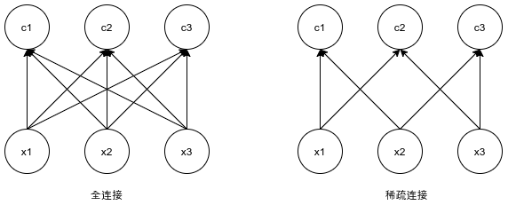
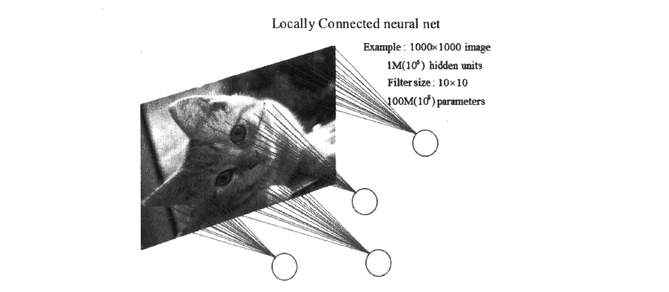

# 卷积神经网络

## 为什么使用卷积神经网络

在[“多层感知机”](../ch1/multilayer-perceptron.md)一节里我们构造了一个含单隐藏层的多层感知机模型来对Fashion-MNIST数据集中的图像进行分类。每张图像高和宽均是28像素。我们将图像中的像素逐行展开，得到长度为784的向量，并输入进全连接层中。然而，这种分类方法有一定的局限性。

1. 图像在同一列邻近的像素在这个向量中可能相距较远。它们构成的模式可能难以被模型识别。
2. 对于大尺寸的输入图像，使用全连接层容易导致模型过大。假设输入是高和宽均为1,0001,000像素的彩色照片（含3个通道）。即使全连接层输出个数仍是256，该层权重参数的形状也是3,000,000×2563,000,000×256：它占用了大约3 GB的内存或显存。这会带来过于复杂的模型和过高的存储开销。

卷积层尝试解决这两个问题。一方面，卷积层保留输入形状，使图像的像素在高和宽两个方向上的相关性均可能被有效识别；另一方面，卷积层通过滑动窗口将同一卷积核与不同位置的输入重复计算，从而避免参数尺寸过大。

卷积神经网络又称卷积网络（Convolutional Networks），是一种专门用来处理具有类似网格结构数据的伸进网络。例如图像就可以看作二维网格机构的像素数据。卷积神经网络和全连接网络都属于前馈神经网络。相较于全连接网络，卷积网络的进步是卷积层的引入和池化层的引入，这两者都是卷积神经网络的重要组成部分。卷积神经网络的名称中“卷积”一词标明了这种网络结构使用卷积（Convolution）这种数学运算。卷积是一种较为特殊的线性运算，用来代替一般的矩阵乘法运算。

本页面将大致叙述卷积本身的具体过程，并讨论在卷积神经网络中的卷积运算的三个性质：稀疏连接特性、参数共享特性、平移等变特性，最后在代码中尝试对其进行实现。

## 卷积运算

### 数学的卷积

函数$f$,$g$是定义在$R^n$上的可测函数（measueable function），$f$与$g$的卷积就记作$f*g$，它是其中一个函数翻转，并平移后，与另外一个函数的乘积的积分，是一个对平移量的函数，也就是：
$$
(f*g)(t) = \int_{R^n} f(\tau)f(\tau )g(t-\tau ) d\tau
$$
如果函数不是定义在$R^n$上的，可以吧函数定义域以外的值都规定成0，这样就变成了一个定义在$R^n$上的函数。

在[泛函分析](https://zh.wikipedia.org/wiki/泛函分析)中，**卷积**（又称**叠积**（convolution）、**褶积**或**旋积**），是透过两个[函数](https://zh.wikipedia.org/wiki/函数) *f* 和 *g* 生成第三个函数的一种数学[算子](https://zh.wikipedia.org/wiki/算子)，表征函数 *f* 与经过翻转和平移的 *g* 的乘积函数所围成的曲边梯形的面积。卷积是[数学分析](https://zh.wikipedia.org/wiki/数学分析)中一种重要的运算。设：$f(x)$、$g(x)$是$R$上的两个[可积函数](https://zh.wikipedia.org/wiki/可积函数)，作[积分](https://zh.wikipedia.org/wiki/积分)：
$$
\int_{-\infty}^{+\infty} f(\tau)f(\tau )g(x-\tau ) d\tau
$$
可以证明，关于几乎所有的$x\in (-\infty ,\infty )$，上述积分是存在的。这样，随着$x$的不同取值，这个积分就定义了一个新函数$h(x)$，称为函数$f$与$g$的卷积，$h(x)=(f*g)(x)$。我们可以轻易验证：$(f*g)(x)=(g*f)(x)$，并且$(f*g)(x)$仍为可积函数。卷积与[傅里叶变换](https://zh.wikipedia.org/wiki/傅里叶变换)有着密切的关系。例如两函数的傅里叶变换的乘积等于它们卷积后的傅里叶变换，利用此一性质，能简化傅里叶分析中的许多问题。

卷积的概念还可以推广到[数列](https://zh.wikipedia.org/wiki/数列)、[测度](https://zh.wikipedia.org/wiki/测度)以及[广义函数](https://zh.wikipedia.org/wiki/广义函数)上去。

### 互相关运算

虽然卷积层得名于卷积（convolution）运算，但我们通常在卷积层中使用更加直观的互相关（cross-correlation）运算。在二维卷积层中，一个二维输入数组和一个二维核（kernel）数组通过互相关运算输出一个二维数组。
我们用一个具体例子来解释二维互相关运算的含义。如图5.1所示，输入是一个高和宽均为3的二维数组。我们将该数组的形状记为$3 \times 3$或（3，3）。核数组的高和宽分别为2。该数组在卷积计算中又称卷积核或过滤器（filter）。卷积核窗口（又称卷积窗口）的形状取决于卷积核的高和宽，即$2 \times 2$。图5.1中的阴影部分为第一个输出元素及其计算所使用的输入和核数组元素：$0\times0+1\times1+3\times2+4\times3=19$。

在二维互相关运算中，卷积窗口从输入数组的最左上方开始，按从左往右、从上往下的顺序，依次在输入数组上滑动。当卷积窗口滑动到某一位置时，窗口中的输入子数组与核数组按元素相乘并求和，得到输出数组中相应位置的元素。上图中的输出数组高和宽分别为2，其中的4个元素由二维互相关运算得出：

$$
0\times0+1\times1+3\times2+4\times3=19,\\
1\times0+2\times1+4\times2+5\times3=25,\\
3\times0+4\times1+6\times2+7\times3=37,\\
4\times0+5\times1+7\times2+8\times3=43.\\
$$

二维卷积层将输入和卷积核做互相关运算，并加上一个标量偏差来得到输出。卷积层的模型参数包括了卷积核和标量偏差。在训练模型的时候，通常我们先对卷积核随机初始化，然后不断迭代卷积核和偏差。

## 卷积和互相关的关系

实际上，卷积运算与互相关运算类似。为了得到卷积运算的输出，我们只需将核数组左右翻转并上下翻转，再与输入数组做互相关运算。可见，卷积运算和互相关运算虽然类似，但如果它们使用相同的核数组，对于同一个输入，输出往往并不相同。

那么，你也许会好奇卷积层为何能使用互相关运算替代卷积运算。其实，在深度学习中核数组都是学出来的：卷积层无论使用互相关运算或卷积运算都不影响模型预测时的输出。为了解释这一点，假设卷积层使用互相关运算学出下图中的核数组：

设其他条件不变，使用卷积运算学出的核数组即上图中的核数组按上下、左右翻转。也就是说，上图中的输入与学出的已翻转的核数组再做卷积运算时，依然得到上图中的输出。为了与大多数深度学习文献一致，如无特别说明，提到的卷积运算均指互相关运算。

## 卷积运算的稀疏连接特性

 在全连接网络中，我们通过输入与参数空间的矩阵乘法得到了输出。在这个过程中，参数矩阵的每一个参数全部并且仅仅只描述了一个输入单元与一个输出单元的交互关系。这样做是不明智的，因为当输入的数据增多时，参数的数量也会变得巨大。

与全连接方式不同的是，卷积运算具有稀疏连接（Sparse Connectivity，或称稀疏交互）的特性。这通过将卷积核的大小限制为远小于输入的大小来达到。举个例子说明，假设某一层有$m$个输入和$n$个输出，那么做一次矩阵乘法会产生$m*n$个参数；如果我们限制每一个来自上一层的输出只连接到下一层的$k$个输入，那么稀疏的连接方法只需要$k*n$个参数。

上图是对稀疏连接的一种图形化解释过程。其中，输入单元用$xi$的形式表示，输出单元用$ci$的形式表示。在稀疏连接中，输出的元素由输入的元素经过核宽为2的卷积产生，例如$c2$仅与$x1$和$x3$产生联系。这些单元被称为$c$的感受野（Receptive Field）；在非稀疏连接时，由于c是由矩阵乘法产生的，所以所有输入都会影响$c$。

卷积运算的稀疏连接特性与感受野有关。每一张图像都存在着空间组织结构图像的一个像素点在空间上和周围的像素点实际存在着紧密的联系。比如图片中有一根黄色的相较放在白色的盘子里，我们放大这幅图片就会发现带表香蕉的像素在边缘会慢慢变白，这些像素就能当作香蕉和盘子的分界线，但是这些像素和太遥远的像素点似乎就没什么关联了。如果盘子里还有一个红色的苹果，代表苹果的像素和代表盘子的像素之间也存在着分界线，但是这条分界线和香蕉没有什么关系。这也就是所谓的计算机视觉中的感受野的概念。一般认为动物对外界的认知是从局部到全局的，每一个感受野只接收来自某一小块区域的信号，并且着一小块区域内的像素相互关联。卷积运算的稀疏连接借鉴了感受野的概念，因为图像的空间联系中局部的像素联系更加紧密，而距离较远的像素相关性则较弱，所以每一个神经元不需要接收全部的像素点的信息，只需要接收相互关联的一小块区域内的像素点座位输入即可，之后这些神经元接受到的局部信息在更高层进行综合，就可以得到全局的信息。

接下来我们通过一个例子叙述卷积运算的稀疏连接特性在减小参数量方面的巨大作用：

（稀疏连接）如图所示，如果一张图像的尺寸是$1000*1000$，并且是只有一个颜色通道的黑白图像，那么一张图片就有100万个像素点，假设局部感受野（如果你不知道感受野的大致含义，可以参考下一段）的大小（卷积核大小）是$10*10$，，并且隐藏单元有100万个，那么稀疏连接就是指每个隐藏单元只与图像中的$10*10$个像素连接，于是现在就需要$10*10*100万=1亿$个连接，也就是需要一亿个权重参数。

一亿个参数，这是在稀疏连接下的情况，听起来参数量还是很大的，但是如果将图片的100万个像素全部连接到一个相同大小的隐藏层（同样是100万个隐藏单元），也就是全连接的情况，这样会产生$100万*100万=1万亿$个连接，也就是一万亿个权重参数，相比于稀疏连接的一亿权重参数，全连接的方式将这个数字扩大了一万倍。（全连接）示意图如下：

通过稀疏连接，我们达到了减少权重参数的目的。

减少权重参数的数量有两个好处，一个是降低计算的复杂度；另一个是过多的连接会导致严重的过拟合，并且参数越多理论上为了达到某种精度所需的训练次数也越多。减少连接数可以提升模型的泛化能力。

我们通过卷积的稀疏连接特性将一万亿参数降低到了一亿，但是这听上去依然很大，仍然需要继续降低参数量，这就需要用到卷积运算的下一个特性——参数共享特性。

## 卷积运算的参数共享特性

参数共享是指相同的参数被用在一个模型的多个函数中。在全连神经网络中，计算每一层的结果时，权重矩阵中的每一个元素只使用了一次。然而在卷积神经网络中，核的每一个元素会作用在输入的每一位置上。例如：

卷积核元素万会与输入数据a、b、c、d、f、g、i和j都产生运算关系(也可以使边界元素参与运算，这取决于是否对边界采用填充)。

直观上，**很多情况下卷积运算的参数共享特性表现为卷积核在整个特征图上移动，而不是在每个位置都放一个卷积核**。

**卷积运算中的参数共享特性也会显著降低参数的数量**，相比于全连接方式中每个神经元都要学习一个单独的参数以及稀疏连接特性中每个神经元对应了一个区域中的全部像素而言，在卷积运算中，我们在每一层只使用一个神经元（卷积核）。也就是每层卷积运算只需要一个卷积核大小的参数量。

上图中每一个隐藏单元都与图像中$10*10$ 的像素相连，也就是每一个隐藏单元都拥有独立的100 个参数。假设隐藏单元是由卷积运算得到，那么每一个隐藏单元的参数都完全一样(都是卷积核中的参数)，这样的话，权重参数不再是1亿，而是100，数量又发生了显著的降低，并且无论隐藏单元有多少个或者图像有多大，始终都是这$10*10=100$个权重参数，这就是所谓的权值共享。

上图中，根据参数是否共享，将模型输入与输出之间的关系用实线和虚线的箭头来表示。在使用参数共享的卷积模型中，实线箭头表示对3元素核的中间元素的使用，因为参数共享，这个参数被用于所有的输入。在没有使用参数共享的全连模型中，这个单独的实线箭头表示权重矩阵中的参数仅仅在输入与输出间被使用了一次(实线箭头只出现了一次)。

**但是请注意，参数共享并不会直接改变前向传播的运行时间**，它只是显著地把需要储存的权重参数显著降低到了k（k的计算与卷积核的大小和卷积核的深度有关）个。

**得益于稀疏连接和参数共享特性，卷积运算在储存需求和统计效率方面相较于全连接的稠密矩阵的乘法运算具有极大的优势，一般情况下参数量会少几个数量级**。

## 卷积运算的平移等变特性

**等变(Equivariance) 在数学中是指某个函数具有这样的一个性质：当输入改变，输出也以同样的方式改变**。例如，对于一个函数$f(x)$，如果存在一个函数$g(x)$使得$f(x)$满足$f(g(x))= g(f(x))$，我们就说$f(x)$对于变$g$具有等变性。

**针对卷积操作，参数共享的机制使得神经网络对输入的平移具有等变的性质**。具体地说，如果令函数$g$完成对卷积操作的输入进行任意的平移，那么卷积函数对于$g$具有等变性。举个例子，用I表示一个图像矩阵中的所有数据，其坐标可以用$(x,y)$来表示，用$g$表示一个对图像进行像素平移变换的函数，$I$经过$g$之后的结果是$I'$，即$I'=g(I)$，现在假设$I'(x,y)=I(x-2,y)$，即函数$g$把$I$中的每个像素向右移动两个像素单位(两个像素单位的移动在实际的照片中几乎.是没有视觉效果的，我们也可以假设移动了10 个或者100个像素单位)。**平移等变指的就是，先对$I$进行这种平移变换然后再进行卷积操作所得到的结果与先对$I$进行卷积然后再对卷积的结果使用函数$g$进行平移变换所得到的最终结果是一样的**。

卷积的平移等变是一个很有用的性质。当处理图像数据时，这意味着卷积产生了一个二维映射来表明输入中某些存在的特征，如果我们移动输入中的某些对象，平移等变就意味着在输出中特征也会进行一定的移动。**参数共享是实现平移等变的一个前提条件**。**对整个图像进行参数共享是很有用的，例如对输入的图像使用卷积操作进行边缘检测时，某一物体的边缘像素会分布在图像的各处，如果多个卷积核使用了不同的参数来处理多个输入的位置，那么会导致边缘检测效率的降低**。

**当然，在某些情况下，或许不希望对整幅图进行参数共享，这发生在我们想对图像提取更多特征的时候**。例如，对于一张包含人脸的图像，我们可能想要提取不同位置.上的不同特征(提取眼睛特征的卷积核和提取嘴巴特征的卷积核不会出现参数完全一致的情况)。使用多卷积核能够完成多特征提取的任务，这部分内容放到了下一小节。

**需要注意的是，除了平移之外，卷积操作对于其他的一些变换并不是天然等变的**，例如图像的缩放或者旋转，处理这些变化还需要一些其他的机制。

## 多卷积核

一张完整的图像是由多个像素点构成的，通过将图像进行足够的放大，可以对图像进行像素级别的观察。在观察图像像素级构成的过程中，我们会发现这些像素组成了图像中的基本特征一点、线和面。

上图是一张简单的图片，其中包含一个实心正方形和一个圆环。之所以称之为简单，是因为我们很容易辨认出图像中包含什么。接下来我们将上图中的一部分放大：

上图展示了右侧的圆环经过多级放大之后的一些局部信息，中间颜色较深，边缘颜色较浅。从图中我们能明显地看出有很多像素点连成的线，这些线堆叠在一起构成了-部分圆边；对于圆环的其他部分，情况也是类似的。我们大概能想象出这些线组成一个圆环的样子。

**对于更大更复杂的图像，将其放大之后都会发现图像中的物体由点、线和面组成。所以我们可以粗浅地认为，这些就是图像中的基本特征。**

**人眼识别物体的方式也是从点、线和面开始**，视觉神经元接受光信号后，每一个神经元只接受一个区域的信号，并提取出点和线的特征；**然后将点和线的信号传递到后面一层的神经元再组合成高阶的特征**，比如直线、拐角等；**再继续抽象组合，得到一些形状**，比如正方形、圆形等；**之后再继续抽象组合，得到人脸中的眼睛、鼻子和嘴等五官**；将这些组合得到的五官组成一张脸，就完成了生物识别的过程。

**使用卷积核的目的也是在于对图中基本特征(上述点、线和面)的提取**。**如果我们只有一个卷积核，那就只能提取一种卷积核滤波的结果，即只能提取图片中的某一个特征(如特定朝向的边)**。尽管图像中最基本的特征很少，但是很多情况下( 如图像是彩色的，或者图像中的物体组成不是那么的直观简单)**我们依然希望多提取一些特征，这可以通过增加卷积核的数量来完成**。这样，机器学习中特征提取的问题就很好解决了，**只要提供的卷积核数量足够多，就能获取数量足够多的基本特征(如不同朝向的边，不同形态的点)，进而让卷积层抽象出有效而丰富的高阶特征**。图像经过卷积核进行卷积运算之后得到的是一类特征的映射，即一个Feature Map (特征图)。对于大型的图片来说(如ImageNet中的图像)，一些现代的卷积神经网络会放置100 个左右的卷积核进行第一轮的特征提取。

如上图所示，你可以暂时粗浅地将多卷积核理解为一些卷积核排着队卷积，每个人都卷一下子，然后站回到队伍里，所以你最后会得到一堆卷积核而不是一个，这一个卷积核就表示了更多的特征。

## 卷积和滤波

在TensorFlow官方文档中将卷积核称为“过滤器(Filer) ”，卷积操作称为“滤波操作”，因为它们本就是表达了一个意思。

产生一个卷积层所需要的过滤器的长和宽都是在编写代码时人工指定的，较常用的过滤器长宽尺寸有3x3或5x5。上面所讲述的多卷积核通常称为过滤器的深度，过滤器的深度指的是卷积核的数量，这也是需要人工指定的参数。另外一种理解过滤器深度的方式是将其看作经过卷积运算后输出数据矩阵的深度。比如刚才的那张卷积核排队的图片，左侧图片中的小矩形的尺寸为过滤器的尺寸，而右侧矩阵的深度就是过滤器的深度(深度为100)，这个矩阵由图像经过多个不同的滤波器滤波并堆叠得到。