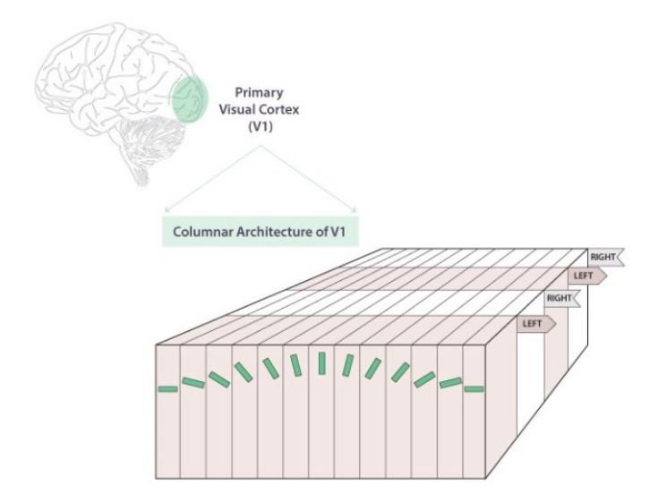

# 胡贝尔和威塞尔的猫

在之前的章节中我们大致了解了卷积神经网络的基本要素和优势，接下来我们将浏览一份研究，通过这篇文章你将对卷积神经网络的仿生方式有简单的了解。

Dr. Hubel 和 Dr. Wiesel 在视觉系统和视觉处理方面的突破性发现让他们获得了 1981 年的诺贝尔生理学或医学奖。后人这样评价他们的贡献：

> David Hubel and Torsten Wiesel provided a quantum step in our understanding of the visual system.

在这里我们要简要了解的工作是 Receptive fields of single neurons in the cat's striate cortex（doi: [10.1113/jphysiol.1959.sp006308](https://dx.doi.org/10.1113%2Fjphysiol.1959.sp006308)）。

## 两位博士对猫视觉皮层的实验

卷积神经网络适合处理视觉任务并不是偶然被发现的。卷积神经网络设计的灵感可以追溯到获得诺贝尔奖的科学家 Hubel 博士和 Wiesel 博士，他们展示了大脑中视觉皮层的一些工作方式。

他们的实验是这样设计的：

上图：这份实验的设计示意。他们在一只部分麻醉的猫的视觉皮层中插入了微电极，并在其视网膜上移动了一条亮线。在这个实验中，他们注意到了以下现象：

1. 当线位于视网膜上的特定位置时，神经元就会激活。 
2. 神经元的活动根据线的方向而变化。 
3. 神经元有时仅在线路沿特定方向移动时才会触发。

这个经典的实验展示了视觉皮层如何以分层的方式处理信息，提取越来越复杂的信息。他们发现，

## 视觉皮层与CNN

在上述实验中研究者发现，视觉皮层在运作时会产生一个代表视野的激活图，每个神经元处理来自附近视野的信息。 这在 CNN 中对应着稀疏交互的概念，其中网络专注于本地信息（local information）而不是获取完整的全局信息（global information）。 这一特性使 CNN 在与图像相关的任务中提供了最先进的性能，因为在大脑皮层处理图像的过程中，附近像素的相关性比远处像素的相关性更强。

此外，他们的工作还确定了视觉皮层中的神经元以某种特定的精确结构顺序排列。 具有相似功能的细胞分布在列上，将信息送入更高层的感受区域。 这类似于 CNN 架构的设计方式，其中较低层提取边缘和其他共同特征，较高层提取更多特定语义信息。 总之，他们的工作揭示了视觉皮层神经元如何编码图像特征以及如何帮助我们建立对周围物体基本特征的感知。

模仿视觉皮层感知方式设计的卷积神经网络与全连接层相比，具有三个基本优势：

1. 它们的连接是稀疏的，而不是完全连接。这直接导致参数量急剧减少，使 CNN 高效处理高维数据。
2. 卷积神经网络是权重共享的。共享发生在整个图像上。这使得参数内存开销降低，并使卷积神经网络表现出平移等变的特性。
3. 卷积神经网络使用下采样（或池化）来对最突出的像素进行子采样或汇集（例如，子最大池化采样的是“更突出的”像素）。突出的像素被传播到下一层，然后丢弃其余的像素。这个特性对图像的移动和旋转是等变的。

## 暂时断更，文献太多翻不完了。有空一定