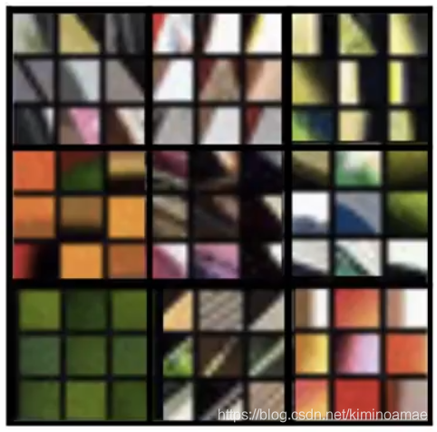

# 风格迁移

## 什么叫做风格迁移？

我们用一张图来表现风格迁移

比如右边的部分，我们有两张图。我们把要改变风格的**原图称为Content(记为C)**，要**提取风格的图片称为Style(记为S)**,在经过风格迁移处理后**获得了融合风格图片Generated image(记为G)**

**将一张图片的主要内容，借用另一张图像的风格展示，这就是风格迁移。**

## 深度卷积网络究竟在学习什么？

我们知道卷积神经网络时如何构造出来的，但是我们并不明白，他在每一个隐藏层中，到底在提取什么？

对每一个隐藏单元来说，他都会**提取图片的重要特征**。但是，什么才叫图片的重要特征呢？专业一些，那就是图像中的**某个部分最大程度地激活了我们的隐藏层，这样的部分，我们称为图片的重要特征。**

以一个五层的卷积网络为例

**在第一层中**，我们的隐藏层要找到最大激活他的部分，一般是**图像中的边缘区域，阴影区域**，因此，第一层中通常会提取图像的边缘或阴影。可以是纵向、横向、甚至是不同方向的边缘，阴影可以是各种颜色的阴影。正如下图：

我们都知道，每个隐藏层提取的特征，都基于上层输出的样本。因此，在第二层中提取的特征是基于第一层的，在第二层中，就要寻找这些边缘，什么部分能够最大激活我们的隐藏层，从而使我们提取的特征变得不断的详细起来。一般**第二层会提取出边缘的组合**，最后**提取出图片更复杂的形状和模式**，比如垂直图案，细线图案，原形图案等等。

接着第三层，在基于第二层的基础上继续抽取。如果我们说前两层抽取的只是抽象图案，那么后面抽取的就是**图像中的具体部分**。从这里开始，我们通过对第二层图案的抽取，**渐渐会构成图案中的一部分**。如果图片是人，他可能会提取出人的手，眼睛，鼻子，如果图片是汽车，那么他可能提取出车子的车轮等等。

到了第四，第五层我们抽取的特征会**逐渐拥有更复杂的形状和模式**，**逐渐构造成一个个体**，最后我们抽取出的关键有用的特征数据，将成为我们对其进行分类的依据。

第四层

第五层

## 代价函数

要判断风格迁移的好坏程度，我们需要一个评估指标，即需要一个**关于G（风格迁移图像）代价函数**来评估迁移的好坏，我们可以这么定义这个函数：

$$J(G) = \alpha J_{content}(C,G) + \beta J_{style}(S,G)$$

我们需要将C和G的差异与S与G的差异关联起来，通过两个权重赋值，最后得出我们的代价函数J(G)来判断我们迁移的成果，当然，我们不可能一次就迁移成果，这个调参的过程还是需要用到我们的反向传播和更细参数，使我们的J(G)下降到最小

这个代价函数由**内容代价函数组分**和**风格代价函数组分**构成

算法的具体过程：

**1. 先随机初始化生成图像G，他可能是100x100x3的一张RGB图像，因为是随机生成的
他会是一张白噪图像**

**2. 使用梯度下降法来最小化我们的代价函数J(G)**

$$G=G-\frac{d}{dG} J(G)$$

举个例子来模拟他演变的过程：

现在我们要对这两张图片进行风格迁移：

先对G进行随机初始化获得白噪图片:

接着我们开始进行风格迁移，和更细迁移方式，过程如下：

## 内容代价函数

我们一般使用在卷积网络后计算我们的内容代价函数。

我们使用$a^{[l][C]}$来表示C的激活值，用$a^{[l][G]}$来表示G的激活值，如果他们的不同程度很低，我们就说这两张图片在内容上很相似。

于是我们定义的**内容代价函数为**:

$$J_{content}(C,G) = \frac 12 ||a^{[l][C]} - a^{[l][G]}||^2$$

这前面的$\frac 12$代表正则项，其实不加也可以

## 风格代价函数

图片的风格贯穿在一张图片中，因此，无论我们做怎样的变换，图片的风格始终保存在我们的卷积块中，但是，我们很难理解**图片的风格到底是什么**。

我们从卷积网络中的任意一个卷积块取出来，假设他有5个通道，我们所说的风格，就是**每一通道之间的关系**，为了让机器处理这种风格，我们得找出**任意两个通道之间的相关系数**

我们的目的就是**通过找出风格图片与生成图片之间对应的相关系数之间的差异**，来作为我们风格的代价函数。

于是我们引入了**风格矩阵（style matrix）**，他用来存放他们各自的相关系数

假设我们用第l层来测量分格，我们用i,j,k（高，宽，通道）来定义我们参数所表示的位置，因为我们是寻找通道与通道之间的关系，自然是要用一个通道和其他通道进行对比，于是我们的风格矩阵的维度应该是$n_c$x$n_c$(n_c是通道数量)

于是对于一个通道(k)与另一通道(k1)之间的相关系数，我们用$G_{kk1}^{[l][s]}$来表示，然后计算两条通道对应的i,k位置的乘积，然后将这些乘积相加起来，就能获得我们的相关系数。下面的式子就表示**对风格图像的k通道与k1通道之间的相关系数：**

$$G_{kk1}^{[l][S]} = \sum_{i=1}^{n_h^{[l]}}\sum_{j=1}^{n_w^{[l]}}a_{ijk}^{[l]}a_{ijk1}^{[l]}$$

**对于合成图像的任意k通道与k1通道之间的相关系数为：**
$$G_{kk1}^{[l][G]} = \sum_{i=1}^{n_h^{[l]}}\sum_{j=1}^{n_w^{[l]}}a_{ijk}^{[l]}a_{ijk1}^{[l]}$$

于是我们现在可以定义我们的**风格代价函数**为：

$$J^{[l]}_{style}(S,G) = \frac 1{2n_H^{[l]}n_W^{[l]}n_C^{[l]}}||G^{[l][S]}-G^{[l][G]}||_F^2 = \frac 1{2n_H^{[l]}n_W^{[l]}n_C^{[l]}}\sum_k\sum_{k1}(G^{[l][S]}_{kk1} - G^{[l][G]}_{kk1})$$

这里的$\frac 1{2n_H^{[l]}n_W^{[l]}n_C^{[l]}}$表示正则项，我么可以无视掉，或者直接使用一个$\beta$替换

通常如果**对每一个隐藏层都计算风格代价函数**，那么我们最终的风格代价函数可以这么定义：

$$J^{[l]}_{style}(S,G) = \sum_l\lambda^{[l]}J^{[L]}_{style}(S,G)$$

这使得我们网络**同时考虑低级和高级特征的相关系数**

**经过内容代价函数和风格代价函数的定义，我们最终获得代价函数应该表示为**

$$J(G) = \alpha J_{content}(C,G) + \beta J_{style}(S,G)$$