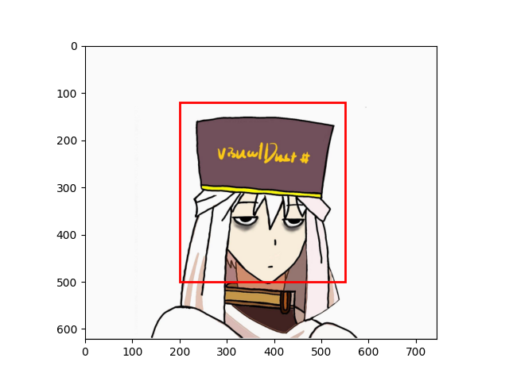

# 目标检测中的边界框和锚框

在前面的一些章节（如[“深度卷积神经网络（AlexNet）”](https://zh.d2l.ai/chapter_convolutional-neural-networks/alexnet.html)一节至[“含并行连结的网络（GoogLeNet）”](https://zh.d2l.ai/chapter_convolutional-neural-networks/googlenet.html)一节）中我们介绍了诸多用于图像分类的模型。**在图像分类任务里，我们假设图像里只有一个主体目标，并关注如何识别该目标的类别**。然而，**很多时候图像里有多个我们感兴趣的目标，我们不仅想知道它们的类别，还想得到它们在图像中的具体位置**。在计算机视觉里，**我们将这类任务称为目标检测（target detection）或物体检测（object detection）**。

目标检测在多个领域中被广泛使用。例如，在无人驾驶里，我们需要通过识别拍摄到的视频图像里的车辆、行人、道路和障碍的位置来规划行进线路。机器人也常通过该任务来检测感兴趣的目标。安防领域则需要检测异常目标，如歹徒或者炸弹。

在接下来的[“锚框”](https://zh.d2l.ai/chapter_computer-vision/anchor.html)一节至[“区域卷积神经网络（R-CNN）系列”](https://zh.d2l.ai/chapter_computer-vision/rcnn.html)一节里，我们将介绍目标检测里的多个深度学习模型。**在此之前，让我们来了解目标位置这个概念**。

## 边界框

先导入需要的包，并读取一张图片。

```python
import matplotlib.pyplot as plt
import cv2
image = "/home/visualdust/Pictures/visualdust.png"
image = cv2.imread(image)
image = cv2.cvtColor(image,cv2.COLOR_BGR2RGB)
plt.imshow(image)
plt.show()
```

于是我们读取并显示了一张工具箱的照片：


现在我们接到了一个任务：在这幅图片里将工具箱的头使用红色的框框起来。

**在目标检测里，我们通常使用边界框（bounding box）来描述目标位置**。边界框是一个矩形框，可以由矩形左上角的$x$和$y$轴坐标与右下角的$x$和$y$轴坐标确定。我们根据上面的图的坐标信息来定义图中工具箱头部位置的边界框。图中的坐标原点在图像的左上角，原点往右和往下分别为$x$轴和$y$轴的正方向。

```python
# bbox是bounding box的缩写
bbox = [200, 120, 550, 500]
```

我们可以在图中将边界框画出来，以检查其是否准确。我们使用`matplotlib.pyplot.Rectangle()`画出一个矩形框。由于这个函数需要的参数并不是框的对角，而是左上角和长宽。所以我们定义一个辅助函数`bbox_into_plt`。它将边界框表示成matplotlib的边界框格式：

```python
def bbox_to_rect(bbox, color='red'):
    # 将边界框(左上x, 左上y, 右下x, 右下y)格式转换成matplotlib格式：
    # ((左上x, 左上y), 宽, 高)
    return plt.Rectangle(
        xy=(bbox[0], bbox[1]), width=bbox[2] - bbox[0], height=bbox[3] - bbox[1],
        fill=False, edgecolor=color, linewidth=2)
```

接下来我们试着画出这个框：

```python
plt.imshow(image)
plt.gca().add_patch(bbox_to_rect(bbox))
plt.show()
```



以上就是关于边界框的全部内容。没错，只有这些。边界框如其名，的确只是边界框。


## 锚框

目标检测算法通常会在输入图像中采样大量的区域，然后判断这些区域中是否包含我们感兴趣的目标，并调整区域边缘从而更准确地预测目标的**真实边界框（ground-truth bounding box）**。不同的模型使用的区域采样方法可能不同。这里我们介绍其中的一种方法：它以每个像素为中心生成多个大小和宽高比（aspect ratio）不同的边界框。这些边界框被称为**锚框（anchor box）**。我们将在[“单发多框检测（SSD）”](https://zh.d2l.ai/chapter_computer-vision/ssd.html)一节基于锚框实践目标检测。

首先，导入本节需要的包或模块。这里我们新引入了`contrib`包，并修改了NumPy的打印精度。由于`NDArray`的打印实际调用NumPy的打印函数，本节打印出的`NDArray`中的浮点数更简洁一些。

假设输入图像高为$h$，宽为$w$。我们分别以图像的每个像素为中心生成不同形状的锚框。设大小为$s\in(0,1]$且宽高比为$r>0$，那么锚框的宽和高将分别为$ws\sqrt r$和$hs\sqrt r$。当中心位置给定时，已知宽和高的锚框是确定的。

下面我们分别设定好一组大小$s1,…,sn$和一组宽高比$r1,…,rm$。如果以每个像素为中心时使用所有的大小与宽高比的组合，输入图像将一共得到$whnm$个锚框。虽然这些锚框可能覆盖了所有的真实边界框，但计算复杂度容易过高。因此，我们通常只对包含$s1$或$r1$的大小与宽高比的组合感兴趣，即
$$
(s_1, r_1), (s_1, r_2), \ldots, (s_1, r_m), (s_2, r_1), (s_3, r_1), \ldots, (s_n, r_1).
$$
也就是说，以相同像素为中心的锚框的数量为$n+m−1$。对于整个输入图像，我们将一共生成$wh(n+m−1)$个锚框。


## 总结

边界框和锚框是目标检测算法和一些二阶段的分割网络实际使用的技术。请务必熟悉它们。