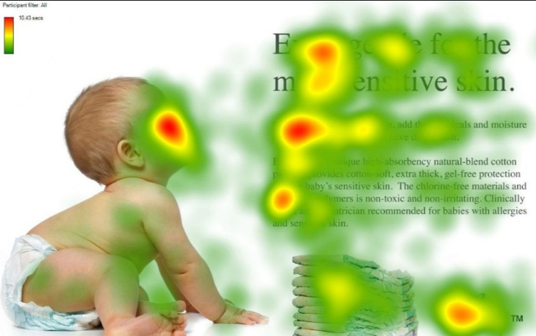

# 注意力机制

注意力机制在很多AI领域内得到了成功的应用。这是人工神经网络在模仿人类进行决策过程的重要发展。

> In humans, Attention is a core property of all perceptual and cognitive operations. Given our limited ability to process competing sources, attention mechanisms select, modulate, and focus on the information most relevant to behavior.

这段文字摘自Alana de Santana Correia, and Esther Luna Colombini的论文 [ATTENTION, PLEASE ! A SURVEY OF NEURAL ATTENTION MODELS IN DEEP LEARNING](https://arxiv.org/abs/2103.16775)。你应该注意到了，在你的视野中，只有一部分区域是很清晰的。对于视野周围的场景，你往往需要转转眼珠，把视野朝向它，才能完全看清。或者，你还发现，比起历史老师开始强调重点，你似乎对下课铃声的响起更加敏感——这就是注意力。你所处的环境包含着远超你的处理能力的信息，而注意力机制让你的大脑集中精力处理你视野中心的场景，或是你“更应该”关心的事物。

Attention机制听上去是一个很高大上的词汇，实际上，Attention在不经意间就会被使用。例如，循环神经网络中每一步计算都依赖于上一步计算结果的过程就可以被视为一种Attention：在 Attention 机制引入之前，有一个问题大家一直很苦恼：长距离的信息会被弱化，就好像记忆能力弱的人，记不住过去的事情是一样的。

如上图，在处理序列的循环神经网咯中，Attention的功能是关注重点，就算文本比较长，也能从中间抓住重点，不丢失重要的信息。上图中红色的预期就是被挑出来的重点。

## 介绍

Attention机制最早是应用于图像领域，九几年就提出来的思想。在2014年，Google Mind团队发表的论文[Recurrent Models of Visual Attention](https://arxiv.org/abs/1406.6247)使Attention机制开始火了起来，该论文提出在RNN模型上使用Attention机制来进行图像分类，结果取得了很好的性能。随后，在Bahdanau等人发表论文[Neural Machine Translation by Jointly Learning to Align and Translate](https://arxiv.org/abs/1409.0473)中提出在机器翻译任务上使用Attention机制将翻译和对齐同时进行，他们的工作是第一个将Attention机制应用在NLP领域中的。接着，在Xu等人发表的论文[Show, Attend and Tell: Neural Image Caption Generation with Visual Attention](https://arxiv.org/abs/1502.03044)中，成功的将Attention机制应用在Image Caption领域。从此，Attention机制就被广泛应用在基于RNN神经网络模型的各种深度学习任务中。随后，如何在CNN中使用Attention机制也成为研究的热点。2017年，Google发表的论文[Attention is All You Need](https://arxiv.org/abs/1706.03762)中提出在机器翻译上大量使用自注意力（self-attention）机制来学习文本表示。2018 年[BERT: Pre-training of Deep Bidirectional Transformers for Language Understanding](https://arxiv.org/abs/1810.04805)和GPT的效果出奇的好，进而走红。而Transformer和 Attention 这些核心开始被大家重点关注。

Attention具有以下三大优点：

- 参数少

- 速度快

- 效果好

## Attention的基本理解

Attention机制如果浅层的理解，跟他的名字非常匹配。他的核心逻辑就是**从关注全部到关注重点**。在认知科学中，由于信息处理的瓶颈，人类会选择性地关注所有信息的一部分，同时忽略其他信息。同理，当神经网络处理大量的信息输入时，快速聚焦其中一些关键信息来进行处理，这便是注意力机制。

### 不同类型的Attention

根据类型的不同，Attention可以被分为：

- 显著性（Saliency-Based）注意力：自下而上的无意识的注意力。

  在很常见的卷积神经网络和循环神经网络中，可以将 **池化（`max pooling`）、门控（`Gating`）** 近似看作是自下而上的基于显著性的注意力机制。自下而上的意思是，这种注意力不需要策略和判断，也不需要经过学习，所以是无意识的。

- 聚焦式（Focus）注意力：自上而下的有意识的注意力。

  这种注意力是需要设计或是经过学习才能产生的，所以称为自上而下的，或称为有意识的。在这一节我们主要对这种自上而下的注意力进行了解。

## 计算机视觉中的一种Attention

Attention机制在很多领域内都取得了不错的效果。接下来我们对计算机视觉领域内的注意力机制进行讨论。

#### 注意力分布

求注意力分布也就是为了实现选择关键的信息来进行处理。或者说，注意力分布就是关键信息的分布。

例如，人第一眼看到上面的图片，会不自觉地先看到红色的区域。上图中红色到绿色构成的mask就是注意力分布了。

注意力机制的一种可能的流程是这样的可以通过这样的两个步骤实现：

1. 在所有输入信息上计算注意力分布
2. 根据注意力分布计算输入信息的加权和，以此选择关键信息

也就是说，我们设计注意力模块产生注意力（分布），然后让注意力通过某种方式作用于输入，形成更加有效的信息。

为了从输入中选择出和某个特定任务相关的信息，我们需要引入一个和任务相关的表示，称为**查询向量**(Query Vector)，并通过一个**打分函数**来计算**每个输入向量和查询向量之间的相关性**。

#### 查询向量和打分函数

查询向量是一个滤波或变换，用于在输入中筛选出更有用的信息；打分函数是一个用于计算输入和查询向量的

为了实现选择关键的信息来进行处理，我们引入了一个与任务相关的查询向量$Q$，并且使用一个打分函数来计算不同信息向量与查询向量的相关性。

查询向量通过线性变换得到：
$$
Q = W_{Q}X
$$
对于键值对模型：
$$
K = W_{K}X\\
V = W_{V}X
$$
常见的打分函数有：

- 加性模型：$v^{T}tanh(W_{x_i}+Uq)$，其中$W$、$U$、$v$是可训练的参数。
- 点积模型：$x_{i}^{T}q$，点积模型相较于加性模型效率更高。
- 缩放点积模型：$\frac{x_{i}^{T}q}{\sqrt{d}}$，其中$d$为输入输入向量的维度。当输入向量维度过高，点积模型通常有较大的方差，从而导致softmax函数梯度较小，而缩放点积模型可以很好地解决这个问题。
- 双线性模型：$x_{i}^{T}Wq$，双线性模型可以看作一种更泛化的点积模型，引入了非对称性。

## 不同形式的Attention

根据计算区域的不同，Attention可以被分为：

### 软注意力（**Soft** Attention）

这是比较常见的Attention方式，对所有key求权重概率，每个key都有一个对应的权重，是一种全局的计算方式（也可以叫Global Attention）。这种方式比较理性，参考了所有key的内容，再进行加权。但是计算量可能会比较大一些。

给定一个和任务相关的查询向量$q$，我们用 **注意力变量**$z\in [1,N]$来表示被选择信息的索引位置，即$z=i$表示选择了第$i$个输入向量。这里采用`Soft Attention`的方式，即计算在给定$q$和$X$下，选择第$i$个输入向量的概率$\alpha_{i}$：
$$
${\alpha}_{i}=p(z=i|X,q)\\
=softmax(s(s_{i},q))\\
=\frac{exp(s(x_{i},q))}{}
$$

### 硬注意力（**Hard** Attention）

这种方式是直接精准定位到某个key，其余key就都不管了，相当于这个key的概率是1，其余key的概率全部是0。因此这种对齐方式要求很高，要求一步到位，如果没有正确对齐，会带来很大的影响。另一方面，因为不可导，一般需要用强化学习的方法进行训练。（或者使用gumbel softmax之类的）

### 局部注意力（**Local** Attention）

这种方式其实是以上两种方式的一个折中，对一个窗口区域进行计算。先用Hard方式定位到某个地方，以这个点为中心可以得到一个窗口区域，在这个小区域内用Soft方式来算Attention。
