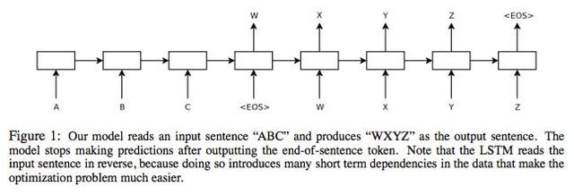

# 编码器-解码器

编码器-解码器（Encoder-Decoder）是深度学习中非常常见的一个模型框架，比如无监督算法的auto-encoding就是用编码-解码的结构设计并训练的；比如这两年比较热的image caption的应用，就是CNN-RNN的编码-解码框架；再比如神经网络机器翻译NMT模型，往往就是LSTM-LSTM的编码-解码框架。因此，准确的说，Encoder-Decoder并不是一个具体的模型，而是一类框架。Encoder和Decoder部分可以是任意的文字，语音，图像，视频数据，模型可以采用CNN，RNN，BiRNN、LSTM、GRU等等。所以基于Encoder-Decoder，我们可以设计出各种各样的应用算法。

Encoder-Decoder框架有一个最显著的特征就是它是一个End-to-End学习的算法；本文将以文本-文本的例子作为介绍，这样的模型往往用在机器翻译中，比如将法语翻译成英语。这样的模型也被叫做 Sequence to Sequence learning。所谓编码，就是将输入序列转化成一个固定长度的向量；解码，就是将之前生成的固定向量再转化成输出序列。

这里复习下Sequence2Sequence任务到底是什么，所谓的Sequence2Sequence任务主要是泛指一些Sequence到Sequence的映射问题，Sequence在这里可以理解为一个字符串序列，当我们在给定一个字符串序列后，希望得到与之对应的另一个字符串序列（如 翻译后的、如语义上对应的）时，这个任务就可以称为Sequence2Sequence了。

如果用人的思维来看，就是我们先看到源Sequence，将其读一遍，然后在我们大脑当中就记住了这个源Sequence，并且存在大脑的某一个位置上，形成我们自己的记忆（对应Context），然后我们再经过思考，将这个大脑里的东西转变成输出，然后写下来。在现在的深度学习领域当中，通常的做法是将输入的源Sequence编码到一个中间的context当中，这个context是一个特定长度的编码（可以理解为一个向量），然后再通过这个context还原成一个输出的目标Sequence。

例如，下图是典型的文本处理中经常出现的Encoder-Decoder结构。

文本处理领域的Encoder-Decoder框架可以这么直观地去理解：可以把把一个句子（或篇章）生成另外一个句子（或篇章）的通用处理模型。和上图所示的一样，Encoder接收序列输入（Source）并编码为语义编码$c$，在这之后Decoder接收语义编码将其解码为目标序列（Target）。如果Source是中文句子，Target是英文句子，那么这就是解决机器翻译问题的Encoder-Decoder框架；如果Source是一篇文章，Target是概括性的几句描述语句，那么这是文本摘要的Encoder-Decoder框架；如果Source是一句问句，Target是一句回答，那么这是问答系统或者对话机器人的Encoder-Decoder框架；如果Source是一副图片，Target是能够描述图片语义内容的一句描述语，那么这是图片描述的Encoder-Decoder框架。

可见，Encoder-Decoder结构的应用非常广泛。在不同的领域中，一般而言，文本处理和语音识别的Encoder部分通常采用RNN模型，图像处理的Encoder一般采用CNN模型。

Encoder-Decoder不是一种模型，而是一种框架，一种处理问题的思路，最早应用于机器翻译领域，输入一个序列，输出另外一个序列。机器翻译问题就是将一种语言序列转换成另外一种语言序列，将该技术扩展到其他领域，比如输入序列可以是文字，语音，图像，视频，输出序列可以是文字，图像，可以解决很多别的类型的问题。这一大类问题就是上图中的sequence-to-sequence问题。这里以输入为文本，输出也为文本作为例子进行介绍：

encoder部分是将输入序列表示成一个带有语义的向量，使用最广泛的表示技术是Recurrent Neural Network，RNN是一个基本模型，在训练的时候会遇到梯度爆炸（gradient explode）或者梯度消失（gradient vanishing）的问题，导致无法训练，所以在实际中经常使用的是经过改良的LSTM RNN或者GRU RNN对输入序列进行表示，更加复杂一点可以用BiRNN、BiRNN with LSTM、BiRNN with GRU、多层RNN等模型来表示，输入序列最终表示为最后一个word的hidden state vector。

decoder部分是以encoder生成的hidden state vector作为输入“解码”出目标文本序列，本质上是一个语言模型，最常见的是用Recurrent Neural Network Language Model (RNNLM)，只要涉及到RNN就会有训练的问题，也就需要用LSTM、GRU和一些高级的model来代替。目标序列的生成和LM做句子生成的过程类似，只是说计算条件概率时需要考虑encoder向量。

这里，每一种模型几乎都可以出一篇paper，尤其是在这个技术刚刚开始应用在各个领域中的时候，大家通过尝试不同的模型组合，得到state-of-the-art结果。
