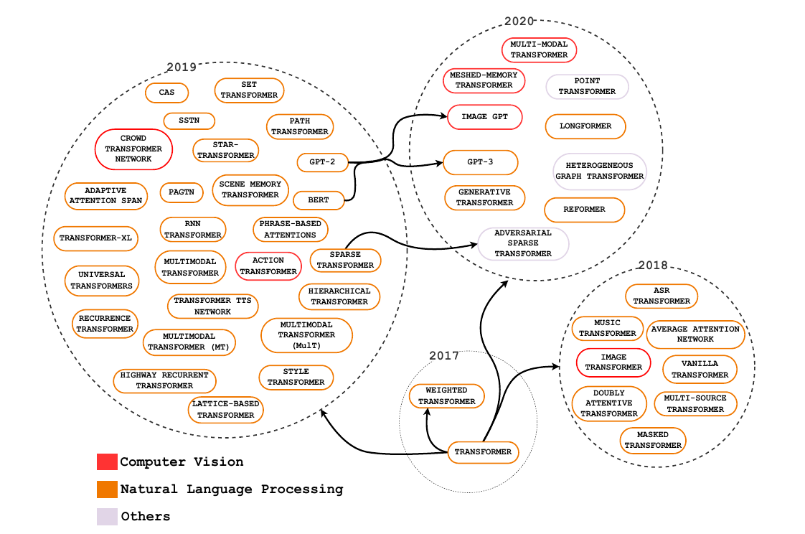
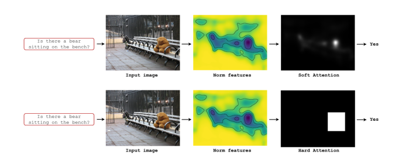
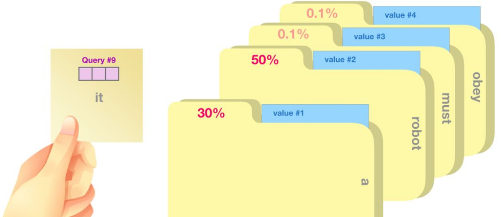
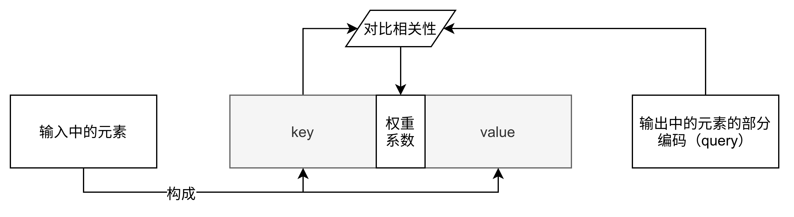
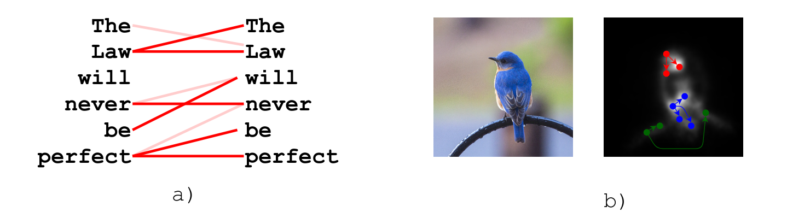
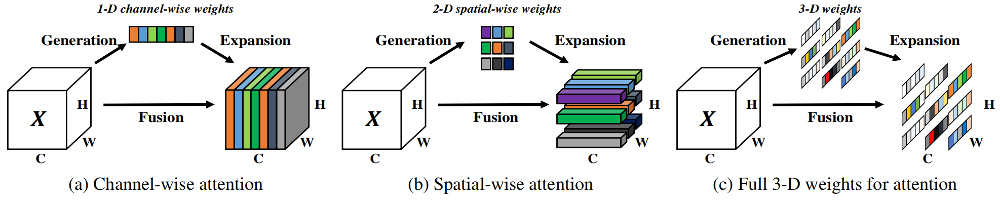
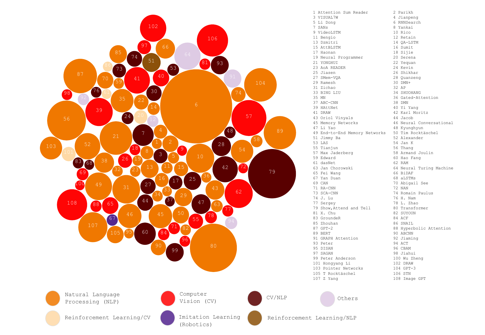

# 注意力机制



## 目录

[[TOC]]

## 1. 介绍

注意力机制在很多AI领域内得到了成功的应用。这是人工神经网络在模仿人类进行决策过程的重要发展。

> In humans, Attention is a core property of all perceptual and cognitive operations. Given our limited ability to process competing sources, attention mechanisms select, modulate, and focus on the information most relevant to behavior.

上面这段文字摘自Alana de Santana Correia, and Esther Luna Colombini的论文 [ATTENTION, PLEASE ! A SURVEY OF NEURAL ATTENTION MODELS IN DEEP LEARNING](https://arxiv.org/abs/2103.16775)。你应该注意到了，在你的视野中，只有一部分区域是很清晰的。对于视野周围的场景，你往往需要转转眼珠，把视野朝向它，才能完全看清。或者，你还发现，比起历史老师开始强调重点，你似乎对下课铃声的响起更加敏感——这就是注意力。你所处的环境包含着远超你的处理能力的信息，而注意力机制让你的大脑集中精力处理你视野中心的场景，或是你“更应该”关心的事物。

Attention机制听上去是一个很高大上的词汇，实际上，Attention在不经意间就会被使用。例如，循环神经网络中每一步计算都依赖于上一步计算结果的过程就可以被视为一种Attention：在 Attention 机制引入之前，有一个问题大家一直很苦恼：长距离的信息会被弱化，就好像记忆能力弱的人，记不住过去的事情是一样的。


如上图，在处理序列的循环神经网咯中，Attention的功能是关注重点，就算文本比较长，也能从中间抓住重点，不丢失重要的信息。上图中红色的预期就是被挑出来的重点。

对于文字序列的输入，有基于编码器解码器的注意力；对图像输入，有各种各样的空间注意力；在神经网络处理得过程中，还有通道注意力；还有强大的自注意力，并且具有能够将自注意力适用于各种输入的广泛化设计。

Attention具有以下三大优点：参数少、速度快、效果好。Attention机制如果浅层的理解，跟他的名字非常匹配。他的核心逻辑就是**从关注全部到关注重点**。在认知科学中，由于信息处理的瓶颈，人类会选择性地关注所有信息的一部分，同时忽略其他信息。同理，当神经网络处理大量的信息输入时，快速聚焦其中一些关键信息来进行处理，这便是注意力机制。

根据类型的不同，Attention可以被分为：

- 显著性（Saliency-Based）注意力：自下而上的无意识的注意力。

  在很常见的卷积神经网络和循环神经网络中，可以将 **池化（`max pooling`）、门控（`Gating`）** 近似看作是自下而上的基于显著性的注意力机制。自下而上的意思是，这种注意力不需要策略和判断，也不需要经过学习，所以是无意识的。

- 聚焦式（Focus）注意力：自上而下的有意识的注意力。

  这种注意力是需要设计或是经过学习才能产生的，所以称为自上而下的，或称为有意识的。在这一节我们主要对这种自上而下的注意力进行了解。

## 2. 初步理解

求注意力分布也就是为了实现选择关键的信息来进行处理。或者说，注意力分布就是关键信息的分布。


例如，人第一眼看到上面的图片，会不自觉地先看到红色的区域。上图中红色到绿色构成的mask就是注意力分布了。

注意力机制的一种可能的流程是这样的可以通过这样的两个步骤实现：

1. 在所有输入信息上计算注意力分布
2. 根据注意力分布计算输入信息的加权和，以此选择关键信息


也就是说，我们设计注意力模块产生注意力（分布），然后让注意力通过某种方式作用于输入，形成更加有效的信息。

## 3. 衡量相关性

注意力的一种核心思想是衡量相关性。例如，我说，要你在一幅画面中找出苹果，那么你会注意到整个画面中所有红色的球形物体，因为这样的物体和苹果相关性较大。所以，设计注意力的时候就是要设计一种函数，用于衡量目标和当前对象的相关性。这种函数被称为**打分函数**，打分函数的输出被称为**注意力分布**。

### 3.1 打分函数

打分函数，就是计算每个输入量和查询向量之间的相关性的函数。打分函数根据是否需要通过学习获得，可以分文不需要学习的打分函数和需要学习的打分函数。


在上图的过程中，打分函数所处的位置是注意力机制模块。

#### 3.1.1 不需要学习的打分函数

不需要学习的打分函数设计往往与具体任务相关。 例如，如果需要设计一个距离计算关系（离得越远分数越低）的打分函数，可以设计为$\widetilde{\alpha}_i = \sum_{j\in X} d(x_i,x_j)$。其中$d(a,b)$表示$a$和$b$之间的欧几里得距离。由于不需要学习参数，这类函数完全由手工设计，效果明确且单一。

#### 3.1.2 需要学习的打分函数

需要学习的打分函数指需要通过训练过程才能完全确定的打分函数。这类打分函数通常在形式上是确定的，但是其中有一部分参数不是确定的，需要通过学习获得。在最新的注意力机制的相关工作中，出现的大部分打分函数都是需要学习的打分函数。其中常见的可以表示为以下几种：

- 加性模型：$v^{T}tanh(W_{x_i}+Uq)$，其中$W$、$U$、$v$是可训练的参数。
- 点积模型：$x_{i}^{T}q$，理论上，加性模型和点积模型的复杂度差不多，但是点积模型在实现上可以 更好地利用矩阵乘积，从而计算效率更高
- 缩放点积模型：$\frac{x_{i}^{T}q}{\sqrt{d}}$，其中$d$为输入输入向量的维度。当输入向量维度过高，点积模型通常有较大的方差，从而导致$softmax$函数梯度较小，而缩放点积模型可以很好地解决这个问题。
- 双线性模型：$x_{i}^{T}Wq$，双线性模型可以看作一种更泛化的点积模型，相比点积模型，双线性模型在计算相似度时引入了非对称性。

其中$W$，$U$，$v$为可学习的参数，$D$为输入向量的维度。以上出现的公式均需要通过学习得到其中的参数。当然，也有一种叫做自注意力的函数设计更特殊一些，但是它也属于需要学习的打分函数。

### 3.2 注意力分布

为了从输入中选择出和某个特定任务相关的信息，我们需要引入一个和任务相关的表示，称为**查询向量**(Query Vector)，并通过一个**打分函数**来计算**每个输入向量和查询向量之间的相关性**。

注意力分布$\alpha_{n}$可以解释为在给定任务相关的查询 $q$ 时，第 $n$个输入向量受关注的程度．我们采用一种“软性”的信息选择机制对输入信息进行汇总，即
$$
att(X,q) = \sum_{n=1}^{N} {\alpha_n x_n}\\
= E_{z\sim{p|X,q}}[X_{z}]
$$

给定一个和任务相关的查询向量$q$，我们用 **注意力变量**$z\in [1,N]$来表示被选择信息的索引位置，即$z=i$表示选择了第$i$个输入向量。这里采用`Soft Attention`的方式，即计算在给定$q$和$X$下，选择第$i$个输入向量的概率$\alpha_{i}$：
$$
{\alpha}_{i}=p(z=i|X,q)\\
=softmax(s(x_{i},q))\\
=\frac{exp(s(x_{i},q))}{\sum_{j=1}^{n}exp(s(x_{j},q))}
$$

上式中${\alpha}_{i}$称为注意力分布（Attention Distribution），$s(x_{i},q)$是注意力的打分函数。

### 3.3 相关性采样

在获得注意力分布后，往往需要对原本的输入进行一次采样，采样的依据是刚才获得的注意力分布：


根据注意力分布的形式的不同，可以设计不同的采样方法对原输入进行采样或处理。常见的方法有点积（dot product）等。例如，通过注意力分布$q$对输入$x$进行点积和加权平均，即使用$q$作为权重参数对输入进行加权：
$$
\widetilde{x} = x \cdot att(X,q(x))
$$
其中$x$表示输入，$att(X,q(x))$是上文中的注意力分布，$\widetilde{x}$是对输入进行相关性采样的输出。


上图为这个过程的一种模式图。除了直接加权平均的方法，还有一些更加复杂的计算方法。但是加权平均是最常用的。一般情况下，需要设计的只是打分函数，采样过程是不需要设计的。

## 4. 不同的Attention机制

深度注意机制可以分为软注意（soft attention，或global attention）、硬注意（local attention）和自我注意（self attention，或intra-attention）。

### 4.1 软注意力（**Soft** Attention）

这是比较常见的Attention方式，其原理是为每个输入元素分配 0 到 1 的权重。它在注意力层中使用 softmax 函数来计算权重，从而使整个注意力模型具有确定性和可微性。软注意力可以对带有空间属性的推理和时间属性的推理起作用。


上图是软注意力的一种直观示例。

上文中提到的注意力分布：
$$
att(X,q) = \sum_{n=1}^{N} {\alpha_n x_n}\\
= E_{z\sim{p|X,q}}[X_{z}]
$$
和输入的之际加权平均*（也就是相关性采样过程本身）就是软注意力的一种形式。

### 4.2 硬注意力（**Hard** Attention）

在软注意力中，选择的信息是所有输入向量在注意力分布下的期望。此外，还有一种注意力是只关注某一个输入向量是否该被选择，或者说注意力分布只能是0或1的注意力机制，叫作硬性注意力（Hard Attention）。

注：由于很多情况下注意力机制不需要计算和储存权重参数，所以通常情况下硬注意力机制不需要训练。


硬注意力有两种实现方式：

1. 选取最高概率的一个输入向量。即$att(X,q)=x_{\hat{n}}$。其中$\hat{n}$为概率最大的输入向量的下标，即$\hat{n} = argmax_{n=1}^{N}\alpha_{n}$。
2. 第二种硬注意力机制可以通过在注意力分布式上随机采样的方式实现．

硬性注意力的一个缺点是基于最大采样或随机采样的方式来选择信息。由于没有基本事实来表明正确的选择策略，硬注意类型的机制由随机过程表示。硬注意力机制使得最终的损失函数与注意力分布之间的函数关系不可导，无法使用反向传播算法进行训练。因此，硬性注意力通常需要使用强化学习来进行训练。为了使用反向传播算法，一般使用软性注意力来代替硬性注意力。由于在硬注意力机制中输入的信息没有被存储或处理（或变为权重参数储存），与软注意力机制相比，推理时间和计算成本就会减少。

软注意力和硬注意力的直观联系和区别可以通过它们的示意图观察得到：



上：软注意力机制示意；下：硬注意力机制示意。

### 4.3 键值注意力（Key-Value Attention）

键值注意力在处理序列输入时常用。这种注意力和后面会聊到的Transformer也具有很大的关系。

键值注意力模型可以宏观理解为一个查询（query）到一系列键值对（key-value）的映射。将Source中的构成元素想象成是由一系列的`<key,value>`数据对构成，此时给定Target中的某个元素query，通过计算query和各个key的相似性或者相关性，得到每个key对应value的权重系数，通过softmax归一化后，对权重和相应value进行加权求和，即得到最终attention数值。



Attention为序列中每个元素都分配一个权重系数，这也可以理解为软寻址。如果序列中每一个元素都以(K,V)形式存储，那么attention则通过计算Q和K的相似度来完成寻址。Q和K计算出来的相似度反映了取出来的V值的重要程度，即权重，然后加权求和就得到了attention值。

**本质上attention机制是对source中元素的value值进行加权求和，而query和key用来计算对应value的权重系数**，在NLP领域中，往往$key=value$。

 一般我们可以用键值对（key-value pair）格式来表示输入信息，其中 “键”用来计算注意力分布$\alpha_{n}$，“值”用来计算聚合信息：
$$
Attention = QK^TV
$$
其中$Q$为输入中元素的向量表示，$K$是键key的向量表示，$V$是值value的向量表示。



用$(K,V) = [{k_1,v_1},...,(k_N,v_N)]$表示$N$组输入信息，给定任务相关的查询向量为$q$时，注意力函数为：
$$
att((K,V),q) = \sum_{n=1}^{N}{\alpha_{n}v_{n}}\\
=\sum_{n=1}^{N}\frac{exp(s(k_{n},q))}{\sum_j \exp(s(k_j,q))}
$$
其中$s(k_n,q)$为打分函数。


上图给出键值对注意力机制的示例．当$K=V$ 时，键值对模式就等价于普通的注意力机制。

这种方式是直接精准定位到某个key，其余key就都不管了，相当于这个key的概率是1，其余key的概率全部是0。因此这种对齐方式要求很高，要求一步到位，如果没有正确对齐，会带来很大的影响。另一方面，因为不可导，一般需要用强化学习的方法进行训练。（或者使用gumbel softmax之类的）。

### 4.4 自注意力（Self Attention）

自注意力的核心内容是量化表示输入元素之间的相互依赖性。比如，通常情况下键盘和鼠标会同时出现，所以当输入中出现键盘时模型就可以关注相关位置是否有键盘。这种机制允许输入与彼此“自我”简历关系并确定他们应该更多关注什么。



上图：左侧为语言模型中在注意力的一种示意；右侧为视觉任务中自注意力的一种示意。


上图：自注意力模型的一种模式。接下来对这种Query-Key-Value的模式进详解：


首先假设我们的input是上图中的序列$x_1$~$x_4$，每一个input (vector)先乘上一个矩阵得到embedding，即向量$a_1$~$a_4$ 。接着这个embedding进入self-attention层，每一个向量分别乘上3个不同的transformation matrix $W_q$、$W_k$和$W_v$，以向量$a_1$为例，就会分别得到3个不同的向量$q^1$、$k^1$和$v^1$ 。


接下来使用每个query $q$去对每个key $k$做attention，attention就是匹配这2个向量有多接近，比如我现在要对$q^1$和$k^1$做attention，我就可以把这2个向量做scaled inner product（$a_{i,j}=q^i*k^j / \sqrt{d}$，$d$是$q$和$k$的维度。这里处以$\sqrt{d}$相当于归一化的效果），得到$a_{1,1}$，再取$q^1$和$k^2$做attention，得到$a_{1,2}$，再取$q^1$和$k^3$做attention，得到$a_{1,3}$，再取$q^1$和$k^4$做attention，得到$a_{1,4}$。以此类推。这便是自注意力的打分函数设计。

接下来需要对所有计算得到的$a_{1,i}$进行$softmax$运算：


取完softmax操作以后，我们得到了$\hat{\alpha}_{1,i}$，我们用它和所有的$v^i$值进行相乘。具体来讲，把$\hat{\alpha}_{1,1}$乘上$v^1$，把$\hat{\alpha}_{1,2}$乘上$v^2$，把$\hat{\alpha}_{1,3}$乘上$v^3$，把$\hat{\alpha}_{1,4}$乘上$v^4$，把结果相加得到$b^1$。在产生$b$的过程中用了整个序列的特征(Considering the whole sequence)。如果要考虑local的特征，则只需要学习出相应的$\hat{\alpha}_{1,i}=0$，$b^1$上就不再带有$i$对应分支的信息了；如果要考虑global的特征，则需要学习出相应的$\hat{\alpha}_{1,i}\neq 0$，$b^1$上就带有$i$对应分支的信息了。


在上述的过程中使用的三个值：$q$、$k$、$v$分别是输入$x$经过embadding变为$a$后分别与$W^q$、$W^k$、$W^v$相乘得到的。其中$q$用来表示当前向量的查询值，查询值和其他所有向量的$k$输入打分函数获得当前向量的相关性矩阵$b$，然后相关性$b$和当前向量的代表值$v$相乘得到输出。

以上注意力模式可以表示为公式：
$$
Attention = QK^TV
$$
其中$Q$为输入中元素的向量表示，$K$是键key的向量表示，$V$是值value的向量表示。

让它具有自注意力机制的最简单的办法就是令$Q=K=V$， 则在键值注意力中，计算相关性的过程就发生在输入本身内部（因为在键值注意力中是$Q$和各个$K$的相关性，在用$V$进行加权）。

#### 4.4.1 自注意力的优越

基于卷积或循环网络的序列编码都是一种局部的编码方式，只建模了输入信息的局部依赖关系。虽然循环网络理论上可以建立长距离依赖关系，但是由于信息传递的容量以及梯度消失问题，实际上也只能建立短距离依赖关系。

如果要建立输入序列之间的长距离依赖关系，可以使用以下两种方法：一种方法是增加网络的层数，通过一个深层网络来获取远距离的信息交互；另一种方法是使用全连接。全连接网络是一种非常直接的建模远距离依赖的模型，但是无法处理变长的输入序列。不同的输入长度，其连接权重的大小也是不同的。这时我们就可以利用注意力机制来“动态”地生成不同连接的权重，这就是自注意力模型（Self-Attention Model，有时也称为内部注意力即Intra-Attention）。

Self-Attention模型对于Seq2Seq模型的优越性在于：

- 对长期依赖关系有着更强的捕捉能力
- 可以并行计算

Self-Attention模型对于CNN模型的优越性在于：

- 元素与元素之间的距离从CNN的logarithmic path length进一步缩短到constant path length
- 由CNN fixed size perceptive变成了variable-sized的 perceptive，具体的长度等于文本长度，这也是self-attention相对于普通attention的优点。

#### 4.4.2 多头自注意力

//抽出空写

#### 4.4.3 自注意力的广泛化设计

目前非常流行的Transformer是一个Sequence to Sequence model，特别之处在于它大量用到了self-attention。要处理一个Sequence，最常想到的就是使用RNN，它的输入是一串vector sequence，输出是另一串vector sequence

下图是自然语言处理的任务中经常出现的encoder-decoder模式：


在这个框架中，编码器将源语句编码为固定长度的向量$C$，解码器从中生成翻译。这其中的主要问题是神经网络需要将源语句中的所有必要信息压缩为固定长度的向量，而固定长度的向量往往对于不同信息可能出现信息冗余或是表达能力不足。


上图：卷积网络和循环网络将不定长度的输入编码为等长的序列。


但是这种设计很难并行化，所以有人提出使用使用CNN代替RNN，如上图中右侧所示。其中，橘色的三角形表示一个filter，每次扫过3个向量 $a$，扫过一轮以后，就输出了一排结果，使用橘色的小圆点表示。所以，用CNN，确实也可以做到跟RNN一样进行sequence to sequence的处理。

而CNN的一个好处是：它是可以并行化的 (can parallel)，不需要等待前序的序列处理完，而是可以直接对整个序列进行处理。

### 4.5 通道注意力

对图像来说，上述注意力都属于空间注意力。通道注意力指的是在神经网络计算的过程中在每一层输出的通道之间进行关注的注意力。Squeeze-and-Excitation Networks（SENet）是由自动驾驶公司Momenta在2017年公布的一种全新的图像识别结构，它通过对特征通道间的相关性进行建模，把重要的特征进行强化来提升准确率。这个结构是2017 ILSVR竞赛的冠军，top5的错误率达到了2.251%，比2016年的第一名还要低25%。


上图是通道注意力的一种模式图。

图中的$F_{sq}(・)$称为**Squeeze过程**，全局平均池化(Global average pooling，GAP)有很多算法，作者用了最简单的求平均的方法：
$$
z_c = F_{sq}(u_c) = \frac{1}{W\times H}\sum_{i=1}^W\sum_{j=1}^H{u_c(i,j)}
$$
这使空间上所有点的信息都平均成了一个值。这么做是因为最终的scale是对整个通道作用的，这就得基于通道的整体信息来计算scale。另外作者要利用的是通道间的相关性，而不是空间分布中的相关性，用GAP屏蔽掉空间上的分布信息能让scale的计算更加准确。

图中的$F_{ex}(・,W)$称为**Excitation过程**，在SEBlock中这部分是用2个全连接来实现的。众所周知，全连接的计算量是非常恐怖的。层间连接数量较大时。所以，在SENet中第一个全连接把$C$个通道压缩成了$C/r$个通道来降低计算量（后面跟了$relu$），第二个全连接再恢复回$C$个通道（后面跟了$sigmoid$）。原论文中尝试了$r$在各种取值下的性能 ，最后得出结论$r=16$时整体性能和计算量较为平衡。

Excitation的设计其实是学习了**某种通道相关性**。上述的Excitation过程是SENet能够利用通道相关性的关键设计。这种设计训练了一个全连接网络，该全连接网络在整个数据集上得出一个合适的$scale$，作用于前序网络的输出。这种设计是必要的：


例如，在上图存在过程1和过程2，过程1不经过全连接直接将$scale$作用于前序网络的输出。没有了全连接层，某个通道的调整值完全基于单个通道全局平均池化(Global average pooling，GAP)的结果，事实上只有GAP的分支是完全没有反向计算、没有训练的过程的，就无法基于全部数据集来训练得出通道增强、减弱的规律。

而过程2是SENet的做法。为什么要加全连接层呢？这里的全连接层旨在更好地捕获通道间的相关关系。为了实现这个目标，函数必须满足两个标准：

1. 它必须能够学习通道间的非线性关系。通道之间会存在关系。
2. 它必须能够学习一种非互斥的关系。因为有用的也许是多个通道。

为了满足这些标准，SENet选用带有$Sigmoid$激活的简单门控机制，利用通道间的相关性训练出真正的$scale$。一次mini-batch个样本的$squeeze$输出并不代表通道真实要调整的$scale$值，真实的scale要基于全部数据集来训练得出，而不是基于单个batch。

还有一个关键问题是：**实际上，单纯通过卷积训练出的权值也有类似$scale$的成分，为什么要加入这个通道相关性的设计呢**？SENet这样设计是为了**排除空间上的干扰**。在经过GAP后，某一个channel上具有的空间信息被压缩成一个点，从而失去了空间相关性，也就排除了空间上的干扰。

#### 通道注意力和空间注意力的关系


### 4.6 外部注意力（External Attention）

//留坑，还没写

### 4.7 无参的注意力

刚才提到的这些注意力，都是带有参数的注意力。带有参数，代表着注意力模块将会参与网络的训练，成为网络的一部分。而无参注意力，能够分离于网络本身。在你重新加载网络模型后，你可以将这种注意力随便塞在一层，而不会遇到模型加载失败（因为它真的没有任何需要保存的参数）。

这里给出的例子是[SimAM: A Simple, Parameter-Free Attention Module for Convolutional Neural Networks](http://proceedings.mlr.press/v139/yang21o/yang21o.pdf)。该论文提出了一种3D的无参注意力， 基于著名的神经科学理论，提出了一种能量函数，并且推导出其快速解析解，能够为每一个神经元分配权重。主要贡献如下：

- 受人脑注意机制的启发，我们提出了一个具有3D权重的注意模块，并设计了一个能量函数来计算权重；
- 推导了能量函数的封闭形式的解，加速了权重计算，并保持整个模块的轻量；
- 将该模块嵌入到现有ConvNet中在不同任务上进行了灵活性与有效性的验证。



上图：通道注意力(a)、空间注意力(b)和3D注意力(c)的对比。作者的目标是设计一个轻量级的即插即用的模块以应用于各种任务，而无需对网络结构做出改变。

作者认为注意机制的实现应该遵循神经计算中的一些统一原则。因此，基于一些成熟的神经科学理论提出了一种新的方法。

在视觉神经学中，那些信息量（most informative）最大的神经元通常与周围神经元拥有不同的放电模式。

同时，一个活跃的神经元也可能一直周围的神经元活动，这种现象被称为”空间抑制“。

换言之，在视觉中，表现出明显空间一直效应的神经元应该被赋予更高的重要性，而找到这些神经元的最简单方式就是测量一个目标神经元与其他神经元之间的线性可分性。

基于以上科学发现，提出了以下的能量函数（公式来源[参考](https://blog.csdn.net/liangdas/article/details/44251469)）：
$$
e_t(w_t,b_t,\mathbf{y},x_i) = (y_t-\hat{t})^2+\frac{1}{M-1}\sum_{i=1}^{M-1}(y_0-\hat{x}_i)^2.\tag{1}
$$
$t$和$x_i$是输入$X\in \mathbb{R}^{C\times H\times W}$中单通道上的目标神经元和其他神经元；$\hat{t}=w_tt+b_t$和$\hat{x}_i=w_tx_i+b_t$是$t$和$x_i$的线性变换，$w_t$和$b_t$分别代表线性变换的权重和偏置；$i$是空间维度上的索引，$M=H\times W$代表该个通道上神经元的个数

上式中的所有量都是标量，当$y_t=\hat{t}$和所有$x_i=y_o$时取得最小值，其中，$y_t$和$y_o$是两个不同的值求解上式的最小值等价于求解目标神经元和其他所有神经元之间的线性可分性

简便起见，使用二值标签，即$y_t=1\quad y_o=-1$，并且添加了正则项，则最终的能量函数如下：
$$
e_t(w_t,b_t,\mathbf{y},x_i) = \frac{1}{M-1}\sum_{i=1}^{M-1}(-1-(w_tx_i+b_t))^2+(1-(w_tt+b_t))^2+\lambda w_t^2.\tag2
$$

上述公式的来源应该是SVM，将当前神经元设置为正类，其余神经元设置为负类，来衡量他们之间的差异性。理论上， 每个通道拥有$M$个能量函数，逐一求解是很大的计算负担。幸运的是，可以获得上式的闭式解（即解析解），如下：

$$
w_t=-\frac{2(t-\mu_t)}{(t-\mu_t)^2+2\sigma_t^2+2\lambda},\tag3
$$

$$
b_t=-\frac{1}{2}(t-\mu_t)w_t.\tag4
$$

其中$\mu_t=\frac{1}{M-1}\sum_{i=1}^{M-1}x_i$，$\sigma_t^2=\frac{1}{M-1}\sum_{i=1}^{M-1}(x_i-\mu_t)^2$，实际上就是该通道中除去目标神经元的均值和方差。由于解析解是在单个通道上获得的，因此可以合理假设每个通道中所有像素遵循相同的分布，最小能量即为：

$$
e_t^*=\frac{4(\mu^2+\lambda)}{(t-\mu)^2+2\sigma^2+2\lambda}.\tag5
$$
**能量越低，神经元t与周围神经元的区别越大，重要性越高**。因此，神经元的重要性可以通过$1/e_t^*$得到。

根据以往的神经学研究，哺乳动物大脑中的注意力调节通常表现为神经元反应的增益效应，因此使用放缩运算而非加法来实现加权：
$$
\widetilde{X}=sigmoid(\frac{1}{E})\otimes X,\tag6
$$
同时$sigmoid$函数还可以限制$E$中的过大值，并且不会影响每个神经元的相对重要性。

根据上述描述，该方法可以被写作如下代码并加入网络任意两层中间：

```python
def forward(X,lambda):
	n = X.shape[2] * X.shape[3] - 1
	d = (X - X.mean(dim=[2,3])).pow(2)
	v = d.sum(dim=[2,3])/n
	E_inv = d / (4 * (v + lambda)) +0.5
	return X * torch.sigmoid(E_inv)
```

可以看到，该方法不包含任何神经网络层，仅对输入进行运算，是完全无参的。该方法在许多任务上取得了不错的效果。

## 7研究热点

从历史上看，Attention机制最早是应用于图像领域，计算注意力系统的研究自 1980 年代以来就已经存在。。在2014年，神经注意力网络（Neural Attentional Networks，NAN）出现在自然语言处理（Natural Language Processing，NLP）中展现出了非常明显的进步。Google Mind团队发表的论文[Recurrent Models of Visual Attention](https://arxiv.org/abs/1406.6247)使Attention机制开始火了起来，该论文提出在RNN模型上使用Attention机制来进行图像分类，结果取得了很好的性能。随后，在Bahdanau等人发表论文[Neural Machine Translation by Jointly Learning to Align and Translate](https://arxiv.org/abs/1409.0473)中提出在机器翻译任务上使用Attention机制将翻译和对齐同时进行，他们的工作是第一个将Attention机制应用在NLP领域中的。接着，在Xu等人发表的论文[Show, Attend and Tell: Neural Image Caption Generation with Visual Attention](https://arxiv.org/abs/1502.03044)中，成功的将Attention机制应用在Image Caption领域。从此，Attention机制就被广泛应用在基于RNN神经网络模型的各种深度学习任务中。随后，如何在CNN中使用Attention机制也成为研究的热点。2017年，Google发表的论文[Attention is All You Need](https://arxiv.org/abs/1706.03762)中提出在机器翻译上大量使用自注意力（self-attention）机制来学习文本表示。2018 年[BERT: Pre-training of Deep Bidirectional Transformers for Language Understanding](https://arxiv.org/abs/1810.04805)和GPT的效果出奇的好，进而走红。而Transformer和 Attention 这些核心开始被大家重点关注。



上图：注意力机制在各种任务中应用的成果。颜色代表类别，大小代表成就或影响力的大小。

注意力使我们能够转向之前具有挑战性的会话机器理解、情感分析、机器翻译、问答和迁移学习等复杂任务。随后，NAN 出现在对人工智能同样重要的其他领域，例如计算机视觉、强化学习和机器人技术。目前有许多注意力架构，其中 RNNSearch、Transformer、Memory Networks 、“show, attend and tell”和 RAM等设计作为关键发展脱颖而出。

