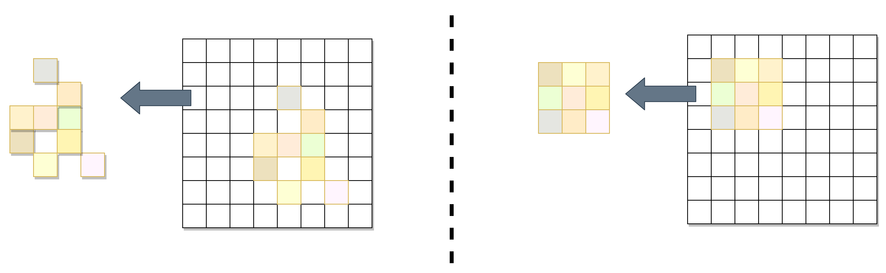
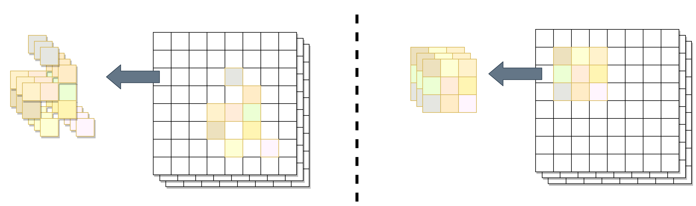
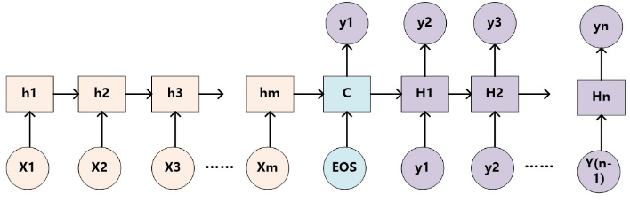
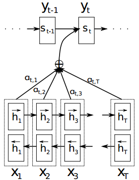

# 注意力机制

注意力机制也可称为注意力模型。

## 介绍

注意力机制在很多AI领域内得到了成功的应用。这是人工神经网络在模仿人类进行决策过程的重要发展。

> In humans, Attention is a core property of all perceptual and cognitive operations. Given our limited ability to process competing sources, attention mechanisms select, modulate, and focus on the information most relevant to behavior.

上面这段文字摘自Alana de Santana Correia, and Esther Luna Colombini的论文 [ATTENTION, PLEASE ! A SURVEY OF NEURAL ATTENTION MODELS IN DEEP LEARNING](https://arxiv.org/abs/2103.16775)。你应该注意到了，在你的视野中，只有一部分区域是很清晰的。对于视野周围的场景，你往往需要转转眼珠，把视野朝向它，才能完全看清。或者，你还发现，比起历史老师开始强调重点，你似乎对下课铃声的响起更加敏感——这就是注意力。你所处的环境包含着远超你的处理能力的信息，而注意力机制让你的大脑集中精力处理你视野中心的场景，或是你“更应该”关心的事物。

Attention机制听上去是一个很高大上的词汇，实际上，Attention在不经意间就会被使用。例如，循环神经网络中每一步计算都依赖于上一步计算结果的过程就可以被视为一种Attention：在 Attention 机制引入之前，有一个问题大家一直很苦恼：长距离的信息会被弱化，就好像记忆能力弱的人，记不住过去的事情是一样的。

如上图，在处理序列的循环神经网咯中，Attention的功能是关注重点，就算文本比较长，也能从中间抓住重点，不丢失重要的信息。上图中红色的预期就是被挑出来的重点。

从历史上看，Attention机制最早是应用于图像领域，计算注意力系统的研究自 1980 年代以来就已经存在。。在2014年，神经注意力网络（Neural Attentional Networks，NAN）出现在自然语言处理（Natural Language Processing，NLP）中展现出了非常明显的进步。Google Mind团队发表的论文[Recurrent Models of Visual Attention](https://arxiv.org/abs/1406.6247)使Attention机制开始火了起来，该论文提出在RNN模型上使用Attention机制来进行图像分类，结果取得了很好的性能。随后，在Bahdanau等人发表论文[Neural Machine Translation by Jointly Learning to Align and Translate](https://arxiv.org/abs/1409.0473)中提出在机器翻译任务上使用Attention机制将翻译和对齐同时进行，他们的工作是第一个将Attention机制应用在NLP领域中的。接着，在Xu等人发表的论文[Show, Attend and Tell: Neural Image Caption Generation with Visual Attention](https://arxiv.org/abs/1502.03044)中，成功的将Attention机制应用在Image Caption领域。从此，Attention机制就被广泛应用在基于RNN神经网络模型的各种深度学习任务中。随后，如何在CNN中使用Attention机制也成为研究的热点。2017年，Google发表的论文[Attention is All You Need](https://arxiv.org/abs/1706.03762)中提出在机器翻译上大量使用自注意力（self-attention）机制来学习文本表示。2018 年[BERT: Pre-training of Deep Bidirectional Transformers for Language Understanding](https://arxiv.org/abs/1810.04805)和GPT的效果出奇的好，进而走红。而Transformer和 Attention 这些核心开始被大家重点关注。

上图：注意力机制在各种任务中应用的成果。颜色代表类别，大小代表成就或影响力的大小。

注意力使我们能够转向之前具有挑战性的会话机器理解、情感分析、机器翻译、问答和迁移学习等复杂任务。随后，NAN 出现在对人工智能同样重要的其他领域，例如计算机视觉、强化学习和机器人技术。目前有许多注意力架构，其中 RNNSearch、Transformer、Memory Networks 、“show, attend and tell”和 RAM等设计作为关键发展脱颖而出。

Attention具有以下三大优点：参数少、速度快、效果好。Attention机制如果浅层的理解，跟他的名字非常匹配。他的核心逻辑就是**从关注全部到关注重点**。在认知科学中，由于信息处理的瓶颈，人类会选择性地关注所有信息的一部分，同时忽略其他信息。同理，当神经网络处理大量的信息输入时，快速聚焦其中一些关键信息来进行处理，这便是注意力机制。

根据类型的不同，Attention可以被分为：

- 显著性（Saliency-Based）注意力：自下而上的无意识的注意力。

  在很常见的卷积神经网络和循环神经网络中，可以将 **池化（`max pooling`）、门控（`Gating`）** 近似看作是自下而上的基于显著性的注意力机制。自下而上的意思是，这种注意力不需要策略和判断，也不需要经过学习，所以是无意识的。

- 聚焦式（Focus）注意力：自上而下的有意识的注意力。

  这种注意力是需要设计或是经过学习才能产生的，所以称为自上而下的，或称为有意识的。在这一节我们主要对这种自上而下的注意力进行了解。

## 初步理解

求注意力分布也就是为了实现选择关键的信息来进行处理。或者说，注意力分布就是关键信息的分布。

例如，人第一眼看到上面的图片，会不自觉地先看到红色的区域。上图中红色到绿色构成的mask就是注意力分布了。

注意力机制的一种可能的流程是这样的可以通过这样的两个步骤实现：

1. 在所有输入信息上计算注意力分布
2. 根据注意力分布计算输入信息的加权和，以此选择关键信息

也就是说，我们设计注意力模块产生注意力（分布），然后让注意力通过某种方式作用于输入，形成更加有效的信息。

## 不同的Attention机制

深度注意机制可以分为软注意（soft attention，或global attention）、硬注意（local attention）和自我注意（self attention，或intra-attention）。

### 软注意力（**Soft** Attention）

这是比较常见的Attention方式，其原理是为每个输入元素分配 0 到 1 的权重。它在注意力层中使用 softmax 函数来计算权重，从而使整个注意力模型具有确定性和可微性。软注意力可以对带有空间属性的推理和时间属性的推理起作用。

上图是软注意力的一种直观示例。

#### 注意力分布

为了从输入中选择出和某个特定任务相关的信息，我们需要引入一个和任务相关的表示，称为**查询向量**(Query Vector)，并通过一个**打分函数**来计算**每个输入向量和查询向量之间的相关性**。

注意力分布$\alpha_{n}$可以解释为在给定任务相关的查询 $q$ 时，第 $n$个输入向量受关注的程度．我们采用一种“软性”的信息选择机制对输入信息进行汇总，即
$$
att(X,q) = \sum_{n=1}^{N} {\alpha_n x_n}\\
= E_{z\sim{p|X,q}}[X_{z}]
$$

上述公式就称为软性注意力机制（Soft Attention Mechanism）。一般情况下，提及注意力一般指的是软注意力。

给定一个和任务相关的查询向量$q$，我们用 **注意力变量**$z\in [1,N]$来表示被选择信息的索引位置，即$z=i$表示选择了第$i$个输入向量。这里采用`Soft Attention`的方式，即计算在给定$q$和$X$下，选择第$i$个输入向量的概率$\alpha_{i}$：
$$
{\alpha}_{i}=p(z=i|X,q)\\
=softmax(s(x_{i},q))\\
=\frac{exp(s(x_{i},q))}{\sum_{j=1}^{n}exp(s(x_{j},q))}
$$

上式中${\alpha}_{i}$称为注意力分布（Attention Distribution），$s(x_{i},q)$是注意力的打分函数。所谓打分函数，就是计算每个输入量和查询向量之间的相关性的函数。

#### 注意力打分函数

打分函数，就是计算每个输入量和查询向量之间的相关性的函数。在上文的注意力分布的公式中${\alpha}_{i}$称为注意力分布（Attention Distribution），$s(x_{i},q)$为注意力打分函数。打分函数可以使用以下几种方式来计算：

- 加性模型：$v^{T}tanh(W_{x_i}+Uq)$，其中$W$、$U$、$v$是可训练的参数。
- 点积模型：$x_{i}^{T}q$，理论上，加性模型和点积模型的复杂度差不多，但是点积模型在实现上可以 更好地利用矩阵乘积，从而计算效率更高
- 缩放点积模型：$\frac{x_{i}^{T}q}{\sqrt{d}}$，其中$d$为输入输入向量的维度。当输入向量维度过高，点积模型通常有较大的方差，从而导致softmax函数梯度较小，而缩放点积模型可以很好地解决这个问题。
- 双线性模型：$x_{i}^{T}Wq$，双线性模型可以看作一种更泛化的点积模型，相比点积模型，双线性模型在计算相似度时引入了非对称性。

其中$W$，$U$，$v$为可学习的参数，$D$为输入向量的维度。

#### 加权平均

注意力分布接下将参与加权平均的环节，即使用$\alpha$作为权重参数对输入进行加权。

上图就是这种软性注意力机制的示意图。注意力机制可以单独使用，但更多地用作神经网络中的一个组件。

### 硬注意力（**Hard** Attention）

在软注意力中，选择的信息是所有输入向量在注意力分布下的期望。此外，还有一种注意力是只关注某一个输入向量是否该被选择，或者说注意力分布只能是0或1的注意力机制，叫作硬性注意力（Hard Attention）。

注：由于很多情况下注意力机制不需要计算和储存权重参数，所以通常情况下硬注意力机制不需要训练。

硬注意力有两种实现方式：

1. 选取最高概率的一个输入向量。即$att(X,q)=x_{\hat{n}}$。其中$\hat{n}$为概率最大的输入向量的下标，即$\hat{n} = argmax_{n=1}^{N}\alpha_{n}$。
2. 第二种硬注意力机制可以通过在注意力分布式上随机采样的方式实现．

硬性注意力的一个缺点是基于最大采样或随机采样的方式来选择信息。由于没有基本事实来表明正确的选择策略，硬注意类型的机制由随机过程表示。硬注意力机制使得最终的损失函数与注意力分布之间的函数关系不可导，无法使用反向传播算法进行训练。因此，硬性注意力通常需要使用强化学习来进行训练。为了使用反向传播算法，一般使用软性注意力来代替硬性注意力。由于在硬注意力机制中输入的信息没有被存储或处理（或变为权重参数储存），与软注意力机制相比，推理时间和计算成本就会减少。

#### 软硬注意力的关系和区别

软注意力和硬注意力的直观联系和区别可以通过它们的示意图观察得到：

上：软注意力机制示意；下：硬注意力机制示意。

### 键值注意力（Key-Value Attention）

注意力模型可以宏观理解为一个查询（query）到一系列键值对（key-value）的映射。将Source中的构成元素想象成是由一系列的`<key,value>`数据对构成，此时给定Target中的某个元素query，通过计算query和各个key的相似性或者相关性，得到每个key对应value的权重系数，通过softmax归一化后，对权重和相应value进行加权求和，即得到最终attention数值。

Attention为序列中每个元素都分配一个权重系数，这也可以理解为软寻址。如果序列中每一个元素都以(K,V)形式存储，那么attention则通过计算Q和K的相似度来完成寻址。Q和K计算出来的相似度反映了取出来的V值的重要程度，即权重，然后加权求和就得到了attention值。

**本质上attention机制是对source中元素的value值进行加权求和，而query和key用来计算对应value的权重系数**，在NLP领域中，往往$key=value$。

 一般我们可以用键值对（key-value pair）格式来表示输入信息，其中 “键”用来计算注意力分布$\alpha_{n}$，“值”用来计算聚合信息：
$$
Attention = QK^TV
$$
其中$Q$为输入中元素的向量表示，$K$是键key的向量表示，$V$是值value的向量表示。

用$(K,V) = [{k_1,v_1},...,(k_N,v_N)]$表示$N$组输入信息，给定任务相关的查询向量为$q$时，注意力函数为：
$$
att((K,V),q) = \sum_{n=1}^{N}{\alpha_{n}v_{n}}\\
=\sum_{n=1}^{N}\frac{exp(s(k_{n},q))}{\sum_j \exp(s(k_j,q))}
$$
其中$s(k_n,q)$为打分函数。

上图给出键值对注意力机制的示例．当$K=V$ 时，键值对模式就等价于普通的注意力机制。

这种方式是直接精准定位到某个key，其余key就都不管了，相当于这个key的概率是1，其余key的概率全部是0。因此这种对齐方式要求很高，要求一步到位，如果没有正确对齐，会带来很大的影响。另一方面，因为不可导，一般需要用强化学习的方法进行训练。（或者使用gumbel softmax之类的）。

### 自注意力（Self Attention）

自注意力的核心内容是量化表示输入元素之间的相互依赖性。比如，通常情况下键盘和鼠标会同时出现，所以当输入中出现键盘时模型就可以关注相关位置是否有键盘。这种机制允许输入与彼此“自我”简历关系并确定他们应该更多关注什么。

上图：左侧为语言模型中在注意力的一种示意；右侧为视觉任务中自注意力的一种示意。

上图：自注意力模型的一种模式。

以上面提到的键值注意力为例：
$$
Attention = QK^TV
$$
其中$Q$为输入中元素的向量表示，$K$是键key的向量表示，$V$是值value的向量表示。

让它具有自注意力机制的最简单的办法就是令$Q=K=V$， 则在键值注意力中，计算相关性的过程就发生在输入本身内部（因为在键值注意力中是$Q$和各个$K$的相关性，在用$V$进行加权）。

#### 自注意力的优越

基于卷积或循环网络的序列编码都是一种局部的编码方式，只建模了输入信息的局部依赖关系。虽然循环网络理论上可以建立长距离依赖关系，但是由于信息传递的容量以及梯度消失问题，实际上也只能建立短距离依赖关系。

如果要建立输入序列之间的长距离依赖关系，可以使用以下两种方法：一种方法是增加网络的层数，通过一个深层网络来获取远距离的信息交互；另一种方法是使用全连接。全连接网络是一种非常直接的建模远距离依赖的模型，但是无法处理变长的输入序列。不同的输入长度，其连接权重的大小也是不同的。这时我们就可以利用注意力机制来“动态”地生成不同连接的权重，这就是自注意力模型（Self-Attention Model，有时也称为内部注意力即Intra-Attention）。

Self-Attention模型对于Seq2Seq模型的优越性在于：

- 对长期依赖关系有着更强的捕捉能力
- 可以并行计算

Self-Attention模型对于CNN模型的优越性在于：

- 元素与元素之间的距离从CNN的logarithmic path length进一步缩短到constant path length
- 由CNN fixed size perceptive变成了variable-sized的 perceptive，具体的长度等于文本长度，这也是self-attention相对于普通attention的优点。

#### 自注意力和卷积的相关性讨论

自注意力和卷积在某些层面上具有类似的性质，也具有很大的不同。

##### 关注的能力

注意力机制和卷积一样，具有对输入内某片区域的关注能力。

例如，上图中，右侧是卷积对于输入的关注的方式；而左侧则是注意力机制对输入的关注的方式。不同的是，它们关注的区域存在形状、大小的不同。并且，卷积固定关注整张图像上的所有区域，而注意力机制并不会对整个输入加以同等的关注。

很重要的区别是，卷积建立的是像素与周围像素之间的关系，而注意力机制则可以建立像素和远处像素之间的关系（可能上图画的不明显）。

##### 多核于多打分函数

和卷积中多核卷积一样，注意力机制可以通过多个打分函数实现“多核”。

上图中，右侧是卷积中的多核；左侧是注意力机制的多打分函数。请注意，根据打分函数的不同，输出的每个channel往往是不同的。上图为了好理解画成了相同的。

### 结构化注意力（Structured Attention）

在之前介绍中，我们假设所有的输入信息是同等重要的，是一种扁平（Flatterned） 结构，注意力分布实际上是在所有输入信息上的多项分布。但如果输入信息本身具有层次（Hierarchical）结构，比如文本可以分为词、句子、段落、篇章等不同 粒度的层次，我们可以使用层次化的注意力来进行更好的信息选择。此外，还可以假设注意力为上下文相关的二项分布，用一种图模型来构建 更复杂的结构化注意力分布。

### 基于encoder-decoder的注意力

这一部分讲的是一种承载在Encoder-Decoder上的注意力机制，但注意力机制和Encoder-Decoder并没有本质的关系，注意力模型可以看作一种通用的思想，本身并不依赖于特定框架。

#### Encoder-Decoder框架

要了解深度学习中的注意力模型，就不得不先谈Encoder-Decoder框架，因为目前大多数注意力模型附着在Encoder-Decoder框架下。例如，下图是自然语言处理的任务中经常出现的encoder-decoder模式：

文本处理领域的Encoder-Decoder框架可以这么直观地去理解：可以把把一个句子（或篇章）生成另外一个句子（或篇章）的通用处理模型。和上图所示的一样，Encoder接收序列输入（Source）并编码为语义编码$c$，在这之后Decoder接收语义编码将其解码为目标序列（Target）。如果Source是中文句子，Target是英文句子，那么这就是解决机器翻译问题的Encoder-Decoder框架；如果Source是一篇文章，Target是概括性的几句描述语句，那么这是文本摘要的Encoder-Decoder框架；如果Source是一句问句，Target是一句回答，那么这是问答系统或者对话机器人的Encoder-Decoder框架；如果Source是一副图片，Target是能够描述图片语义内容的一句描述语，那么这是图片描述的Encoder-Decoder框架。

可见，Encoder-Decoder结构的应用非常广泛。在不同的领域中，一般而言，文本处理和语音识别的Encoder部分通常采用RNN模型，图像处理的Encoder一般采用CNN模型。

#### 普通的Encoder-Decoder

以下是没有引入注意力机制的RNN Encoder-Decoder框架：

下面就以Seq2Seq模型为例，来对比未加入注意力机制的模型和加入了注意力机制后的模型。未加入注意力机制的RNN Encoder-Decoder框架在处理序列数据时，可以做到先用编码器把长度不固定的序列X编码成长度固定的向量表示C，再用解码器把这个向量表示解码为另一个长度不固定的序列$y$，输入序列X和输出序列$y$的长度可能是不同的。

经典编码器-解码器框架中的瓶颈问题是深度学习注意力研究的最初动机。在这个框架中，编码器将源语句编码为固定长度的向量$C$，解码器从中生成翻译。这其中的主要问题是神经网络需要将源语句中的所有必要信息压缩为固定长度的向量，而固定长度的向量往往对于不同信息可能出现信息冗余或是表达能力不足。

上图：卷积网络和循环网络将不定长度的输入编码为等长的序列。

论文《[On the Properties of Neural Machine Translation: Encoder-Decoder Approaches](https://arxiv.org/abs/1409.1259)》表明经典编码器-解码器的性能随着输入句子大小的增加而迅速恶化。为了尽量减少这个瓶颈，Bahdanau等人在论文《[Neural Machine Translation by Jointly Learning to Align and Translate](https://arxiv.org/abs/1409.0473)》中提出了 RNNSearch，其主要优点是不会将整个输入句子编码为单个固定长度的向量。相反，它将输入句子编码为向量序列，在生成翻译时自适应地选择这些向量的子集。注意机制允许通过网络传播额外的信息，消除固定大小的上下文向量的信息瓶颈。这种方法表明，注意力模型首次在长句子上优于经典的编码器-解码器框架。

#### 加入注意力的Encoder-Decoder

在[Neural Machine Translation by Jointly Learning to Align and Translate](https://arxiv.org/abs/1409.0473) 这篇论文在上面那篇论文的基础上，提出了一种新的神经网络翻译模型（NMT）结构，也就是在RNN Encoder-Decoder框架中加入了注意力机制。这篇论文中的编码器是一个双向GRU，解码器也是用RNN网络来生成句子。

在加入了注意力之后，对于输出$y$中的每个元素，输入中的每个$x$都会对其产生影响。其影响的大小与该元素位置的attention值有关。

端到端注意力模型在深度学习中引入了一类新的神经网络。值得注意的是人脑中不存在孤立的注意力中心，上面提到的机制是不同于人脑认知的过程。

## 外部注意力（External Attention）

//留坑，还没写
