# 轻量化网络设计

[[TOC]]

深度神经网络模型被广泛应用在图像分类、物体检测等机器视觉任务中，并取得了巨大成功。然而，由于存储空间和功耗的限制，神经网络模型在嵌入式设备上的存储与计算仍然是一个巨大的挑战。

轻量化网络设计旨在使用更少的参数达到重量级网络的效果。轻量化网络在训练（例如 ，分布式训练）和部署（例如，部署在移动端）上具有很大的优势。理论上轻量的浅层网络特征提取能力不如深度网络，训练也更需要技巧。不过假设保证有足够多的训练的数据，轻量网络训练会更加容易。

轻量级卷积网络设计往往具有下面的某些特点：

- 再各个层中会技巧性地使用$1\times 1$卷积
- 降低前向传播过程中的通道数
- 减少不必要的shortcut连接和ReLU层
- 使用Group Normalization 替换 Batch Normalization
- 网络的层数较少
- 在网络的浅层使用空洞卷积和深度可分离卷积替换普通的卷积

轻量化模型主要围绕减少计算量，减少参数，降低实际运行时间，简化底层实现方式等这几个方面，提出了深度可分离卷积，分组卷积，可调超参数降低空间分辨率和减少通道数，新的激活函数等方法，并针对一些现有的结构的实际运行时间作了分析，提出了一些结构设计原则，并根据这些原则来设计重新设计原结构。

除了直接设计轻量的、小型的网络结构的方式外，还包括使用知识蒸馏，低秩剪枝、模型压缩、基于神经网络架构搜索（Neural Architecture Search,NAS）的自动化设计神经网络等方法来获得轻量化模型。

真的要研究轻量的CNN设计，可以从AlexNet说起。

## 分组卷积（Grouped Convolution）:始于AlexNet

分组卷积是标准卷积的变体：

上图：普通的卷积

上图：分组卷积。假设卷积核尺寸为$K^2$​，$H$​和$W$用于表示输入的空间尺寸，$N$表示输入的通道数，$M$表示输出的通道数。则​分组卷积将输入特征通道分为$G$​​组，并且对于每个分组的信道独立地执行卷积，分组卷积计算量是$HWNK²M/G$​​，为标准卷积计算量的$\frac{1}{G}$​​​​。

Grouped Convlution最早源于AlexNet（在[这篇](../ch2p2/[4]AlexNet.md)文章中进行了讲解）。AlexNet在ImageNet LSVRC-2012挑战赛上以绝对优势取得了冠军，不过当时AlexNet训练时所用GPU GTX 580显存太小，无法对整个模型训练，所以Alex采用Group convolution将整个网络分成两组后，分别放入一张GPU卡进行训练：

## VGG：使用$3\times 3$代替$5\times 5$

VGG（在[这篇](../ch2p2/[7]VGGNet.html)文章中进行了讲解）在网络中有一个有趣的设计，就是使用两个$3\times 3$卷积取代$5\times 5$卷积：

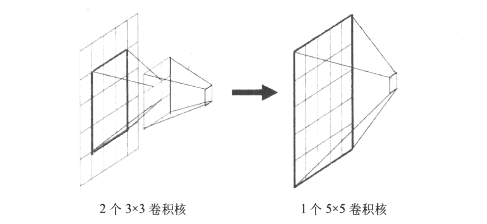

将多个3x3卷积核的卷积层堆叠在一起是一种非常有趣也非常有用的设计，这对降低卷积核的参数非常有帮助：在下采样特征提取的角度来看，这两者的效果是相同的：两个$3\times 3$卷积或是一个$5\times 5$卷积都会使当前位置的像素和周围$5\times 5$范围内的像素产生关联。

不过两层$3\times 3$​卷积产生的参数量（也就是两个核的大小）是$3\times 3\times 2 = 9$​，而一个$5\times 5$​卷积带来的参数量是$5\times 5 = 25$​。**也就是说，在获得相同感受野的情况下，两层$3\times 3$卷积所占的参数量更少**。同时，这种设计也会加强CNN对特征的学习能力（你可以简单理解为多了一个核，学习能力有所增强）。这种设计可以被推广用来替代更多的层，例如，你可以三层$3\times 3$卷积代替一层$7\times 7$​​​卷积，以此类推。

## 瓶颈层（Bottleneck Layer）：始于ResNet

Bottleneck layer又称之为瓶颈层，使用的是$1\times 1$​的卷积神经网络。之所以称之为瓶颈层，是因为长得比较像一个瓶颈。

如上图所示，经过$1\times 1$​的网络，中间那个看起来比较细。像一个瓶颈一样。使用 $1\times 1$​​卷积处理后可以大幅减少计算量。

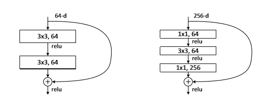

上图：有bottleneck和没有bottleneck的ResNet模块对比。使用瓶颈层，使得ResNet在保持上一层channel数量的同时降低下一层中卷积的运算量。瓶颈层并不总有用，在带有残差结构的网络中瓶颈层尤为有效。

在后面，我们还会聊到MobileNet V2中提出了一种称为线性瓶颈（Linear Bottleneck）层的结构。

## Inception结构：增加网络宽度

Inception Module是GoogLeNet的核心组成单元。其核心思想是将channel分成若干个不同感受野大小的通道，除了能获得不同的感受野，Inception还能大幅的降低参数数量。

### Inception V1

上图：一种Inception网路的示意。上图中`(a)`是Inception Module基本组成结构，其包含四个部分：$1\times 1$​卷积，$3\times 3$​卷积，$5\times 5$​卷积，$3\times 3$​最大池化。最后对四个成分运算结果进行通道上组合。

对于一个输入的Feature Map，首先通过三组$1\times 1$​卷积得到三组Feature Map，它和先使用一组$1\times 1$​卷积得到Feature Map，再将这组Feature Map分成三组是完全等价的（图2）。假设图1中$1\times 1$​卷积核的个数都是 $k_1$​， $3\times 3$​的卷积核的个数都是 $k_2$​，输入Feature Map的通道数为$m$​​，那么这个简单版本的参数个数为：
$$
m\times k_1 +3\times 3\times 3\times \frac{k_1}{3}\times \frac{k_2}{3}\\
=m\times k_1 + 3\times k_1\times k_2
$$
对比相同通道数但是没有分组的普通卷积，普通卷积的参数量为：
$$
m\times k_1 + 3\times 3\times k_1\times k_2
$$
这就是Inception Module的核心思想。**通过多个卷积核提取图像不同尺度的信息，最后进行融合，可以得到图像更好的表征**。

上图中`(b)`是对上述`(a)`的一种改进，即在$3\times 3$卷积，$5\times 5$卷积前加$1\times 1$卷积，目的是为了先进行降维（减少了通道数），相比较于原来结构减少了较多参数：

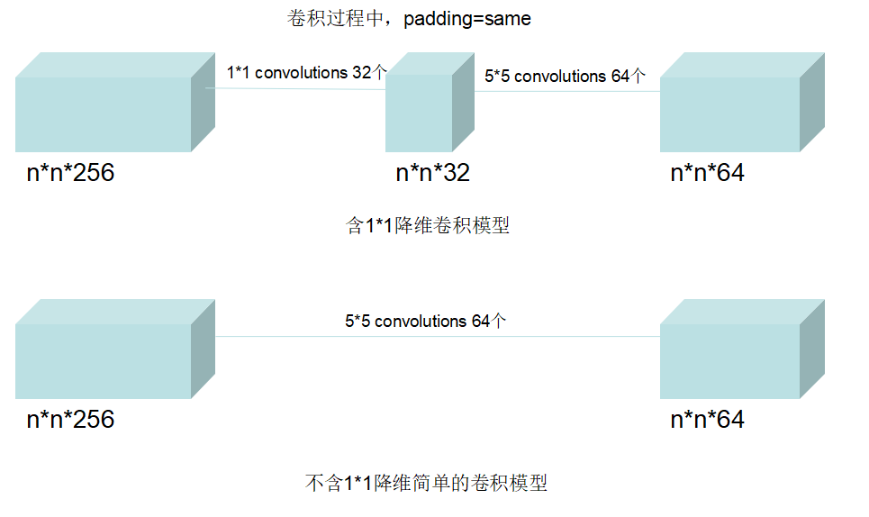

如上图所示，针对$5\times 5$卷积的这一层，不包含$1\times 1$的卷积模块时，参数量为：
$$
5\times 5\times 256\times 64=409600
$$
连接数为：
$$
(5\times 5\times 256+1)\times 64\times n\times n=409664\times n\times n
$$
而包含$1\times 1$的卷积模块时，参数量为：
$$
1\times 1\times 256\times 32+5\times 5\times 32\times 64=59392
$$
连接数为 ：
$$
((1\times 1\times 256+1)\times 32\times n\times n+(5\times 5\times 32+1)\times 64\times n\times n)\\
=59488\times n\times n
$$
而把$1\times 1$卷积放在$3\times 3$最大池化之后，相比较放在前面，也是为了参数量的减少。

### Inception V2

Inception V2学习了VGG使用$3\times 3$代替$5\times 5$卷积进一步减少计算量：

Inception V2 一方面了加入了BN层，减少了Internal Covariate Shift（内部neuron的数据分布发生变化），使每一层的输出都规范化到一个N(0, 1)的高斯；另外一方面学习VGG用2个3x3的conv替代inception模块中的5x5，降低了参数数量加速计算。

### Inception V3

学习Factorization into small convolutions的思想，将一个二维卷积拆分成两个较小卷积，例如将7*7卷积拆成1*7卷积和7*1卷积：

这样做的好处是降低参数量。paper中指出，通过这种非对称的卷积拆分（Factorization），比对称的拆分为几个相同的卷积效果更好，可以处理更多，更丰富的空间特征。论文指出，该设计使得网络结构得以进一步加深，并且增加了网络的非线性。

## 深度可分离卷积

### 深度卷积（Depthwise convolution）

深度卷积（Depthwise convolution）最早是由Google提出，是指将$N\times H\times W\times C$​输入特征图分为$group=C$​组（既Depthwise 是分组卷积的特殊简化形式），然后每一组做$k\times k$​卷积，计算量为$HWK²M$​（是普通卷积计算量的$\frac{1}{N}$​，通过忽略通道维度的卷积显著降低计算量）。Depthwise相当于对于每个通道，单独使用一个仅属于该通道的卷积核。

上图：普通的卷积。

上图：深度卷积。

因为卷积操作的输出通道数等于卷积核的数量，而Depthwise Convolution中对每个通道只使用一个卷积核，所以单个通道在卷积操作之后的输出通道数也为1。那么如果输入feature map的通道数为N，对N个通道分别单独使用一个卷积核之后便得到N个通道为1的feature map。再将这N个feature map按顺序拼接便得到一个通道为N的输出feature map。

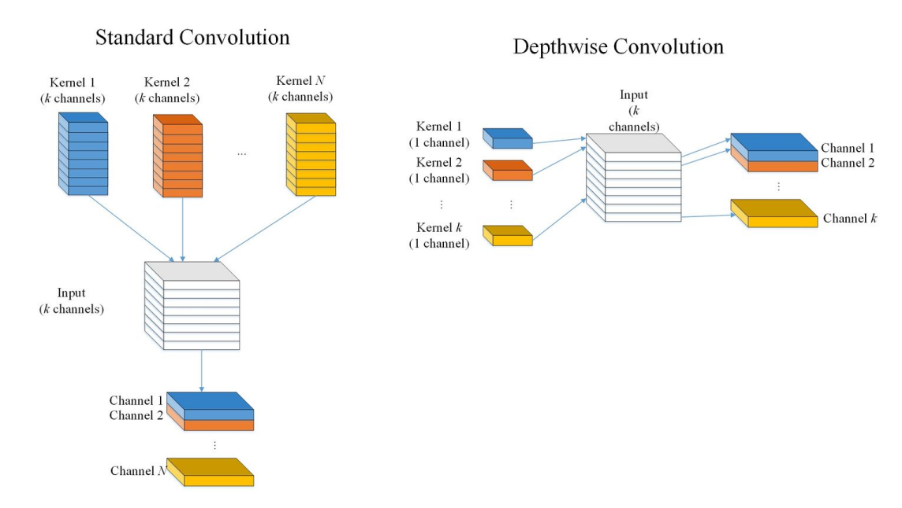

上图：Depthwise Convolution与普通卷积的直观对比。

对于计算性能，假设输入特征图的尺寸为$W\times H\times N$​​，卷积核的大小为$k\times k$​​​​。在这里假设步长$step = 1$​​那么可知单个卷积核共需要进行$k\times k\times H\times W\times N$​​​​​次计算。所以对于一个卷积核，其计算量为：
$$
k\times k\times H\times W\times N
$$
如果使用普通卷积，若输出维度为$M$，则对于$M$​个卷积核，其参数总量为：
$$
k\times k\times H\times W\times M\times N
$$
也就是说，深度卷积是普通卷积参数量的$\frac{1}{M}$​​。​在这里由于深度卷积输入和输出的通道数相等，故$M=N$，所以其参数量也可以写作普通卷积的$\frac{1}{N}$。

### 逐点卷积（Pointwise Convolution）

逐点卷积（Pointwise Convolution）实际为1×1卷积，它的卷积核的尺寸为$1\times 1\times M$​​（$M$​​是输入的通道数）。逐点卷积运算会将上一步的map在深度方向上进行加权组合，生成新的Feature map：

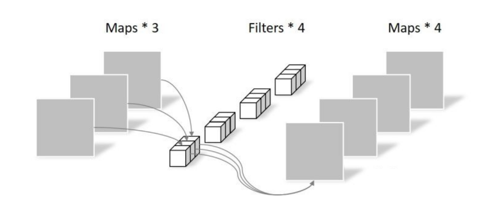

逐点卷积可以理解为在通道维度上的一维卷积。通过观察可以发现，逐点卷积中输出Feature map的数量等于卷积核的数量。

对于参数量，不难看出对于单个核，其参数量为$k\times k\times M\times N$上式中$k\times k$为卷积核尺寸。由于是在通道上进行的，所以$k=1$​。​所以单个核的参数量为$M\times N$，即输入通道乘以输出通道。

对于其计算量，之前我们分析过普通卷积的单次计算量为：
$$
k\times k\times H\times W\times M\times N
$$
而逐点卷积的计算量是：
$$
k\times k\times M\times N
$$
所以逐点卷积的计算量是普通卷积的$\frac{1}{H\times W}$。

### 深度可分离卷积（Depthwise Separable Convolution）

深度可分离卷积（Depthwise Separable Convolution，DSC）可以理解为深度卷积（Deepwise Convolution）和逐点卷积（Pointwise Convolution）的串联：

根据上文介绍的深度卷积和逐点卷积可以察觉，深度卷积仅对单个通道上的空间信息进行建模，并不会对通道间信息进行混合；而逐点卷积则恰好相反，仅对某个通道进行建模，而对每个通道的空间信息不做处理。深度可分离卷积将两者串联，使其同时具备混合空间和通道的能力。

上文中分析，深度卷积和逐点卷积计算量分别是普通卷积的$\frac{1}{N}$和$\frac{1}{H\times W}$​。对于上图中的情况，深度可分离卷积的计算量和普通卷积计算量的比值是$\frac{1}{N}+\frac{1}{H\times W}$。​

这种结构最早出现在一篇名为Rigid-motion scattering for image classification的论文中。但让大家对DSC熟知的则是著名的MobileNet和Xception。

### 深度可分离卷积与Inception的关系

Inception和DSC在研究动机上的关系是：

- Inception的假设是：图像的空间特征关系和通道间特征关系可以**在一定程度上**独立地计算；

- DSC的假设是：图像的空间特征关系和通道间特征关系可以**完全独立**地计算。

nception、DSC以及基于DSC的最著名的两个网络Xception和MobileNet均来自Google，所以它们之间存在非常密切的关系。关于Inception和DSC的动机，Xception这篇文章中有相关介绍。不过考虑到深度可分离卷积时间比较晚，所以这波也有可能是痛击友军。

### MobileNet V1

MobileNetV1基于深度可分离卷积构建了非常轻量且延迟小的模型，并且可以通过两个超参数进一步控制模型的大小，该模型能够应用到终端设备中，具有很重要的实践意义。

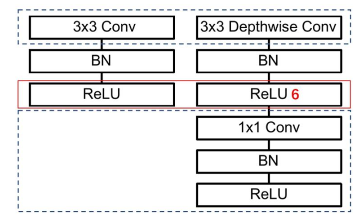

上图中左侧：标准的卷积单元；右侧：MobileNet V1中的网络单元。虚线处是不相同点。可以看出，MobileNet的网络单元首先使用3×3的深度卷积提取特征，接着是一个BN层，随后是一个ReLU层，在之后就会逐点卷积，最后就是BN和ReLU了。这也很符合深度可分离卷积，**将左边的标准卷积拆分成右边的一个深度卷积和一个逐点卷积**。`注：ReLU6是一种ReLU的修改版本。作者认为ReLU6作为非线性激活函数，在低精度（fixed-point arithmetic）计算下具有更强的鲁棒性`。

使用深度可分离的卷积对参数量的降低产生了显著的作用：

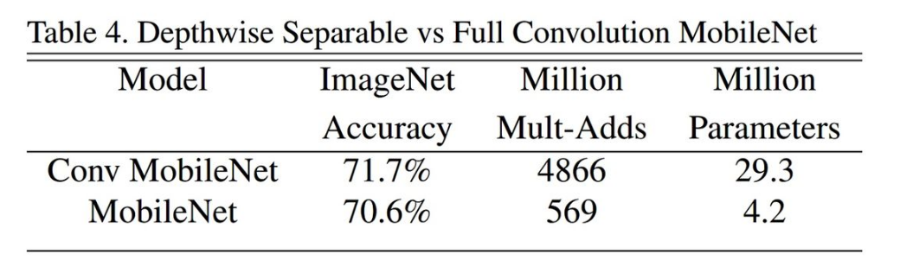

上图：使用标准卷积 VS 使用深度可分离卷积。

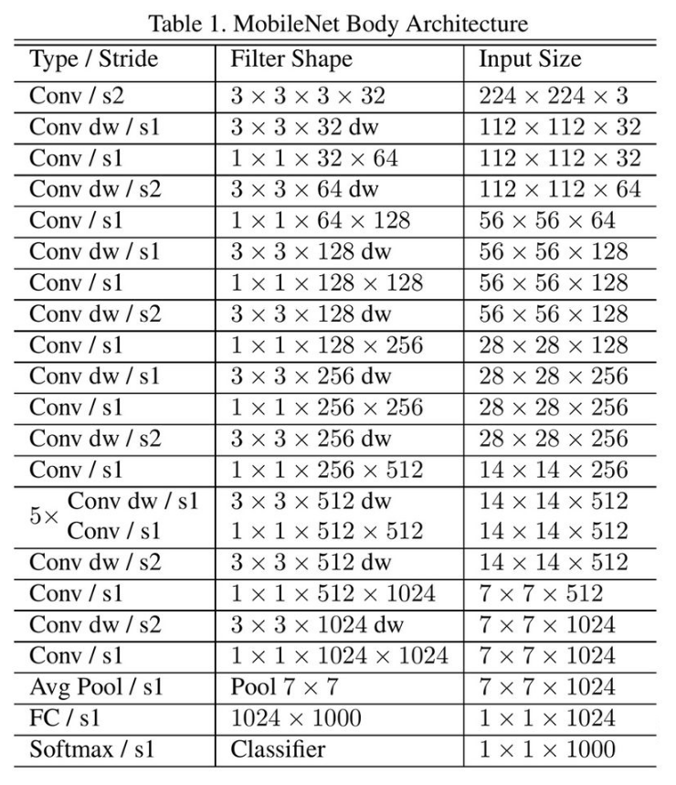

上表：MobileNet V1的网络结构。首先是一个$3\times 3$的标准卷积，$s2$进行下采样。然后就是堆积深度可分离卷积，并且其中的部分深度卷积会利用$s2$进行下采样。然后采用平均池化层将feature变成$1\times 1$​​，根据预测类别大小加上全连接层，最后是一个softmax层。整个网络有28层，其中深度卷积层有13层。

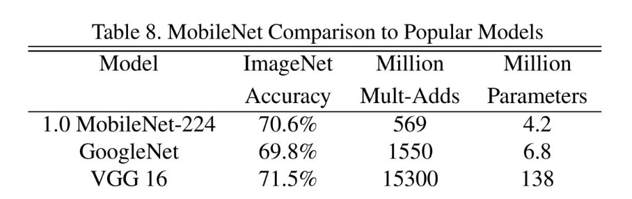

可以发现，作为轻量级网络的MobileNet V1在计算量小于GoogleNet，参数量差不多是在一个数量级的基础上，在分类效果上比GoogleNet还要好。`注：当时的ImageNet参数还是可以信一下的`。

### Xception: Extream Inception

Xception被称为极端的Inception。如果Inception是将$3\times 3$​卷积分成3组，那么考虑一种极端的情况，我们如果将Inception的 $1\times 1$​得到的$k_1$个通道的Feature Map完全分开呢？也就是使用$k_1$个不同的卷积分别在每个通道上进行卷积，它的参数数量是：

$$
m\times k_1 + k_1 \times 3\times 3
$$
更多时候我们希望两组卷积的输出Feature Map相同，这里我们将Inception的$1\times 1$卷积的通道数设为$k_2$，即参数数量为
$$
m\times k_2 + k_2 \times 3\times 3
$$
它的参数数量是普通卷积的$\frac{1}{k_1}$​，我们把这种形式的Inception叫做Extreme Inception：

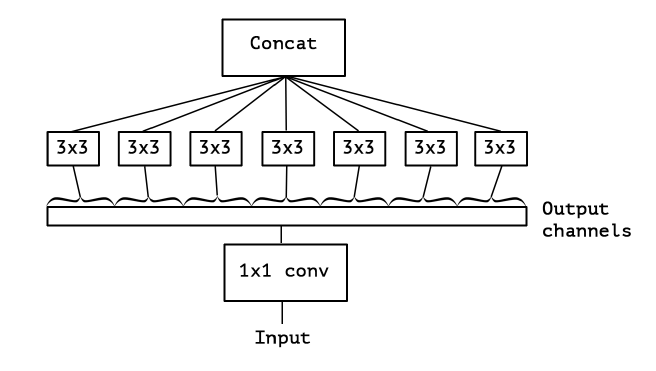

将Inception和Xception放在一起有助于观察其相关性：

左：Inception示意；右：Xception。

深度可分离卷积和Xception不完全相同。区别之一就是先计算Point-wise卷积还是先计算Deep-wise卷积的问题；另一个区别是Xception是线性的，而深度可分离的卷积不严格线性。

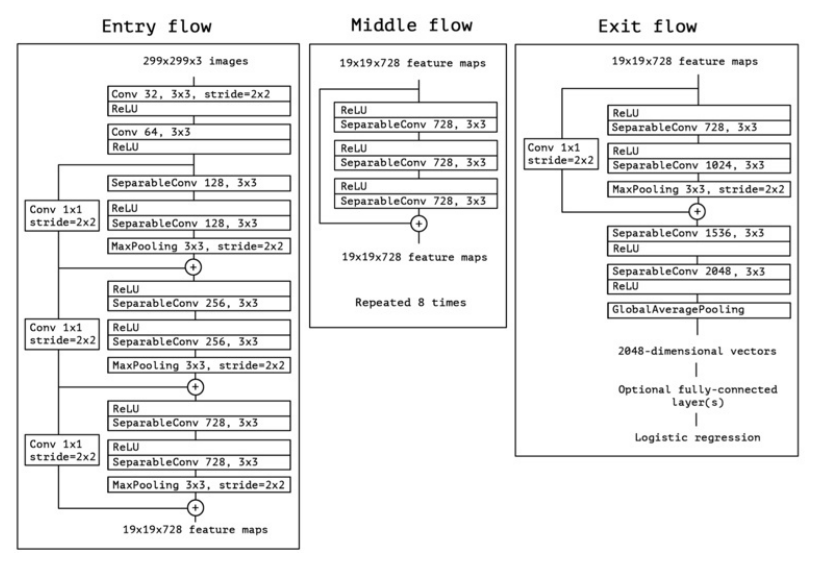

上图：结合残差结构，一个完整的使用Xception的网络。

## 请不要在低维乱激活

低维空间可以简单理解为channel数比较少的情况。在低维乱激活，举个例子，你将通道数为3的特征图传入了激活层。这样做容易引起训练参数出现崩塌的情况。在轻量级网络设计中，在较浅层的网络进行激活、进行疯狂的通道裁剪、使用深度可分离的卷积等都可能导致奇怪的问题。

### MobileNet V1 出现的训练时崩坏

MobileNetV1既能较少不小的参数量、计算量，提高网络运算速度，又能的得到一个接近于标准卷积的还不错的结果，看起来是很美好的。但是，有人在实际使用的时候， 发现深度卷积部分的卷积核在训练中比较容易“失效”：训完之后发现深度卷积训出来的卷积核有不少值是0：

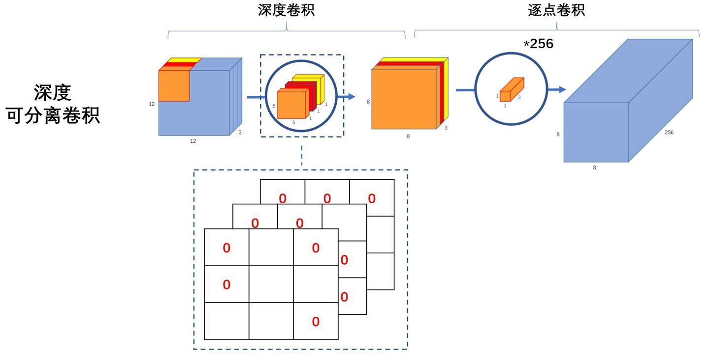

在MobileNet V2的论文中，作者称网络层中的激活特征为兴趣流形（mainfold of interest），论文中有如下观点：

> It has been long assumed that mainfolds of interest in neural networks could be imbedded in low-dimensional subspaces. In other words, when we look at all individual d-channel pixels of a deep convolutional layer, the information encoded in those values actually lie in some mainfold, which in turns is embeddable into a low-dimensional subspace.

通俗点说，我们查看的卷积层中所有单个$d$​​​通道像素时，这些值中存在多种编码信息，兴趣流行位于其中。我们可以通过变换，进一步嵌入（Embade）到下一个低维子空间中。

但是，由于网络中存在非线性的激活函数，以ReLU变换$F(x) = \max(0,x)$为例，存在一个特性：如果当前激活空间内兴趣流形完整度较高，经过ReLU，可能会让激活空间坍塌，不可避免的会丢失信息。

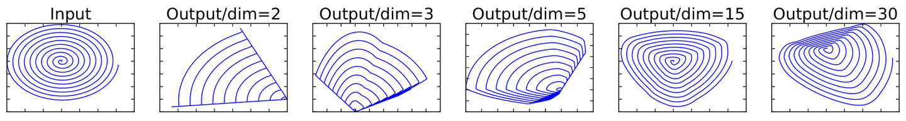

上图：将低维流形的ReLU变换embeding到高维空间中的的例子（如果你不了解Embedding，可以查看[这篇](./[5]embedding-space.md)文章）。如图所示，Input是一个2维数据，其中兴趣流形是其中的蓝色螺旋线。本例使用矩阵$T$将数据嵌入到n维空间中，后接ReLU，再使用其逆矩阵$T^{-1}$​将其投影回原空间。

可以观察到，当$n = 2,3$​​​时，与Input相比有很大一部分的信息已经丢失了。而当$n = 15,30$​​​​，还是有相当多的分布信息被恢复回来。

回想深度可分离卷积中有关深度的部分，在单个通道上的ReLU运算就是对低维度做ReLU运算。根据上面的说法，**对低维度做ReLU运算，很容易造成信息的丢失。而在高维度进行ReLU运算的话，信息的丢失则会很少。**这也是轻量级网络设计应该注意和避免的拟合空间中容易出现的问题。

**这就解释了为什么深度卷积的卷积核有不少是空**。发现了问题，我们就能更好地解决问题。针对这个问题，可以这样解决：既然是ReLU导致的信息损耗，**将ReLU替换成线性激活函数**。

### MobileNet V2：使用线性瓶颈（Linear Bottleneck）和反残差（Inverted Residuals）对抗崩坏

瓶颈（Bottleneck）层来源于ResNet，其设计本源是为了避免在残差网络中巨大的计算量。线性瓶颈（Linear Bottleneck）层的设计则源于MobileNet V2，目的是为了解决在MobileNet V1中出现的训练时崩坏问题。

线性瓶颈是使用$1\times 1$卷积实现的。其目的是为了在网络进入深度卷积（Depthwise Convolution）之前对特征先进行升维，之后再进行降维恢复其原通道数。升维的$1\times 1$卷积被称为“Expantion Layer”，降维的$1\times 1$卷积被称为“Projection Layer”。这样叫大概就是因为想表示这是在做[Embedding](./[5]embedding-space.md)吧。

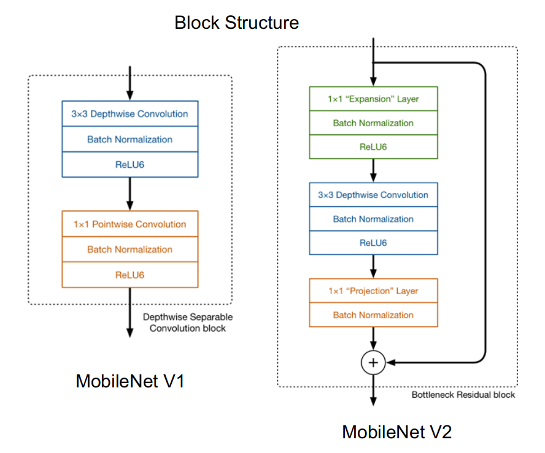

上图：MobileNet V1和MobileNet V2网络基础块结构的对比。所以实际上，MobileNet V2中提出的线性瓶颈层（对特征进行了升维）作用和ResNet中的瓶颈层（对特征进行了降维）效果完全相反：

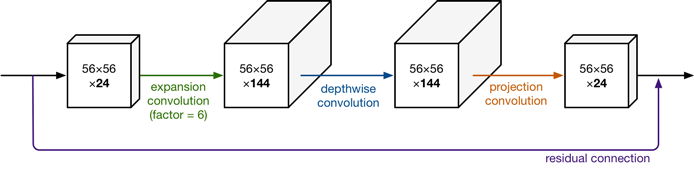

上图详细的展示了整个模块的结构。输入是24维，最后输出也是24维。但这个过程中，特征图被扩展了6倍（$channel : 24\to 144$），然后应用深度可分离卷积进行处理。整个网络是中间胖，两头窄，像一个纺锤形。**bottleneck residual block（ResNet论文中的）**是中间窄两头胖，在MobileNetV2中正好反了过来，所以，在MobileNetV2的论文中我们称这样的网络结构为**Inverted residuals**。需要注意的是residual connection是在输入和输出的部分进行连接。

可以作出以下简单的理解：

MobileNet V1 网络块的结构为：

1. Depthwise convolution
2. Pointwise convolution

MobileNet V2 网络块的结构为：

1. Pointwise convolution（Expantion Layer）
1. Depthwise convolution
2. Pointwise convolution（Projection Layer）

上述修改使得特征空间先升维，再进行ReLU计算，其后再进行降维。从而避免了在MobileNet V1中出现的问题。

## 神经网络搜索

### MobileNet V3

MobileNet V3的论文名称为“Searching for MobileNetV3”。“searching”一词就把V3的论文的核心观点展示了出来——用**神经结构搜索（NAS）**来完成V3。

MobileNetV3先基于AutoML构建网络，然后进行人工微调优化，搜索方法使用了platform-aware NAS以及NetAdapt，分别用于全局搜索以及局部搜索，而人工微调则调整了网络前后几层的结构、bottleneck加入[SE模块](../unlimited-paper-works/[23]Squeeze-and-Excitation-Networks.md)以及提出计算高效的h-swish非线性激活。

> "抱歉，有钱真的可以为..."

实在没钱，没接触过NAS，等有机会弄懂了再回来补上。

