# Transformer到Vision Transformer

> 这篇文章中大量使用李宏毅教授讲课的PPT图片。

[注意力（Attention）机制](./[4]attention.md)由Bengio团队与**2014年**提出并在近年广泛的应用在深度学习中的各个领域，例如在计算机视觉方向用于捕捉图像上的感受野，或者NLP中用于定位关键token或者特征。

2018年，谷歌团队近期提出的用于生成词向量的BERT算法在NLP的11项任务中取得了效果的大幅提升。而BERT算法的最重要的部分便是本文中提出的Transformer的概念。

自注意力经过了数年的研究和发展，其实并不是一种很新的方法。Transformer只是对这种方法的极端化。最初的Transformer是一个Sequence to Sequence model，它大量用到了self-attention。 或者换句话说，整个Transformer舍弃了传统CNN和RNN的结构，整个网络由Self-Attention组成。

## 在序列中建立关系

在前馈神经网络中，信息的传递是单向的。这种限制虽然使得网络变得更容易学习，但在一定程度上也减弱了神经网络模型的能力。一般而言，我们可以通过给网络增加短期记忆能力来解决这个问题。例如：延时神经网络、  循环神经网络等。

循环神经网络(Recurrent Neural Network，RNN)是一类具有短期记忆能力的神经网络，它能够处理序列变化的数据。比如某个单词的意思会因为上文提到的内容不同而有不同的含义，RNN就能够很好地解决这类问题。

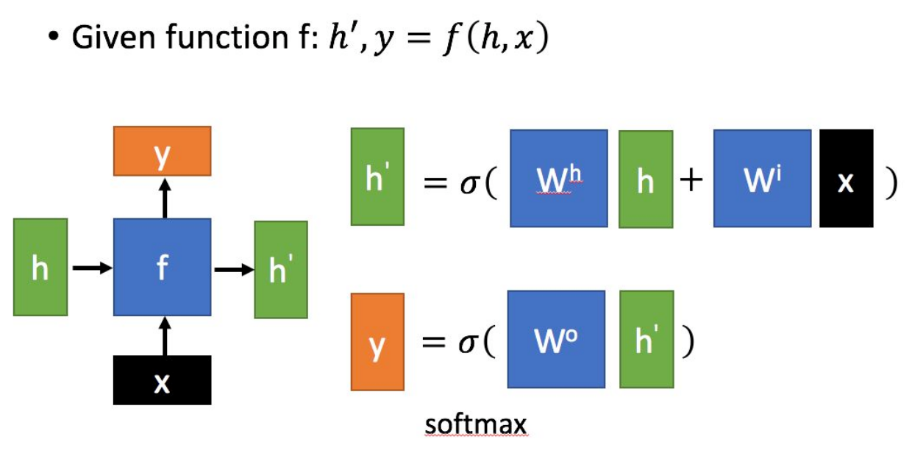

上图：一种常见的RNN结构示意图。其中，$x$是当前状态下的数据输入；$h$​表示上一个状态的输入；$y$表示当前状态的输出；$h'$​​代表传递到下个节点的输出。

上图：CNN的一种更简单的示意。给定一个输入序列$x_{1:T} = (x_1 , x_2, ... , x_t , ... , x_T )$，循环神经网络通过下面公式更新带反馈边的隐藏层的活性值$h_t$：
$$
h_t = f(h_{t-1},x_t)
$$
其中$h_0 = 0,f(\cdot)$​是一个非线性函数, 可以是一个前馈网络。从数学上讲，上述公式可以看成一个动力系统。隐藏层的活性值$h_t$​在很多文献上也称为状态(State)或隐状态(Hidden State)。

由于循环神经网络具有短期记忆能力，相当于存储装置，因此其计算能力十分强大。理论上，循环神经网络可以近似任意的非线性动力系统.前馈神经网络可以模拟任何连续函数，而循环神经网络可以模拟任何程序。

### RNN的老问题

Transformer中抛弃了传统的CNN和RNN，整个网络结构完全是由Attention机制组成。更准确地讲，Transformer由且仅由self-Attenion和Feed Forward Neural Network组成。

Transformer中采用Attention取代了传统RNN结构的原因是考虑到RNN（LSTM，GRU等）的计算限制为是顺序的，也就是说RNN相关算法只能从左向右依次计算或者从右向左依次计算，这种机制带来了两个问题：

1. 时间片$t$的计算依赖$t-1$时刻的计算结果，这样限制了模型的并行能力。
2. 顺序计算的过程中信息会丢失，尽管LSTM等门机制的结构一定程度上缓解了长期依赖的问题，但是对于长距离依赖（在CNN上，也有人试图解决长距离依赖的问题。可以参考[Non-Local Neural Networks](../unlimited-paper-works/[27]Non-local-Neural-Networks.md)）的建立LSTM依旧无能为力。

### CNN可以具有RNN的功能

针对刚才提到的RNN的老问题，有人提出使用CNN代替RNN：

例如，对于序列输入$a_1,a_2,a_3,a_4$​​​，RNN要计算出输出$b_4$​​的值，就需要先处理$a_1,a_2,a_3$​​，然后再处理$a_4$​​​。如上图中左侧示意。右侧是使用CNN处理序列输入的样例，其中每一个三角形代表一个一维的卷积核，有几个输出就有几个卷积核。需要对输入建立多长的依赖就将卷积核设置为多大。

单层卷积只能考虑非常有限的内容。比如上图中右侧的CNN的filter只考虑了3个vector，不像RNN可以考虑之前的所有vector。当然，你也可以通过堆叠卷积层获得更长的依赖关系：

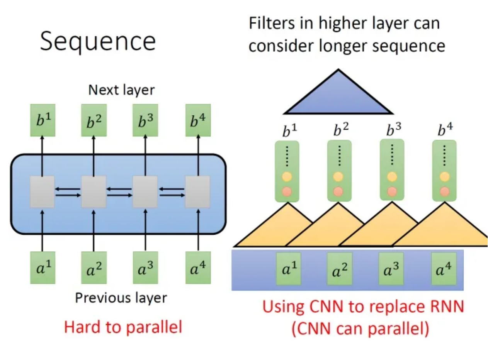

你只需要堆叠filter，多堆叠几层，上层的filter就可以考虑比较多的资讯，比如，上图中右侧第二层的filter (蓝色的三角形)看了6个vector，所以，只要叠很多层，就能够看很长时间的资讯。

所以，用CNN，你确实也可以做到跟RNN的输入输出类似的关系，也可以做到输入是一个sequence，输出是另外一个sequence。

## Transformer中的自注意力

Transformer的提出解决了上面两个问题，首先它使用了Attention机制，将序列中的任意两个位置之间的距离是缩小为一个常量；其次它不是类似RNN的顺序结构，因此具有更好的并行性，符合现有的GPU框架。

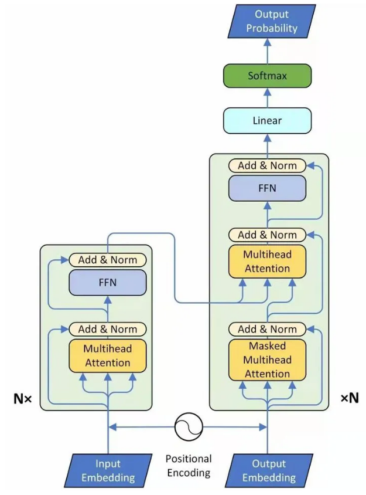

> Transformer is the first transduction model relying entirely on self-attention to compute representations of its input and output without using sequence aligned RNNs or convolution.

上文为Transformer原论文中对Transformer进行的定义。

最初的Transformer是一个Sequence to Sequence的模型。在刚才的讨论中我们发现，要实现Sequence to Sequence，并不一定要使用RNN。重点是，我们需要一种网络层，其功能是在一个序列输入上能够建立关系，并产生序列输出。**在Transformer中有一种新的layer，叫self-attention Layer，它的输入和输出和RNN是一模一样的，输入一个sequence，输出一个sequence**。

### Self-Attention（自注意力）

所谓自注意力，就是输入作为一个群体，让自身的每一个元素之间建立关系。

上图：自注意力模型的一种模式。接下来Query-Key-Value的模式进详解：

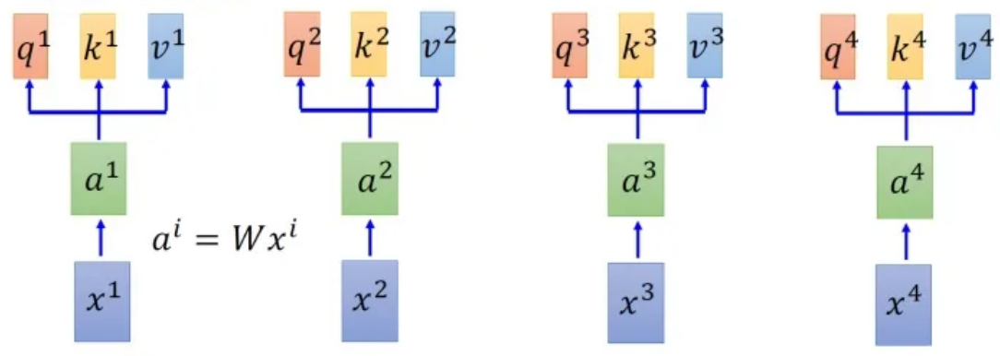

首先假设我们的input是上图中的序列$x_1$​​~$x_4$​​，每一个input (vector)先乘上一个矩阵得到embedding，即向量$a_1$​​~$a_4$​​ 。接下来这些向量分别乘上3个不同的transformation matrix（其实也可以理解成三个不同的embedding） $W_q$​​、$W_k$​​和$W_v$​​，以向量$a_1$​​为例，就会分别得到3个不同的向量$q^1$​​、$k^1$​​和$v^1$​​​ 。

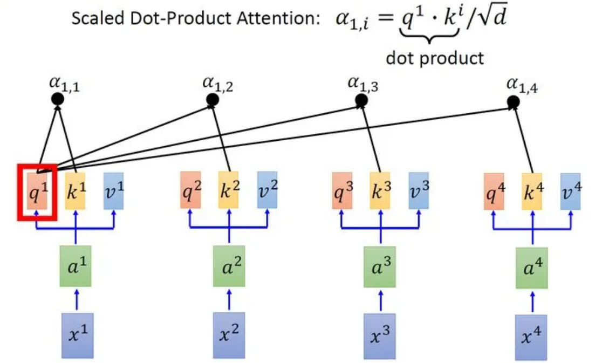

接下来使用每个query $q$去对每个key $k$做attention，attention就是匹配这2个向量有多接近，比如我现在要对$q^1$和$k^1$做attention，我就可以把这2个向量做scaled inner product（$a_{i,j}=q^i*k^j / \sqrt{d}$，$d$是$q$和$k$的维度。这里处以$\sqrt{d}$相当于归一化的效果），得到$a_{1,1}$，再取$q^1$和$k^2$做attention，得到$a_{1,2}$，再取$q^1$和$k^3$做attention，得到$a_{1,3}$，再取$q^1$和$k^4$做attention，得到$a_{1,4}$。以此类推。这便是自注意力的打分函数设计。

接下来需要对所有计算得到的$a_{1,i}$进行$softmax$运算：

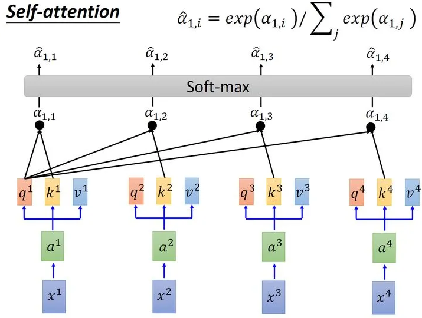

取完softmax操作以后，我们得到了$\hat{\alpha}_{1,i}$，我们用它和所有的$v^i$值进行相乘。具体来讲，把$\hat{\alpha}_{1,1}$乘上$v^1$，把$\hat{\alpha}_{1,2}$乘上$v^2$，把$\hat{\alpha}_{1,3}$乘上$v^3$，把$\hat{\alpha}_{1,4}$乘上$v^4$，把结果相加得到$b^1$。在产生$b$的过程中用了整个序列的特征(Considering the whole sequence)。如果要考虑local的特征，则只需要学习出相应的$\hat{\alpha}_{1,i}=0$，$b^1$上就不再带有$i$对应分支的信息了；如果要考虑global的特征，则需要学习出相应的$\hat{\alpha}_{1,i}\neq 0$，$b^1$上就带有$i$对应分支的信息了。

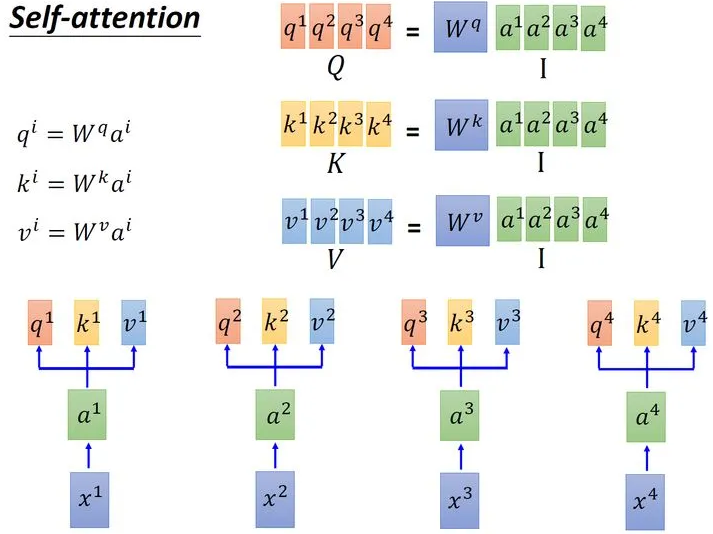

在上述的过程中使用的三个值：$q$、$k$、$v$分别是输入$x$经过embadding变为$a$后分别与$W^q$、$W^k$、$W^v$相乘得到的。其中$q$用来表示当前向量的查询值，查询值和其他所有向量的$k$输入打分函数获得当前向量的相关性矩阵$b$，然后相关性$b$和当前向量的代表值$v$相乘得到输出。

以上注意力模式可以表示为公式：
$$
Attention = QK^TV
$$
其中$Q$为输入中元素的向量表示，$K$是键key的向量表示，$V$是值value的向量表示。

让它具有自注意力机制的最简单的办法就是令$Q=K=V$， 则在键值注意力中，计算相关性的过程就发生在输入本身内部（因为在键值注意力中是$Q$和各个$K$的相关性，在用$V$​​进行加权）。

### Self-Attention Layer（自注意力层）

Self-Attention可以被表示为一串连续的矩阵相乘操作：

整个过程可以表示为：输入矩阵$I\in \R^{d,N}$​​​​，分别乘以三个矩阵$W_q,W_k,W_v \in \R^{d,N}$​​​​得到三个维度相同的中间矩阵$Q,K,V\in \R^{d,N}$​​​。​将$K$​​​转置后与$Q$​​​相乘得到注意力矩阵$A\in \R^{N,N}$​​，代表输入中每一个元素两两之间的Attention。再将这个矩阵取Softmax，得到$\hat{A}\in \R^{N,N}$​，最后将得到的$\hat{A}$乘以矩阵$V$​得到输出。所以可以被表示为：
$$
Attention = QK^TV
$$

这个运算过程被封装在一个网络层中，称为Self-Attention Layer。

### Multi-Head（多头）注意力

如其名，多头自注意力机制可以表视为对于输入建立多套关系。刚才聊过的Self-Attention Layer对输入的每个元素建立了一套关系，对于多头注意力，例如两头注意力：

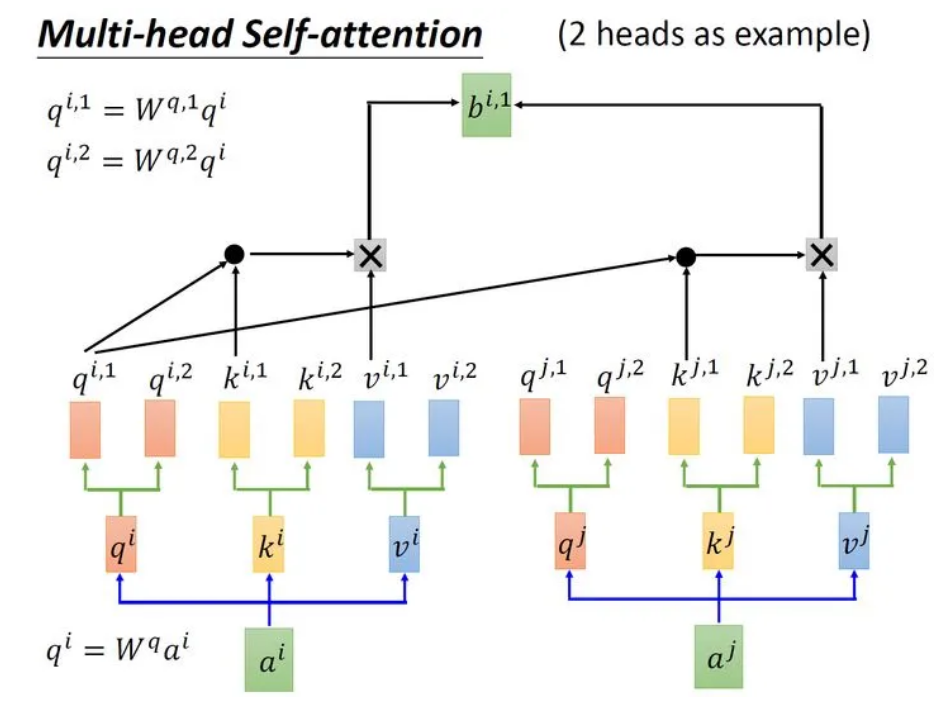

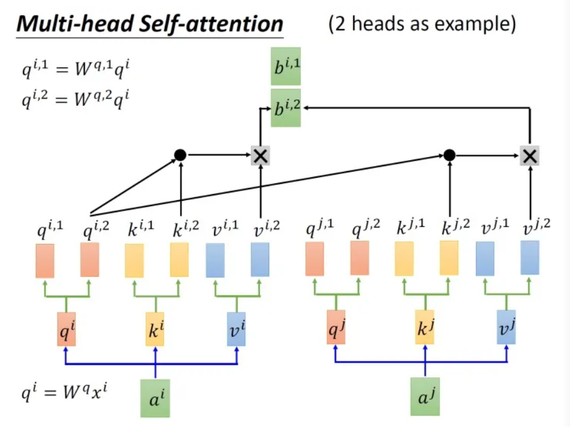

可以看出 Multi-Head Attention 包含多个 Self-Attention 层，首先将输入$X$分别传递到 2个不同的 Self-Attention 中，计算得到 2 个输出结果。得到2个输出矩阵之后，Multi-Head Attention 将它们拼接在一起 (Concat)，然后传入一个Linear层，得到 Multi-Head Attention 最终的输出$Z$。可以看到 Multi-Head Attention 输出的矩阵$Z$与其输入的矩阵$X$​的维度是一样的。

刚才提到，多头注意力就是建立了多组注意力。每一组注意力分别关注到了不同的关系。例如：

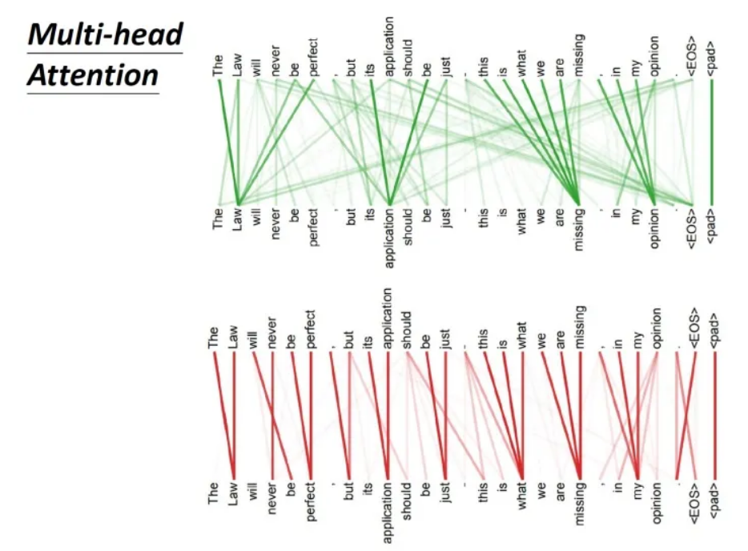

上图是一组Multi-head Self-attention的示意，其中绿色部分是一组query和key，红色部分是另外一组query和key，可以发现绿色部分其实更关注global的信息，而红色部分其实更关注local的信息。

**通过多头，自注意力建立起了对不同关系的关注。**

### Positional Encoding（位置编码）

在刚才对多头注意力的描述中存在一个问题，那就是Self-Attention无法显式地编码位置信息。也就是说，可能存在一个单词向量与距离较近和距离较远的单词无差别建立关系的情况。Transformer原论文中这样描述这个问题：

> No position information in self attention

通俗地讲，在没有位置信息的情况下可能产生"A打了B"与"B打了A"被认为是相同语义的情况。解决方案如图所示：

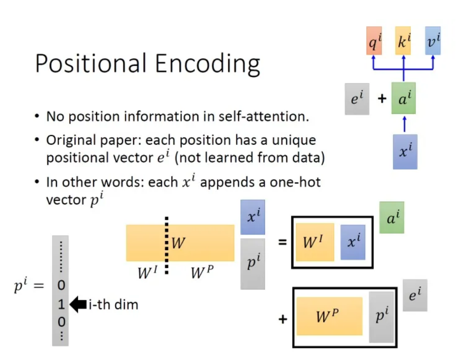

具体的做法是：给每一个位置规定一个表示位置信息的向量$e^i = W^Pp^i$​，让它与$a^i$​相加后作为新的$a^i$​参与后续运算。不过这个$e^i$​​的产生方法是人工设计的，而不是学习获得的。**设计的原则是对于输入中每一个位置都有一个不同的$e^i$​​​**。

## Transformer运行时

### Transformer的结构

下图就是Transformer，一个seq2seq的model：

其中，左侧为 Encoder block，右侧为 Decoder block。黄色的块是Multi-Head Attention。Transformer是由多个Self-Attention组成的，可以看到 Encoder block 包含一个 Multi-Head Attention，而 Decoder block 包含两个 Multi-Head Attention (其中有一个用到 Masked)。Multi-Head Attention 上方还包括一个 Add & Norm 层，Add 表示残差连接 (Residual Connection) 用于防止网络退化，Norm 表示 Layer Normalization，用于对每一层的激活值进行归一化。

Transformer训练时采用一组输入，对应一个输出。一组输入分别是$x$（对应上图中的Input Embedding）和$y$​（对应上图中的Output Embedding），预测的输出是$\hat{y}$​​（对应上图中的Output Probability）。

接下来我们将聊一下Encoder和Decoder中分别在做什么。

### Encoder（编码器）

### Decoder（解码器）

### 训练时

### 预测时

## Transformer+Detection

