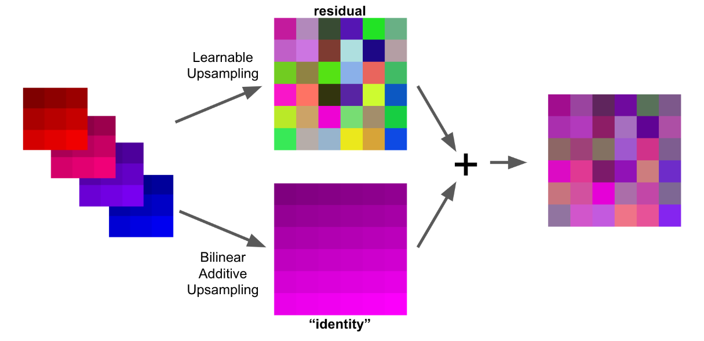

# The Devil is in the Decoder: Classification, Regression and GANs

这是一篇讲各种各样解码器的论文。[原论文（The Devil is in the Decoder: Classification, Regression and GANs）](/papers/The-Devil-is-in-the-Decoder-Classification-Regression-and-GANs.pdf)。

由于“解码器（decoder，有些时候也被称为feature extractor）”的概念与像素级的分类、回归等问题多多少少都有瓜葛。以下是decoder被应用于像素级的任务：

- 分类：语义分割、边缘检测。
- 回归：人体关键点检测、深度预测、着色、超分辨。
- 合成：利用生成对抗网络生成图像等。

所以decoder是稠密预测（Dence prediction，像素级别的很多问题都可以叫做稠密的）问题的关键。

摘要：

> Image semantic segmentation is more and more being of interest for computer vision and machine learning researchers. Many applications on the rise need accurate and efficient segmentation mechanisms: autonomous driving, indoor navigation, and even virtual or augmented reality systems to name a few. This demand coincides with the rise of deep learning approaches in almost every field or application target related to computer vision, including semantic segmentation or scene understanding. This paper provides a review on deep learning methods for semantic segmentation applied to various application areas. Firstly, we describe the terminology of this field as well as mandatory background concepts. Next, the main datasets and challenges are exposed to help researchers decide which are the ones that best suit their needs and their targets. Then, existing methods are reviewed, highlighting their contributions and their significance in the field. Finally, quantitative results are given for the described methods and the datasets in which they were evaluated, following up with a discussion of the results. At last, we point out a set of promising future works and draw our own conclusions about the state of the art of semantic segmentation using deep learning techniques.

我看了这篇综述受益匪浅，如果有时间的话请阅读[原作](/papers/The-Devil-is-in-the-Decoder-Classification-Regression-and-GANs.pdf)。本文只是对原作阅读的粗浅笔记。

---

​		语义分割、深度预测等计算机视觉任务往往需要对输入进行逐像素的预测，用于解决此类问题的模块通常由编码器组成。编码器（行为上是下采样的，通常情况下是卷积、池化组成的）在学习高维度特征的同时会降低输入图像的空间分辨率；在这之后是将其恢复原始分辨率的解码器（行为是上采样的，通常情况下是转置卷积等操作组成的）：

```
编码器（特征提取器，降低特征图分辨率）---解码器（提高特征图分辨率）
```

## 相关研究（Related works）

​		这篇论文主要的内容是针对各种像素级的计算机视觉任务，对各种解码器进行了较为广泛的比较。以下是这篇论文的主要贡献：

1. 提出选择不同类型的解码器对效果的影响非常巨大
2. 为解码器引入了类似残差（residual connection）的新连接
3. 介绍了一种比较新颖的解码器：双线性加和上采样（bilinear additive upsampaling）
4. prediction artifacts（真的没想好怎么翻译）

---


我们将需要逐像素预测的问题成为密集预测（dence prediction）的问题。通常编码器-解码器结构是用于解决这种密集预测问题的：首先，编码器（特征提取器）在增加通道数量的同时降低了图像的空间分辨率（通常为8~32倍）；然后，解码器进行上采样恢复到输入原图大小。从概念上讲，此类解码器可以被视为和编码器相反的操作：一个解码器至少由一个提高空间分辨率的层（通常称为上采样层）以及可能保持空间分辨率的层（例如单位卷积、残差快或是起始块）组成。其中 ，用于保持空间分辨率的层已经有了比较成熟的研究，所以这一篇论文只分析提升空间分辨率的部分。

目前在单个计算机视觉领域内使用最多的是转置卷积（transposed convolution），它在分割、深度预测、超分辨重建等任务中都有比较详细的论文进行研究。详见原论文中的相关字段。

还有一些为了加快模型速度进行的研究，例如：二维卷积在图像分类和语义分割的背景下被分解成两个一维卷；还有一些比较新颖的堆叠的沙漏结构（似乎也可以叫金字塔结构），它是由堆叠的多个编码器-解码器组成。

## 现存的上采样层设计Existing upsampling layers）

### 转置卷积（Transposed Convolution）

转置卷积是最常用的上采样层，有的时候也被称为“反卷积”或是“上卷积”。在输入和输出的关联关系上，转置卷积可以看作是卷积的一种反向操作，但实际上这并不是严格意义的逆运算，逆运算应该是可以被精确计算的，而转置卷积的计算结果并不是精确结果。转置卷积的一种示意如下图：


如图，常见的转置卷积一般会通过某种方式在输入中填充0，以获得一张更大的特征图，其后使用一个标准的卷积运算获得一个比最初始的输入大一些的特征图作为输出。

### 分解的转置卷积（Decomposed transposed convolution）

分解的转置卷积和转置卷积是相似的：


只不过分解的转置卷积将主卷积运算分为多个低秩卷积。例如，在图像中，分解的转置卷积通过两个一维的卷积对二维的卷积进行模拟。例如上图中，对于输入，先在行上进行隔行填充，然后使用一维的卷积核进行卷积，再在列上进行隔列填充，再使用一维的卷积核进行卷积。

分解的转置卷积严格意义上是转置卷积的子集。


如上图，这样做的优势是降低了可训练变量的数量（降低了参数量）。

分解的转置卷积已经在inception结构中获得了成功：在ILSVRC2012分类赛中获得了the state of the art的成果。

### 深度到空间的转换（Depth-to-space）

这种方法（Depth to space）有时也被称为“subpixel convolution”的基本思路是将特征通道移入空间域：


如上图，本应堆叠在channel维度的不同特征被融合进一个深度为1的平面特征图。这种方法能够很好地保留空间特征，因为它所做的仅仅是改变它们的位置而不是将它们堆叠进channel，而这种方法的缺点是引入了对齐伪像。为了能够和其他几个上采样方法进行横向对比，这篇论文在进行从深度到空间的转换实验之前的下采样卷积比其他上采样层的输出通道多了四倍。

### 插值法（Interpolation）

#### 最临近插值法（Nearest Interpolation）


最近邻法不需要计算只需要寻找原图中对应的点，所以最近邻法速度最快，但是会破坏原图像中像素的渐变关系，原图像中的像素点的值是渐变的，但是在新图像中局部破坏了这种渐变关系。

#### 线性插值法（linear interpolation）

线性插值法（单线性插值法）是指使用连接两个已知量的直线来确定在这个两个已知量之间的一个未知量的值的方法。 


根据初中的知识，2点求一条直线公式，这是双线性插值所需要的唯一的基础公式。

#### 双线性插值（Bilinear interpolation）

双线性插值可以理解为进行了两次单线性插值：


先在x方向求2次单线性插值，获得R1(x, y1)、R2(x, y2)两个临时点，再在y方向计算1次单线性插值得出P(x, y)（实际上调换2次轴的方向先y后x也是一样的结果）

### 双线性上采样+卷积（Bilinear upsampling + Convolution）

双线性上采样+卷积的意思就是在双线性插值之后进行卷积运算。为了和其他上采样方法比较，这篇论文中假设在上采样之后还要进行额外的卷积运算。这种方法的缺点是占用了大量内存和计算空间：双线性插值会二次增加特征量，但同时保持原来的“信息量”。由于假设了双线性上采样之后接有卷积运算，因此这种方法理论上比转置卷积方法的开销高四倍。

### 双线性上采样+可分离卷积（Bilinear upsampling+Separable convolution）

可分离的卷积用于构建简单且同质的网络结构，其结果优于InceptionV3。


如上图：一个可分离的卷积又两个操作组成：一个是对每个通道的卷积，另一个是使用`(1x1)`卷积核的逐点卷积对通道进行“混合”。

### 双线性加性上采样（Bilinear additive upsampleing）

这个方法是这篇论文在对上述现存的方法进行了叙述后提出的新方法。

该论文建议继续使用双线性上采样，但是该论文还将每N个连续的通道相加，从而将输出降低了N倍：


如上图，该方法的过程是确定性的，唯一可调的参数是N。虽然这个方法很像是之前说的“深度到空间的转换（Depth-to-space）”，但是这个方法并不会导致空间伪像的出现，也就是不需要考虑对齐操作。

在这篇论文的实验中，作者选择参数N的标准是让进行双线性加性上采样后和之前的浮点数相等，这使得这种上采样的性能开销类似于转置卷积。

## 跨层连接和残差连接方法（Skip connections and residual connections）

### 跨层连接（Skip connections）

跨层连接有时也被叫做跳跃连接。这种方法已经在很多解码器结构中获得成功，并且在很多其他的计算机视觉任务中取得了不错的成绩。


在这种方法中，解码器的每一层输入有两个来源：第一个是上层解码器得到的输出；第二个是在编码器中输出大小和自身输入大小匹配的一层输出的特征。

### 解码器的残差连接（Residual connections for decoders）

残差连接已经在很多不同的计算机视觉任务中被证明是有效的（来源是ResNet）。但是，残差连接并不能直接应用于解码器：在解码器中，下一层比上一层具有更大的空间分辨率和更少的通道数，这和起初残差被提出时的条件恰好相反。所以该论文提出了一个可以解决这些问题的转换方法：特别是上面提出的双线性加性上采样（Bilinear additive upsampleing）方法将输入转化为所需的空间大小和所需的通道数而无需提供任何额外的参数。其转化的特征包含了原始特征的很多信息。因此，可以使用这种转换方法（不进行额外的卷积）进行转换，然后将转换结果输入到任何上采样层的输出中作为下一个上采样层的输入，从而形成类似残差的连接：



上图是对这种方法进行的图形化解释。在后面的内容中，这篇论文通过实验证明了这种方法的有效性。

## 实验和实验设置（Task and experimental setups）

实验部分请查看[原论文](/papers/The-Devil-is-in-the-Decoder-Classification-Regression-and-GANs.pdf)。

