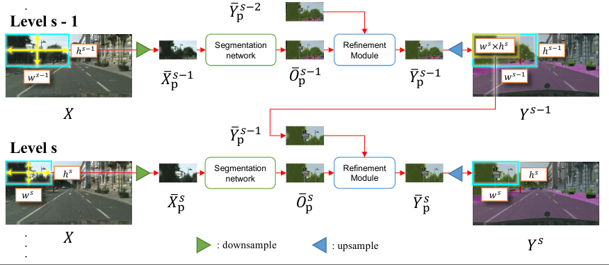
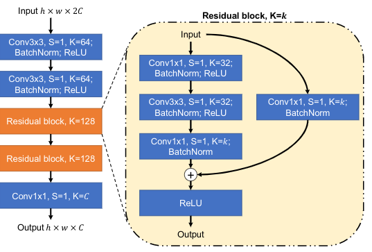

# Progressive Semantic Segmentation

> 论文名称：Progressive Semantic Segmentation
>
> code:[https://github.com/VinAIResearch/MagNet.](https://github.com/VinAIResearch/MagNet.)

## 问题描述 

当对大型图片进行语义分割时，可能会导致显存炸掉。收到内存限制，可以选择下采样，或将图像划分为局部块。但前者会丢失细节，后者会却反全局视图。

## 后处理改善分割细节

### 经典方法

条件随机场(CRF),引导滤波器（GF），两个速度慢，改进是渐进的。

深度学习的引导过滤器(DGF)可以提高推理速度

### 迭代实例分割（ISS）

通过多次将输入图像和分割图像通过细化模块来多次细化输出。

这种细化过程是自反的，因此每一个细化层的输入图像都是相同的

### CascadedPSP

才用与ISS相同的细化模式，但是对于每一个细化层的输入与ISS不同，才用的是不同分辨率的原图和分割图像进行细化。

## MagNet

核心模块为：segmentation and refinement

 在refinement模块中，每一层的输入两张分割图

1. 前几层的累积结果
2. 当前层的当前规模和比例的分割模块计算结果

在sementation中，可以应用与多个分割主干

refinement与分割主干无关，可以在任意一个主干训练，在另一个主干使用。

### 多级过程通道处理

用s表示每一个处理阶段，s = 1对应最初的粗分割处理块，s=m对应最后的细分结果

令h,w为最大的可被分割模块处理的大小

使用$h^s ,w^s$表示level s对应块输入图像的高，宽

通常$h^s ,w^s$的比例是递减的

### 特定比例级别s的处理块

先将输入图片X划分为若干个$h^s$ X $w^s$的小块，并对这些小块进行语义分割。

对于每一个小块的位置用集合$p_s$表示，$p_s = \{p|p=(x,y,w^s,h^s)\}$

x,y：当前块左上角在图像上的位置

$h^s ,w^s$:当前块的宽高

随着比例s的增加，巨型窗口的宽度和高度减小$P_s$的基数增加

对于特等的窗口p，将使用$X_p$表示在窗口P处提取的图像块

对于每个窗口p，执行以下操作：

1. 对于当前层的窗口$X_P^s$进行图像分割，将上一个层对应窗口，提取出其长宽为$h_s,w_s$的部分
2. 对$X_p^s$和$Y^{s-1}_p$进行下采样，使得图像达到h,w，他们大小可以输入GPU中，并通过分割模块和细分模块进行处理。
3. $X_p^s$的分割结果用$O_p^s$表示

## Refinement模块（细分模块）

用于优化各个窗口的细节部分

主要有两个输入

	1. 先前一个模块的细分结果+下采样最终获得的特征图
	2. 原图经过Segmentation的结果

### refinement结构图

O：是分割结果

Y：是上一层细分结果

R：O和Y经过细分模块出来的图像

$R^u$：R的不确定性图，计算方式为对每一个像素，其对应点的值为，置信度最高-置信度第二高的值

$Y^u$：Y的不确定性图，同R的计算方式

这个做法与PointRend类似，但是只用了一个不确定性图，而这里用了两个。

最终获得的像素得分图（每个像素预测为1类和预测为2类的差值）计算方式为：
$$
Q = F(Y^u\cdot(1-R^u))
$$
其中$\cdot$符号表示对每个像素进行相乘

$F$表示中值滤波平滑处理（这个我也不是很懂）

通过最终计算处的得分图，找出图像中需要优化的k个点。

优化网络的实际结构：

### 对比与其他算法的优点

1. SegFix：无法恢复被覆盖较大的小物体，如标志杆。
2. PointRend：缺乏全局上下文信息。

## MagNet-Fast

是MagNet的快速版，优化点在于减少了分块次数，同时在细分模块中只使用$Y^u$进行优化点选取，这样大大地提高了计算速度。

在做过这样的简化后对之前的算法在miou指标上，仍有提升

## 消融实验结果

经过作者团队的测试，选取的优化点k数量为$2^{16}$时能获得最佳效果

## 选择优化点数量增加效率对比度

