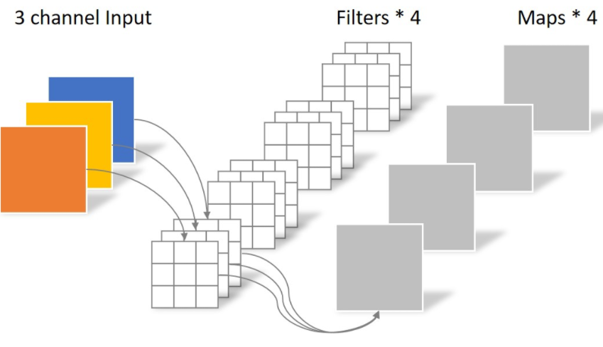
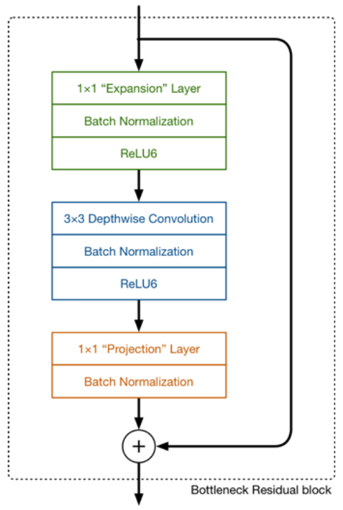
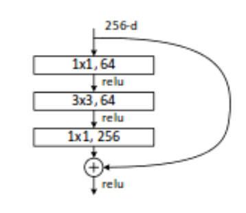

# MobileNetV2: Inverted Residuals and Linear Bottlenecks

#### 这篇笔记的写作者是[PommesPeter](https://github.com/PommesPeter)。

这是一篇讲解一种轻量级主干网络的论文。[原论文（MobileNetV2: Inverted Residuals and Linear Bottlenecks）](https://arxiv.org/abs/1801.04381)。

- 本文主要针对轻量特征提取网络中结构上的三个修改提高了网络性能。
- 本文总思路：使用低维度的张量得到足够多的特征

摘要:

> In this paper we describe a new mobile architecture, MobileNetV2, that improves the state of the art performance of mobile models on multiple tasks and bench- marks as well as across a spectrum of different model sizes. We also describe efficient ways of applying these mobile models to object detection in a novel framework we call SSDLite. Additionally, we demonstrate how to build mobile semantic segmentation models through a reduced form of DeepLabv3 which we call Mobile DeepLabv3. is based on an inverted residual structure where the shortcut connections are between the thin bottle- neck layers. The intermediate expansion layer uses lightweight depthwise convolutions to filter features as a source of non-linearity. Additionally, we find that it is important to remove non-linearities in the narrow layers in order to maintain representational power. We demon- strate that this improves performance and provide an in- tuition that led to this design. Finally, our approach allows decoupling of the in- put/output domains from the expressiveness of the trans- formation, which provides a convenient framework for further analysis. We measure our performance on ImageNet classification, COCO object detection [2], VOC image segmentation [3]. We evaluate the trade-offs between accuracy, and number of operations measured by multiply-adds (MAdd), as well as actual latency, and the number of parameters.

## Introduction

本文所介绍的网络是针对于计算资源受限的情况下仍然使用深度学习做实际落地应用等方面内容。一般来说，提高准确率很大程度与需要依赖算力成本，追求越高的准确率算力成本开销就越，使得很多移动设备和嵌入式应用无法使用这种类型的算法。

针对这个问题本文提出了一种新的神经网络结构，专门针对移动设备或者资源首先的环境下仍然能够使用深度学习，但在降低参数量和操作数量的同时，又要保证网络的准确率。

我们主要的贡献是一种新型的模块，使用linear bottleneck模块的inverted residual模块。Inverted Residual模块输入的是一个经过压缩之后的低维度的特征，这个特征首先是先扩展到高维特征，然后在经过轻量depthwise卷积之后得到的.

本文的方法是针对于移动端进行涉及，能够减少在推理阶段的内存开销，减少了对内存访问的需求，使得该模块能够在嵌入式硬件上使用。

## Related Work

针对目前现有的网络，许多团队都是手动对结构进行优化、改进取得了很好的结果，如AlexNet,VGGNet,GoogleNet,ResNet等网络。对其进行了超参数的各种优化。针对连接的方式也做了大量的工作，目前很多都是修改卷积块内部的连接结构，像ShuffleNet。像近期的一些研究虽然能够达到很好的效果，但是网络结构很复杂，无法达到预期目标，所以我们的网络基于[MobileNetV1](https://arxiv.org/abs/1704.04861)进行改进，在保证轻量、简单的同时又不需要额外特殊的操作就能提高准确率，在移动端上有一个良好的表现。

## 创新点

### Depthwise Separable Convolutions

本文网络结构中关键的卷积模块是DSC模块(深度可分离卷积，以下简称DSC)，对于大多数高效的神经网络来说使用这种类型的卷积是关键。

#### 基本思想

- 常规卷积：

假设输入层为一个大小为64×64像素、三通道彩色图片。经过一个包含4个Filter的卷积层，最终输出4个Feature Map，且尺寸与输入层相同。




此时，卷积层共4个Filter，每个Filter包含了3个Kernel，每个Kernel的大小为3×3。因此卷积层的参数数量可以用如下公式来计算：

```python
N_std = 4 × 3 × 3 × 3 = 108
```

- DSC

  为了取代传统卷积操作，我们通过将图片分解成两个单独的图层。

  第一层做深度卷积(DW)，通过使用对每一个通道使用轻量级的卷积进行滤波。对每一个通道使用卷积，在二维平面上进行，运算完之后生成3个特征图，此时通道数并没有扩大，没有有效利用不同通道上相同位置的特征信息。所以需要接下来的点卷积(PW)


```python
# 参数量
N_depthwise = 3 × 3 × 3 = 27
```

第二层是一个$1\times 1$的卷积，叫做点卷积，负责通过计算输入通道的线性组合来建立新的特征。

- 

```python
# 参数量
N_pointwise = 1 × 1 × 3 × 4 = 12

# 总和
N_sum = N_depthwise + N_pointwise = 39
```

- 计算消耗

  标准的卷积模块，对于一个$h\times w\times d$的图片来说，为了得到$h\times w\times d'$，使用一个$k\in R^{k\times k\times d\times d'}$的卷积核，需要进行$h\times w\times d\times d'\times k^2$次运算。

  DSC模块，能够达到跟标准卷积同样的效果但是只需要$h\times w\times d\times(k^2+d')$
  
  为什么深度可分离卷积性能好，因为他是先做一次3x3的卷积(对3个通道分别做卷积)，分成三个通道后在做1x1的卷积提取特征，计算量比传统的减少了

### Linear Bottleneck

> 这部分主要介绍了为什么使用线性分类器来取代激活函数，通过一系列例子来证明，先是将卷积和激活函数抽象成一个兴趣流形，然后根据兴趣流形在不同输出维度的表现来说明**ReLU在低维空间会丢失大量的信息，但在高维的时候却不会丢失**。这部分主要讲**线性变换取代ReLU激活函数**，代替原本非线性激活变换。所以在后面介绍Inverted Risdual的时候使用LinearBottleneck就可以捕获兴趣流形并且防止非线性破坏太多信息。

- 兴趣流形manifold of interest

  对于一个n个$L_i$层的神经网络来说，每一层输出的张量是$h_i\times w_i\times d_i$的大小。其中包含了$h_i\times w_i$个像素和$d_i$个维度。manifold of interest是指在神经网络中嵌入低维子空间，也就是说，将每个在深度卷积层的通道通过manifold编码为各种信息，这些信息又嵌入低维子空间中。我们人为**一连串的卷积核激活函数就形成了一个manifold of interest(兴趣流形)**
  
  神经网络中的兴趣流形可以嵌入到低维子空间，也就是我们查看单个d通道的像素时，这些值中存在多种编码信息，我们通过变换可以进一步嵌入到下一个低维的子空间中(通过$1\times1$的卷积变换，转换兴趣流形的空间维度)

- 实际例子

  如果当前激活空间内兴趣流形完整度较高，经过ReLU，可能会让激活空间坍塌，不可避免的会丢失信息。

  

  如图所示，输入的是一个二维的数据，兴趣流形就是蓝色的螺旋线，本例使用矩阵$T$将数据嵌入到n维空间中，后接ReLU，再使用$T^{-1}$将其投影回2D平面。可以看到设置$n=2,3$时信息丢失严重，中心点坍塌掉了。当$n=15..30$之间，恢复的信息明显多了。

  如果输入对应的输出是非零的，那么输入和输出之间其实对应的就是一个线性映射关系。

  > 因为这个网络的目的是为了把网络轻量化，那么就不能够使用高维度的特征图，维度越高计算量越大，但是如果维度太低导致特征不明显就会导致准确率下降，所以本文的**目的是尽可能使用一些维度比较低的卷积。**
  >
  > 但是如果**对比较低维度的特征使用ReLU激活函数会丢失掉很多信息**。因为ReLU是一个线性映射，所以我们用线性分类器就会减少维度信息的丢失，同时又可以设计出维度比较低的层。

- 总结

  如果manifold of interest 始终保持非零在经过ReLU变换之后，那么就是对于线性的变换。

  ReLU能够保留输入的manifold的信息，但是只有在输入空间中低维度空间中的manifold才能保留完整信息。假设manifold of interest是低维度的，我们可以通过线性瓶颈层插入卷积块来捕获，使用线性层是为了防止非线性层摧毁太多信息，从传统的残差块中去除掉非线性的部分。

### Inverted Residuals

> 设计思路: 先通过Expansion layer来**扩展维度**，之后在**用深度可分离卷积来提取特征**，之后使用Projection layer来压缩数据，**将高维度的数据映射回低维数据**，让网络从新变小。因为Expansion layer 和 Projection layer都是有可以学习的参数，所以整个网络结构可以学习到如何更好的扩展数据和从新压缩数据。
>
> 先将张量维度扩展到高维，对高维tensor提取特征，然后再映射回低维度空间。

网络结构如下:




设计思路主要还是深度可分离卷积模块的堆叠，在v1的基础上，除了使用DSC模块之外，添加了**Projection layer**和**Expansion layer**。在提取特征的时候使用高维tensor(高维信息多)，在处理特征的时候使用低维tensor.

**Projection layer**也是使用$1\times 1$的网络结构，他的目的是希望把**高维特征映射到低维空间**去。使用 $1\times 1$的网络结构将高维空间映射到低维空间的设计有的时候我们也称之为**Bottleneck layer。**

**Expansion layer**的功能正相反，使用$1\times 1$的网络结构，目的是将**低维空间映射到高维空间**。这里**Expansion factor**有一个超参数(Expansion Factor)是维度扩展几倍。可以根据实际情况来做调整的，默认值是6，也就是扩展6倍。与传统的残差连接不同，对于一个块大小为$h\times w$，扩展因子为$t$和卷积核大小为$k$，输入通道为$d'$，输出通道为$d''$总共需要进行$h\times w\times d'\times t(d'+k^2+d'')$次乘法。通过一个额外的$1\times 1$卷积使得网络能够利用更小的输入和输出。从而实现降低维度大小，也就是降低乘法计算量的方法.


此图更详细的展示了整个模块的结构。我们输入是24维，最后输出也是24维。但这个过程中，我们扩展了6倍，然后应用深度可分离卷积进行处理。

**bottleneck residual block(ResNet)**是中间窄两头胖**(中间是维度小的，两边是维度大的)**，在MobileNetV2中正好反了过来**(中间是维度大的，两边是维度小的)**，所以，在MobileNetV2的论文中我们称这样的网络结构为**Inverted residuals**。需要注意的是residual connection是在输入和输出的部分进行连接。另外，我们之前已经讲的**Linear Bottleneck**在这里使用，因为从高维向低维转换，使用ReLU激活函数可能会造成信息丢失或破坏（不使用非线性激活数数）。所以在projection convolution这一部分，**我们不再使用ReLU激活函数而是使用线性激活函数。**（这也是为什么前面要提到linear bottleneck）

与传统的Residuals不同，传统的ResNet网络结构如下：



可以注意到，对比**Inverted**版本的，在残差求和之前，他们都是维度比较小的，经过一个$1\times 1$卷积之后变回原来的通道数（高维->低维）。而Inverted版本的是输入较低维度的，在残差求和之前通过Expansion layer使用$1\times 1$的网络架构将低维空间映射到高维空间。（低维->高维）

## Supplements

我们知道，如果tensor维度越低，卷积层的乘法计算量就越小。那么如果整个网络都是低维的tensor，那么整体计算速度就会很快。

然而，如果只是使用低维的tensor效果并不会好。如果卷积层的过滤器都是使用低维的tensor来提取特征的话，那么就没有办法提取到整体的足够多的信息。所以，如果提取特征数据的话，我们可能更希望有高维的tensor来做这个事情。V2就设计这样一个结构来达到平衡。


先通过Expansion layer来扩展维度，之后在用深度可分离卷积来提取特征，之后使用Projection layer来压缩数据，让网络从新变小。因为Expansion layer 和 Projection layer都是有可以学习的参数，所以整个网络结构可以学习到如何更好的扩展数据和从新压缩数据。

使用 $1\times 1$的网络结构将高维空间映射到低维空间的设计有的时候我们也称之为**Bottleneck layer。**

