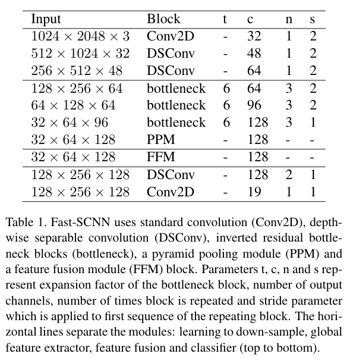
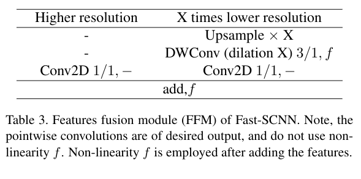

# Fast-SCNN: Fast Semantic Segmentation Network

### 这篇笔记的写作者是[ZeroRains](https://github.com/zeroRains)。

这是一篇讲解一种快速语义分割的论文。论文名:[Fast-SCNN: Fast Semantic Segmentation Network](https://arxiv.org/abs/1902.04502)

- 主要是采用双流模型的架构设计这个网络
- 本文总思路：减少冗余的卷积过程，从而提高速度

摘要：

> The encoder-decoder framework is state-of-the-art for offline semantic image segmentation. Since the rise in autonomous systems, real-time computation is increasingly desirable. In this paper, we introduce fast segmentation convolutional neural network (Fast-SCNN), an above real-time semantic segmentation model on high resolution image data (1024 × 2048px) suited to efficient computation on embedded devices with low memory. Building on existing two-branch methods for fast segmentation, we introduce our ‘learning to downsample’ module which computes low-level features for multiple resolution branches simultaneously. Our network combines spatial detail at high resolution with deep features extracted at lower resolution, yielding an accuracy of 68.0% mean intersection over union at 123.5 frames per second on Cityscapes. We also show that large scale pre-training is unnecessary. We thoroughly validate our metric in experiments with ImageNet pre-training and the coarse labeled data of Cityscapes. Finally, we show even faster computation with competitive results on subsampled inputs, without any network modifications.

## 摘要

主要贡献：

1. 提出了一个有竞争性(68.0%miou)，并且能在高分辨率(1024x2048)的图片实现实时(123.5FPS)语义分割的算法Fast-SCNN.
2. 采用了离线型DCNNs中流行的**跳跃连接(skip connection)**，并提出了一种浅层学习的下采样模块**learning to Down-sample**,以此更加快速高效地进行多分支低级特征提取。
3. 将Fast-SCNN设计为轻量型(low capacity)，并证实了无论是使用ImageNet数据集的训练模型多训练几代，还是在添加的粗糙数据中多训练几代的结果是等效的。

## DCNNs的效率

高效DCNNs（Diffusion-Convolutional Neural Networks ）的常见技术为：

### 深度可分离卷积(Depthwise Separable Convolutions):

MoblieNet将标准的Conv分解为**深度卷积（depthwise convolutions）**和$1 \times 1$**点式卷积(pointwise convolution)**通过这样的方式，减少了浮点运算和卷积参数，减少了模型的计算成本和内存需求。

### DCNNs的高效重新设计

MobileNet-V2使用**倒置的瓶颈残差块(inverted bottleneck residual blocks)**以分类任务构建有效的DCNN。

ContextNeto使用能够倒置瓶颈残差块设计了一个1两分支网络，以进行有效的实时语义分割。

### 网络压缩

使用剪枝减小预训练网络的大小，从而实现更块的运行时间，更小的参数集和更小的内存占用空间。


Fast-SCNN严重依赖与深度可分离卷积和残差瓶颈块，还引入了一个两分支模型，该模型将学习内容整合到下采样的模块中，从而允许在多个分辨率级别上进行共享特征提取。网络量化和网络压缩可以正交应用，留待后面的工作。

## Fast-SCNN

网络结构图：


在定义网络的BN层时使用类各种类型的BN层,但是默认都是使用普通的BN层

常规的BN，SyncBN（跨卡BN），FrozenBN（测试阶段使用的BN），GN（Group Normalization）


### 下采样学习模块(learning to down-sample)

在该模块中使用了三层卷积，第一层是普通的卷积(Conv2D)，其余两层是可分离卷积(DSConv)，因为图像刚刚输入只有三个通道，使用DSConv的优势并不明显所以，采用普通卷积层。

在下采样学习模块中，使用的步长均为2，然后进行BN和ReLU。卷积核和深度可分离卷积核均为$3\times3$.

```python
# 在主网络中的定义
self.learning_to_downsample = LearningToDownsample(32, 48, 64, norm_layer=self.norm_layer) # norm_layerh是普通的BN

# 下采样学习模块的定义
class LearningToDownsample(nn.Module):
    """Learning to downsample module"""

    def __init__(self, dw_channels1=32, dw_channels2=48, out_channels=64, norm_layer=nn.BatchNorm2d):
        super(LearningToDownsample, self).__init__()
        self.conv = _ConvBNReLU(3, dw_channels1, 3, 2) # 这个就是单纯的CONV+BN+ReLU
        # 深度可分离卷积：一个深度卷积，一个点卷积的组合
        self.dsconv1 = SeparableConv2d(dw_channels1, dw_channels2, stride=2, relu_first=False, norm_layer=norm_layer)
        self.dsconv2 = SeparableConv2d(dw_channels2, out_channels, stride=2, relu_first=False, norm_layer=norm_layer)

    def forward(self, x):
        x = self.conv(x) #  普通卷积
        x = self.dsconv1(x) # 可分离卷积
        x = self.dsconv2(x)
        return x
```

```python
# 深度可分离卷积
class SeparableConv2d(nn.Module):
    def __init__(self, inplanes, planes, kernel_size=3, stride=1, dilation=1, relu_first=True,
                 bias=False, norm_layer=nn.BatchNorm2d):
        super().__init__()
        # 深度卷积，卷积核为3步长1，padding1，空洞1的卷积层
        depthwise = nn.Conv2d(inplanes, inplanes, kernel_size,
                              stride=stride, padding=dilation,
                              dilation=dilation, groups=inplanes, bias=bias)
        # 对应的BN
        bn_depth = norm_layer(inplanes)
        # 点卷积，就是普通的1x1卷积
        pointwise = nn.Conv2d(inplanes, planes, 1, bias=bias)
        # 对应的BN
        bn_point = norm_layer(planes)
        # 是否使用激活函数
        if relu_first:
            self.block = nn.Sequential(OrderedDict([('relu', nn.ReLU()),
                                                    ('depthwise', depthwise),
                                                    ('bn_depth', bn_depth),
                                                    ('pointwise', pointwise),
                                                    ('bn_point', bn_point)
                                                    ]))
        else:
            self.block = nn.Sequential(OrderedDict([('depthwise', depthwise),
                                                    ('bn_depth', bn_depth),
                                                    ('relu1', nn.ReLU(inplace=True)),
                                                    ('pointwise', pointwise),
                                                    ('bn_point', bn_point),
                                                    ('relu2', nn.ReLU(inplace=True))
                                                    ]))

    def forward(self, x):
        return self.block(x)
```


### 全局特征提取器(Global Feature Extrator)

全局特征提取器模块的目的在于捕获分割图像的全局上下文信息。该模块直接将下采样学习模块的结果(分辨率为原图的$\frac 18$)作为而输入。该模块引入了MobileNet-V2中提出的有效的瓶**颈残差网络(efficient bottleneck residual blocks)**。当输入的图像和输出的图像尺寸相同时，使用残差连接链接瓶颈残差块。

在瓶颈残差块中使用了有效的深度可分离卷积，从而减少了参数量和浮点数运算。最后还添加了一个金字塔池化模块(pyramid pooling module 简称PPM)，用于汇总基于不同区域的上下文信息。

在各层的详细参数如下表：



每一条横线分别表示，下采样学习模块，全局特征提取器，特征融合，分类四个总体模块

其中t,c,n,s分别表示瓶颈块的拓展因子，输入通道数，使用该层的次数，步长


瓶颈块的参数表：


瓶颈残差块将输入为c的图像转化为具有拓展因子t的c`

最后的点卷积不适用非线性函数f

```python
# 主网络声明
self.global_feature_extractor = GlobalFeatureExtractor(64, [64, 96, 128], 128, 6, [3, 3, 3],norm_layer=self.norm_layer)

# 全局特征提取器对应的模块类
class GlobalFeatureExtractor(nn.Module):
    """Global feature extractor module"""
    # 输入的通道数，每一层的通道数，输出的通道数，拓展因子t，块在每一层的数量
    def __init__(self, in_channels=64, block_channels=(64, 96, 128), out_channels=128,
                 t=6, num_blocks=(3, 3, 3), norm_layer=nn.BatchNorm2d):
        super(GlobalFeatureExtractor, self).__init__()
        # 创建瓶颈残差块，这里使用的InvertedResidual叫做反向残差。
        # 只有步长为1并且输入通道和输出通道相同的情况下这各个反向残差才会使用残差连接
        self.bottleneck1 = self._make_layer(InvertedResidual, in_channels, block_channels[0], num_blocks[0],
                                            t, 2, norm_layer=norm_layer)
        self.bottleneck2 = self._make_layer(InvertedResidual, block_channels[0], block_channels[1],
                                            num_blocks[1], t, 2, norm_layer=norm_layer)
        self.bottleneck3 = self._make_layer(InvertedResidual, block_channels[1], block_channels[2],
                                            num_blocks[2], t, 1, norm_layer=norm_layer)
        # 做一个金字塔池化
        self.ppm = PyramidPooling(block_channels[2], norm_layer=norm_layer)
        # 最后使用1x1卷积输出成对应的通道，进行输出
        self.out = _ConvBNReLU(block_channels[2] * 2, out_channels, 1, norm_layer=norm_layer)

    def _make_layer(self, block, inplanes, planes, blocks, t=6, stride=1, norm_layer=nn.BatchNorm2d):
        # 使用的模块，输入的通道数，输出的通道数，块的数量，拓展因子t，步长
        # 初始化一个容器
        layers = []
        # 将块中的信息加入
        layers.append(block(inplanes, planes, stride, t, norm_layer=norm_layer))
        # 重复这个块对应次
        for i in range(1, blocks):
            layers.append(block(planes, planes, 1, t, norm_layer=norm_layer))
        #  将对应的内容放入Sequential容器中
        return nn.Sequential(*layers)

    def forward(self, x):
        x = self.bottleneck1(x)
        x = self.bottleneck2(x)
        x = self.bottleneck3(x)
        x = self.ppm(x)
        x = self.out(x)
        return x
```

```python
# 反向卷积块
class InvertedResidual(nn.Module):
    def __init__(self, in_channels, out_channels, stride, expand_ratio, dilation=1, norm_layer=nn.BatchNorm2d):
        # 参数：输入通道，输出通道，步长，拓展因子，空洞卷积，
        super(InvertedResidual, self).__init__()
        assert stride in [1, 2]
        # 是否使用残差连接
        self.use_res_connect = stride == 1 and in_channels == out_channels

        layers = list()
        # 中间的通道数，使用拓展因子*输入的通道数
        inter_channels = int(round(in_channels * expand_ratio))
        if expand_ratio != 1:
            # pw
            # 先做一个标准卷积嘛，使用中间通道数作为输出,1x1卷积
            layers.append(_ConvBNReLU(in_channels, inter_channels, 1, relu6=True, norm_layer=norm_layer))
        layers.extend([
            # dw 这里使用了分组卷积，但是实际上和普通的卷积没有什么区别，如果groups整好是输入通道数的一个因素，则输入的通道会被分成对应的组进行卷积
            _ConvBNReLU(inter_channels, inter_channels, 3, stride, dilation, dilation,
                        groups=inter_channels, relu6=True, norm_layer=norm_layer),
            # pw-linear
            # 使用1x1卷积将中间通道数转化成最终的通道数
            nn.Conv2d(inter_channels, out_channels, 1, bias=False),
            norm_layer(out_channels)])
        self.conv = nn.Sequential(*layers)

    def forward(self, x):
        # 残差连接
        if self.use_res_connect:
            return x + self.conv(x)
        else:
            return self.conv(x)
```

```python
# PPM(金字塔池化模块)
class PyramidPooling(nn.Module):
    def __init__(self, in_channels, sizes=(1, 2, 3, 6), norm_layer=nn.BatchNorm2d, **kwargs):
        super(PyramidPooling, self).__init__()
        # 定义输出为输入的四分之一
        out_channels = int(in_channels / 4)
        # 创建平均池化和卷积层模块列表
        self.avgpools = nn.ModuleList()
        self.convs = nn.ModuleList()
        # 遍历平均池化的尺寸
        for size in sizes:
            # 使用自适应平均池化，这里的参数，表示经过自适应平均池化的特征图输入为c X h X w，出来的结果为c X size X size
            self.avgpools.append(nn.AdaptiveAvgPool2d(size))
            # 使用普通卷积层进行卷积1x1的卷积核
            self.convs.append(_ConvBNReLU(in_channels, out_channels, 1, norm_layer=norm_layer, **kwargs))

    def forward(self, x):
        size = x.size()[2:]
        feats = [x]
        for (avgpool, conv) in zip(self.avgpools, self.convs):
            # 没记错的话interpolate应该是上采样到size的大小
            feats.append(F.interpolate(conv(avgpool(x)), size, mode='bilinear', align_corners=True))
        # 记录完平均池化的结果后，就进行拼接
        return torch.cat(feats, dim=1)
```


### 特征融合模块(Feature Fusion Module)



先前下采样学习模块计算的特征图（表的左边）只经过一个$1 \times 1$的卷积即可，在x次下采样后的结果(经过全局特征提取模块的特征图，表的右边)，上采样X次，使用可分离卷积和一个非线性函数，再使用一个$1 \times1$的卷积，最后将两个特征图加起来，再使用非线性激活函数f

```python
# 在主类中的声明：
self.feature_fusion = FeatureFusionModule(64, 128, 128, norm_layer=self.norm_layer)

# 特征融合模块
class FeatureFusionModule(nn.Module):
    """Feature fusion module"""
    # 输入的参数为高输入的通道数，低输入的通道数，输出的通道数
    def __init__(self, highter_in_channels, lower_in_channels, out_channels, scale_factor=4, norm_layer=nn.BatchNorm2d):
        super(FeatureFusionModule, self).__init__()
        # 设置规模
        self.scale_factor = scale_factor
        # 使用普通卷积将低通道数转化成输出的通道数
        self.dwconv = _ConvBNReLU(lower_in_channels, out_channels, 1, norm_layer=norm_layer)
        # 再对低维卷积的将诶过再做一个1x1卷积，但是不激活
        self.conv_lower_res = nn.Sequential(
            nn.Conv2d(out_channels, out_channels, 1),
            norm_layer(out_channels)
        )
        # 对高维度的卷积，只使用1x1卷积，不使用激活函数
        self.conv_higher_res = nn.Sequential(
            nn.Conv2d(highter_in_channels, out_channels, 1),
            norm_layer(out_channels)
        )
        self.relu = nn.ReLU(True)

    def forward(self, higher_res_feature, lower_res_feature):
        # 先将低维特征图上采样到现在的4倍
        lower_res_feature = F.interpolate(lower_res_feature, scale_factor=4, mode='bilinear', align_corners=True)
        # 将低纬度的通道数转化成输出的通道数
        lower_res_feature = self.dwconv(lower_res_feature)
        # 再做一次1x1卷积，但是不激活
        lower_res_feature = self.conv_lower_res(lower_res_feature)
        # 对高纬度进行1x1卷积，但是不激活
        higher_res_feature = self.conv_higher_res(higher_res_feature)
        # 将低纬度和高纬度加起来
        out = higher_res_feature + lower_res_feature
        # 最后激活他就行
        return self.relu(out)
```


### 分类模块(classifier)

在分类模块中采用两个深度可分离卷积(DSConv)和一个普通卷积(Conv2D，纠正一下，之前说过的点卷积是Conv2D)。

为了适应梯度下降，所以在训练中使用了Softmax激活函数，在推理过程中,由于argmax和sorftmax都是单调递增的函数，所以使用argmax代替softmax减小计算开销。

如果需要Fast-SCNN的概率模型，才在推理时使用softmax。

```python
# 在主类中的声明：
self.classifier = Classifer(128, self.nclass, norm_layer=self.norm_layer)

# 分类模块
class Classifer(nn.Module):
    """Classifer"""

    def __init__(self, dw_channels, num_classes, stride=1, norm_layer=nn.BatchNorm2d):
        # 参数：输入的通道数，分类数，步长，BN
        super(Classifer, self).__init__()
        # 使用2个深度分离卷积
        self.dsconv1 = SeparableConv2d(dw_channels, dw_channels, stride=stride, relu_first=False,
                                       norm_layer=norm_layer)
        self.dsconv2 = SeparableConv2d(dw_channels, dw_channels, stride=stride, relu_first=False,
                                       norm_layer=norm_layer)
        # 设置随机失活(dropout2d)，然后进行卷积，不适用BN不使用，激活，使用1x1卷积
        self.conv = nn.Sequential(
            nn.Dropout2d(0.1),
            nn.Conv2d(dw_channels, num_classes, 1)
        )

    def forward(self, x):
        x = self.dsconv1(x)
        x = self.dsconv2(x)
        x = self.conv(x)
        return x

```


