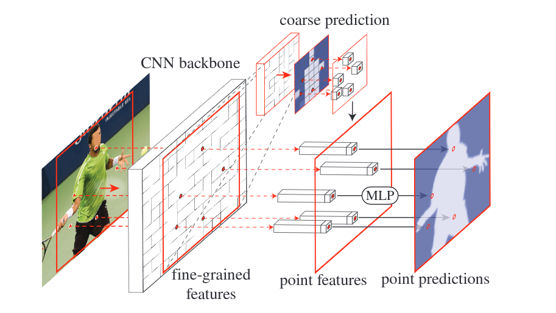
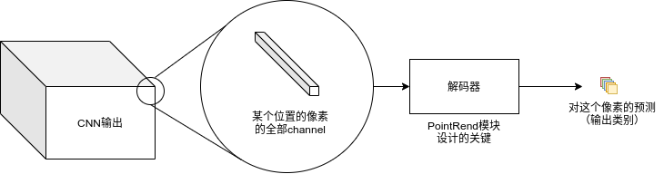

# PointRend: Image Segmentation as Rendering

### 这篇笔记的写作者是[VisualDust](https://github.com/visualDust)。

这是一篇用于改善图像分割问题中边缘分割效果的方法的论文的阅读笔记。该方法“将分割问题看作渲染问题”，达到了较好的效果。论文原文：[PointRend: Image Segmentation as Rendering](https://arxiv.org/abs/1912.08193)。在阅读这篇笔记之前，请确保先了解图像分割技术。对分割的技术进行简要的了解，可以参考[另一篇笔记](./[10]Overview-Of-Semantic-Segmentation.md)。

> We present a new method for efficient high-quality image segmentation of objects and scenes. By analogizing classical computer graphics methods for efficient rendering with over- and undersampling challenges faced in pixel labeling tasks, we develop a unique perspective of image segmentation as a rendering problem. From this vantage, we present the PointRend (Point-based Rendering) neural network module: a module that performs point-based segmentation predictions at adaptively selected locations based on an iterative subdivision algorithm. PointRend can be flexibly applied to both instance and semantic segmentation tasks by building on top of existing state-of-the-art models. While many concrete implementations of the general idea are possible, we show that a simple design already achieves excellent results. Qualitatively, PointRend outputs crisp object boundaries in regions that are over-smoothed by previous methods. Quantitatively, PointRend yields significant gains on COCO and Cityscapes, for both instance and semantic segmentation. PointRend's efficiency enables output resolutions that are otherwise impractical in terms of memory or computation compared to existing approaches. Code has been made available at [this https URL](https://github.com/facebookresearch/detectron2/tree/master/projects/PointRend).

## 介绍（Introduction）

本论文的核心内容是 PointRend（基于点的渲染）神经网络模块：“一个基于迭代细分算法在自适应选择的位置执行基于点的分割预测的模块”。该模块使用细分策略自适应地选择一组非均匀点来计算标签，容易理解的说法是该模块自动选取边缘上难以正确归类的点进行再次分类。 它的细分策略使用比直接密集计算少一个数量级的浮点运算来有效地计算高分辨率分割图。

请注意，PointRend是一个网络模块而不是独立的网络。该模块接受一个或多个CNN输出的feature map，并产生比输入更高分辨率的预测。

> PointRend is a general module that admits many possible implementations.

PointRend 可以合并到流行的元架构中，用于实例分割（例如，Mask R-CNN）和语义分割（例如FCN）。

上图是一种可能的PointRend结构模式图：选择一些分割困难的点，CNN产生的特征图被输入到MLP中，和粗分割结果融合，最终输出分割困难点的预测结果。

实际上，这篇论文的创新在于重新选择边缘困难点的种类。本质上这篇论文其实是一个新型上采样方法，针对物体边缘的图像分割进行优化，使其在难以分割的物体边缘部分有更好的表现。在整个PointRend设计的过程中有类似于渲染的思想，但请不要对“渲染”过度理解。

---

## 方法（Method）

### PointRend模块

类似于在计算机图形学中，屏幕上某个位置的像素是从一个曲线、模型等通过被称为渲染的映射产生，在计算机视觉中，我们可以将图像分割视为底层连续实体的类别图，而分割输出，即预测标签的像素集合，是从中“渲染”出来的。

上图是这个模式的简图。其中，PointRend的关键步骤就是训练一个“解码器”（或者叫“渲染器”），从channel中“解码”（或者“渲染”）出预测困难的像素所属的类别。

PointRend模块接受一个或多个典型的$C$通道的CNN特征图（$f\in \R^{C\times H\times W}$）作为输入，这些输入特征图往往比需要预测的图像的实际尺寸要小4~16倍。PointRend模块会输出一个大小为$p\in \R^{k\times H' \times W'}$的对K个类别的预测。通常输出的大小会大于输入的大小。

（如果读不懂了请先参考[另一篇笔记](./[10]Overview-Of-Semantic-Segmentation.md)了解图像的分割技术）

### PointRend模块的组成

PointRend模块由单个主要的部分组成：

1. 一个**点的选择策略**。PointRend模块并不会对整幅图片上的所有点进行预测（这样会产生巨大的开销），而是选择其中的一部分看上去“难以预测的实值点”进行预测（实值点的特征是通过输入$f$的双线性插值计算的）。
2. 一个**特征提取器**（或者叫“解码器”，或是“渲染器”）。对于每个选定的点，在输入中相关的部分可能是$i\in \R^{C\times 1\times 1}$的一个长长的通道。对于每个选定的点，特征提取器提取该点的特征表示。
3. 一个**分类器**（原文中称之为“point head”）。这个分类器是一个很小的神经网络，它被训练来从这个逐点特征表示中预测一个标签。对于这部分来说，每个点都是独立的。

这几个组成部分将会在下文中进行详细介绍。

PointRend 架构可应用于实例分割（例如，在 Mask R-CNN上）和语义分割（例如，在 FCNs上）任务。

如上图，PointRend 模块应用于每个区域。它通过对一组选定点进行预测，以从粗到细的方式计算掩码。对于语义分割，可以将整个图像视为单个区域，因此不失一般性。

### 点的选择策略（Point selection for Inference and Training）

PointRend方法的核心是灵活和自适应地选择图像平面中预测分割标签的点。直觉上，这些点应该更密集地靠近高频区域，例如物体边界，类似于光线追踪中的抗锯齿问题。

PointRend的推理选择策略受到计算机图形学中自适应细分的经典技术的启发。该技术用于通过仅在值与其邻居显著不同的位置进行计算来高效地渲染高分辨率图像。对于其他位置，这些值是通过插入已经计算出的输出值获得的。下面是一段解释：

在渲染问题中，例如，在一块分辨率为1080p的屏幕上显示一张2k的图片时，往往显示设备不需要对2k图片的所有像素都进行处理，仅处理一部分即可显示出足够的分辨率。但当用户放大图片，在1080p的显示屏上显示一张2k图片中的一角时，显示设备就需要对这张图片进行更精细的处理让它们出现在屏幕上显示更多细节。通过观察我们发现，1和2部分和原来的像素差距不大，不需要从图片文件渲染，处理时仅需同上文中的“这些值是通过插入已经计算出的输出值获得的”，从放大前的图上插值即可得到。需要重新处理的，是1和2的边缘部分，也就是上面提到的“值与其邻居显著不同的位置”。

>  类比渲染问题中的细分过程和分割问题中的上采样过程后我们发现，在分割中的上采样过程中时我们需要关注边缘，对边缘进行细化即可。

所以点的选择策略，就是在上采样过程中选择“不确定的点”，或“边界的点”。

#### 前向传播过程（Inference）

> 对于每个区域，我们以粗到细的方式迭代地“渲染”输出掩码。

在网络的前向传播过程到达PointRend模块时，会总体经历以下步骤：

1. 使用双线性插值对其先前预测的分割进行上采样
2. 在这个更密集的网格上选择 N 个最不确定的点（例如，对于二进制掩码，概率最接近 0.5 的那些点）
3. 为这 N 个点中的每一个计算逐点特征表示（在第 3.2 节中简要描述）并预测它们的标签
4. 重复这个过程，直到分割被上采样到所需的分辨率

#### 训练（Training）下面还没写完......

### 点的特征提取和分类（Point-wise Representation and Point Head）

在特征提取部分，PointRend通过融合粗特征和细粒度特征获得更合适的特征，然后通过分类得到该点的类别。

#### 细粒度特征（Fine-grained features）

#### 粗预测特征（Coarse prediction features）

#### 分类器（“点头”，Point Head）

