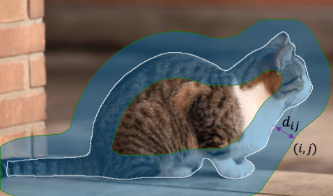
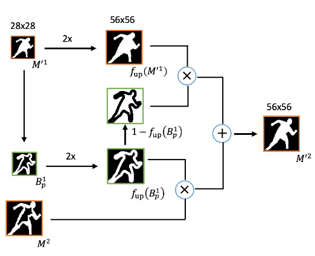

 

# RefineMask: Towards High-Quality Instance Segmentationwith Fine-Grained Features

### 这篇笔记的写作者是[ZeroRains](https://github.com/zeroRains)。

>论文名称：[RefineMask: Towards High-Quality Instance Segmentationwith Fine-Grained Features](https://arxiv.org/abs/2104.08569)
>
>作者：[Gang Zhang](https://arxiv.org/search/cs?searchtype=author&query=Zhang%2C+G), [Xin Lu](https://arxiv.org/search/cs?searchtype=author&query=Lu%2C+X), [Jingru Tan](https://arxiv.org/search/cs?searchtype=author&query=Tan%2C+J), [Jianmin Li](https://arxiv.org/search/cs?searchtype=author&query=Li%2C+J), [Zhaoxiang Zhang](https://arxiv.org/search/cs?searchtype=author&query=Zhang%2C+Z), [Quanquan Li](https://arxiv.org/search/cs?searchtype=author&query=Li%2C+Q), [Xiaolin Hu](https://arxiv.org/search/cs?searchtype=author&query=Hu%2C+X)
>
>期刊：CVPR2021
>
>代码：[https://github.com/zhanggang001/RefineMask](https://github.com/zhanggang001/RefineMask)

## 原文摘要

>The  two-stage  methods  for  instance  segmentation,  e.g.Mask  R-CNN,  have  achieved  excellent  performance  re-cently.  However, the segmented masks are still very coarsedue  to  the  downsampling  operations  in  both  the  featurepyramid and the instance-wise pooling process, especiallyfor large objects.  In this work, we propose a new methodcalled  RefineMask  for  high-quality  instance  segmentationof objects and scenes, which incorporates fine-grained fea-tures  during  the  instance-wise  segmenting  process  in  amulti-stage manner. Through fusing more detailed informa-tion stage by stage, RefineMask is able to refine high-qualitymasks  consistently.    RefineMask  succeeds  in  segmentinghard  cases  such  as  bent  parts  of  objects  that  are  over-smoothed by most previous methods and outputs accurateboundaries.  Without bells and whistles, RefineMask yieldssignificant gains of 2.6, 3.4, 3.8 AP over Mask R-CNN onCOCO, LVIS, and Cityscapes benchmarks respectively at asmall  amount  of  additional  computational  cost.   Further-more, our single-model result outperforms the winner of theLVIS Challenge 2020 by 1.3 points on the LVIS test-dev setand establishes a new state-of-the-art.

## 摘要

即使如Mask R-CNN这样二阶段的实例分割网路已经有了优秀的表现，但因为在特征金字塔和实例池化过程中使用了下采样操作，使得分割掩码仍然非常粗糙，尤其是对于大型物体。

在本文中，提出了RefineMask方法，用于对象和场景的高质量实例分割，它在实分割的过程中以多阶段的方式结合了细粒度特征。通过逐步融合更细节的信息，RefineMask能够始终如一地提炼出高质量的mask。

## 介绍

Mask R-CNN丢失了高质量实例分割任务必不可少的图像细节。导致这个问题的主要有两个原因

第一，池化过程中的特征来自于特征金字塔的多个层次，高级特征通常会使得空间分辨率更加粗糙，对于高级特征，在mask的预测过程中很难保留细节信息。

第二，池化操作本身y进一步将特征的空间尺寸减小到更小的尺寸，这也会导致信息丢失。

由于语义分割不需要区分个体，所以其可以充分利用高分辨率的特征。因此使用语义分割的方法，利用高分辨率特征来生成高质量的语义，并成功分割清洗的对象边缘。 于二阶段的实例分割方法相比，这些方法对对象边界区域的预测精度更高，同时该方法没有必要使用任何实例池化操作。

本文的主要思想是通过保持当前二阶段的强大能力来区分实例分割过程中用细粒度特征补充丢失的细节来执行实例分割。

**RefineMask**在特征金字塔中的最高分辨率特征图上**构建新的语义头**，以生成细粒度的语义特征这些细粒度特征用于补充实例分割过程中的细节头丢失。于Mask R-CNN不同，RefineMask在mask head中使用了**多阶段的细化策略**。在ROI-Align操作之后，他逐渐放大预测大小并结合细粒度特征，以减轻高质量的实例掩码预测的损失细节。同时RefineMkas使用边界感知细化策略关注边界区域，以预测更加准确的边界。通过迭代融合更细粒度的特征并明确关注边界区域，RefindMask能够持续改进更高质量的掩码。在对象边缘的难点区域，RiefneMask的表现比Mask R-CNN的分割精度高得多。

## RefineMask

基于FPN网络，引入一个与检测头平行的**mask head**，以多阶段的方式进行实例分割，并添加一个**语义头**，生成细粒度特征，每个阶段都有一个**语义融合模块(SFM)**来融合从前一个阶段获得的实例特征和从语义头的输出中汇集的语义特征，同时接收实例掩码和语义掩码作为指导。还使用了**边界感知细化(BAR)**策略来关注边界区域，以便在后期预测更准确的边界。

### 语义头(Semantic Head)

**语义头**是一个**FCN网**络(全卷积神经网络)，附着在P2（**FPN网络的最高分辨率的特征图**）上。由四个卷积层组成，用于提取整个图像的语义特征，以及一个二元分类器，用于预测每个像素属于前景的概率。在**二元交叉熵损失**(binary cross-entropy loss)的监督下，预测整个图像的高分辨率语义掩码。将**细粒度特征**进一步用于补充**Mask head**丢失的细节部分，以进行高质量的掩码预测。

### 掩码头(Mask Head)

**掩码头**是一个全卷积实分割分支，在掩码头中，通过14x14的**RoIAlign**操作提取的特征首先被送入两个3x3卷积层以生成实例特征。之后，一个1x1的卷积层被用来预测**实例掩码**(instance mask)，但是mask的空间大小只有14x14。这个粗糙的掩码用作后期细化阶段的初始掩码。

### 多阶段细化(Multi-stage refinement)

经过上述的过程，可以得到一个粗略的实例掩码。接下来，提出了一种多阶段细化过程以迭代方式细化掩码，每个阶段的输入由四部分组成，即从其前一阶段获得的**实例特征和实例掩码**，从语义头的输出中汇集的**语义特征和语义掩码**。提出了**语义融合模块(SFM)**来n疾驰而过这些输入，然后将融合的特征放大到更高的空间尺寸。**Mask head**迭代地运行此细化程序，并输入分辨率高达112x112的高质量实例掩码。

在放大到更高的空间尺寸之前，SFM中的融合特征用1x1卷积压缩以将其通道减半。因此，尽管特征的空间尺寸ua越来越大，但引入的额外计算成本却很低。

### 语义融合模块(Semantic Fusion Module)

为了更好的融合细粒度特征，设计了一个简单的融合模块，称为**语义融合模块（SFM）**，以确保掩码头部中的每个神经元感知其周围的上下文。如下图所示，他连接了每个阶段的**四个输入部分**，遵循**1x1卷积层**来融合这些特征并减少通道维度，之后，**三个平行的具有不同空洞(dilations)的3x3卷积**层用于融合单个神经元周围的信息，同时保留局部细节。最后**实例掩码和语义掩码再次与融合特征连接起来**，作为后续预测的指导。

### 边界感知细化(Boundary-Aware Refinement)

#### **边界区域的定义**：

令$M^k$表示第k阶段二元实例分割的掩码，掩码空间大小可以表示为：$14 \cdot2^k\times14\cdot2^k$,其中$k = 1,2,3$。$M^k$的边界区域被定义为由于mask轮廓的距离小于$\hat d$的像素组成。引入一个二值掩码$B^k$来表示$M^k$的边界区域，$B^k$可以用下面的公式表示：
$$
B^{k}(i, j)=\left\{\begin{array}{ll}
1, & \text { if } d_{i j} \leq \hat{d} \\
0, & \text { otherwise }
\end{array}\right.
$$
其中(i,j)表示$M^k$的像素点$p_{ij}$的位置，$d_{ij}$表示$p_{ij}$到mask的轮廓上最近的像素的欧几里得距离。

边界如下图所示

为了有效地实现这个模块，设计了一个卷积算子来近似边界区域的计算。由于对象具有不同的比例，首先将实例掩码调整为固定大小，如第1阶段28x28和第二阶段56x56，然后再计算边界掩码。

#### **训练过程**：

第一阶段大小为28x28的完整实例掩码,在输出大小分别为56x56和112x112的两个后续阶段中，仅使用监督信号训练某些边界区域，这些区域由ground-truth mask和其前一阶段的预测掩码决定。
$$
R^{k}=f_{\text {up }}\left(B_{G}^{k-1} \vee B_{P}^{k-1}\right)
$$
其中：$f_{up}$表示比例因子为2的上采样操作，$B^{k-1}_G$表示ground-truth在k-1阶段的边界区域，$B^{k-1}_P$表示预测掩码在k-1阶段的边界区域，$\vee$表示两个边界区域的并集。输出大小为$S_k\times S_k$的第k阶段(k=2,3)的损失函数$L_k$可定义为如下公式：
$$
\mathcal{L}^{k}=\frac{1}{\delta_{n}} \sum_{n=0}^{N-1} \sum_{i=0}^{S_{k}-1} \sum_{j=0}^{S_{k}-1} R_{n i j}^{k} \cdot l_{n i j}\\
\delta_{n}=\sum_{n=0}^{N-1} \sum_{i=0}^{S_{k}-1} \sum_{j=0}^{S_{k}-1} R_{n i j}
$$
其中：N表示实例的数量，$l_{nij}$表示第n个实例位置为(i,j)处的二元交叉熵损失

#### **推理过程**：

对于每个实例，第一阶段输出一个大小为28x28的粗略完整掩码$M^1$，同时生成其边界掩码$B_p^1$生成更精细和完整的实例掩码$M^{\prime K}$(第k阶段的最终输出)的规则，可以用下面的公式进行表示：
$$
\begin{array}{c}
M^{\prime 1}=M^{1} \\
M^{\prime k}=f_{\text {up }}\left(B_{P}^{k-1}\right) \otimes M^{k}+\left(1-f_{\text {up }}\left(B_{P}^{k-1}\right)\right) \otimes f_{\text {up }}\left(M^{\prime k-1}\right)
\end{array}
$$
其中：$\otimes$表示逐像素乘法，下图展示了第二阶段的推理过程。通过重复这个过程直到得到最好的mask

$M^{\prime1},M^{\prime2}$是BAR模块的输入，$B_p^1$是$M^{\prime1}$的边界区域，$M^{\prime2}$是i第二阶段的输入掩码。带有$\times$和$+$的两个运算符分别表示逐像素乘法和逐像素加法。
