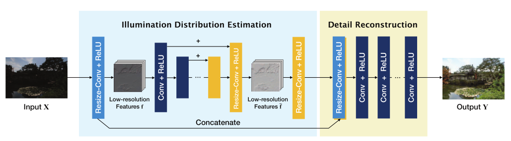

# GLADNet: Low-Light Enhancement Network with Global Awareness

> 论文名称: [Low-Light Enhancement Network with Global Awareness](https://ieeexplore.ieee.org/document/8373911)
>
> 论文作者: Wenjing Wang, Chen Wei, Wenhan Yang, Jiaying Liu
>
> Code: [https://github.com/weichen582/GLADNet](https://github.com/weichen582/GLADNet)

### 这篇笔记的写作者是[PommesPeter](https://github.com/PommesPeter)。

这是一篇讲解使用神经网络进行低照度增强的论文。

- 先对图像的光照进行估计，根据估计的结果来调整原图像
- 调整过程中会对图像中的细节重构，以便得到更加自然的结果。

## Abstract (摘要)

> In this paper, we address the problem of lowlight enhancement. Our key idea is to first calculate a global illumination estimation for the low-light input, then adjust the illumination under the guidance of the estimation and supplement the details using a concatenation with the original input. Considering that, we propose a GLobal illuminationAware and Detail-preserving Network (GLADNet). The input image is rescaled to a certain size and then put into an encoder-decoder network to generate global priori knowledge of the illumination. Based on the global prior and the original input image, a convolutional network is employed for detail reconstruction. For training GLADNet, we use a synthetic dataset generated from RAW images. Extensive experiments demonstrate the superiority of our method over other compared methods on the real low-light images captured in various conditions.

本文主要解决了低照度增强的问题，**关键的思想是输入一张低照度图像进行全局光照估计，然后在估计所得的指导下对亮度进行调整，并于原始图像连接来补充细节。** 提出了GladNet，输入图像resize成一定的大小，放入Encoder-Decoder网络中，以生成的光照作为先验基础。**将先验结果与原图输入卷积神经网络进行细节重构。**

## Introduction

照明不足会严重影响图像质量，生活场景中会经常出现这样的问题。拍摄环境差，摄影设备性能有限，摄影师操作不当都有可能是图像质量差的原因。主要是因为图像的饱和度和对比度不足。

一般常用的低照度增强方式有直方图均衡化(HE)，基于视网膜模型的多尺度颜色恢复（视网膜模型：是图像被认为是反射和照明两个部分的组合），将人类视觉的机制引入到图像处理当中。

在低级的计算机视觉人物中，有人尝试使用叠加稀疏去噪自动编码器学习的变体，从合成黑暗和添加噪声的训练例子中同时进行微光增强和噪声降低。（LLNet）

本文提出了一种全局光照感知和细节保持网络，主要分为两个步骤。

- 第一步是为了获得全局光照估计，将图片进行下采样到固定的大小，通过Encoder-Decoder网络。编码器-解码器的瓶颈层有一个覆盖整个图像的感受野。
- 第二步细节重构，主要是为了恢复和补充图像缩放过程种丢失的细节。
- 为了训练这样的网络，我们从在各种条件下捕获的原始图片合成训练数据集，并使用L1范数作为损失函数。GLADNet的效果是用其他最先进的方法在真实图像上评估的

## Proposed method

网络结构如下图所示。

- 输入被下采样到固定大小。然后，通过编码器-解码器网络传递特征图(产生一个固定大小的照度估计)。在瓶颈层，估计全局照度。缩回到原始尺寸之后，获得整个图像的照明预测。

- 全局照明估计步骤之后是细节重建步骤。三个卷积层参考全局级照度预测来调整输入图像的照度，并同时填充在下采样和上采样过程中丢失的细节。

### 全局光照估计

这一步骤主要包含三个步骤

- 将输入图像缩放到特定分辨率。
- 通过Encoder-Decoder网络进行全局光照预测
- 缩放到原来的分辨率

使用最近邻插值法下采样到特定的大小$W_0\times H_0$.通过有ReLU模块的卷积分层，然后将这个特征图输入到一系列的级联下采样模块，下采样模块的数量根据设定的$W_0\times H_0$来决定，使得ED网络的Bottleneck的感受野能够覆盖整个图像。经过一系列对称的上采样块，得到用于光照预测的特征图。通过另一个上采样块，特征映射被重新缩放到原始输入的大小。

在图像经过ED网络的时候，对应上采样和下采样对应两层之间会做一次跳跃连接，这样能够将下采样的特征与上采样的特征进行映射相加，这个是为了让网络学习残差，而不是直接预测实际的像素值。

下采样模块是由一系列步长为2的卷积层和一个ReLU激活函数组成。在上采样块中与下采样模块类似，但上采样模块是用resize卷积层和来代替普通反卷积层，resize卷积层能够避免棋盘图案的伪影，且对输入的大小没有限制。Resize卷积层是由一个最近邻插值、步长为2的卷积层和一个ReLU激活函数组成。

### 细节重构

- 从全局进行光照估计(但是，由于重新缩放过程，细节会丢失)

原始输入被认为比编码器-解码器网络的输出包含更多的细节，因此可以为细节恢复提供信息。使用拼接代替跳跃连接来组合最后一个上采样块和输入图像的特征映射，使得原始信息和照度估计都可以被完全保留并传输到下一步。级联层后面是三个带有ReLU的卷积层。它将输入图像信息与估计的全局光照信息组合在一起，最终生成具有更好细节的增强结果。

### 损失函数

训练过程是通过最小化恢复图像和相应的地面真实图像之间的损失来实现的。损失函数公式如下：
$$
Loss(X,Y)=\frac{1}{N}\sum^N_{i=1}||F(X_i,\Theta)-Y_i||_1
$$
我们使用的是$L_1$范数作为损失函数，使用$L_2$番薯能够更好的去除噪声和抖动在增强结果上的影响。

此外，红色、绿色和蓝色通道在损失函数中有自己的权重:(0.29891、0.58661、0.11448)，这对于从RGB图像到灰度图像的转换是相同的权重。这有助于保持色彩平衡，提高网络的鲁棒性。

## Experiments

本文训练的时候所有的卷积层都是采用$3\times3$，设定的$W_0\times H_0$大小为$96\times96$,ED网络中使用的卷积核大小也为$3\times3$,使用这个大小的目的是为了能够让感受野覆盖整个图像(因为需要对整个图片上的光照进行增强，如果感受野不能覆盖整个图片那么可能会导致只有局部进行了增强。)

使用GoogleCloud的视觉API来评估图像

