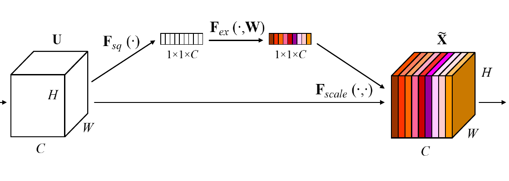
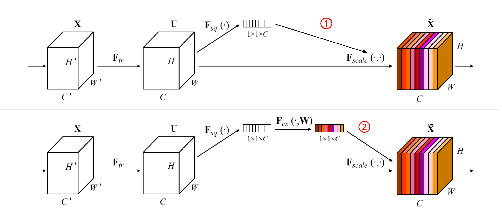

# Squeeze-and-Excitation Networks (SENet)

### 这篇笔记的写作者是[VisualDust](https://github.com/visualDust)。

Squeeze-and-Excitation Networks（SENet）是由自动驾驶公司Momenta在2017年公布的一种全新的图像识别结构，它通过对特征通道间的相关性进行建模，把重要的特征进行强化来提升准确率。这个结构是2017 ILSVR竞赛的冠军，top5的错误率达到了2.251%，比2016年的第一名还要低25%。

> The central building block of convolutional neural networks (CNNs) is the convolution operator, which enables networks to construct informative features by fusing both spatial and channel-wise information within local receptive fields at each layer. A broad range of prior research has investigated the spatial component of this relationship, seeking to strengthen the representational power of a CNN by enhancing the quality of spatial encodings throughout its feature hierarchy. In this work, we focus instead on the channel relationship and propose a novel architectural unit, which we term the "Squeeze-and-Excitation" (SE) block, that adaptively recalibrates channel-wise feature responses by explicitly modelling interdependencies between channels. We show that these blocks can be stacked together to form SENet architectures that generalise extremely effectively across different datasets. We further demonstrate that SE blocks bring significant improvements in performance for existing state-of-the-art CNNs at slight additional computational cost. Squeeze-and-Excitation Networks formed the foundation of our ILSVRC 2017 classification submission which won first place and reduced the top-5 error to 2.251%, surpassing the winning entry of 2016 by a relative improvement of ~25%. Models and code are available at [this https URL](https://github.com/hujie-frank/SENet).

SENet的主要创新是一个模块。如上图，Ftr是传统卷积结构，其输入$X$($C'\times W' \times H'$)和输出$U$($C\times W \times H$)也都是传统结构中已经存在的。SeNet的模块是$U$之后的部分。SENet通过这种设在某种程度上引入了注意力。

---

## SE-Block（SE模块）

SE模块是这篇论文的主要创新点。该模块的运作方法并不复杂。其步骤如下：

1. 接收$U$作为输入，对$U$做全局平均池化（Global Average  Pooling，原论文中称之为**Squeeze过程**，图中标记为$F_{sq}(・)$），得到一个$1\times 1\times C$的特征向量。
2. 将得到的长条状特征向量输入一个两层的全连接层（原文中称为**Excitation过程**，图中标记为$F_{ex}(・,W)$），得到一个大小不变的特征向量，并使用$sigmoid$限制到$[0,1]$的范围内（原论文称之为self-gating mechanism）。
3. 对于得到的特征向量，将其与最初输入$U$的各个$Channel$一一对应，并将其直接作为scale乘进$U$中（图中标记为$F_{scale}(・,・)$）。

这样做的理论依据是为了对channel-wise进行重要性采样。或者换个说法，就是把重要的特征增强，不重要的特征减弱，从而让提取的特征指向性更强。

上图是对SEBlock处理过程的描述。

---

## Squeeze过程的设计细节

图中的$F_{sq}(・)$称为**Squeeze过程**，全局平均池化(Global average pooling，GAP)有很多算法，作者用了最简单的求平均的方法：
$$
z_c = F_{sq}(u_c) = \frac{1}{W\times H}\sum_{i=1}^W\sum_{j=1}^H{u_c(i,j)}
$$
这使空间上所有点的信息都平均成了一个值。这么做是因为最终的scale是对整个通道作用的，这就得基于通道的整体信息来计算scale。另外作者要利用的是通道间的相关性，而不是空间分布中的相关性，用GAP屏蔽掉空间上的分布信息能让scale的计算更加准确。

### Squeeze的效果

## Excitation过程的设计细节

Excitation部分的设计是为了利用**通道相关性**，详见下文中通道相关性部分。

图中的$F_{ex}(・,W)$称为**Excitation过程**，在SEBlock中这部分是用2个全连接来实现的。众所周知，全连接的计算量是非常恐怖的。层间连接数量较大时。所以，在SENet中第一个全连接把$C$个通道压缩成了$C/r$个通道来降低计算量（后面跟了$relu$），第二个全连接再恢复回$C$个通道（后面跟了$sigmoid$）。原论文中尝试了$r$在各种取值下的性能 ，最后得出结论$r=16$时整体性能和计算量较为平衡。

## 通道相关性

上述的Excitation过程是SENet能够利用通道相关性的关键设计。这种设计训练了一个全连接网络，该全连接网络在整个数据集上得出一个合适的$scale$，作用于前序网络的输出。这种设计是必要的：

例如，在上图存在过程1和过程2，过程1不经过全连接直接将$scale$作用于前序网络的输出。没有了全连接层，某个通道的调整值完全基于单个通道全局平均池化(Global average pooling，GAP)的结果，事实上只有GAP的分支是完全没有反向计算、没有训练的过程的，就无法基于全部数据集来训练得出通道增强、减弱的规律。

而过程2是SENet的做法。为什么要加全连接层呢？这里的全连接层旨在更好地捕获通道间的相关关系。为了实现这个目标，函数必须满足两个标准：

1. 它必须能够学习通道间的非线性关系。通道之间会存在关系。
2. 它必须能够学习一种非互斥的关系。因为有用的也许是多个通道。

为了满足这些标准，SENet选用带有$Sigmoid$激活的简单门控机制，利用通道间的相关性训练出真正的$scale$。一次mini-batch个样本的$squeeze$输出并不代表通道真实要调整的$scale$值，真实的scale要基于全部数据集来训练得出，而不是基于单个batch。

还有一个关键问题是：**实际上，单纯通过卷积训练出的权值也有类似$scale$的成分，为什么要加入这个通道相关性的设计呢**？SENet这样设计是为了**排除空间上的干扰**。在经过GAP后，某一个channel上具有的空间信息被压缩成一个点，从而失去了空间相关性，也就排除了空间上的干扰。

## Summary

SENet的设计兼顾了空间相关性（通过1/8下采样的卷积）和通道相关性（通过Excitation的设计）。这种设计把重要通道的特征强化，非重要通道的特征弱化，得到了很好的效果，这是一种全新的思路，在这个方向上将来可能会有更多的成果。这种设计在当时产生了非常大的进步，证明了通道相关性的重要性。

这种设计也能很轻易地运用到其他网络中：

例如，在上图中，左侧是SE-Inception的结构，即Inception模块和SENet组和在一起；右侧是SE-ResNet，ResNet和SENet的组合，这种结构scale放到了残差的直连相加之前。

