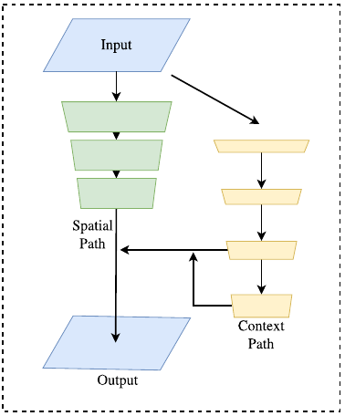
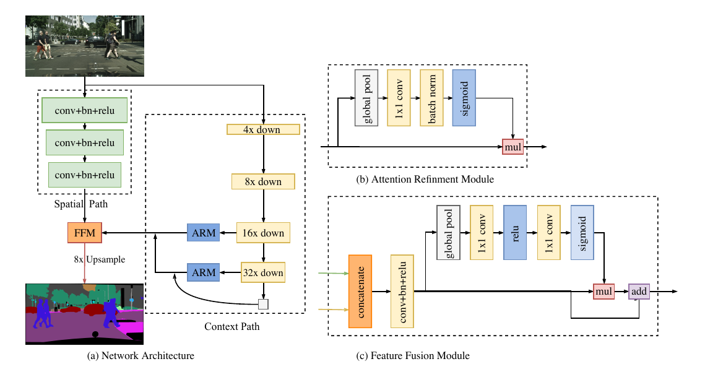
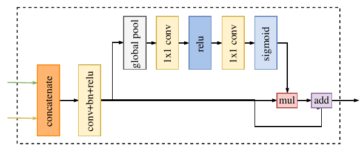

# BiSeNet: Bilateral Segmentation Network for Real-time Semantic Segmentation

### 这篇笔记的写作者是[VisualDust](https://github.com/visualDust)。

BiSeNet的目标是更快速的实时语义分割。在语义分割任务中，空间分辨率和感受野很难两全，尤其是在实时语义分割的情况下，现有方法通常是利用小的输入图像或者轻量主干模型实现加速。但是小图像相较于原图像缺失了很多空间信息，而轻量级模型则由于裁剪通道而损害了空间信息。BiSegNet整合了Spatial Path (SP) 和 Context Path (CP)分别用来解决空间信息缺失和感受野缩小的问题。

> Semantic segmentation requires both rich spatial information and sizeable receptive field. However, modern approaches usually compromise spatial resolution to achieve real-time inference speed, which leads to poor performance. In this paper, we address this dilemma with a novel Bilateral Segmentation Network (BiSeNet). We first design a Spatial Path with a small stride to preserve the spatial information and generate high-resolution features. Meanwhile, a Context Path with a fast downsampling strategy is employed to obtain sufficient receptive field. On top of the two paths, we introduce a new Feature Fusion Module to combine features efficiently. The proposed architecture makes a right balance between the speed and segmentation performance on Cityscapes, CamVid, and COCO-Stuff datasets. Specifically, for a 2048x1024 input, we achieve 68.4% Mean IOU on the Cityscapes test dataset with speed of 105 FPS on one NVIDIA Titan XP card, which is significantly faster than the existing methods with comparable performance.

论文原文：[BiSeNet: Bilateral Segmentation Network for Real-time Semantic Segmentation](https://arxiv.org/abs/1808.00897)。阅读后你会发现，这篇论文有很多思路受到[SENet（Squeeze-and-Excitation Networks）](./Squeeze-and-Excitation-Networks.md)的启发。

---

## 设计目的和思路

在以往的工作中，为了对网络进行加速以达到实时的目的，研究者们往往会选择折中精度以求速度：

1. 通过剪裁或 resize 来限定输入大小，以降低计算复杂度。尽管这种方法简单而有效，空间细节的损失还是让预测打了折扣，尤其是边界部分，导致度量和可视化的精度下降；
2. 通过减少网络通道数量加快处理速度，尤其是在骨干模型的早期阶段，但是这会弱化空间信息。
3. 为追求极其紧凑的框架而丢弃模型的最后阶段（比如ENet）。该方法的缺点也很明显：由于 ENet 抛弃了最后阶段的下采样，模型的感受野不足以涵盖大物体，导致判别能力较差。

上图中左侧是剪裁和resize方法的示意，右侧是跑去部分结构或减少通道的示意。为解决上述空间信息缺失问题，研究者普遍采用 U 形结构。通过融合 backbone 网络不同层级的特征，U 形结构逐渐增加了空间分辨率，并填补了一些遗失的细节。

上图是一种典型的U型结构。但是，这一技术有两个弱点：

1. 由于高分辨率特征图上额外计算量的引入，完整的 U 形结构拖慢了模型的速度。
2. 绝大多数由于裁剪输入或者减少网络通道而丢失的空间信息无法通过引入浅层而轻易复原。换言之，U 形结构顶多是一个备选方法，而不是最终的解决方案。

基于上述观察，本文提出了双向分割网络BiSeNet（Bilateral Segmentation Network），其主要的改进有：

- 同时使用Spatial Path (SP) 和 Context Path (CP)，兼顾空间属性和感受野
- 提出特征融合模块（Feature Fusion Module/FFM）用于更好地融合SP和CP的特征
- 提出注意力优化模块（Attention Refinement Module/ARM）

下图为BiSeNet的结构示意图：

它包含两个部分：Spatial Path (SP) 和 Context Path (CP)。顾名思义，这两个组件分别用来解决空间信息缺失和感受野缩小的问题。对于 Spatial Path，论文中只叠加三个卷积层以获得 1/8 特征图，其保留着丰富的空间细节。对于 Context Path，本文在[Xception](//todo)尾部附加一个全局平均池化层，其中感受野是 backbone 网络的最大值。

上图是以上三种思路放在一起的对比图。在追求更快、更好模型的过程中，论文也研究了两个组件的融合，以及最后预测的优化，并分别提出特征融合模块FFM（Feature Fusion Module）和注意力优化模块ARM（Attention Refinement Module），这两个模块进一步从整体上提升了语义分割的精度。

---

## 网络结构设计

上图是BiSeNet的网络结构。可以看到其重要组成部分Spatial Path、Context Path以及两个优化模块Attention Refinement（原图中打错了单词）、Feature Fusion Module。

### Spatial Path

在语义分割任务中，空间分辨率和感受野很难两全，尤其是在实时语义分割的情况下，现有方法通常是利用小的输入图像或者轻量主干模型实现加速。但是小图像相较于原图像缺失了很多空间信息，而轻量级模型则由于裁剪通道而损害了空间信息。

在原论文中，为了保持充足的空间信息，Spatial Path包含三个层，每个层由一个步长为2的卷积和一个BN层以及一个非线性的ReLU激活层构成。这样做使得Spatial Path仅对原图进行1/8下采样，保留了丰富的空间信息。

### Context Path

在语义分割任务中，感受野对于性能表现至关重要。为增大感受野，一些方法利用金字塔池化模块，金字塔型空洞池化（ASPP）或使用"large kernel"，但是这些操作比较耗费计算和内存，导致速度慢，这些缺点在实时的任务上尤为突出。出于较大感受野和较高计算效率兼得的考量，本文提出 Context Path，它充分利用轻量级模型与全局平均池化以提供大感受野。

在本工作中，轻量级模型，比如 Xception，可以快速下采样特征图以获得大感受野，编码高层语义语境信息。接着，本文在轻量级模型末端添加一个全局平均池化，通过全局语境信息提供一个最大感受野。在轻量级模型中，本文借助 U 形结构融合最后两个阶段的特征，但这不是一个完整的 U 形结构。图 2(c) 全面展示了 Context Path。

#### Attention Refinement Module (ARM)

在 Context Path 中，本文提出一个独特的注意力优化模块，以优化每一阶段的特征：

如上图所示，ARM 借助全局平均池化捕获全局语境并计算注意力向量以指导特征学习。这一设计可以优化 Context Path 中每一阶段的输出特征，无需任何上采样操作即可轻易整合全局语境信息，因此，其计算成本几乎可忽略。

### Feature Fusion Module (FFM)

在特征表示的层面上，两路网络的特征并不相同。因此不能简单地加权这些特征。由 Spatial Path捕获的空间信息编码了绝大多数的丰富细节信息。而 Context Path 的输出特征主要编码语境信息。换言之，Spatial Path 的输出特征是低层级的，Context Path 的输出特征是高层级的。因此，本文提出一个独特的特征融合模块以融合这些特征。

在特征的不同层级给定的情况下，本文首先连接 Spatial Path 和 Context Path 的输出特征；接着，通过批归一化平衡特征的尺度。下一步，像[SENet](./[23]Squeeze-and-Excitation-Networks.md)一样，把相连接的特征池化为一个特征向量，并计算一个权重向量。这一权重向量可以重新加权特征，起到特征选择和结合的作用。上图展示了这一设计的细节。

## 实验

实验部分请自行阅读原论文。
