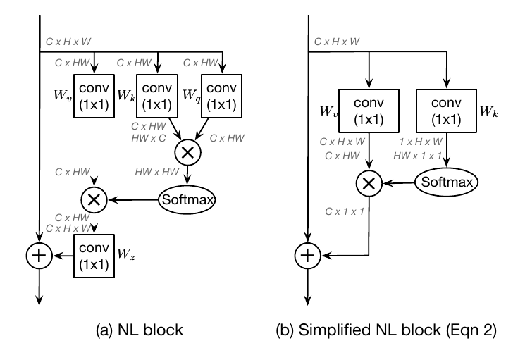
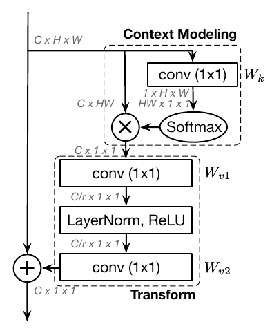

# GCNet: Global Context Networks (Non-local Networks Meet Squeeze-Excitation Networks and Beyond)

[Yue Cao](https://arxiv.org/search/cs?searchtype=author&query=Cao%2C+Y), [Jiarui Xu](https://arxiv.org/search/cs?searchtype=author&query=Xu%2C+J), [Stephen Lin](https://arxiv.org/search/cs?searchtype=author&query=Lin%2C+S), [Fangyun Wei](https://arxiv.org/search/cs?searchtype=author&query=Wei%2C+F), [Han Hu](https://arxiv.org/search/cs?searchtype=author&query=Hu%2C+H)

### 这篇笔记的写作者是[VisualDust](https://github.com/visualDust)。

GCNet（原论文：[GCNet: Non-local Networks Meet Squeeze-Excitation Networks and Beyond](https://arxiv.org/abs/1904.11492)或[Global Context Networks](https://arxiv.org/abs/2012.13375)）这篇论文的研究思路类似于DPN，深入探讨了Non-local和SENet的优缺点，然后结合Non-local和SENet的优点提出了GCNet。

> The Non-Local Network (NLNet) presents a pioneering approach for capturing long-range dependencies, via aggregating query-specific global context to each query position. However, through a rigorous empirical analysis, we have found that the global contexts modeled by non-local network are almost the same for different query positions within an image. In this paper, we take advantage of this finding to create a simplified network based on a query-independent formulation, which maintains the accuracy of NLNet but with significantly less computation. We further observe that this simplified design shares similar structure with Squeeze-Excitation Network (SENet). Hence we unify them into a three-step general framework for global context modeling. Within the general framework, we design a better instantiation, called the global context (GC) block, which is lightweight and can effectively model the global context. The lightweight property allows us to apply it for multiple layers in a backbone network to construct a global context network (GCNet), which generally outperforms both simplified NLNet and SENet on major benchmarks for various recognition tasks. The code and configurations are released at [this https URL](https://github.com/xvjiarui/GCNet).

GCNet提出一种模块框架称为Global context modeling framework（上图中(a)），并将其分为三步：Context modeling、Transform、Fusion。

这篇论文选用[Non-Local Neural Networks](./[27]Non-local-Neural-Networks)（上图中(b)是其简化版）的Context modeling 和 [Squeeze and Excitation Networks ](./[23]Squeeze-and-Excitation-Networks)（上图中(c)是其一种形式）的 Transform过程组成新的模块Global Context (GC) block，同时训练spacial和channel-wise上的注意力。这是一篇很好的论文，有兴趣请阅读[原文](https://arxiv.org/abs/1904.11492)。

## Non-Local在实践中的缺陷

这篇论文提出，NLNet（[Non-Local Neural Networks](./[27]Non-local-Neural-Networks)）在长距离注意力方面作出了开创性的工作。在这里作者提出，为了建立长距离的注意力，有两种办法：

1. 采用**自注意力机制**来建模query对的关系（也就是Non-Local的做法）。
2. 第二种是对query-independent（可以理解为无query依赖）的**全局上下文**建模。

NLNet就是典型的采用自注意力机制来建模像素对关系。但是，作者从COCO数据集中随机选择6幅图，分别可视化3个不同位置和它们的attention maps进行实验：

结果发现对于不同位置来说，它们的attention maps几乎是相同的。这说明，**虽然non-local block想要计算出每一个位置特定的全局上下文，但是经过训练之后，实际上形成的attention map受位置的影响非常低。**

也就是说，NLNet对于每一个位置学习不受位置依赖的attention map，造成了大量的计算浪费。通过严格的实验分析，作者发现non-local network的全局上下文在不同位置几乎是相同的，这表明NLNet经过训练之后实际上学习到的是弱位置依赖的全局上下文。

## 简化Non-Local block

如果你不知道什么是Non-Local block，请先阅读[Non-Local Neural Networks](./[27]Non-local-Neural-Networks)。

刚才说到通过严格的实验分析，作者发现non-local network的全局上下文上造成了大量的计算浪费。作者取其精华去其糟粕设计了简化的Non-Local block：

上图中（a）是Non-Local neural Networks的原论文中提出的Non-Local block结构；（b）是这篇论文的作者重新设计的简化版本。

### 原版Non-Local block

**原版Non-Local block**（上图中（a））（如果不知道这是什么，请先阅读请先阅读[Non-Local Neural Networks](./[27]Non-local-Neural-Networks)）可以描述为：
$$
z_i = x_i + \sum_{j=1}^{N_p}\frac{f(x_i,x_j)}{C(x)}(W_v\cdot x_i)
$$
其中$C(x)$为归一化因子；$f(x_i,x_j)$为衡量相关性的函数，为了方便，定义$w(x_i,x_j)=\frac{f(x_i,x_j)}{C(x)}$为归一化的关系衡量函数；$W_z$和$W_v$是线性变换矩阵。

在本文中，作者选择将$f(x_i,x_j)$表示为Embedded Gaussian的形式：
$$
w(x_i,x_j) = \frac{\exp(W_q x_i,W_k x_j)}{\sum_m\exp(W_q x_i,W_k x_m)}
$$

### 简化的Non-Local block

**简化后的Non-Local block**（上图中（b））可以描述为：
$$
z_i = x_i + \sum_{j=1}^{N_p}[\frac{\exp(W_k x_j)}{\sum_{m=1}^{N_p}\exp(W_k x_m)}(W_v\cdot x_j)]
$$
其中$W_k$和$W_v$是线性变换矩阵。为了进一步降低计算量作者将$W_v$移动到attention pooling的外面，表示为：
$$
z_i = x_i + W_v\sum_{j=1}^{N_p}\frac{\exp(W_k x_j)}{\sum_{m=1}^{N_p}\exp(W_k x_m)}x_j
$$
这样修改之后，$1\times 1$卷积的FLOPs从$O(HWC^2)$降低到了$O(C^2)$。

不同于原始的non-local block，简化版non-local block的第二项是不受位置依赖的，所有位置共享这一项。因此，作者直接将全局上下文建模为所有位置特征的加权平均值，然后聚集全局上下文特征到每个位置的特征上。

## Global Context Modeling Framework

如同上文的叙述，简化版的non-local block可以抽象为3个步骤：

1. 全局attention pooling：采用$1\times1$卷积$W_k$和softmax函数来获取attention map，然后执行attention pooling获得全局上下文特征。
2. 使用$1\times 1$卷积的线性变换$W_v$进行特征转换。
3. 将得到的全局上下文特征通过加和的方式整合到每个位置上。

整体过程的模块设计如图所示：

作者将该抽象过程描述为下面的这个公式：
$$
z_i = F(x_i, \delta(\sum_{j=1}^{N_p}\alpha_jx_j))
$$
其中$\sum_{j=1}^{N_p}\alpha_jx_j$被称为**context modeling**模块，用于通过权值$\alpha$聚合来自全局各个位置的特征；$\delta(\cdot)$表示一种用于捕获通道见相关性的transform；$F(\cdot,\cdot)$表示一个特征fusion的过程，在这里特指使用fusion函数将获得的全局上下文特征整合到每个位置上。

接下来，论文提出将SEBlock的操作分为三步：

1. global average pooling用于上下文建模(即squeeze操作)。
2. bottleneck transform用于计算每个通道的重要程度(即excitation operation)。
3. rescaling function用于通道特征重标定(即element-wise multiplication)。

并提出，其中的第一步（squeeze操作）可以替换为简化版的Non-Local Block。

## Global Context Block (GCBlock)

作者提出了一种新的全局上下文建模框架，global context block(简写GCNet)，即能够像SNL block一样建立有效的长距离依赖，又能够像SEblock一样建立通道间的关系：

在简化版的non-local block中，transform模块有大量的参数。为了获得SE block轻量的优点，1x1卷积用bottleneck transform模块来取代，能够显著的降低参数量(其中r是降低率)。因为两层bottleneck transform增加了优化难度，所以在ReLU前面增加一个layer normalization层(降低优化难度且作为正则提高了泛化性)。

GCBlock可以被表示为下面的公式：
$$
z_i = x_i + W_{v2}Relu(LN(W_{v1}\sum_{j=1}^{N_p}\alpha_j x_j))
$$
上式中：
$$
\alpha_j = \frac{e^{W_k x_j}}{\sum_{m=1}^{N_p}e^{W_k x_m}}
$$
是全局attention pooling的权值，$\delta(\cdot)=W_{v2}ReLU(LN(W_{v1}(\cdot)))$表示bottleneck transform的过程。

也就是说，GCblock的操作可以分为以下三个步骤：

1. global attention pooling用于上下文建模。
2. bottleneck transform来捕获通道间依赖。
3. broadcast element-wise addition用于特征融合。

## 有效性的讨论

这篇论文很精彩，但是有以下几个问题让人想不通：

1. 为什么Non-Local在不同的query位置生成的attention map是几乎相同的？

   已经有两篇论文（OCNet、DANet）证实了在分割模型里面加入non-local算子可以让学习得到的attention map集中在和query pixel同类别的区域，而不是和query无关。可能这个问题是和具体任务相关的。

2. 文中的Global Context Modeling为何要这样设计也是一个问题。

   根据论文中给出的公式，似乎使用全连接和一个残差连接能达到类似的功能。
