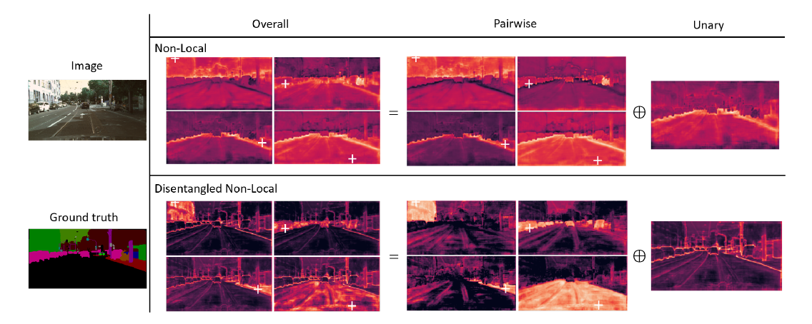

# Disentangled Non-Local Neural Networks

[Minghao Yin](https://arxiv.org/search/cs?searchtype=author&query=Yin%2C+M), [Zhuliang Yao](https://arxiv.org/search/cs?searchtype=author&query=Yao%2C+Z), [Yue Cao](https://arxiv.org/search/cs?searchtype=author&query=Cao%2C+Y), [Xiu Li](https://arxiv.org/search/cs?searchtype=author&query=Li%2C+X), [Zheng Zhang](https://arxiv.org/search/cs?searchtype=author&query=Zhang%2C+Z), [Stephen Lin](https://arxiv.org/search/cs?searchtype=author&query=Lin%2C+S), [Han Hu](https://arxiv.org/search/cs?searchtype=author&query=Hu%2C+H)

### 这篇笔记的写作者是[VisualDust](https://github.com/visualDust)。

> The non-local block is a popular module for strengthening the context modeling ability of a regular convolutional neural network. This paper first studies the non-local block in depth, where we find that its attention computation can be split into two terms, a whitened pairwise term accounting for the relationship between two pixels and a unary term representing the saliency of every pixel. We also observe that the two terms trained alone tend to model different visual clues, e.g. the whitened pairwise term learns within-region relationships while the unary term learns salient boundaries. However, the two terms are tightly coupled in the non-local block, which hinders the learning of each. Based on these findings, we present the disentangled non-local block, where the two terms are decoupled to facilitate learning for both terms. We demonstrate the effectiveness of the decoupled design on various tasks, such as semantic segmentation on Cityscapes, ADE20K and PASCAL Context, object detection on COCO, and action recognition on Kinetics.

从论文名称上来看，这篇论文分析了[Non-Local Neural Networks](./[27]Non-local-Neural-Networks.md)中的Non-Local模块中所存在的注意力机制，并对其设计进行了解耦。解耦后该注意力分为两部分：成对项（pairwise term）用于表示像素之间的关系，一元项（unary term）用于表示像素自身的某种显著性。这两项在Non-Local块中是紧密耦合的。这篇论文发现当着两部分被分开训练后，会分别对不同的视觉线索进行建模，并达到不错的效果。

整篇论文从对Non-Local分析到新的方法提出都非常地有调理。有时间请阅读原论文[Disentangled Non-Local Neural Networks](https://arxiv.org/abs/2006.06668)。

> 在阅读本文之前请先阅读[Non-Local Neural Networks](./[27]Non-local-Neural-Networks.md)。

## Non-Local的深入分析

Non-Local块用于在单层内建立像素之间的长距离依赖关系，是一种像素级的自注意力机制。这种像素级的自注意力是通过像素的特征在嵌套（Embedding）空间进行点积运算获得的。初见Non-Local，会不自然地将其当作一种成对（Pairwise）的关系，即每个像素都会和其他像素建立一对一的关系。在更加深刻的思考后，本文的作者认为除了Pairwise的关系，这样的注意力还带有一个一元（Unary）的显著性信息，即每个像素本身也通过这种运算对其他像素产生影响。

回顾Non-Local是如何捕获长距离特征的：
$$
y_i = \sum_{j\in\Omega}w(x_i,x_j)g(x_j)
$$
其中$y_i$表示在位置$i$上的输出，$\Omega$表示所有像素对应的特征的集合，$g(\cdot)$是一个emedding函数，$w(x_i,x_j)$是在嵌套（Embedded）空间内计算$x_i,x_j$相关性的函数（忘记了这个公式的话可以复习一下[Non-Local Neural Networks](./[27]Non-local-Neural-Networks.md)）。当$w(x_i,x_j)$是Embedded Gaussian时，$w(x_i,x_j)$可以展开为：
$$
w(x_i,x_j) = \sigma(q_i^Tk_j) = \frac{exp(q_i^Tk_j)}{\sum_{t\in\Omega}exp(q_i^Tk_t)}
$$
其中$q_i=W_qx_i$，$k_i=W_kx_i$，分别表示$x_i$的查询值（query）和键（key）（如有疑惑请查阅[注意力机制](../ch3pw/[4]attention.md)中有关键值注意力的部分），$\sigma(\cdot)$表示$softmax$函数。

第一眼看上去，该公式建立了一种成对（pairwise）的关系，即每个像素都会和其他像素建立一对一的关系。但是，作者同是发现该公式会同时编码像素的显著性信息。考虑如下特殊情况：当整张图片上的所有像素使用同个常量作为其query值时，每个像素的key就会对其他所有像素的位置上的输出产生影响（原文为`Considering a special case where the query vector is a constant over all image pixels, a key pixel will have global impact on all query pixels.`）。在[GCNet](./[28]GCNet-Non-local-Networks-Meet-Squeeze-Excitation-Networks-and-Beyond.md)中，作者通过一系列实验展现了在一些视觉任务中，Non-Local块常常退化为一种仅包含一元项（unary term）的注意力：

上图表示Non-Local块在不同的query位置（图片中的红点位置）产生的attention map可视化（详见[Non-local Networks Meet Squeeze-Excitation Networks and Beyond](./[28]GCNet-Non-local-Networks-Meet-Squeeze-Excitation-Networks-and-Beyond.md)）。可以看出，当每个像素的key和所有的query具有类似的相似度时，Non-Local块就会退化成一个仅包含一元项（unary term）的注意力，表达像素之间特殊关系的能力降低了。这些现象都说明了，除了第一眼看上去的成对（pairwise）关系，一元（unary）的关系（也就是像素的显著性关系）也被Non-Local块编码。

所以，接下来作者将Non-Local块中所产生的注意力**拆分为两个项（分量）：**

- **成对项（pairwise term）用于表示像素对另一个像素的单独影响**
- **一元项（unary term）用于表示一个像素对所有像素的公共影响**。

在这篇论文中，作者单独训练了两个网络，分别用于对一元的和二元的两种注意力进行实验，保证它们互相不受对方干扰，并发现两种注意力分别产生了不同的作用：

上图是Non-Local块和解耦的Non-Local块各部分产生注意力的可视化。可以看出，成对项（pairwise term）产生的注意力很好地建模了区域内的线索，而一元项（unary term）的注意力很好地建模了显著边界。对比Non-Local块在Non-Local Neural Networks中的表现，当这两种注意力没有被分开时，并没有学习到如此清晰的视觉线索。在后续的测试中，作者发现结合了这两种注意力的Non-Local本身的性能甚至比仅包含一元项（unary term）的变体还差。这表明将这两个项（term）耦合在一起可能不利于这些视觉线索的学习。

为了解决这个问题，作者就将这两项分开，提出了解耦（Disentangled）的Non-Local。在这个设计中，上文提到的一元项（unary term）经过单独的嵌入（embadding）和单独的$softmax$从原本的分布中脱离独立出来，从而实现了两项的解耦。

## Dividing Non-local Block into Pairwise and Unary Terms

于是产生了一个问题，如何将上述公式分解为pairwise和unary两项，并使它们相互不产生影响呢？

为了解决这个问题，作者提出了一种能单纯表示key和query之间关系的点积，称为白化（whitened）点积用于表示pairwise项：
$$
(q_i-\mu_q)^T(k_j-\mu_k)
$$
其中$\mu_q=\frac{1}{|\Omega|}\sum_{i\in\Omega}q_i$和$\mu_k = \frac{1}{|\Omega|}\sum_{j\in\Omega}k_j$分别表示所有像素的query和key（在嵌入空间）的均值，这种白化（whitened）的设计使用query和key之间的归一化差异来衡量其相似性。上述表达式和Non-Local中的原始设计关系如下：
$$
q_i^Tk_j =(q_i-\mu_q)^T(k_j-\mu_k) + \mu_q^Tk_j+q_i^T\mu_k+\mu_q^T\mu_k
$$
其中最后两项是同时出现在相关性函数：
$$
w(x_i,x_j) = \sigma(q_i^Tk_j) = \frac{exp(q_i^Tk_j)}{\sum_{t\in\Omega}exp(q_i^Tk_t)}
$$
的分子和分母中。在原论文的附录中，作者证明了这使得最后两项可以被约掉。所以，相关性函数可以被写作：
$$
w(x_i,x_j) = \sigma(q_i^Tk_j) = \sigma(\underbrace{(q_i-\mu_q)^T(k_j-\mu_k)}_{pairwise}+\underbrace{\mu_q^Tk_j}_{unary})
$$
通过这种设计，深度学习技术在此处就学习了两种分布，从而在分布上pairwise和unary的关系就被分离了。

上图中（b）、（c）分别表示Pairwise Non-Local和Unary Non-Local。（d）是上述公式的网络结构表示。
