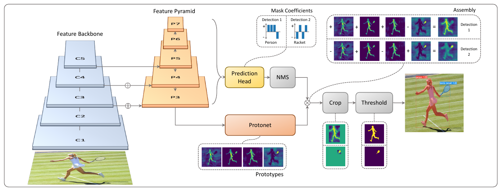
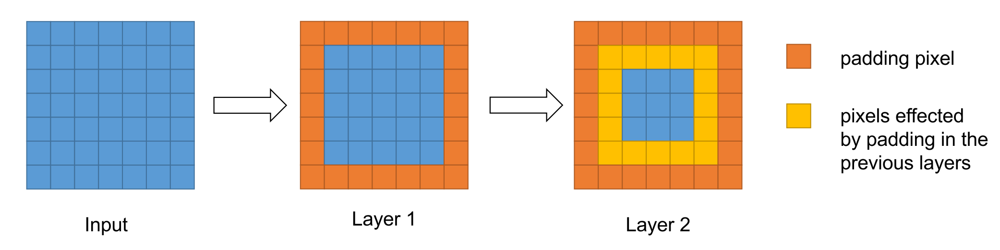
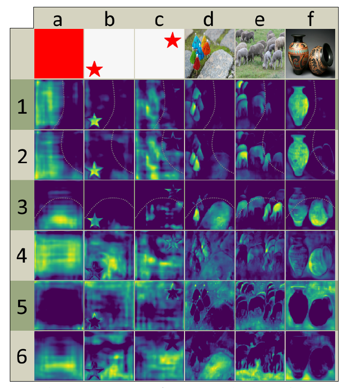

# YOLACT: Real-time Instance Segmentation

[Daniel Bolya](https://arxiv.org/search/cs?searchtype=author&query=Bolya%2C+D), [Chong Zhou](https://arxiv.org/search/cs?searchtype=author&query=Zhou%2C+C), [Fanyi Xiao](https://arxiv.org/search/cs?searchtype=author&query=Xiao%2C+F), [Yong Jae Lee](https://arxiv.org/search/cs?searchtype=author&query=Lee%2C+Y+J)

> We present a simple, fully-convolutional model for real-time instance segmentation that achieves 29.8 mAP on MS COCO at 33.5 fps evaluated on a single Titan Xp, which is significantly faster than any previous competitive approach. Moreover, we obtain this result after training on only one GPU. We accomplish this by breaking instance segmentation into two parallel subtasks: (1) generating a set of prototype masks and (2) predicting per-instance mask coefficients. Then we produce instance masks by linearly combining the prototypes with the mask coefficients. We find that because this process doesn't depend on repooling, this approach produces very high-quality masks and exhibits temporal stability for free. Furthermore, we analyze the emergent behavior of our prototypes and show they learn to localize instances on their own in a translation variant manner, despite being fully-convolutional. Finally, we also propose Fast NMS, a drop-in 12 ms faster replacement for standard NMS that only has a marginal performance penalty.

YOLACT是You Only Look At CoefficienTs 的简写，其中 coefficients 是这个模型的输出之一，这个命名风格应是致敬了另一目标检测模型 YOLO。

上图：YOLACT的网络结构图。**YOLACT的目标是将掩模分支添加到现有的一阶段（one-stage）目标检测模型**。我个人觉得这是夹在一阶段和二阶段中间的产物。将其分为一阶段的依据是其实现“将掩模分支添加到现有的一阶段目标检测模型”的方式与Mask R-CNN对 Faster-CNN 操作相同，但没有诸如feature repooling和ROI align等明确的目标定位步骤。也就是，`定位-分类-分割`的操作被变成了`分割-剪裁`。

根据评估，当YOLACT 处理$550\times 550$​​​大小的图片时，其速度达到了 33FPS，而互联网上多数视频一般是 30FPS 的，这也就是实时的含义了。这是单阶段比较早的一份工作，虽然这个速度不快但也还行了。

---

## YOLACT网络结构

本文作者将实例分割的复杂任务分解为两个更简单的并行任务，分别是使用FCN生成一组对象无关的分割掩码（称为prototype masks，“原型掩码”）以及在目标检测分支添加额外的head生成某种相关系数（称为mask coefficients，“掩模系数”）。

可以看出，整个网络共享了一个backbone，使用FPN作为neck，在后面才分为了两个分支。其中上方的分支是加入了一个head用于预测掩模系数的，下放的分支是使用protonet生成原型掩模的。

## 老朋友：backbone+FPN

在YOLACT中，输入经过backbone+FPN结构处理后才进入两个分支。或者换句话说，两个分支共享这个backbone。

Backbone+FPN（neck）是需要获得不同level特征图时常用的提取结构，在很多其他网络中也见得着。例如，在[SOLO: Segmenting Objects by Locations](./[36]SOLO-Segmenting-Objects-by-Locations.md)中，前序网络也是类似的结构。以resnet101为例：

上图中分割线上方是ResNet的backbone，图中_make_layer是YOLACT代码中的helper函数。在后续结构中会用到backbone在多个level上的特征，也就是左侧标号0、1、2、3的蓝色块。这些不同level的输出进入了FPN。分割线下放是FPN结构，其使用了来自backbone的多级输出，并产生新的多级输出，即图中右下侧黄色三角0、1、2、3、4。

这种Backbone+FPN的结构能够融合多感受野，浅层低层级特征得到了保留，深层网络的高层级特征也融入了进来。所以这种结构在分割网络中经常使用。

## prototype mask分支

网络结构图中下侧的分支是用于生成图像大小的原型掩码（prototype masks）的网络分支。

上图：YOLACT中两个分支的结构。其中黄色三角0、1、2、3、4分别表示前序的backbone+FPN输出的不同level的特征图。上图中灰色分割线左侧是prototype mask分支的结构。可以看出用于预测原型mask分支的分支使用了了上采样到最大分辨率并再融合的最大特征图（标号0）作为输入，目的是为了获得精细的分割mask。

最终这个分支的输出有两个：

- `proto`：与mask系数配合使用的分割特征图，形状为（1，138，138，32）
- `segm`：得到一个类似分割的热度图，这里的形状为（1，num_class-1，69，69），估计segm是为了使得网络快速收敛用的。

在原论文中，作者用超参数$k$描述protonet部分输出的通道数：

上图：protonet的结构。上面的话换个理解，就是对一组输出，prototype mask分支会生成一组共$k$​个mask。这些mask和后面的掩模系数线性组合会产生实例级的分割结果。

## mask coefficients分支

这个分支用于获得检测框和掩模相关系数，对一组输出进行处理的是一个head。上方的机构图中灰色分割线右侧是该分支结构图。

上图：对于不同level的特征图输入，分别对应多个head，即对黄色三角代表的0、1、2、3、4输入，分别对应一个这样的结构。多个level上的head处理完后会concat在一起，最终在该分支上产生五种输出：

- `loc`：每个anchorbox的预测偏移量，形状为（1，19248，4）
- `conf`：每个anchorbox的类别预测，形状为（1，19248，num_class）
- `mask`：就是论文中指出的mask系数，形状为（1，19248，32）
- `priors`：预设的anchorbox的坐标，形状为（19248，4）

## YOLACT如何学习

### 实例级掩模合成（Mask Assembly）

前面我们聊了两个分支。将整个网络结构拼在一起就是：

上图：整个网络前向传播流程。所以我们就有一种简单的理解：YOLACT是进行了一次语义特征图的生成，然后用相关系数和语义特征图产生最终的实例分割结果。

在原论文的代码中，为了生成实例掩模，通过基本的矩阵乘法配合sigmoid函数来处理两分支的输出，从而合成mask：
$$
Mask = \sigma(PC^T)
$$
其中$P\in h\times w\times k$是原型mask集合（也就是Protonet生成的一组特征图），$C\in n\times k$​是掩模系数（Coefficient）集合，代表有n个通过NMS和阈值过滤的实例，每个实例对应有k个mask系数。

### Loss设计

YOLACT在模型训练时，采用三个Loss对模型进行优化：

1. 分类Loss，即$L_{cls}$​。可能的选择是类别上做交叉熵。
2. 边界框回归Loss，即$L_{box}$。可能的选择是IOU系列Loss。
3. 语义分割的掩模loss，即$L_{maxk}$​。计算方式是二值交叉熵$L_{mask} = BCE(M,M_{gt})$。

上述loss中前两个作用于掩模相关系数分支，第三个作用于原型掩模产生的分支。

### Mask剪裁的细节

在前向传播时，YOLACT会使用bounding box裁剪掩模形成实例分割结果。值得注意的细节是，裁剪使用的bounding box在预测和训练时是不同的。为了使两个分支的训练不过多地相互干涉，在训练时，裁剪mask使用的是来自ground truth的bounding box，而在预测时才会使用另一个分支产生的bounding box。这样，训练时两个分支的Loss就不会相关。

## Emergent Behavior

阅读过Fully Convolutional Instance-aware Semantic Segmentation的朋友都知道，实例分割任务有一个共识，FCN是平移等变的。这导致在feature localizing能力的缺失。因此，在Mask R-CNN和FCIS等二阶段实例分割方法中，通过将mask预测分支放在第二个stage来解决平移等变带来的问题：都使得它们不需要再处理localize的问题。

和上述方法不同，YOLACT通过学习在原型掩模生成时会生成一组不同的激活：

例如上图(a)中的纯色红色方块，如果想在FCN中产生(a)下方的激活图，这是不可能的。原因非常简单：

> if its input everywhere in the image is the same, the result everywhere in the conv output will be the same.

由于卷积在整个输入上都是权值共享的，卷积核在每个位置的输出为单个值，如果输入一样，输出也会一样。所以对(a)中的纯红色方块，全卷积应该不能产生其下方的这种有变化的激活图。

在原论文代码中，FCN使用的是ResNet作为Backbone进行特征提取。如果有多个Layer堆叠在一起，并且它们都使用了padding，就会产生一个有趣的现象：

上图：padding对下一层的影响。例如，我们取卷积核大小为$3\times 3$​，$padding = 1$​​，图中蓝色表示依然平移不变的输入，橘黄色表示当前层的padding像素，黄色表示受之前层中padding像素影响的像素。不难想象，随着层数的加深，这种padding带来的影响可以描述“某个像素与边界的距离”。

上图：自己做的一个实验。在经历了五层卷积后，一个纯色的方块输入在无padding和使用0进行padding的情况下展现出差异。

在原论文中，作者描述了YOLACT中原型掩模的有效性：

在上图中，每一列mask就是一组原型掩模。可以看出，在经过学习后，该分支的输出对实体的类别和实体本身都展现出了特异性。例如，在mask编号1-3中，掩模表现出方向相关性，即mask只有沿一条曲线的一侧被激活；而再mask编号4-6中，掩模表现出类别敏感，例如在输入f对应的掩模mask编号5和6分别激活了非前景的部分和地面的部分。

上图：protonet的结构。在上面的实验中使用的编号1-6的mask，可以理解为在protonet中将$k$​设置为6，从而产生了一组6个原型掩模。作者实验说明了即使设置$k=32$​模型的性能也不会降低。或者说，增加$k$很可能是无效的，因为预测掩模系数很困难。如果网络即使在一个系数中出现大错误，由于线性组合的性质，生成的掩码可能会消失或包括来自其他对象的泄漏。因此，网络必须发挥平衡作用以产生正确的系数，而添加更多原型会使这变得更加困难。

在实验中作者发现对于更高的$k$​值，网络只是简单产生了边缘级别变化，这使得AP95略微上涨，但除此之外并没有太多其他用途。
