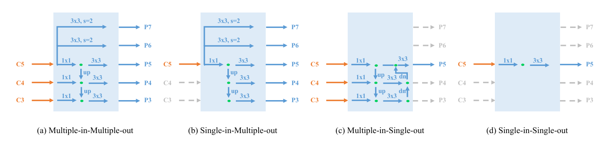
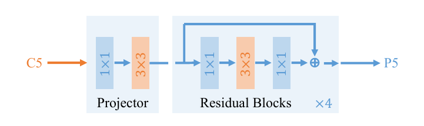

# You Only Look One-level Feature

[Qiang Chen](https://arxiv.org/search/cs?searchtype=author&query=Chen%2C+Q), [Yingming Wang](https://arxiv.org/search/cs?searchtype=author&query=Wang%2C+Y), [Tong Yang](https://arxiv.org/search/cs?searchtype=author&query=Yang%2C+T), [Xiangyu Zhang](https://arxiv.org/search/cs?searchtype=author&query=Zhang%2C+X), [Jian Cheng](https://arxiv.org/search/cs?searchtype=author&query=Cheng%2C+J), [Jian Sun](https://arxiv.org/search/cs?searchtype=author&query=Sun%2C+J)

> This paper revisits feature pyramids networks (FPN) for one-stage detectors and points out that the success of FPN is due to its divide-and-conquer solution to the optimization problem in object detection rather than multi-scale feature fusion. From the perspective of optimization, we introduce an alternative way to address the problem instead of adopting the complex feature pyramids - {\em utilizing only one-level feature for detection}. Based on the simple and efficient solution, we present You Only Look One-level Feature (YOLOF). In our method, two key components, Dilated Encoder and Uniform Matching, are proposed and bring considerable improvements. Extensive experiments on the COCO benchmark prove the effectiveness of the proposed model. Our YOLOF achieves comparable results with its feature pyramids counterpart RetinaNet while being 2.5× faster. Without transformer layers, YOLOF can match the performance of DETR in a single-level feature manner with 7× less training epochs. With an image size of 608×608, YOLOF achieves 44.3 mAP running at 60 fps on 2080Ti, which is 13% faster than YOLOv4. Code is available at [this https URL](https://github.com/megvii-model/YOLOF).

本文简称YOLOF。截至到本文写作时，二阶段和单阶段目标检测的SOTA方法中广泛使用了多尺度特征融合的方法。FPN方法几乎已经称为了网络中理所应当的一个组件。

本文中作者重新回顾了FPN模块，并指出FPN的两个优势分别是其分治（divide-and-conquer）的解决方案、以及多尺度特征融合。本文在单阶段目标检测器上研究了FPN的这两个优势，并在RetinaNet上进行了实验，将上述两个优势解耦，分别研究其发挥的作用，并指出，FPN在多尺度特征融合上发挥的作用可能没有想象中那么大。

最后，作者提出YOLOF，这是一个不使用FPN的目标检测网络。其主要创新是：

1. Dilated Encoder
2. Uniform Matching

该网络在达到RetinaNet对等精度的情况下速度提升了2.5倍。

---

## 讨论FPN的作用

FPN是多尺度特征融合的经典设计，具有重大的启发意义。

上图：一个典型的FPN结构示意图。FPN结构接受来自骨干网络的多level输出作为输入，首先经过$1\times 1$卷积的侧向连接进行通道对齐，然后经过从高级特征到低级特征不断地Upsample和按位相加操作得到融合的特征图。这样的设计在启发意义上使人认为FPN是在进行多级特征融合并由此提升性能。

同时，FPN的另一个设计动机是为了让不同尺度的目标物体分配到不同level的特征图进行预测，称之为“分而治之”的策略。这样的策略在SSD、YOLOv3等目标检测器中被使用，即使用不同level的特征图做不同尺度的目标检测。

然而，FPN的代价是在推理时存在内存复制、融合的过程，这会在原网络输出的基础上占用两倍以上的显存空间，同时会导致运算的缓慢。这导致了使用FPN的网络在资源限制下无法处理超大分辨率（例如，2K、4K分辨率或以上）的图片。

在这里，作者称FPN是一个多输入多输出（Multiple-in-Multiple-out，以下简称MiMo）的编码器（encoder），MiMo使用来自骨干网络的多级特征进行融合，然后给后续的decoder（例如各种detection head）提供多级融合的特征。

## MiMo、SiMo、MiSo和SiSo

在本文中，作者将目标检测网络分为三个组成部分：

如上图，这三个组成部分分别是骨干网络（backbone，例如ResNet50），编码器（encoder，例如FPN）以及解码器（decoder，例如yolo head）。

在本文中，作者将多输入多输出（以下简称MiMo）、单输入多输出（以下简称SiMo）、多输入单输出（以下简称MiSo）和单输入单输出（以下简称SiSo）的encoder进行了检测框AP的对比。

上图：四种encoder的输入输出方式示意以及检测框AP。其中C3、C4以及C5分别表示骨干网络下采样到8、16、32倍的特征图；P3~P7代表最终用于检测的输出特征图。实验中使用的输入均产生自ResNet-50，并且上图中MiMo的结构和RetinaNet中使用的FPN结构相同。

上图：MiMo、SiMo、MiSo、SiSo的具体结构。

| 英文缩写 | 中文释义     | 英文全拼                 |
| -------- | ------------ | ------------------------ |
| MiMo     | 多输入多输出 | Multiple-in-Multiple-out |
| SiMo     | 单输入多输出 | Single-in-Multiple-out   |
| MiSo     | 多输入单输出 | Multiple-in-Single-out   |
| SiSo     | 单输入单输出 | Single-in-Single-out     |

上表：四个缩写对照表。

上图：MiMo和SiSo在不同超参（channel数量等）下的性能对比。图中使用不同颜色的柱状图标记了网络的三个组成部分对性能的消耗情况，可以看出，encoder对网络的计算速度具有重大影响。`注：上图中最后的YOLOF和导数第二个RetinaNet是不同结构的，因此AP差异较大。`

在本文的实验中，作者发现SiSo和MiSo的表现结果并不好，但令人惊奇的是SiMo这种并不会进行任何特征融合的结构却在AP上具有和MiMo对等的精度（相差不到1）因此作者才会提出要只使用一层特征图进行目标检测任务，即舍弃占用大量显存的FPN。

上图：SiMo使用的输入输出示意。根据上述实验，仅使用C5作为输出并且不进行任何特征融合的encoder具有和MiMo对等的精度。也就是说，从backbone那里得到的C5特征图已经包含了足够完成目标检测任务的上下文信息。

## YOLOF的设计

根据上述实验，作者提出特征图C5有能力独自承担目标检测任务。于是作者希望仅使用来自backbone的单个特征图C5+SiSo的encoder完成目标检测任务。但是，仅使用C5也导致了两个问题：

1. 被限制了的感受野（receptive field is limited）

   与 C5 特征的感受野匹配的尺度范围是有限的，这阻碍了对不同尺度的物体的检测性能。

2.  正样本不均衡（imbalance problem on positive anchors）

   单层特征中稀疏anchor导致的正负样本的不平衡问题，老话题了。

因此，作者使用两种方法来解决这些问题。它们是使用空洞卷积的encoder（Dilated Encoder）和统一匹配解码器（Uniform Matching）。

上图：YOLOF的大致结构。可以看出，YOLOF仅使用C5进行目标检测。接下来我们聊一下使用空洞卷积的encoder（Dilated Encoder）和统一匹配解码器（Uniform Matching）的设计。

### Dilated Encoder 解决 Limited receptive field

作者想要通过标准的空洞卷积**（dilated convolution）**提升特征图C5的感受野，但一直下采样虽然可以让 feature 覆盖大的物体，不能很好地捕获小尺寸物体。因此，本文加入残差，将原始的 scale 范围和扩大后的 scale 范围结合起来，得到一个可以覆盖所有物体的 scale 的具有多个感受野**（multiple receptive field）**的输出特征，构建的Dilated Encoder结构如下：

上图：本文构造的Dilated Encoder结构。其包括一个$1\times 1$卷积+$3\times 3$卷积的projector以及四个串联的残差块。其中，四个连续的 Residual 模块中对于3x3卷积采用空洞卷积（dilated convolution）且有着不同的 dilate rate。这样以来，encoder就从C5中获得了一个具有更大感受野且不丢失小物体的特征图。`个人疑惑：这样做和直接从backbone取出更深的特征图的区别仅仅是空洞卷积的加入吗？`

### Uniform Matching 解决 positive anchors' Imbalance problem

目标检测中的样本不平衡问题，是指对于目标检测模型，负样本的个数远多于正样本(标签为背景的检测框比标签为目标的检测框多得多)，同时，负样本中简单负样本的个数也远多于困难负样本。模型训练过程中，需要避免这种不平衡对模型性能的影响，以免模型将所有样本都判断为负样本。

- 两阶段网络：两阶段网络中第一阶段的 RPN 与单阶段网络类似，但第二阶段 proposal 的不平衡问题得到了很大缓解，这主要是由于 RPN 处理后，proposal 中的简单负样本大大减少，从而同时减轻了正负样本和困难/简单负样本的不平衡问题。
- 单阶段网络：目前绝大多数单阶段网络仍然基于 anchor 。网络 anchor 的正负样本和困难/简单负样本不平衡问题十分突出。

目前大家熟知的解决样本不均衡问题的解决方法有按比例随机采样（例如Faster R-CNN 中第一阶段 RPN 采用按比例随机采样）、在线难样本挖掘(OHEM, Online Hard Example Mining)、Focal Loss（这大概是最出名的专门处理不均衡的Loss设计的paper了）、IoU 平衡采样。

在anchor-based检测模型中，定义 positive anchor 的标准通常与 anchor 和 ground truth 的 IoU 有关，在 RetinaNet中，如果 anchor 与所有 ground truth 的最大 IoU 值大于 0.5，则该 anchor 是 positive anchor，此方法作者称之为 Max-IoU matching。

在 MiMo Encoder 中，anchor在 multi-level 特征图上密集的分布在整个图像上，并且ground truth会在其尺寸对应的 level 的特征图上产生 positive anchors，因此这种分治机制可以让每个尺寸的 ground truth 都能产生足够多的 positive anchors，但在 SiSo Encoder中，由于只有一个 level 特征图，且不采用分治机制（即 single out），会让 positive anchor 数量骤减。

因此，作者提出 Uniform Matching Strategy：对于每个 ground truth，采用k近邻（k nearest）的 anchors 作为 positive anchors ，这一步保证了所有的 ground truth 都能均匀的匹配到相同数量的 positive anchors 而不受 ground truth 自身 scale 的影响（正样本的平衡也会使得它们对训练的贡献相同），除此之外，在 Uniform Matching 中忽略 IoU>0.7 的 negative anchors 和 IoU<0.15 的 positive anchors。

## Encoder 设计

参考YOLOF的结构：

在backbone作者还是采用经典的ResNet和ResNeXt，选取的特征图是C5，通道数为2048且下采样率为32。

上图：本文的encoder结构。encoder中第一步和FPN类似，对backbone的输出使用投影层（由1x1卷积和3x3卷积组成），得到通道数为512的特征图`注：FPN中使用1x1卷积投影特征图用于对齐通道`。接着，为了获得全尺度感受野，作者这里使用了一种残差模块，它由三个卷积组成，第一个$1\times 1$卷积通道减少4倍，然后一个$3\times 3$膨胀卷积用于增大感受野，最后的$1\times 1$卷积恢复通道维度，这个残差块会重复四次。

## Decoder的设计

decoder和RetinaNet类似，它包含两个并行的head分支，用于目标分类和边框回归任务。作者这里主要做了两个改动：参考DETR中FFN的设计使用两个预测头以及参考AutoAssign动态分配正负样本。

### 使用两个预测头

参照DETR（End-to-End Object Detection with Transformers）中FFN的设计，使得两个head卷积层数目不同。

上图：DETR结构示意。其主要贡献是将目标检测任务转化为一个集合预测（set prediction）的任务，使用transformer编码-解码器结构和双边匹配的方法，由输入图像直接得到预测结果集合。和SOTA的检测方法不同，没有proposal（Faster R-CNN），没有anchor（YOLO），没有center(CenterNet)，也没有繁琐的NMS，直接预测检测框和类别，利用二分图匹配的匈牙利算法，将CNN和transformer巧妙的结合，实现目标检测的任务。

其中的预测头部（Feed-forward network，FFN）是本文参考的一个设计：

上图：FFN在DETR结构中出现的位置。在右上角的两个FFN结构不是一样的。这两个FFN通过不同的Loss分别优化，用于分别生成类别和检测框。

本文在decoder上的两个分支参考了这种设计，在回归（regression）分支中包含4个Conv-BN-ReLU操作，在分类（classification）分支中包含2个Conv-BN-ReLU操作构成两个“FFN”，使用相同的输入完成不同的生成任务。

### 跳出非正即负的assign方式和监督原则

依据AutoAssign，回归分支中的每个anchor都有一个objectness prediction，最终的分类得分由分类分支的输出乘以objectness prediction得到。

AutoAssign认为每个location众生平等（这里包括FPN各个level），每个location都有正样本属性和负样本属性。也就是说，在优化的过程中，有些样本会同时受到来自它为正样本的监督和负样本的监督。

并且，相较于大多数方法分开优化classification和regression，AutoAssign将两者进行联合，一方面可以更好地简化表示统一优化，另一方面在协助生成正样本置信度的时候可以综合考虑分类和定位的情况。即优化上regression和classification是统一的：
$$
L_i(\theta) = L_i^{cls}(\theta) + \lambda L_i^{loc}(\theta)\\
= -\log(P_i(cls|\theta))+\lambda L_i^{loc}(\theta)\\
= -log(P_i(cls|\theta)e^{-\lambda L_i^{loc}(\theta)})\\
= -\log(P_i(cls|\theta)P_i(loc|\theta))\\
= -\log(P_i(theta))
$$
这篇AutoAssign的内容是稍微有点多的，建议单独阅读一下。
