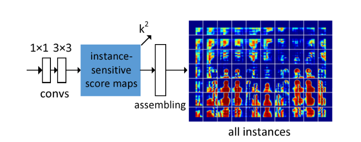
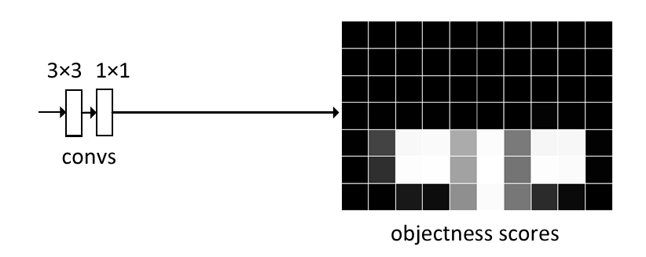

# Instance-sensitive Fully Convolutional Networks

[Jifeng Dai](https://arxiv.org/search/cs?searchtype=author&query=Dai%2C+J), [Kaiming He](https://arxiv.org/search/cs?searchtype=author&query=He%2C+K), [Yi Li](https://arxiv.org/search/cs?searchtype=author&query=Li%2C+Y), [Shaoqing Ren](https://arxiv.org/search/cs?searchtype=author&query=Ren%2C+S), [Jian Sun](https://arxiv.org/search/cs?searchtype=author&query=Sun%2C+J)

> Fully convolutional networks (FCNs) have been proven very successful for semantic segmentation, but the FCN outputs are unaware of object instances. In this paper, we develop FCNs that are capable of proposing instance-level segment candidates. In contrast to the previous FCN that generates one score map, our FCN is designed to compute a small set of instance-sensitive score maps, each of which is the outcome of a pixel-wise classifier of a relative position to instances. On top of these instance-sensitive score maps, a simple assembling module is able to output instance candidate at each position. In contrast to the recent DeepMask method for segmenting instances, our method does not have any high-dimensional layer related to the mask resolution, but instead exploits image local coherence for estimating instances. We present competitive results of instance segment proposal on both PASCAL VOC and MS COCO.

这篇工作又名InstanceFCN。实例分割方面，由于网络难以同时进行分类和分割任务，因此首先流行的是二阶段实例分割网络，首先对输入找到实例的proposal，然后在其中进行密集预测（也就是先框框再分割）。本文从名称上看不是一篇讲实例分割的文章，是讲如何通过FCN获得实例级别的分割mask的的。

在阅读之前我想提醒一下，这篇工作的效果是比较差的，毕竟是早期工作。不过这篇工作具有不错的启发意义，值得读一读。后面的一篇工作FCIS（Fully Convolutional Instance-aware Semantic Segmentation）中就借鉴了本文中提出的instance-sensitive score maps（请不要弄混本篇工作和FCIS）。本文的一大贡献就是提出使用instance-sensitive score maps区分不同个体。

---

## InstanceFCN

大家也称这篇工作为InstanceFCN。这篇工作的功能只是区分了实例，并没有区分类别。这是一篇”两不像“的工作。我们可以称之为”对象分割“：

| 名称                 | 描述                                             |
| -------------------- | ------------------------------------------------ |
| 语义分割             | 区分各个像素类别的密集预测任务                   |
| 实例分割             | 区分各个像素类别及其属于的对象实例的密集预测任务 |
| 对象分割（本篇工作） | 区分各个像素属于的对象实例的密集预测任务         |

这篇工作是使用全卷积网络区分像素所属的对象实例的：

上图是InstanceFCN的主要结构。可以看出，在特征提取网络之后（原论文中InstanceFCN使用在ImageNet上预训练的修改版VGG-16作为骨干特征提取网络，修改版是指作者对原版的VGG-16做了一些调整避免过度的下采样导致分辨率过度损失。具体可以看一下原论文中算法部分的相关描述），InstanceFCN在骨干特征提取网络之后主要分为两个分支，分别是instance分支（用于产生实例级的像素打分）以及objectness分支（用于产生某位置是不是一个实体的打分）。这两个分支的结果将相乘形成最终的得分。

接下来我们主要聊一下这两个分支如何工作。

## Instance分支

这个分支的作用产生一个像素与实体关系的打分，可衡量一个像素应该属于哪个实例。这个分支分为两个阶段：

1. 通过卷积得到instance-sensitive score maps。
2. 一个assembling module将它们组装称为最终的结果。

接下来分别介绍这两个阶段。

### Instance-sensitive score maps

instance-sensitive score maps是这份工作的核心贡献之一。InstanceFCN通过这一贡献实现区分不同对象。在语义分割模型中，通常将损失设定为交叉熵，因此每个像素在优化时仅表达一个语义。这对于很多个对象存在重叠的像素难以判断其所属。

相比于用于语义分割的FCN在最终输出一个类别，InstanceFCN最后的输出是一个像素于对象关系的打分。大致上去理解，就=就是一个像素越可能属于某个对象，这个打分就越高。进行打分的方式来源于一个简单的规则：不同对象应该处在不同位置。因此在原论文中，作者使用$k\times k$的矩阵定义一种”相对位置“：

例如在上图中，$k=3$，就会产生$k^2=9$个score map。这些score map被称为instance-sensitive score maps，可以用于对像素和对象的相对位置进行打分。

这个$k\times k$的矩阵我们暂且称之为”打分器“。这个打分器是一个在全图上移动的滑动窗口，将对全图的各个区域进行打分。还是刚才提到的，作者认为不同的对象处于不同的位置。所以只要打分器在所有位置都打一下分，使每个像素都具有一个跟位置相关的分数，就能区分这个像素到底属于哪个对象。例如上图中有两个类别为人的实体，打分器在左侧的人的位置产生的score maps最终仅拼接出了左侧的人，并没有拼接出右面的。

根据原论文，前置骨干特征提取网络输出特征图后，首先使用一个512-d的$1\times 1$卷积对特征进行一下转换，然后使用一个$3\times 3$的卷积层产生instance-sensitive score maps：

刚才我们提到论文中使用一个$k\times k$的网格打分器描述某种相对位置信息，所以这个用于形成score map的$3\times 3$卷积层卷积核维度就是$k^2$。也就是对于输出，分辨率上每个像素后方堆叠着$k^2$个数字，分别表示这个像素对$k^2$个相对位置的打分。

这里可能会产生一个小疑问，就是卷积核明明是逐像素的迭代，而且根据上面的描述只有$3\times 3$的大小，怎么可能覆盖图中的区域：

例如这幅示意图中，一个$k\times k,k=3$的打分器命名就是一个$3\times 3$的卷积核，如何覆盖一个人的像素范围？我自己的理解是VGG-16都进来卷过了，一个像素就已经能代表一定大小的感受野了。而且在$3\times 3$卷积之前还有一个$1\times 1$的卷积层，训练过程它学了啥全是玄学。这就导致了这部分可解释性比较牵强（也许是我才疏学浅解读失误）。`大家都常讲起这个笑话：“通过学习的卷积核能做到的话解释不通也是能解释通的”。如果您有心钻研深度神经网络的可解释性，那么祝您能在这条路上走得顺利👻。有任何实质性的进展请让我也了解一下您的工作`。

> 插一嘴，我在想这样的结构在不同感受野的物体上表现应该不会均衡吧。这样设计实属是把对不同感受野的兼容性抛给了骨干网络和那个不知道为什么存在的$1\times 1$卷积。看了一眼原论文试验结果部分，确实效果一般。会不会换上Res-Net或者U结构的网络后性能会显著提升呢？

这样我们就得到了一份instance-sensitive score maps。不过仅凭此还不能区分出对象，还需要通过一个称为组装（assembling）的过程生成对象级的输出。

### Instance assembling module

instance-sensitive score maps还不足以直接产生对象实例。但是可以通过”组装“score maps来产生对象实例：

例如，在上图所示的两个类别为人的对象上，通过卷积打分产生instance-sensitive score maps。我们可以看出，当这个$k\times k ,k=3$的打分器位于左侧的人的位置时，在这个打分器内部的$k^2 = 9$个位置上输出产生了不同的score map（也就是上个阶段网络的输出是$k^2$维的，分别代表当前位置下和这$k^2$个区域的相对位置关系分数）。

接下来Instance assembling module会用这个$k^2$维的输出“组装”出一个像素级的实例输出。原论文将这个组装的模块描述为一个大小为$m\times m$的窗口（其中m是k的倍数），将这个窗口分为$\frac{m}{k}\times \frac{m}{k}$个子窗口，也就是每个窗口是$k\times k$这么大，每个子窗口直接从score map的相应位置复制对应的值，然后拼在一起（依据它们的相对位置拼在一起）形成$m^2$大小的输出。在原文中，作者选择了$m=21$，步长$stride = 8$。

作者在原文中重申，这个模块是没有参数的，其中仅包含复制粘贴的操作，不需要学习。但是这个模块仍然是产生$m^2$分辨率输出的“唯一指定组件”（the only component），是网络的重要组件，且特征图由它经手后得到的输出直接参与loss计算，所以其设计影响网络的训练优化过程。

> 回看刚才我们在Instance-sensitive score maps那里提到的小疑问，InstanceFCN通过卷积产生“位置敏感的”输出仅通过卷积这件事确实难以解释。如果真的是这样，为什么不直接在组装部分也直接用一个可以学习的卷积解决呢？个人认为这个“复制粘贴”模块是解释的一部分。作者在重申的时候也提到了，这个模块影响网络的训练优化。也就是说，它是干预前序网络学习行为的。因为它“对着位置复制粘贴”的行为，在优化网络的时候导致了前面score map的产生是区域敏感的（以上纯属我自己的臆想）。

由于这篇论文并没有提供具体的代码，所以这个assembling模块的具体设计无从知晓。猜测是一个`[0,0,...,1,...,0]`长相的卷积。

## Object分支

这个分支用于产生Objectness score map，主要用于判别某个位置存在一个实体的可能性。

如上图，这个分支和Instance分支是并行的。在原论文的描述中，该分支使用一个$3\times 3$卷积和一个$1\times 1$卷积构成。其中$1\times 1$卷积是一个密集（逐像素）的logistic回归，回归为两类，一类是“背景”，一类是“实体”。

接下来这两个分支产生的结果直接相乘得到最终结果。注意，object分支的输出分辨率要和instace分支匹配，否则没法按位相乘。

## Loss设计

$$
\sum_i (L(p_i,p_i^*)+\sum_j L(S_{i,j},S_{i,j}^*))
$$

其中$p$的部分是在计算object分支的loss，$S$的部分是在计算intance分支的loss。
