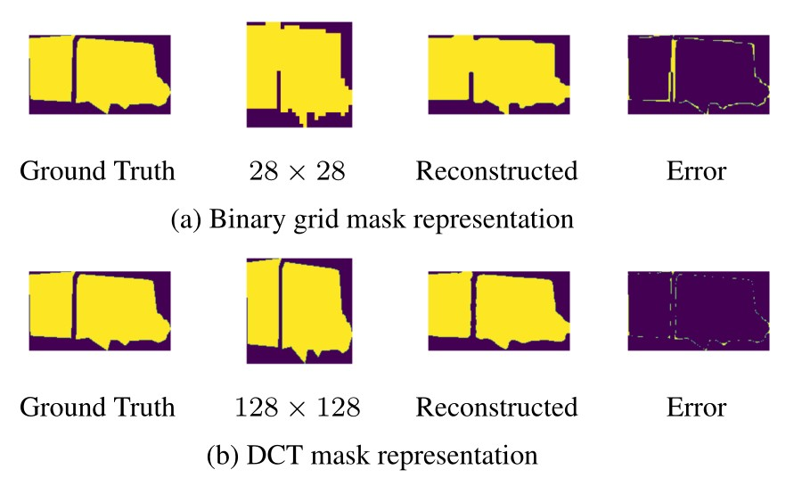
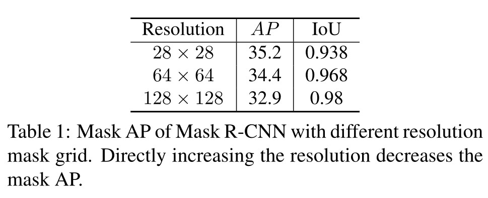
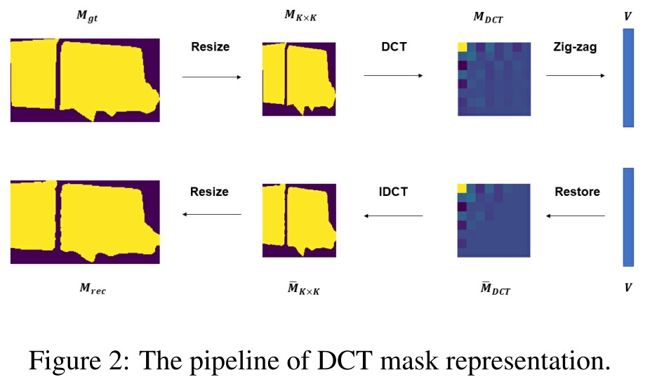
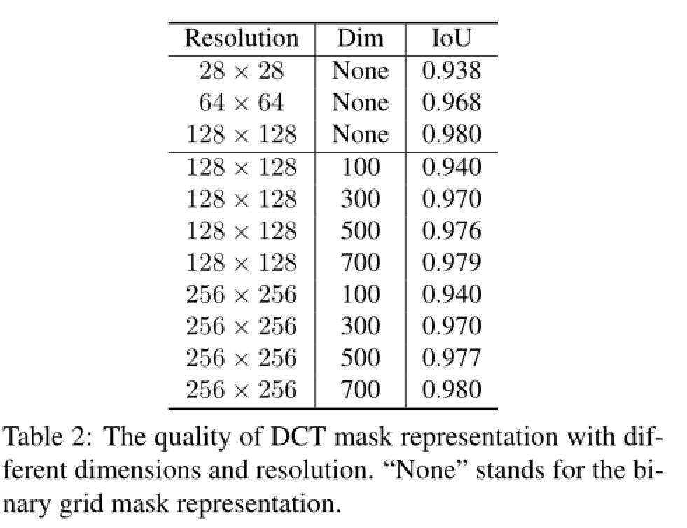
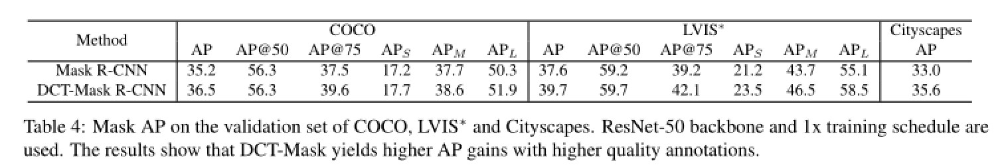
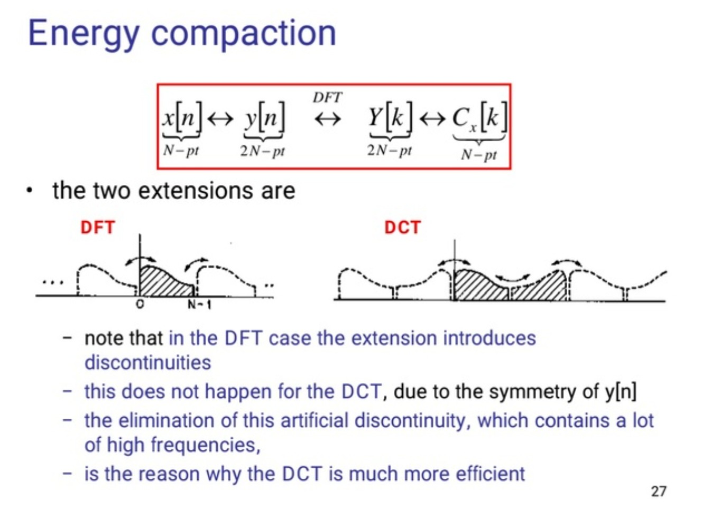

# DCT-Mask: Discrete Cosine Transform Mask Representation for Instance Segmentation

这篇笔记的写作者是[PuQing](https://github.com/AndPuQing)。

> 论文名称：[DCT-Mask: Discrete Cosine Transform Mask Representation for Instance Segmentation](https://openaccess.thecvf.com/content/CVPR2021/papers/Shen_DCT-Mask_Discrete_Cosine_Transform_Mask_Representation_for_Instance_Segmentation_CVPR_2021_paper.pdf)
>
> 作者：Xing Shen, Jirui Yang, Chunbo Wei, Bing Deng, Jianqiang Huang, Xiansheng Hua, Xiaoliang Cheng, Kewei Liang
> 
> 仓库地址：https://github.com/calmevtime/DCTNet

## 摘要

$Binary\; grid\; mask$ 广泛用于实例分割。就例如 $Mask\ R-CNN$[1](#references)，如下图所示，网络在 $28\times 28$ 的网格中预测 $Mask$ 。

但是一般来说，低分辨率的网格不足以捕捉细节，而高分辨率会大大增加训练的复杂性，为解决此问题，这篇论文提出一种新的 $Mask$ 表达方式，利用离散余弦变换（$DCT$）将高分辨率的$Binary\; grid\; mask$编码成一个紧凑的向量，这种方法称为 $DCT-Mask$。

该方法可以非常容易集成到大多数基于像素的实例分割上。它不需要任何预处理或预训练，而且几乎对速度没有损害。

## 介绍

就如上图所示，$Mask\ R-CNN$ 将 $GT$ 采样到 $28\times 28$ ，然后上采样重构它，如下图所示，低分辨率的 $Binary\; grid\; mask$ 不足以捕获细节特征，并在上采样过程中产生偏差。

如上图为使用 $DCT$ 和未使用 $DCT$ 方法的比较，左边为 $GT$ ；之后是 $Resize$ 后的 $GT$ ；再是基于 $Resize$ 后的重建图；最后是重建图与原来的$GT$图的误差值。

所以就算预测 $Mask$ 是正确的，重建的 $Mask$ 也有一定的系统误差。解决方式之一是提高 $Binary\; grid\; mask$ 的分辨率，但是实验显示提高分辨率后平均精度（$AP$）比 $28\times 28$ 要差，具体见下图。

## Method

作者给出的方法是 $DCT\ mask$ ，如下图是该 $DCT\ mask$ 的 $pipline$。

该处理方式是受 $JPEG$ 标准的启发，$pipline$ 将二进制掩码转化为紧凑的向量。首先将 $GT\ Resize$到 $K\times K$ 大小，然后对其进行二维 $DCT-II$ (假装是罗马 2)变换，在重构时利用二维逆 $DCT$ 变换，最后利用双线性插值 $Resize$ 到 $H\times W$。数学表达如下（先看[离散余弦变换](#离散余弦变换dct)）：

设 $Binary\; grid\; mask\; M_{gt}\in\ R^{H\times W}$。$Resize$ 到$M_{K\times K}\in\ R^{K\times K}$。文中$K=128$。二维$DCT$变换$M_{DCT}\in\ R^{K\times K}$ 频率信号由如下公式得到：

$$
M_{DCT}(u, v)=\frac{2}{K}C(u)C(v)\sum_{x=0}^{K-1} \sum_{y=0}^{K-1} M_{K \times K}(x, y) \cos \frac{(2 x+1) u \pi}{2 K} \cos \frac{(2 y+1) v \pi}{2 K}
$$

这里 $C(\omega)=1/\sqrt{2}$ 当 $\omega=0$ 时当 $\omega$ 等于其他值时 $C(\omega)=1$

因为 $DCT$ 具有很强的能量聚集性，所以可以从 $M_{DCT}$ 经过 $zig-zag$ 编码后得到向量选择第一个 $N$ 维度的向量 $V\in\ R^{N}$ (为什么是$select\; the\; first\; N-dimensional\; vector?$)

之后对该向量补零重构得到 $\bar{M}_{DCT}\in\ R^{K\times K}$，下一步利用二维逆 $DCT$ 变换

$$
\bar{M}_{K \times K}(x, y)=\frac{2}{K} \sum_{u=0}^{K-1} \sum_{v=0}^{K-1} C(u) C(v) \bar{M}_{D C T}(u, v) \cos \frac{(2 x+1) u \pi}{2 K} \cos \frac{(2 y+1) v \pi}{2 K}
$$

## DCT-Mask in Mask R-CNN

如上图 $DCT-Mask$ 在$Mask\ R-CNN$ 的应用，在$Mask\; head$ 中使用 4 个卷积层，提取$Mask$ 特征，然后用三个线性归回层回归$DCT$向量

则实际上变为回归问题，损失函数可构建为

$$
\mathcal{L}_{mask}=1^{obj}\sum_{i}^{N}D(\hat{V}_{i},V_{i})
$$

这里 $V_{i},\hat{V}_{i}$ 分别表示为第$i$个元素的$GT$与预测值。$1^{obj}$ 是样本中正样本指示函数，$D$ 是第一范数距离矩阵。

如下图为对$N$的取值的探究

其中$None$表示为使用的二进制掩码。

## 效果

## Zig-Zag 编码

下图为$Zig-Zag$ 编码方式

## 离散余弦变换 DCT

$DCT$ 变换的全称是离散余弦变换（$Discrete\; Cosine\; Transform$），主要用于将数据或图像的压缩，能够将空域的信号转换到频域上，具有良好的去相关性的性能。

在详细说明 $DCT$ 公式之前需要对 $DFT$ 有所了解。

$$
X[k] = \sum_{n=0}^{N-1}x[n] \left(cos \left( \frac{2\pi k n}{N}\right)-jsin \left( \frac{2\pi k n}{N}\right)\right)
$$

将上面式子拆开来

$$
X[k]=\sum_{n=0}^{N-1} x[n]\left(\cos \frac{2 \pi \mathrm{kn}}{N}\right)-j \sum_{n=0}^{N-1} x[n] \sin \left(\frac{2 \pi k n}{N}\right)
$$

可以看到 $DFT$ 变化结果，实数部分由$\displaystyle\sum_{n=0}^{N-1} x[n]\left(\cos \frac{2 \pi \mathrm{kn}}{N}\right)$ 组成，而虚数部分由$\displaystyle j\sum_{n=0}^{N-1} x[n] \sin \left(\frac{2 \pi k n}{N}\right)$组成，设$\displaystyle\cos \left(\frac{2 \pi \mathrm{kn}}{N}\right)=\cos(kt)$，那 $DFT$ 公式可以写为：

实数部分:

$$
Re[k]=\sum_{n=0}^{N-1} x[n]\cos(kt)
$$

虚数部分:

$$
Im[k]=\sum_{n=0}^{N-1} x[n]\sin(kt)
$$

显然，$\cos$ 是一个偶函数，$\sin$ 是一个奇函数，因此

$$
Re[k]=Re[-k],Im[k]=-Im[k]
$$

所以当 $x[n]$ 是一个实数函数时，其频率的实部是偶函数，虚部是一个奇函数。

那当原信号 $x[n]$ 是一个全是实数的偶函数信号，$x[n]\sin{kt}$ 就变成一个奇函数，奇函数那么自然

$$
Im[k]=\sum_{n=0}^{N-1} x[n]\sin(kt)=0
$$

因此，当原时域信号是一个实偶信号时，我们就可以把 $DFT$ 写成

$$
X[k]=\sum_{n=0}^{N-1} x[n]\left(\cos \frac{2 \pi \mathrm{kn}}{N}\right)
$$

以上就是 $DCT$ 变换的核心思想，当然这与实际的 $DCT$ 公式还是有差距的。

先来看最常用的 $DCT$ 变换公式

$$
F(u)=c(u) \sum_{x=0}^{N-1} f(x) \cos \left[\frac{(x+0.5) \pi}{N} u\right]
$$

其中当 $u=0$ 时 $c(0)=\displaystyle\sqrt{\frac{1}{N}}$ 否则 $c(u)=\displaystyle\sqrt{\frac{2}{N}}$

可以看到与我们上面推导的内容还是有很大不一样的，这是因为在实际应用中没有刚刚好的实偶函数信号给我们，既然没有，我们就构造一个实信号。

设一长度为 $N$ 的实数离散信号 ${x[0],x[1],\cdots,x[N-1]}$ 。首先，我们先将这个信号长度扩大成原来的两倍，并变成 $2N$ ，定义新信号 $x'[m]$ 为

$$
\begin{aligned}
x'[m]=x[m](0\le m \le N-1)\\
x'[m]=x[-m-1](-N\le m\le -1)
\end{aligned}
$$

可视化一下：

其中红色为原始信号，红色为延拓后的信号，这样我们就将一个实信号变成了一个实偶信号，显然信号的区间已经变化为 $[-N,N-1]$

但是这样插值之后也随之带来问题，这个信号并不关于 $m=0$ 偶对称，所以为了让信号关于原点对称，把整个延拓信号向右平移 $\frac{1}{2}$ 个单位

因此上面 $DFT$ 公式变化为

$$
X[k]=\sum_{m=-N+\frac{1}{2}}^{N-\frac{1}{2}} x^{\prime}\left[m-\frac{1}{2}\right] e^{\frac{-j 2 \pi m k}{2 N}}
$$

根据欧拉公式对上式展开，展开时我们只要实数部分就行了

$$
X[k]=\sum_{m=-N+\frac{1}{2}}^{N-\frac{1}{2}} x^{\prime}\left[m-\frac{1}{2}\right] e^{\frac{-j 2 \pi m k}{2 N}}=\sum_{m=-N+\frac{1}{2}}^{N-\frac{1}{2}} x^{\prime}\left[m-\frac{1}{2}\right] \cos \left(\frac{2 \pi m k}{2 N}\right)
$$

但是这样是不科学的，因为$m$是带小数甚至负数的，因为在离散信号中找不到这样的信号。因此我们需要变形，我们知道这个序列是偶对称序列，因此

$$
\sum_{m=-N+\frac{1}{2}}^{N-\frac{1}{2}} x^{\prime}\left[m-\frac{1}{2}\right] \cos \left(\frac{2 \pi m k}{2 N}\right)=2 \times  \sum_{m=\frac{1}{2}}^{N-\frac{1}{2}} x^{\prime}\left[m-\frac{1}{2}\right] \cos \left(\frac{2 \pi m k}{2 N}\right)
$$

于是设$\displaystyle n=m-\frac{1}{2}$，代入上式

$$
2 \times  \sum_{n=0}^{N-1} x^{\prime}[n] \cos \left(\frac{2 \pi\left(n+\frac{1}{2}\right) k}{2 N}\right)=2 \times  \sum_{n=0}^{N-1} x^{\prime}[n] \cos \left(\frac{\left(n+\frac{1}{2}\right) \pi k}{N}\right)
$$

关于 $DCT$ 中 $c(u)$ 是怎么来的，$c(u)$ 在函数计算中，加不加都无所谓，但实际上，这个值因为一些工程上的意义，在 $DFT$ 中也常常出现$\frac{1}{N}$ 这主要是为了在 $DFT$ 变换变成矩阵运算的形式时，将该矩阵正交化，所以这里的$c(u)$也同样。$c(u)=\displaystyle \sqrt{\frac{1}{2N}}$ 将该系数乘入上面式子

$$
\sqrt{\frac{1}{2 N}} \times  2 \times  \sum_{n=0}^{N-1} x^{\prime}[n] \cos \left(\frac{\left(n+\frac{1}{2}\right) \pi k}{N}\right)=\sqrt{\frac{2}{N}} \times  \sum_{n=0}^{N-1} x^{\prime}[n] \cos \left(\frac{\left(n+\frac{1}{2}\right) \pi k}{N}\right)
$$

于是我们便得到 $DCT$ 式子

## 分析能量聚集性

上面推导了 $DCT$ 公式，这里尝试对其能量聚集性进行解释。

回想我们如何得到傅里叶变换公式，我们先对原信号进行**周期**延拓，而在$DCT$中我们先对信号进行**镜像**延拓，如上面的图可以看出$DFT$直接进行周期变换会造成跳变，对应与频率里的高频。而$DCT$对信号进行镜像，其过度更加平滑，同时会弱化高频信号（高频决定细节，低频决定轮廓）。而根本原因是对一般的周期函数展开成 fourier 级数的性质问题，这里不在深入探究。

## References

[1] [mask r-cnn](https://arxiv.org/pdf/1703.06870.pdf)
